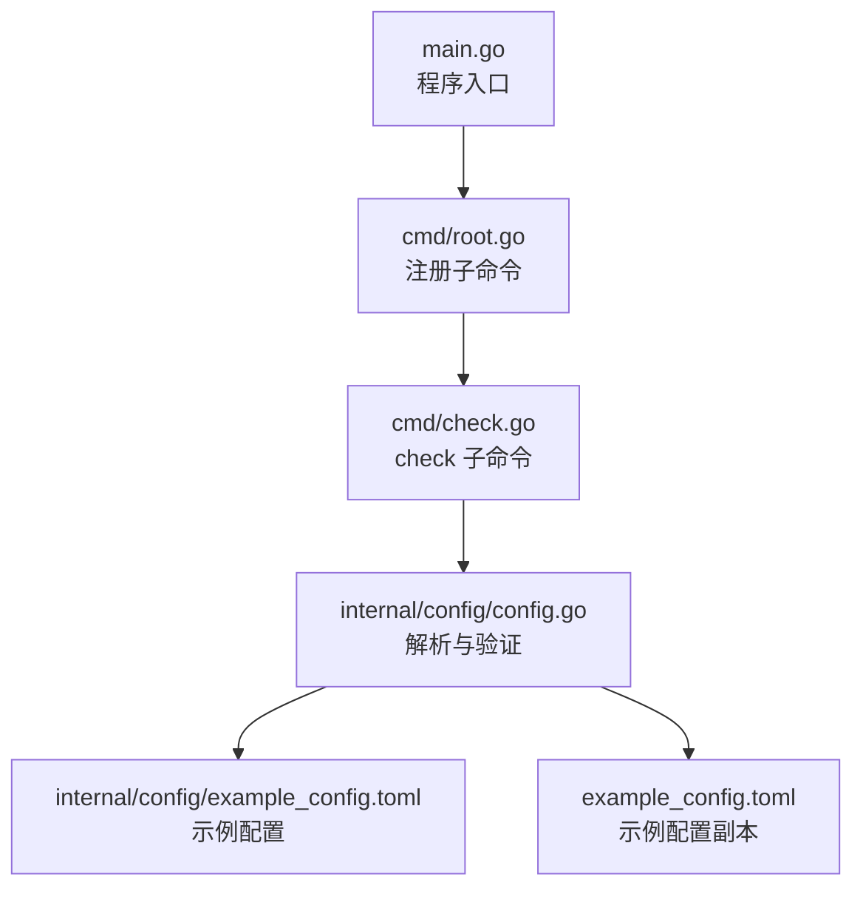
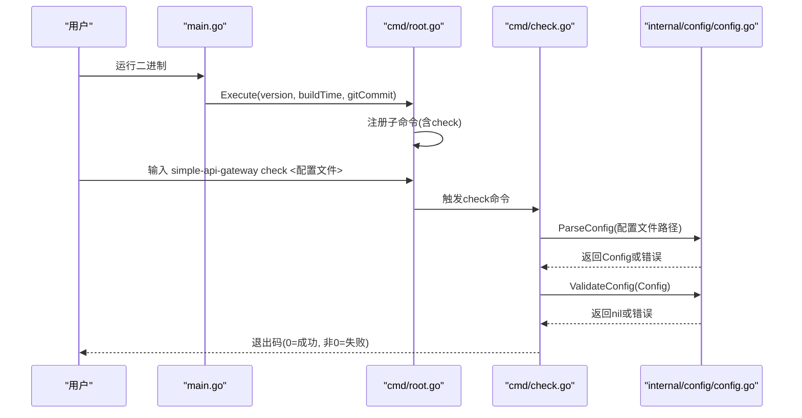
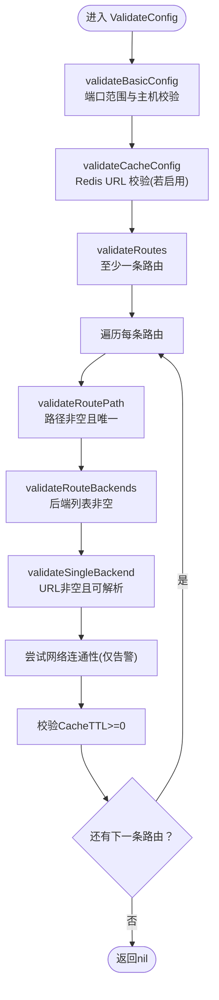
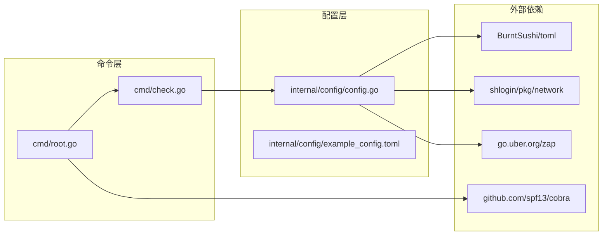
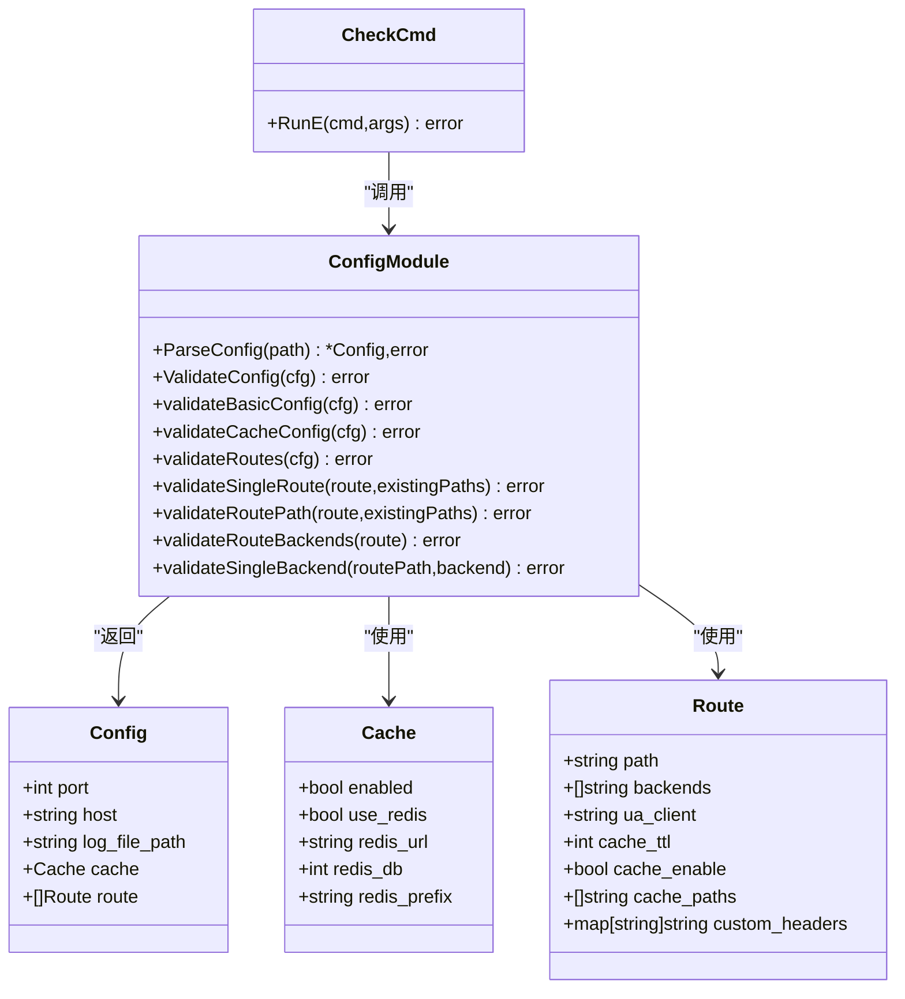

# check 命令

<cite>
**本文引用的文件**
- [main.go](file://main.go)
- [cmd/root.go](file://cmd/root.go)
- [cmd/check.go](file://cmd/check.go)
- [internal/config/config.go](file://internal/config/config.go)
- [internal/config/example_config.toml](file://internal/config/example_config.toml)
- [example_config.toml](file://example_config.toml)
- [go.mod](file://go.mod)
</cite>

## 目录
1. [简介](#简介)
2. [项目结构](#项目结构)
3. [核心组件](#核心组件)
4. [架构总览](#架构总览)
5. [详细组件分析](#详细组件分析)
6. [依赖关系分析](#依赖关系分析)
7. [性能与可靠性考量](#性能与可靠性考量)
8. [故障排查指南](#故障排查指南)
9. [结论](#结论)
10. [附录](#附录)

## 简介
本文件围绕“check”命令展开，系统性阐述其作为配置验证工具的职责与实现：读取指定的 TOML 配置文件，调用 internal/config 模块的解析与验证逻辑，完成语法正确性与语义完整性的检查。文档同时提供常见错误类型与修复建议，帮助在部署前进行自动化配置校验，降低运行期风险。

## 项目结构
- 命令入口位于 cmd 包，check 命令通过 Cobra 注册并执行。
- 配置解析与验证集中在 internal/config 包，包含 Config 结构体、解析函数与多级验证函数。
- 示例配置文件位于 internal/config/example_config.toml 与仓库根目录 example_config.toml，便于对照与生成示例。

图表来源
- [main.go](file://main.go#L1-L49)
- [cmd/root.go](file://cmd/root.go#L1-L50)
- [cmd/check.go](file://cmd/check.go#L1-L24)
- [internal/config/config.go](file://internal/config/config.go#L1-L263)
- [internal/config/example_config.toml](file://internal/config/example_config.toml#L1-L45)
- [example_config.toml](file://example_config.toml#L1-L45)

章节来源
- [main.go](file://main.go#L1-L49)
- [cmd/root.go](file://cmd/root.go#L1-L50)
- [cmd/check.go](file://cmd/check.go#L1-L24)
- [internal/config/config.go](file://internal/config/config.go#L1-L263)
- [internal/config/example_config.toml](file://internal/config/example_config.toml#L1-L45)
- [example_config.toml](file://example_config.toml#L1-L45)

## 核心组件
- check 命令：接收一个参数（配置文件路径），打印日志，调用解析与验证流程，返回错误或成功。
- 配置模块：
  - 解析：从 TOML 文件解码为 Config 结构体；支持可选的日志文件路径重定向。
  - 验证：分层校验基础配置、缓存配置、路由配置及单条路由细节。
- 示例配置：提供标准示例，便于用户比对与生成。

章节来源
- [cmd/check.go](file://cmd/check.go#L1-L24)
- [internal/config/config.go](file://internal/config/config.go#L1-L263)
- [internal/config/example_config.toml](file://internal/config/example_config.toml#L1-L45)
- [example_config.toml](file://example_config.toml#L1-L45)

## 架构总览
check 命令的执行链路如下：main 初始化日志与信号处理，root 注册 check 子命令，check 执行时先解析再验证，最终返回状态码。

图表来源
- [main.go](file://main.go#L1-L49)
- [cmd/root.go](file://cmd/root.go#L1-L50)
- [cmd/check.go](file://cmd/check.go#L1-L24)
- [internal/config/config.go](file://internal/config/config.go#L1-L263)

## 详细组件分析

### check 命令实现
- 参数要求：精确一个位置参数，即配置文件路径。
- 行为流程：
  - 记录一次 info 级别日志，包含配置文件路径。
  - 调用 ParseConfig 解析配置。
  - 若解析失败，直接返回错误；否则调用 ValidateConfig 完成验证。
- 错误传播：check 命令直接返回验证阶段的错误，便于 CI/CD 层面识别失败。

章节来源
- [cmd/check.go](file://cmd/check.go#L1-L24)

### 配置解析与验证流程
- 解析阶段（ParseConfig）：
  - 使用 BurntSushi/toml 解码 TOML 文件到 Config。
  - 若配置中设置了日志文件路径，则更新日志输出目标并重置。
- 验证阶段（ValidateConfig）：
  - 基础配置校验（validateBasicConfig）：端口范围合法性、主机非空。
  - 缓存配置校验（validateCacheConfig）：当启用 Redis 时，要求 Redis URL 非空且可解析。
  - 路由配置校验（validateRoutes）：至少存在一条路由。
  - 单条路由校验（validateSingleRoute）：路径非空且唯一；后端列表非空；后端 URL 非空且可解析；可尝试网络连通性（仅记录警告，不影响验证通过）。
  - 路由缓存 TTL 校验：必须非负。

图表来源
- [internal/config/config.go](file://internal/config/config.go#L1-L263)

章节来源
- [internal/config/config.go](file://internal/config/config.go#L1-L263)

### 数据模型与字段约束
- Config
  - port：整数，范围 0~65535。
  - host：字符串，非空。
  - log_file_path：字符串，可选。
  - cache：Cache 结构体。
  - route：Route 列表。
- Cache
  - enabled：布尔。
  - use_redis：布尔。
  - redis_url：字符串，启用 Redis 时必填且需可解析。
  - redis_db：整数。
  - redis_prefix：字符串。
- Route
  - path：字符串，非空且全局唯一。
  - backends：字符串列表，非空，每个元素为合法 URL。
  - ua_client：字符串，可选。
  - cache_ttl：整数，非负。
  - cache_enable：布尔，可选。
  - cache_paths：字符串列表，可选。
  - custom_headers：键值映射，可选。

章节来源
- [internal/config/config.go](file://internal/config/config.go#L1-L263)

### 示例配置与生成
- 内置示例：internal/config/example_config.toml 提供了完整的示例。
- 生成示例：可通过内部接口生成示例配置文件（扩展名必须为 .toml，目录需存在）。

章节来源
- [internal/config/example_config.toml](file://internal/config/example_config.toml#L1-L45)
- [example_config.toml](file://example_config.toml#L1-L45)
- [internal/config/config.go](file://internal/config/config.go#L226-L263)

## 依赖关系分析
- 命令层依赖 Cobra 与 Zap 日志。
- 配置层依赖 BurntSushi/toml 进行 TOML 解析，依赖 shlogin/pkg/network 进行后端连通性探测。
- 项目模块依赖 go.mod 中的第三方库版本。

图表来源
- [cmd/root.go](file://cmd/root.go#L1-L50)
- [cmd/check.go](file://cmd/check.go#L1-L24)
- [internal/config/config.go](file://internal/config/config.go#L1-L263)
- [go.mod](file://go.mod#L1-L203)

章节来源
- [go.mod](file://go.mod#L1-L203)
- [cmd/root.go](file://cmd/root.go#L1-L50)
- [cmd/check.go](file://cmd/check.go#L1-L24)
- [internal/config/config.go](file://internal/config/config.go#L1-L263)

## 性能与可靠性考量
- 解析复杂度：TOML 解码为 O(N)（N 为配置项数量），验证为 O(R)（R 为路由数量）。
- I/O 影响：解析配置文件与写入日志文件为主要 I/O 操作；日志文件路径变更会触发日志器重置。
- 连接探测：后端 URL 的网络连通性探测仅记录警告，不阻断验证通过，避免 CI 场景下的网络波动导致误判。
- 并发与稳定性：check 命令为一次性校验，不涉及并发；日志器初始化与关闭在 main 中统一管理。

[本节为通用性能讨论，无需特定文件引用]

## 故障排查指南

### 常见错误类型与定位
- TOML 语法错误
  - 现象：解析阶段报错，check 直接返回。
  - 定位：查看命令输出的错误信息与日志。
  - 修复：对照示例配置修正键名、缩进、引号与数组格式。
  - 参考路径：[internal/config/config.go](file://internal/config/config.go#L47-L67)
- 基础配置非法
  - 端口越界：port 不在 0~65535。
  - 主机为空：host 为空字符串。
  - 修复：调整 port 与 host。
  - 参考路径：[internal/config/config.go](file://internal/config/config.go#L90-L104)
- 缓存配置非法
  - 启用 Redis 但未提供 URL 或 URL 无效。
  - 修复：填写有效的 Redis URL 或关闭 use_redis。
  - 参考路径：[internal/config/config.go](file://internal/config/config.go#L106-L124)
- 路由配置非法
  - 无路由：routes 为空。
  - 路径为空或重复：path 为空或重复。
  - 后端列表为空：backends 为空。
  - 后端 URL 为空或无效：不符合 URL 格式。
  - 修复：补齐 routes；确保每条路由 path 唯一且非空；为每条路由提供至少一个有效后端 URL。
  - 参考路径：[internal/config/config.go](file://internal/config/config.go#L126-L201)
- 路由缓存 TTL 非法
  - cache_ttl 为负数。
  - 修复：将 TTL 设为非负数。
  - 参考路径：[internal/config/config.go](file://internal/config/config.go#L159-L166)
- 后端连通性告警
  - 验证阶段会尝试探测后端连通性，失败仅记录警告。
  - 修复：确保后端可达或在 CI 中忽略该告警。
  - 参考路径：[internal/config/config.go](file://internal/config/config.go#L211-L224)

### 错误信息解读与修复建议
- “端口不合法”：检查 port 是否在 0~65535。
- “主机不合法”：检查 host 是否非空。
- “Redis URL 为空但启用了 Redis 缓存”：提供 redis_url 或关闭 use_redis。
- “Redis URL 无效”：使用标准 Redis URL 格式。
- “无路由”：至少添加一条 [[route]]。
- “路由路径为空”：为 path 设置非空值。
- “路由路径重复”：确保每条路由 path 唯一。
- “路由后端为空”：为 backends 至少提供一个 URL。
- “路由后端不是有效 URL”：修正为合法 URL。
- “路由缓存 TTL 为负数”：将 TTL 改为非负数。
- “failed to connect to route backend”：仅告警，不影响验证通过，可在 CI 中忽略或修复后端可达性。

章节来源
- [internal/config/config.go](file://internal/config/config.go#L90-L224)

### 使用示例与最佳实践
- 本地校验
  - 使用命令：simple-api-gateway check <配置文件路径>
  - 成功：退出码 0；失败：非 0 并输出错误信息。
- CI/CD 集成
  - 将 check 命令加入构建流水线，前置校验配置有效性，避免部署失败。
  - 可结合示例配置生成工具，确保新环境具备参考配置。
- 对照与生成
  - 参考示例配置文件：internal/config/example_config.toml 与 example_config.toml。
  - 如需生成示例文件，请确保目标路径扩展名为 .toml 且目录存在。

章节来源
- [cmd/check.go](file://cmd/check.go#L1-L24)
- [internal/config/example_config.toml](file://internal/config/example_config.toml#L1-L45)
- [example_config.toml](file://example_config.toml#L1-L45)
- [internal/config/config.go](file://internal/config/config.go#L226-L263)

## 结论
check 命令通过“解析 + 分层验证”的方式，覆盖了配置文件的语法与语义关键点，能够有效在部署前发现常见配置错误。其设计将网络连通性探测降级为告警，避免 CI 场景下的误判；同时提供清晰的错误信息与示例配置，便于快速定位与修复问题。

[本节为总结性内容，无需特定文件引用]

## 附录

### 关键流程类图（代码级）

图表来源
- [cmd/check.go](file://cmd/check.go#L1-L24)
- [internal/config/config.go](file://internal/config/config.go#L1-L263)