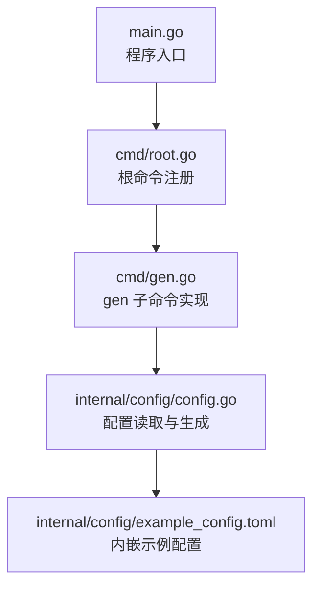
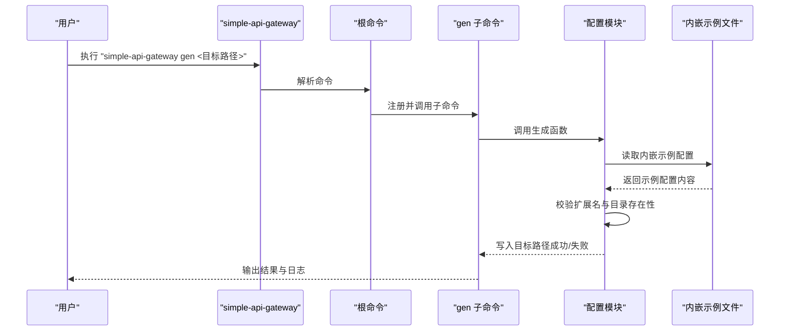
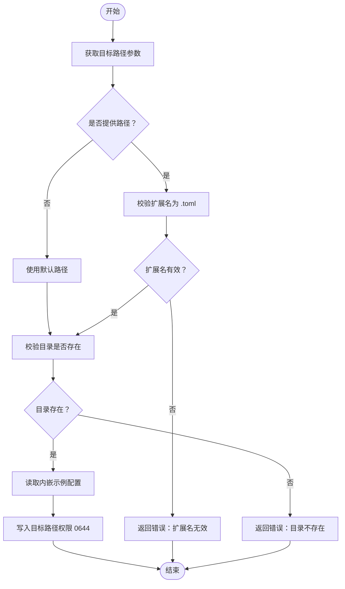
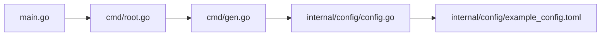

# gen 命令

<cite>
**本文引用的文件**
- [cmd/gen.go](file://cmd/gen.go)
- [cmd/root.go](file://cmd/root.go)
- [internal/config/config.go](file://internal/config/config.go)
- [internal/config/example_config.toml](file://internal/config/example_config.toml)
- [main.go](file://main.go)
- [README.md](file://README.md)
</cite>

## 目录
1. [简介](#简介)
2. [项目结构](#项目结构)
3. [核心组件](#核心组件)
4. [架构总览](#架构总览)
5. [详细组件分析](#详细组件分析)
6. [依赖关系分析](#依赖关系分析)
7. [性能与可用性考量](#性能与可用性考量)
8. [故障排查指南](#故障排查指南)
9. [结论](#结论)
10. [附录](#附录)

## 简介
gen 命令是本项目的配置生成工具，旨在为新用户提供一份“包含所有可配置项”的示例 TOML 配置文件，帮助用户快速上手并减少配置错误。该命令并非动态模板渲染，而是直接从代码内嵌的示例文件读取内容，并写入到用户指定的目标路径，确保生成的配置与代码中定义的结构保持一致。

gen 命令的核心价值：
- 新用户快速上手：一键生成完整示例配置，避免遗漏关键字段
- 配置模板更新：当代码结构变更时，示例文件同步更新，便于用户对照升级
- 非动态模板：基于内嵌示例文件，而非运行时拼接，保证生成文件的稳定性和一致性

## 项目结构
与 gen 命令相关的文件组织如下：
- 命令入口与注册：根命令负责注册 gen 子命令
- 子命令实现：gen 子命令负责生成配置文件
- 配置模块：提供示例配置读取与生成逻辑
- 示例配置：内嵌于配置模块中的示例 TOML 文件

图表来源
- [main.go](file://main.go#L34-L48)
- [cmd/root.go](file://cmd/root.go#L16-L40)
- [cmd/gen.go](file://cmd/gen.go#L9-L25)
- [internal/config/config.go](file://internal/config/config.go#L18-L26)
- [internal/config/example_config.toml](file://internal/config/example_config.toml#L1-L45)

章节来源
- [main.go](file://main.go#L34-L48)
- [cmd/root.go](file://cmd/root.go#L16-L40)

## 核心组件
- gen 子命令：接收目标配置文件路径参数，调用配置模块生成示例配置
- 配置模块：
  - 内嵌示例配置文件，提供完整的字段覆盖
  - 生成函数：校验扩展名、目录存在性，并写入目标路径
- 示例配置文件：包含监听端口、主机绑定、日志路径、缓存开关与 Redis 设置、以及两条示例路由及其缓存与自定义头部等

章节来源
- [cmd/gen.go](file://cmd/gen.go#L9-L25)
- [internal/config/config.go](file://internal/config/config.go#L18-L26)
- [internal/config/config.go](file://internal/config/config.go#L226-L263)
- [internal/config/example_config.toml](file://internal/config/example_config.toml#L1-L45)

## 架构总览
gen 命令的执行流程如下：

图表来源
- [cmd/root.go](file://cmd/root.go#L33-L40)
- [cmd/gen.go](file://cmd/gen.go#L15-L23)
- [internal/config/config.go](file://internal/config/config.go#L236-L263)
- [internal/config/example_config.toml](file://internal/config/example_config.toml#L1-L45)

## 详细组件分析

### gen 子命令实现
- 命令注册：在根命令中注册 gen 子命令，设置使用说明、简短描述与参数数量限制
- 参数处理：最多接受一个参数（目标配置文件路径），静默使用输出
- 执行流程：记录日志、调用配置模块生成函数、错误处理与返回

章节来源
- [cmd/gen.go](file://cmd/gen.go#L9-L25)

### 配置模块与生成逻辑
- 结构体映射：配置模块定义了 Config、Cache、Route 等结构体，与示例 TOML 字段一一对应
- 示例读取：通过内嵌文件系统读取示例配置内容
- 生成函数：
  - 若未提供路径，默认写入当前目录的示例文件名
  - 校验目标路径扩展名为 .toml
  - 校验目标目录存在性
  - 以只读权限写入文件

章节来源
- [internal/config/config.go](file://internal/config/config.go#L21-L46)
- [internal/config/config.go](file://internal/config/config.go#L226-L234)
- [internal/config/config.go](file://internal/config/config.go#L236-L263)

### 示例配置文件结构与注释
示例配置文件包含以下主要部分：
- 基础监听：端口、主机绑定、日志文件路径
- 全局缓存：缓存开关、是否使用 Redis、Redis 连接 URL、数据库编号、键前缀
- 路由配置：每条路由包含路径、后端服务列表、User-Agent、缓存 TTL、路由级缓存开关、可缓存路径集合、自定义请求头等

章节来源
- [internal/config/example_config.toml](file://internal/config/example_config.toml#L1-L45)

### 生成流程图（算法实现）

图表来源
- [internal/config/config.go](file://internal/config/config.go#L236-L263)

## 依赖关系分析
- 命令层依赖：gen 子命令依赖配置模块提供的生成函数
- 配置层依赖：配置模块依赖内嵌示例文件系统
- 入口依赖：main.go 中调用根命令执行器，完成命令树初始化

图表来源
- [main.go](file://main.go#L44-L48)
- [cmd/root.go](file://cmd/root.go#L33-L40)
- [cmd/gen.go](file://cmd/gen.go#L15-L23)
- [internal/config/config.go](file://internal/config/config.go#L18-L26)
- [internal/config/example_config.toml](file://internal/config/example_config.toml#L1-L45)

章节来源
- [main.go](file://main.go#L44-L48)
- [cmd/root.go](file://cmd/root.go#L33-L40)
- [cmd/gen.go](file://cmd/gen.go#L15-L23)
- [internal/config/config.go](file://internal/config/config.go#L18-L26)

## 性能与可用性考量
- 生成过程为本地文件写入，开销极小，适合在新环境首次部署时快速生成配置
- 由于示例文件内嵌于二进制，无需额外资源分发，提升可用性
- 生成逻辑仅做基础校验（扩展名与目录），不涉及网络或外部依赖，稳定性高

## 故障排查指南
常见问题与定位建议：
- 目标路径扩展名不是 .toml：生成函数会返回错误，检查传入路径扩展名
- 目标目录不存在：生成函数会返回错误，先创建目录再重试
- 写入权限不足：确认目标路径所在目录具备写权限
- 生成成功但配置不符合预期：检查示例配置字段与结构体映射，按需修改

章节来源
- [internal/config/config.go](file://internal/config/config.go#L245-L261)

## 结论
gen 命令通过“内嵌示例文件 + 结构体映射”的方式，为用户提供了一份完整、准确且易于理解的配置模板。它不仅降低了新用户的上手门槛，也保证了配置文件与代码结构的一致性，便于后续维护与升级。建议在首次部署或迁移配置时优先使用该命令生成初始模板，再根据实际环境进行针对性调整。

## 附录

### 使用步骤与最佳实践
- 生成配置：使用命令生成示例配置文件，随后在目标环境中进行微调
- 调整监听端口与主机：根据部署环境修改基础监听配置
- 后端服务地址：将示例中的后端地址替换为实际服务地址
- 缓存设置：根据需求开启/关闭缓存，或配置 Redis 连接参数
- 路由与自定义头部：按业务场景补充或删除路由条目，并添加必要的自定义头部

章节来源
- [README.md](file://README.md#L46-L59)
- [README.md](file://README.md#L96-L101)
- [internal/config/example_config.toml](file://internal/config/example_config.toml#L1-L45)

### 生成逻辑实现要点（面向开发者）
- 非动态模板：示例配置来自内嵌文件，不依赖运行时拼接
- 结构体驱动：配置结构体定义了所有可配置字段，生成文件与结构体保持一致
- 错误处理：对扩展名与目录进行显式校验，便于快速定位问题

章节来源
- [internal/config/config.go](file://internal/config/config.go#L18-L26)
- [internal/config/config.go](file://internal/config/config.go#L236-L263)