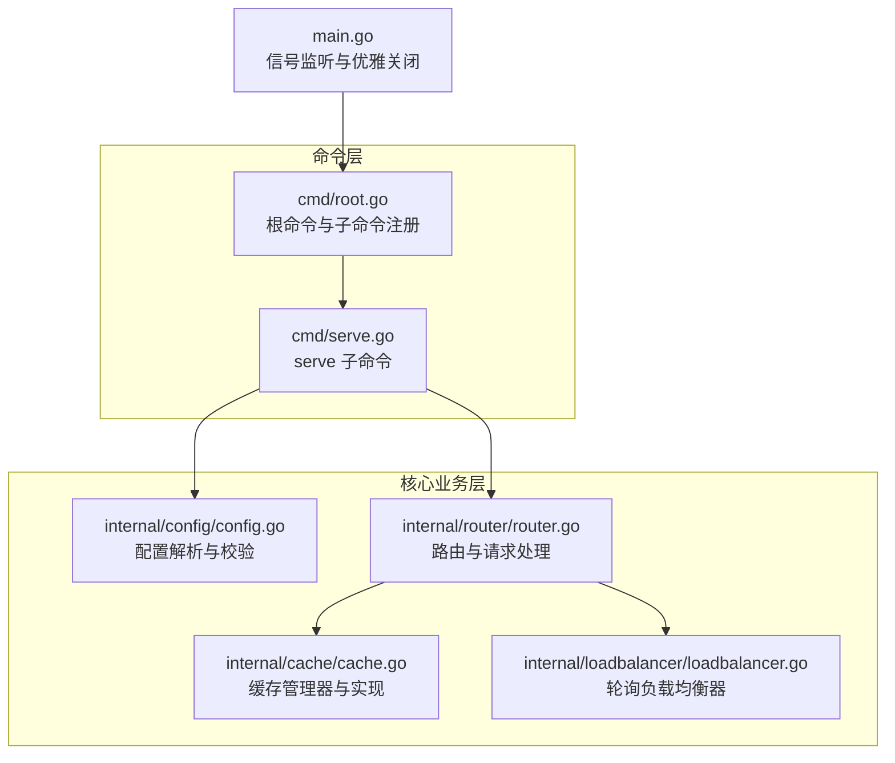
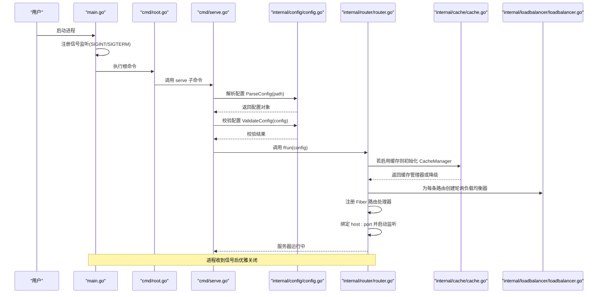
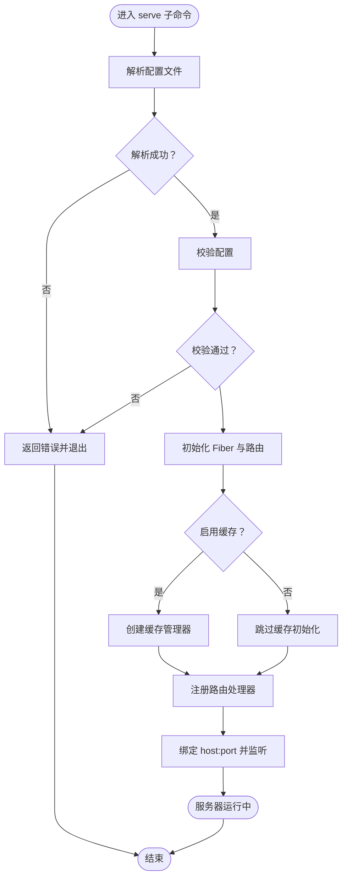
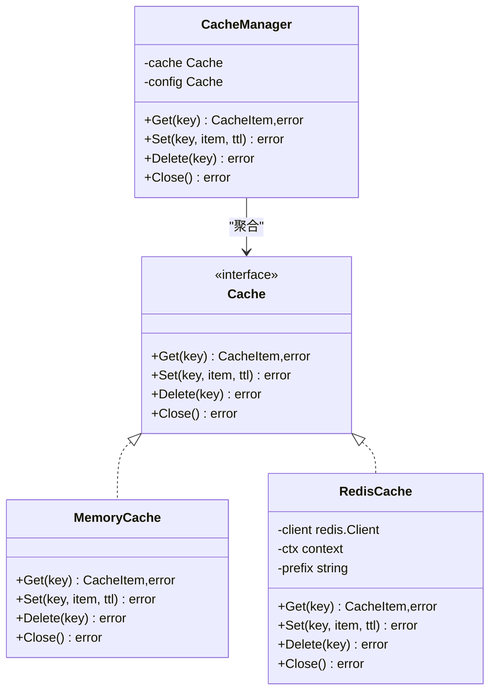
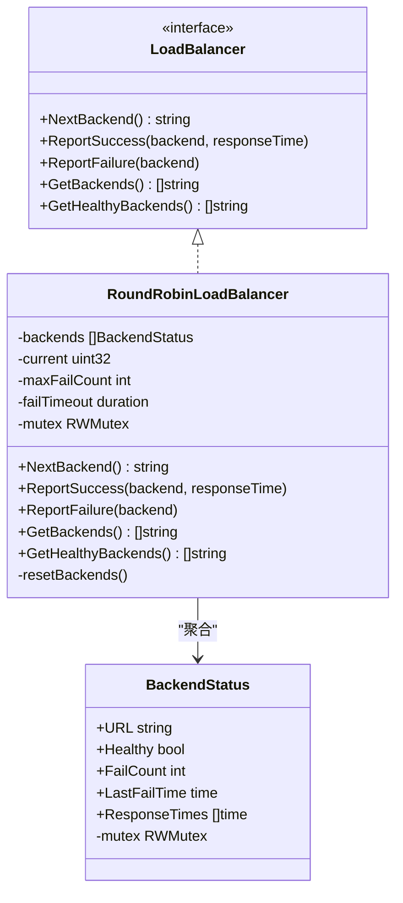
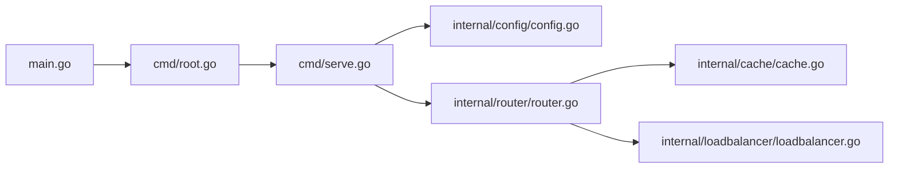

# serve 命令

<cite>
**本文引用的文件**
- [main.go](file://main.go)
- [root.go](file://cmd/root.go)
- [serve.go](file://cmd/serve.go)
- [config.go](file://internal/config/config.go)
- [example_config.toml](file://internal/config/example_config.toml)
- [router.go](file://internal/router/router.go)
- [cache.go](file://internal/cache/cache.go)
- [loadbalancer.go](file://internal/loadbalancer/loadbalancer.go)
</cite>

## 目录
1. [简介](#简介)
2. [项目结构](#项目结构)
3. [核心组件](#核心组件)
4. [架构总览](#架构总览)
5. [详细组件分析](#详细组件分析)
6. [依赖分析](#依赖分析)
7. [性能考量](#性能考量)
8. [故障排查指南](#故障排查指南)
9. [结论](#结论)
10. [附录](#附录)

## 简介
本节面向“serve 命令”的使用者与维护者，系统化阐述该命令作为 API 网关服务启动的核心职责与实现细节。重点覆盖：
- 如何解析配置文件路径并进行校验
- 初始化 Fiber HTTP 服务器
- 加载路由规则并构建处理链
- 构建缓存管理器与负载均衡器
- 集成信号监听（SIGTERM 与 Interrupt）实现优雅关闭
- 典型调用方式与参数说明
- 与 internal/router、internal/cache、internal/loadbalancer 的交互关系
- 启动失败的常见原因与排查方法
- 性能调优建议（连接池、日志级别等）

## 项目结构
本项目采用命令入口 + 子模块分层的组织方式：
- 命令层：cmd 下包含根命令与子命令（serve、check、gen、version）
- 核心业务层：internal 下按功能拆分为 config、router、cache、loadbalancer
- 入口程序：main.go 注册信号监听并委派执行命令

图表来源
- [main.go](file://main.go#L1-L49)
- [root.go](file://cmd/root.go#L1-L50)
- [serve.go](file://cmd/serve.go#L1-L30)
- [config.go](file://internal/config/config.go#L1-L263)
- [router.go](file://internal/router/router.go#L1-L504)
- [cache.go](file://internal/cache/cache.go#L1-L369)
- [loadbalancer.go](file://internal/loadbalancer/loadbalancer.go#L1-L248)

章节来源
- [main.go](file://main.go#L1-L49)
- [root.go](file://cmd/root.go#L1-L50)
- [serve.go](file://cmd/serve.go#L1-L30)

## 核心组件
- serve 命令：负责解析配置、校验配置、启动 Fiber 服务器、注册路由、初始化缓存与负载均衡器
- 配置模块：解析 TOML 配置、校验端口/主机、缓存与路由合法性
- 路由模块：基于 Fiber 注册路由，封装请求处理链，集成缓存与负载均衡
- 缓存模块：支持内存与 Redis 两种实现，提供统一 CacheManager 接口
- 负载均衡模块：轮询策略、健康检查、失败计数与恢复

章节来源
- [serve.go](file://cmd/serve.go#L1-L30)
- [config.go](file://internal/config/config.go#L1-L263)
- [router.go](file://internal/router/router.go#L1-L504)
- [cache.go](file://internal/cache/cache.go#L1-L369)
- [loadbalancer.go](file://internal/loadbalancer/loadbalancer.go#L1-L248)

## 架构总览
serve 命令的启动流程如下：

图表来源
- [main.go](file://main.go#L1-L49)
- [root.go](file://cmd/root.go#L1-L50)
- [serve.go](file://cmd/serve.go#L1-L30)
- [config.go](file://internal/config/config.go#L1-L263)
- [router.go](file://internal/router/router.go#L445-L504)
- [cache.go](file://internal/cache/cache.go#L252-L328)
- [loadbalancer.go](file://internal/loadbalancer/loadbalancer.go#L1-L248)

## 详细组件分析

### serve 命令：启动流程与控制流
- 参数与入口
  - 子命令定义：使用 Cobra 定义 serve 子命令，要求精确传入一个参数（配置文件路径）
  - 日志记录：启动时记录配置路径
- 配置解析与校验
  - 解析：调用 ParseConfig 解析 TOML 文件为结构体
  - 校验：调用 ValidateConfig 对端口、主机、缓存、路由进行一致性与合法性检查
- Fiber 服务器初始化与路由注册
  - 创建 Fiber 应用实例
  - 条件初始化缓存管理器（根据配置决定是否启用）
  - 逐条路由注册处理器（Fiber 路由通配符）
  - 绑定 host:port 并启动监听
- 错误处理
  - 解析失败、校验失败、监听失败均向上返回，由上层记录并退出

图表来源
- [serve.go](file://cmd/serve.go#L1-L30)
- [config.go](file://internal/config/config.go#L1-L263)
- [router.go](file://internal/router/router.go#L445-L504)

章节来源
- [serve.go](file://cmd/serve.go#L1-L30)
- [config.go](file://internal/config/config.go#L1-L263)
- [router.go](file://internal/router/router.go#L445-L504)

### 配置解析与校验
- 解析逻辑
  - 使用 BurntSushi/toml 解析 TOML 文件
  - 可选设置日志文件路径并开启落盘
- 校验规则
  - 基本配置：端口范围校验、主机非空
  - 缓存配置：启用 Redis 时必须提供有效 URL；URL 有效性校验
  - 路由配置：至少一条路由；路径非空且唯一；后端列表非空且 URL 有效；可连接性仅记录警告（运行时再试）
- 示例配置
  - 提供示例 TOML，包含端口、主机、日志、缓存、路由、自定义头部等字段

章节来源
- [config.go](file://internal/config/config.go#L1-L263)
- [example_config.toml](file://internal/config/example_config.toml#L1-L45)

### Fiber 服务器初始化与路由加载
- Fiber 应用创建
  - 使用 fiber.New() 初始化应用
- 缓存管理器初始化
  - 若配置启用缓存：调用 NewCacheManager(config.Cache)
  - 成功后在退出时自动关闭；失败则降级为无缓存运行
- 路由注册
  - 遍历配置中的路由列表，为每条路由注册通配符处理器
  - 处理器内部根据配置决定是否启用缓存与 TTL
- 地址绑定与监听
  - 组合 host 与 port，调用 app.Listen(host:port)

章节来源
- [router.go](file://internal/router/router.go#L445-L504)

### 缓存管理器与缓存实现
- CacheManager
  - 统一接口：Get/Set/Delete/Close
  - 选择策略：若启用 Redis 且连接成功则使用 Redis；否则降级为内存缓存
- Redis 缓存
  - 基于 go-redis/redis.v8
  - 连接测试通过后使用；键带前缀；序列化存储响应体与头部
- 内存缓存
  - 基于 sync.Map 的并发安全实现
  - 定期清理过期项；TTL 为 0 表示不过期
- 头部过滤
  - 过滤掉易变或重复的响应头，避免缓存污染

图表来源
- [cache.go](file://internal/cache/cache.go#L1-L369)

章节来源
- [cache.go](file://internal/cache/cache.go#L1-L369)

### 负载均衡器
- 接口与实现
  - LoadBalancer 接口：NextBackend、ReportSuccess、ReportFailure、GetBackends、GetHealthyBackends
  - 轮询实现：RoundRobinLoadBalancer，维护后端健康状态、失败计数、最近响应时间
- 健康检查与恢复
  - 失败阈值与超时：超过阈值标记不健康；超时后允许重试
  - 全部不健康时重置所有后端
- 线程安全
  - 使用互斥锁保护状态更新与读取

图表来源
- [loadbalancer.go](file://internal/loadbalancer/loadbalancer.go#L1-L248)

章节来源
- [loadbalancer.go](file://internal/loadbalancer/loadbalancer.go#L1-L248)

### 与 internal/router 的交互
- serve 命令在启动时调用 router.Run(config)，后者完成：
  - 缓存管理器初始化（可选）
  - 为每条路由创建负载均衡器（按需并发创建并复用）
  - 注册 Fiber 路由处理器（通配符）
  - 绑定地址并监听
- 路由处理器内部：
  - 生成缓存键、判断是否启用缓存
  - 优先从缓存读取，未命中则转发至后端
  - 成功响应按 TTL 缓存
  - 负载均衡器上报成功/失败，维护健康状态

章节来源
- [serve.go](file://cmd/serve.go#L1-L30)
- [router.go](file://internal/router/router.go#L1-L504)
- [loadbalancer.go](file://internal/loadbalancer/loadbalancer.go#L1-L248)
- [cache.go](file://internal/cache/cache.go#L1-L369)

## 依赖分析
- serve 命令依赖
  - 配置模块：解析与校验
  - 路由模块：Fiber 初始化、路由注册、缓存与负载均衡集成
- 路由模块依赖
  - 缓存模块：CacheManager、MemoryCache、RedisCache
  - 负载均衡模块：LoadBalancer 接口与 RoundRobinLoadBalancer 实现
- 主程序依赖
  - 信号监听：os/signal + syscall，捕获 SIGINT 与 SIGTERM，触发优雅关闭

图表来源
- [serve.go](file://cmd/serve.go#L1-L30)
- [config.go](file://internal/config/config.go#L1-L263)
- [router.go](file://internal/router/router.go#L1-L504)
- [cache.go](file://internal/cache/cache.go#L1-L369)
- [loadbalancer.go](file://internal/loadbalancer/loadbalancer.go#L1-L248)
- [main.go](file://main.go#L1-L49)
- [root.go](file://cmd/root.go#L1-L50)

章节来源
- [serve.go](file://cmd/serve.go#L1-L30)
- [router.go](file://internal/router/router.go#L1-L504)
- [main.go](file://main.go#L1-L49)

## 性能考量
- 缓存策略
  - 全局启用缓存时，路由可按 TTL 与路径白名单进一步细化
  - Redis 缓存具备跨进程共享能力，适合分布式部署；内存缓存适合单实例
- 负载均衡
  - 轮询策略简单高效；失败阈值与超时可平衡可用性与延迟
- 日志级别
  - 建议生产环境使用默认级别，必要时通过命令行开关调整
- 连接池与网络
  - 代理转发使用 Fiber Agent，注意上游后端的连接池与超时设置
- 并发与资源
  - 负载均衡器与缓存实现均考虑并发安全；注意内存缓存的过期清理频率

[本节为通用指导，无需列出具体文件来源]

## 故障排查指南
- 启动失败
  - 配置解析失败：检查 TOML 语法与字段类型
  - 配置校验失败：端口越界、主机为空、缓存 Redis URL 无效、路由路径重复或后端为空/无效
  - 端口占用：确认 host:port 已被占用，更换端口或释放占用进程
- 运行中异常
  - 缓存初始化失败：Redis 连接失败将降级为内存缓存；检查 Redis 地址与网络连通
  - 路由后端不可达：负载均衡器会标记为不健康并重试；确认后端服务可达
  - 优雅关闭
    - 进程收到 SIGINT/SIGTERM 后会同步日志并关闭资源
    - 若未按预期退出，检查信号是否被上层进程拦截或容器运行时限制

章节来源
- [config.go](file://internal/config/config.go#L1-L263)
- [router.go](file://internal/router/router.go#L445-L504)
- [cache.go](file://internal/cache/cache.go#L252-L328)
- [main.go](file://main.go#L1-L49)

## 结论
serve 命令以最小耦合的方式串联配置、路由、缓存与负载均衡模块，借助 Fiber 实现高性能 HTTP 代理。通过严格的配置校验与优雅关闭机制，保障服务稳定运行。生产部署建议：
- 使用示例配置作为起点，逐步细化缓存与路由策略
- 在分布式场景启用 Redis 缓存
- 合理设置负载均衡阈值与超时
- 关注日志级别与落盘路径，便于问题定位

[本节为总结性内容，无需列出具体文件来源]

## 附录

### 典型调用方式与参数说明
- 基本用法
  - 命令：simple-api-gateway serve <配置文件路径>
  - 示例：simple-api-gateway serve config.toml
- 参数
  - 配置文件路径：必填，TOML 格式
  - 日志文件路径：可在配置中设置，支持落盘
- 端口绑定
  - 通过配置中的 host 与 port 字段控制监听地址

章节来源
- [root.go](file://cmd/root.go#L1-L50)
- [serve.go](file://cmd/serve.go#L1-L30)
- [example_config.toml](file://internal/config/example_config.toml#L1-L45)