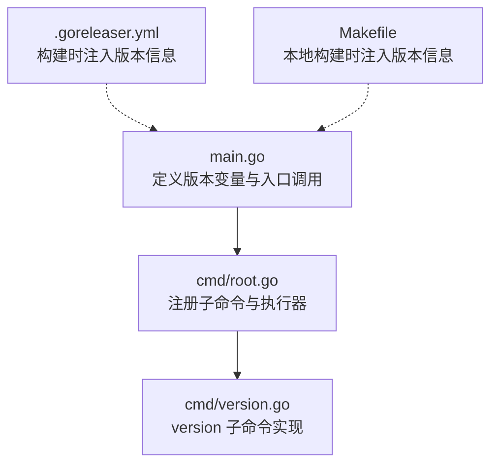
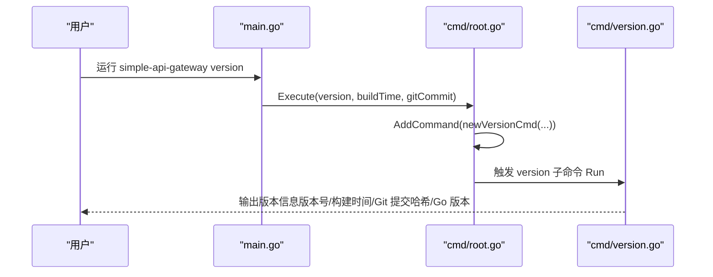
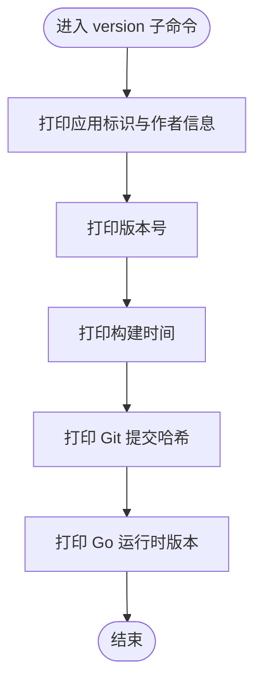
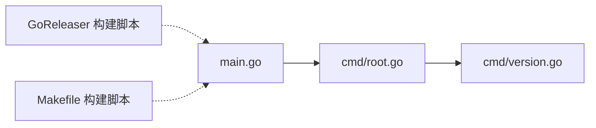

# version 命令

<cite>
**本文引用的文件**
- [main.go](file://main.go)
- [cmd/root.go](file://cmd/root.go)
- [cmd/version.go](file://cmd/version.go)
- [.goreleaser.yml](file://.goreleaser.yml)
- [Makefile](file://Makefile)
- [README.md](file://README.md)
</cite>

## 目录
1. [简介](#简介)
2. [项目结构](#项目结构)
3. [核心组件](#核心组件)
4. [架构总览](#架构总览)
5. [详细组件分析](#详细组件分析)
6. [依赖关系分析](#依赖关系分析)
7. [性能与构建特性](#性能与构建特性)
8. [故障排查指南](#故障排查指南)
9. [结论](#结论)

## 简介
本节说明 simple_api_gateway 的 version 命令用途与输出格式，解释版本号“dev”等信息如何通过 Go 编译时变量（-ldflags）注入二进制，并展示在 main.go 中的定义方式。同时阐述 version 命令在故障排查、环境确认与版本兼容性检查中的作用，并给出构建时正确设置版本信息的实践建议，确保 version 输出真实反映发布状态。

## 项目结构
version 命令属于 CLI 子系统的一部分，位于 cmd 目录下；入口程序 main.go 将版本信息传递给根命令，最终由 version 子命令负责输出。

图表来源
- [main.go](file://main.go#L1-L49)
- [cmd/root.go](file://cmd/root.go#L1-L50)
- [cmd/version.go](file://cmd/version.go#L1-L39)
- [.goreleaser.yml](file://.goreleaser.yml#L1-L76)
- [Makefile](file://Makefile#L1-L20)

章节来源
- [main.go](file://main.go#L1-L49)
- [cmd/root.go](file://cmd/root.go#L1-L50)
- [cmd/version.go](file://cmd/version.go#L1-L39)
- [.goreleaser.yml](file://.goreleaser.yml#L1-L76)
- [Makefile](file://Makefile#L1-L20)

## 核心组件
- 入口与版本变量
  - main.go 中定义了版本号、构建时间、Git 提交哈希三个变量，默认值分别为“dev”、“unknown”、“unknown”，并在 main 函数中作为参数传入根命令执行器。
- 根命令与子命令注册
  - cmd/root.go 中创建根命令，并在其中注册 version 子命令，同时将版本信息透传给子命令。
- version 子命令
  - cmd/version.go 实现 version 子命令，负责输出版本号、构建时间、Git 提交哈希以及 Go 运行时版本等信息。

章节来源
- [main.go](file://main.go#L1-L49)
- [cmd/root.go](file://cmd/root.go#L1-L50)
- [cmd/version.go](file://cmd/version.go#L1-L39)

## 架构总览
version 命令的调用链路如下：main.go -> cmd/root.go -> cmd/version.go。构建阶段通过 -ldflags 注入版本信息，使 version 输出与实际发布状态一致。

图表来源
- [main.go](file://main.go#L34-L48)
- [cmd/root.go](file://cmd/root.go#L16-L40)
- [cmd/version.go](file://cmd/version.go#L10-L38)

## 详细组件分析

### 入口与版本变量注入
- main.go 定义了三个全局变量：版本号、构建时间、Git 提交哈希，并在 main 函数中将它们作为参数传入 cmd.Execute(...)，从而在整棵命令树中可用。
- 默认值设计：
  - 版本号默认为“dev”，便于开发调试时区分本地构建与发布版本。
  - 构建时间与 Git 提交哈希默认为“unknown”，当未通过 -ldflags 注入时，version 输出将显示“unknown”。

章节来源
- [main.go](file://main.go#L13-L17)
- [main.go](file://main.go#L44-L48)

### 根命令与子命令注册
- cmd/root.go 创建根命令，注册 version 子命令，并将版本信息透传给子命令构造函数。
- 该设计保证了 version 子命令无需直接访问全局变量，而是通过参数接收，提升模块化与可测试性。

章节来源
- [cmd/root.go](file://cmd/root.go#L16-L40)

### version 子命令实现
- cmd/version.go 中 newVersionCmd 返回一个 Cobra 命令对象，Run 回调负责格式化输出。
- 输出字段包含：
  - 应用版本号（来自 -ldflags 注入）
  - 构建时间（来自 -ldflags 注入）
  - Git 提交哈希（来自 -ldflags 注入）
  - Go 运行时版本（来自 runtime.Version）

图表来源
- [cmd/version.go](file://cmd/version.go#L10-L38)

章节来源
- [cmd/version.go](file://cmd/version.go#L10-L38)

### 构建时变量注入（-ldflags）
- Go 编译器允许在链接阶段通过 -ldflags 注入符号值，simple_api_gateway 在构建时使用 -X 指令将版本号、构建时间、Git 提交哈希写入 main 包的变量中。
- 两种主要注入方式：
  - 使用 GoReleaser（CI/CD 发布流程）：.goreleaser.yml 中通过 ldflags 注入 main.version、main.buildTime、main.gitCommit。
  - 使用 Makefile（本地开发）：Makefile 中通过 -ldflags "-X main.version=$(shell git describe --abbrev=0 --tags)" 注入版本号，便于本地快速构建与测试。

章节来源
- [.goreleaser.yml](file://.goreleaser.yml#L16-L23)
- [.goreleaser.yml](file://.goreleaser.yml#L47-L56)
- [Makefile](file://Makefile#L10-L16)

## 依赖关系分析
- main.go 依赖 cmd 包导出的 Execute(...)，并将版本信息作为参数传递。
- cmd/root.go 依赖 cmd/version.go 导出的新建子命令函数，并在根命令中注册。
- 构建系统（GoReleaser 与 Makefile）通过 -ldflags 间接影响 main.go 中的变量值，从而改变 version 输出。

图表来源
- [main.go](file://main.go#L44-L48)
- [cmd/root.go](file://cmd/root.go#L33-L40)
- [cmd/version.go](file://cmd/version.go#L10-L18)
- [.goreleaser.yml](file://.goreleaser.yml#L16-L23)
- [Makefile](file://Makefile#L10-L16)

章节来源
- [main.go](file://main.go#L44-L48)
- [cmd/root.go](file://cmd/root.go#L33-L40)
- [cmd/version.go](file://cmd/version.go#L10-L18)
- [.goreleaser.yml](file://.goreleaser.yml#L16-L23)
- [Makefile](file://Makefile#L10-L16)

## 性能与构建特性
- -ldflags 注入是静态链接期替换，不会引入运行时开销，仅影响 version 输出与构建元数据。
- GoReleaser 在多平台、多架构构建时统一注入版本信息，确保跨平台一致性。
- Makefile 适合本地开发场景，便于快速迭代与测试。

章节来源
- [.goreleaser.yml](file://.goreleaser.yml#L16-L23)
- [Makefile](file://Makefile#L10-L16)

## 故障排查指南
- version 输出仍为“dev/unknown”
  - 检查是否使用 -ldflags 注入版本信息（GoReleaser 或 Makefile）。
  - 若使用 GoReleaser，确认 .goreleaser.yml 中 ldflags 是否包含 main.version/main.buildTime/main.gitCommit。
  - 若使用 Makefile，确认本地构建命令是否包含 -ldflags "-X main.version=..."。
- 版本号不符合预期
  - 确认构建时使用的标签或提交哈希来源是否正确（例如 git describe 的结果）。
- 输出缺少 Git 提交哈希
  - 在无 Git 环境或未检出完整历史时，可能无法解析提交哈希，此时保持“unknown”属正常行为。
- 多平台构建一致性
  - 使用 GoReleaser 的 overrides 配置确保各平台注入一致。

章节来源
- [.goreleaser.yml](file://.goreleaser.yml#L16-L23)
- [.goreleaser.yml](file://.goreleaser.yml#L47-L56)
- [Makefile](file://Makefile#L10-L16)

## 结论
- version 命令用于输出 simple_api_gateway 的版本信息，包括版本号、构建时间、Git 提交哈希与 Go 运行时版本。
- 版本号“dev”与“unknown”默认值由 main.go 定义，实际发布状态由构建阶段通过 -ldflags 注入。
- 通过 GoReleaser 与 Makefile 的配合，可在 CI/CD 与本地开发中稳定地将真实发布状态注入二进制，确保 version 输出准确可靠。
- 在故障排查、环境确认与版本兼容性检查中，version 命令是快速定位问题与验证部署状态的重要工具。