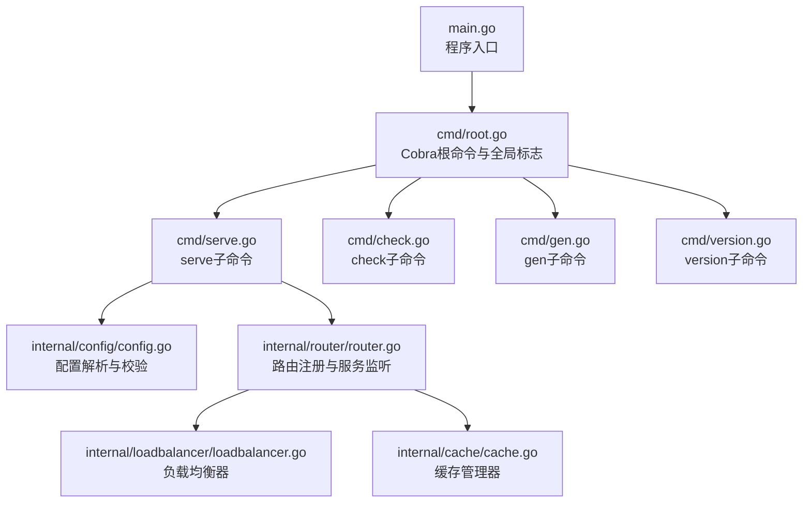
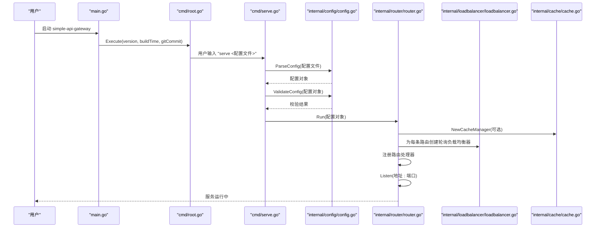
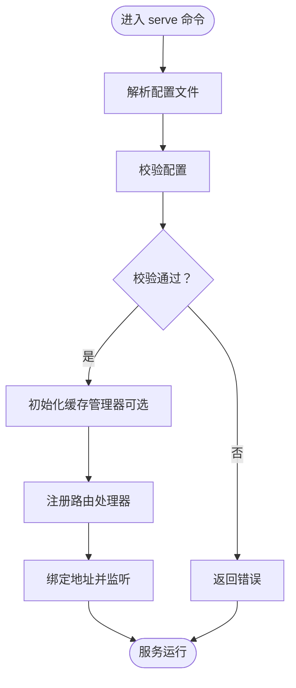
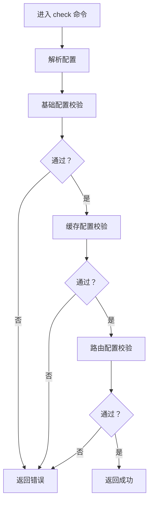
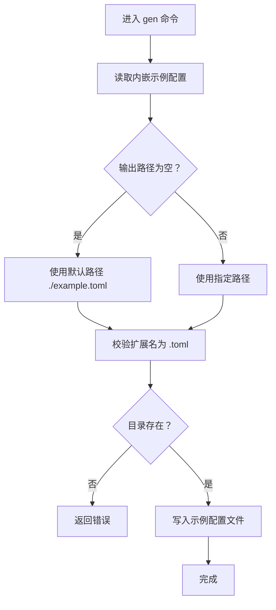
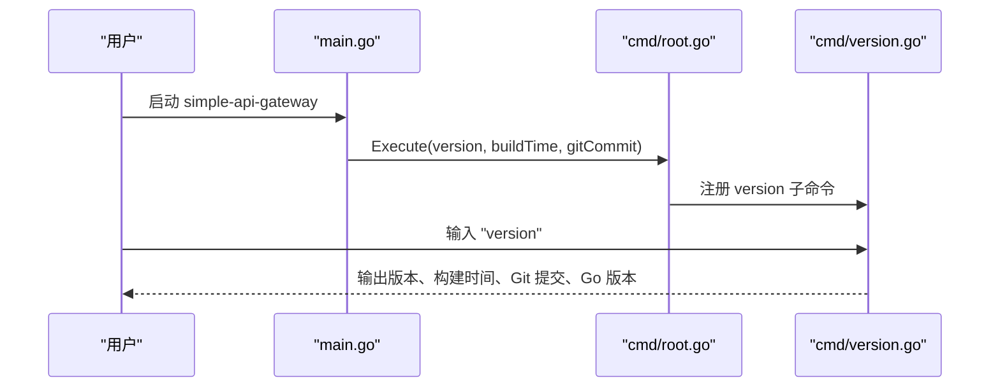
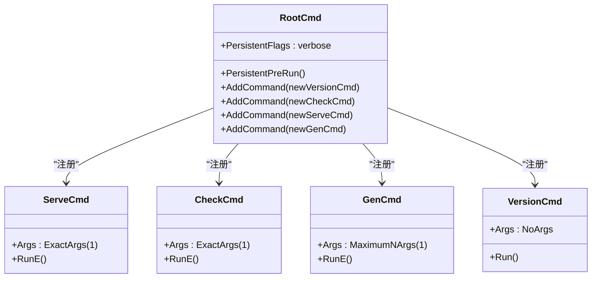
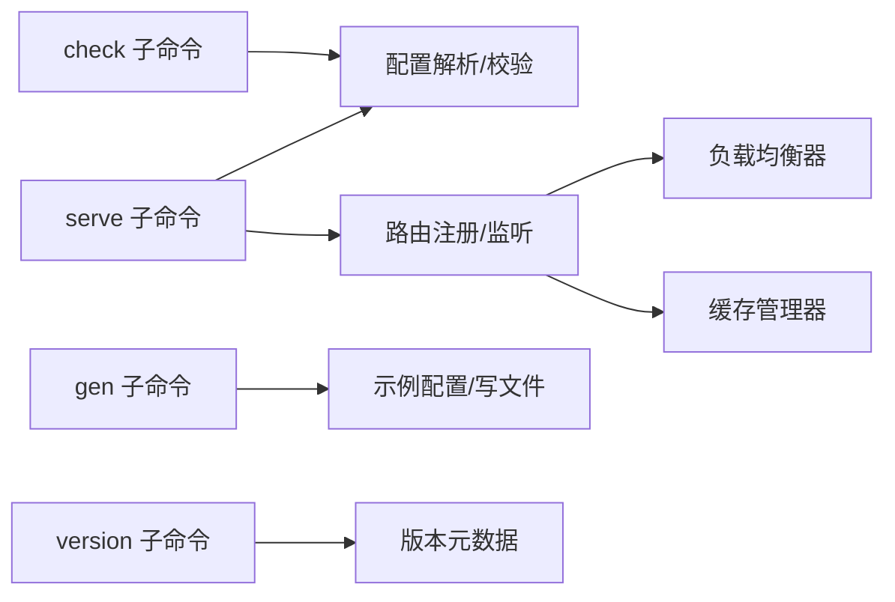

# 命令行接口

<cite>
**本文引用的文件**
- [main.go](file://main.go)
- [cmd/root.go](file://cmd/root.go)
- [cmd/serve.go](file://cmd/serve.go)
- [cmd/check.go](file://cmd/check.go)
- [cmd/gen.go](file://cmd/gen.go)
- [cmd/version.go](file://cmd/version.go)
- [internal/config/config.go](file://internal/config/config.go)
- [internal/config/example_config.toml](file://internal/config/example_config.toml)
- [internal/router/router.go](file://internal/router/router.go)
- [internal/loadbalancer/loadbalancer.go](file://internal/loadbalancer/loadbalancer.go)
- [internal/cache/cache.go](file://internal/cache/cache.go)
- [README.md](file://README.md)
</cite>

## 目录
1. [简介](#简介)
2. [项目结构](#项目结构)
3. [核心组件](#核心组件)
4. [架构总览](#架构总览)
5. [详细组件分析](#详细组件分析)
6. [依赖关系分析](#依赖关系分析)
7. [性能与可用性特性](#性能与可用性特性)
8. [故障排查指南](#故障排查指南)
9. [结论](#结论)
10. [附录：命令参考与示例](#附录命令参考与示例)

## 简介
本文件面向使用者与维护者，系统化梳理 simple_api_gateway 的命令行接口能力，覆盖四个子命令的功能、参数、执行流程与输出解读，并深入解释 Cobra 命令树的构建方式与扩展方法。重点包括：
- serve 命令：启动 HTTP 服务器的完整流程（配置加载、校验、组件初始化、路由注册、服务监听）
- check 命令：配置文件语法与语义验证机制
- gen 命令：示例配置模板生成逻辑与可定制性
- version 命令：版本信息嵌入与展示格式
- Cobra 命令树：root.go 中命令树构建与扩展指引

## 项目结构
命令行入口位于 cmd 目录，核心业务逻辑位于 internal 目录；main.go 作为程序入口负责信号处理与调用命令执行器。

图表来源
- [main.go](file://main.go#L1-L49)
- [cmd/root.go](file://cmd/root.go#L1-L50)
- [cmd/serve.go](file://cmd/serve.go#L1-L30)
- [cmd/check.go](file://cmd/check.go#L1-L25)
- [cmd/gen.go](file://cmd/gen.go#L1-L26)
- [cmd/version.go](file://cmd/version.go#L1-L39)
- [internal/config/config.go](file://internal/config/config.go#L1-L263)
- [internal/router/router.go](file://internal/router/router.go#L1-L504)
- [internal/loadbalancer/loadbalancer.go](file://internal/loadbalancer/loadbalancer.go#L1-L248)
- [internal/cache/cache.go](file://internal/cache/cache.go#L1-L369)

章节来源
- [main.go](file://main.go#L1-L49)
- [cmd/root.go](file://cmd/root.go#L1-L50)

## 核心组件
- Cobra 根命令与全局标志：定义全局 verbose 标志，持久化前置钩子控制日志级别，注册各子命令。
- serve 子命令：解析配置、校验配置、启动 Fiber 应用、初始化缓存、注册路由、监听端口。
- check 子命令：解析并校验配置，仅输出结果，不启动服务。
- gen 子命令：生成示例配置文件，支持自定义输出路径与扩展名。
- version 子命令：打印版本、构建时间、Git 提交、Go 版本等信息。

章节来源
- [cmd/root.go](file://cmd/root.go#L1-L50)
- [cmd/serve.go](file://cmd/serve.go#L1-L30)
- [cmd/check.go](file://cmd/check.go#L1-L25)
- [cmd/gen.go](file://cmd/gen.go#L1-L26)
- [cmd/version.go](file://cmd/version.go#L1-L39)

## 架构总览
下图展示 CLI 到核心模块的调用链路与职责分工。

图表来源
- [main.go](file://main.go#L34-L49)
- [cmd/root.go](file://cmd/root.go#L42-L50)
- [cmd/serve.go](file://cmd/serve.go#L10-L29)
- [internal/config/config.go](file://internal/config/config.go#L47-L67)
- [internal/router/router.go](file://internal/router/router.go#L445-L504)
- [internal/loadbalancer/loadbalancer.go](file://internal/loadbalancer/loadbalancer.go#L59-L82)
- [internal/cache/cache.go](file://internal/cache/cache.go#L259-L287)

## 详细组件分析

### serve 命令：启动 HTTP 服务器的完整流程
- 参数与行为
  - 子命令：serve
  - 参数：必须提供一个配置文件路径（精确参数个数）
  - 行为：解析配置、校验配置、启动 Fiber 应用、初始化缓存（可选）、注册路由、监听端口
- 执行流程
  1) 解析配置：调用配置解析函数读取 TOML 并填充结构体
  2) 校验配置：执行基础配置、缓存配置、路由配置的校验
  3) 初始化缓存：根据配置决定是否启用缓存，若启用则创建缓存管理器（优先 Redis，失败则回退内存缓存）
  4) 注册路由：遍历路由表，为每个路由注册处理器
  5) 监听服务：按 host:port 绑定并启动监听
- 关键实现位置
  - 配置解析与校验：见 internal/config/config.go
  - 服务启动与路由注册：见 internal/router/router.go
  - 负载均衡器：见 internal/loadbalancer/loadbalancer.go
  - 缓存管理器：见 internal/cache/cache.go

图表来源
- [cmd/serve.go](file://cmd/serve.go#L10-L29)
- [internal/config/config.go](file://internal/config/config.go#L47-L88)
- [internal/router/router.go](file://internal/router/router.go#L445-L504)
- [internal/cache/cache.go](file://internal/cache/cache.go#L259-L287)

章节来源
- [cmd/serve.go](file://cmd/serve.go#L1-L30)
- [internal/config/config.go](file://internal/config/config.go#L47-L88)
- [internal/router/router.go](file://internal/router/router.go#L445-L504)
- [internal/loadbalancer/loadbalancer.go](file://internal/loadbalancer/loadbalancer.go#L59-L82)
- [internal/cache/cache.go](file://internal/cache/cache.go#L259-L287)

### check 命令：配置文件语法与语义验证
- 参数与行为
  - 子命令：check
  - 参数：必须提供一个配置文件路径（精确参数个数）
  - 行为：解析并校验配置，仅输出校验结果，不启动服务
- 校验机制
  - 基础配置校验：端口范围、主机地址有效性
  - 缓存配置校验：当启用缓存且使用 Redis 时，要求 Redis URL 非空且可解析
  - 路由配置校验：路由数量非零；每条路由路径非空且唯一；后端列表非空；每个后端 URL 非空且可解析；可对后端连通性做运行时探测（记录警告）
- 输出解读
  - 成功：无输出或仅返回成功状态
  - 失败：返回具体错误原因（如端口无效、路径重复、后端 URL 无效等）

图表来源
- [cmd/check.go](file://cmd/check.go#L9-L24)
- [internal/config/config.go](file://internal/config/config.go#L90-L144)
- [internal/config/config.go](file://internal/config/config.go#L146-L224)

章节来源
- [cmd/check.go](file://cmd/check.go#L1-L25)
- [internal/config/config.go](file://internal/config/config.go#L90-L144)
- [internal/config/config.go](file://internal/config/config.go#L146-L224)

### gen 命令：生成示例配置模板
- 参数与行为
  - 子命令：gen
  - 参数：最多一个目标路径（可选），默认输出到当前目录的示例文件
  - 行为：读取内嵌示例配置，校验输出路径扩展名为 .toml，确保目录存在，写入文件
- 可定制性
  - 示例配置包含全局缓存与多路由示例，用户可据此调整端口、主机、后端、缓存策略与自定义头部等
  - 通过 Docker Compose 提供带 Redis 与不带 Redis 的示例配置文件，便于快速部署

图表来源
- [cmd/gen.go](file://cmd/gen.go#L9-L25)
- [internal/config/config.go](file://internal/config/config.go#L226-L263)
- [internal/config/example_config.toml](file://internal/config/example_config.toml#L1-L45)

章节来源
- [cmd/gen.go](file://cmd/gen.go#L1-L26)
- [internal/config/config.go](file://internal/config/config.go#L226-L263)
- [internal/config/example_config.toml](file://internal/config/example_config.toml#L1-L45)

### version 命令：版本信息嵌入与显示格式
- 参数与行为
  - 子命令：version
  - 参数：无
  - 行为：打印项目标语、作者、仓库链接、文档链接、版本号、构建时间、Git 提交、Go 版本
- 版本信息来源
  - 通过 main.go 的变量注入到 root.go 的命令构造函数中，最终在 version 子命令中输出

图表来源
- [main.go](file://main.go#L13-L17)
- [cmd/root.go](file://cmd/root.go#L16-L39)
- [cmd/version.go](file://cmd/version.go#L10-L38)

章节来源
- [cmd/version.go](file://cmd/version.go#L1-L39)
- [main.go](file://main.go#L13-L17)
- [cmd/root.go](file://cmd/root.go#L16-L39)

### Cobra 命令树构建与扩展指引
- 根命令与全局标志
  - 定义全局 verbose 标志，持久化前置钩子根据标志设置日志级别
  - 注册子命令：version、check、serve、gen
- 子命令注册点
  - 在 root.go 中通过 AddCommand 注册各子命令
- 扩展建议
  - 新增子命令：在 cmd 目录新增文件，定义新命令并返回 *cobra.Command，再在 root.go 中注册
  - 新增标志：在对应子命令的 Flags 中定义；如需全局生效，在 root.go 的 PersistentFlags 中定义
  - 错误处理：在 RunE 中返回错误，root.go 的 Execute 会捕获并记录

图表来源
- [cmd/root.go](file://cmd/root.go#L16-L39)
- [cmd/serve.go](file://cmd/serve.go#L10-L29)
- [cmd/check.go](file://cmd/check.go#L9-L24)
- [cmd/gen.go](file://cmd/gen.go#L9-L25)
- [cmd/version.go](file://cmd/version.go#L10-L38)

章节来源
- [cmd/root.go](file://cmd/root.go#L1-L50)

## 依赖关系分析
- serve 命令依赖配置解析与校验、路由注册与监听、负载均衡与缓存
- check 命令依赖配置解析与校验
- gen 命令依赖示例配置与文件系统写入
- version 命令依赖主程序注入的版本信息

图表来源
- [cmd/serve.go](file://cmd/serve.go#L10-L29)
- [cmd/check.go](file://cmd/check.go#L9-L24)
- [cmd/gen.go](file://cmd/gen.go#L9-L25)
- [cmd/version.go](file://cmd/version.go#L10-L38)
- [internal/config/config.go](file://internal/config/config.go#L47-L88)
- [internal/router/router.go](file://internal/router/router.go#L445-L504)
- [internal/loadbalancer/loadbalancer.go](file://internal/loadbalancer/loadbalancer.go#L59-L82)
- [internal/cache/cache.go](file://internal/cache/cache.go#L259-L287)

章节来源
- [cmd/serve.go](file://cmd/serve.go#L1-L30)
- [cmd/check.go](file://cmd/check.go#L1-L25)
- [cmd/gen.go](file://cmd/gen.go#L1-L26)
- [cmd/version.go](file://cmd/version.go#L1-L39)
- [internal/config/config.go](file://internal/config/config.go#L47-L88)
- [internal/router/router.go](file://internal/router/router.go#L445-L504)
- [internal/loadbalancer/loadbalancer.go](file://internal/loadbalancer/loadbalancer.go#L59-L82)
- [internal/cache/cache.go](file://internal/cache/cache.go#L259-L287)

## 性能与可用性特性
- 负载均衡：轮询策略，健康检查与自动故障转移，支持失败超时后重试
- 缓存：支持 Redis 或内存缓存，自动降级；缓存键基于请求方法、路径、查询参数与请求体生成
- 日志：支持将日志写入文件，便于生产环境排障
- 平滑退出：主程序监听系统信号，优雅关闭日志与缓存资源

章节来源
- [internal/loadbalancer/loadbalancer.go](file://internal/loadbalancer/loadbalancer.go#L84-L110)
- [internal/loadbalancer/loadbalancer.go](file://internal/loadbalancer/loadbalancer.go#L139-L182)
- [internal/loadbalancer/loadbalancer.go](file://internal/loadbalancer/loadbalancer.go#L197-L231)
- [internal/cache/cache.go](file://internal/cache/cache.go#L143-L251)
- [internal/cache/cache.go](file://internal/cache/cache.go#L252-L328)
- [internal/router/router.go](file://internal/router/router.go#L33-L110)
- [main.go](file://main.go#L27-L49)

## 故障排查指南
- 配置文件无效
  - 症状：check 命令报错或 serve 命令启动失败
  - 排查：确认端口范围、主机地址、路由路径唯一性、后端 URL 可解析；启用 Redis 时检查 URL 与连通性
- 缓存初始化失败
  - 症状：启动日志提示缓存初始化失败并回退内存缓存
  - 排查：检查 Redis 连接 URL、数据库编号、网络连通性
- 路由无健康后端
  - 症状：请求返回 503 或错误
  - 排查：查看负载均衡器健康状态与失败计数，确认后端服务可达
- 日志定位
  - 使用 verbose 标志提升日志级别；如配置了日志文件路径，检查文件权限与磁盘空间

章节来源
- [cmd/check.go](file://cmd/check.go#L9-L24)
- [internal/config/config.go](file://internal/config/config.go#L90-L144)
- [internal/config/config.go](file://internal/config/config.go#L146-L224)
- [internal/cache/cache.go](file://internal/cache/cache.go#L143-L201)
- [internal/router/router.go](file://internal/router/router.go#L204-L247)
- [internal/loadbalancer/loadbalancer.go](file://internal/loadbalancer/loadbalancer.go#L139-L182)

## 结论
simple_api_gateway 的命令行接口以 Cobra 为核心，结构清晰、职责分明。serve 命令串联配置解析、校验与服务启动；check 命令专注于配置验证；gen 命令提供可定制的示例模板；version 命令提供完整的版本元数据。配合负载均衡与缓存机制，可在生产环境中稳定运行。通过 root.go 的命令树设计，易于扩展新的子命令与标志。

## 附录：命令参考与示例

- 全局标志
  - -v, --verbose：启用详细日志输出
- 子命令与示例
  - serve
    - 用法：simple-api-gateway serve <配置文件路径>
    - 示例：simple-api-gateway serve config.toml
    - 输出：启动成功后显示监听地址与路由初始化信息
  - check
    - 用法：simple-api-gateway check <配置文件路径>
    - 示例：simple-api-gateway check config.toml
    - 输出：校验通过无输出，失败返回具体错误
  - gen
    - 用法：simple-api-gateway gen [输出路径]
    - 示例：simple-api-gateway gen config.toml
    - 输出：在指定路径生成示例配置文件（默认 ./example.toml）
  - version
    - 用法：simple-api-gateway version
    - 示例：simple-api-gateway version
    - 输出：版本号、构建时间、Git 提交、Go 版本等信息

章节来源
- [README.md](file://README.md#L72-L101)
- [README.md](file://README.md#L48-L56)
- [README.md](file://README.md#L90-L100)
- [cmd/root.go](file://cmd/root.go#L33-L33)
- [cmd/serve.go](file://cmd/serve.go#L10-L16)
- [cmd/check.go](file://cmd/check.go#L9-L14)
- [cmd/gen.go](file://cmd/gen.go#L9-L14)
- [cmd/version.go](file://cmd/version.go#L10-L16)