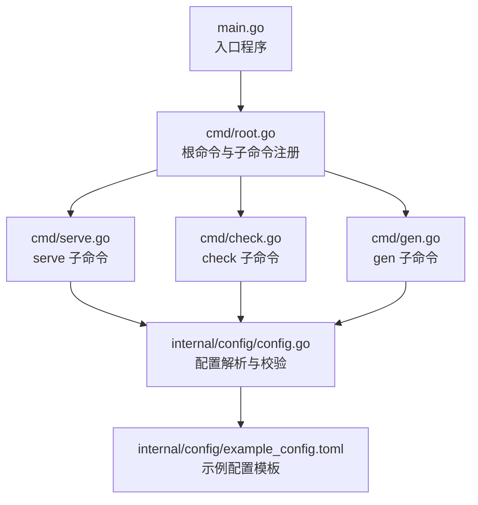
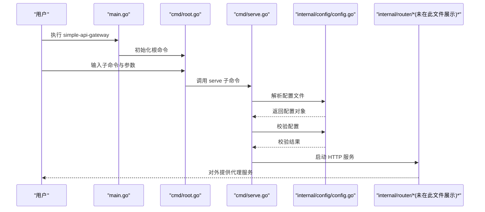
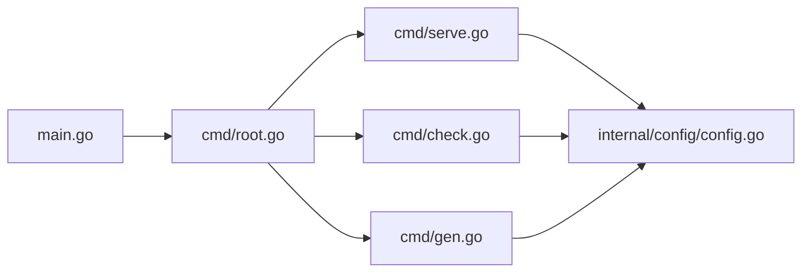

# 快速开始

<cite>
**本文引用的文件**
- [README.md](file://README.md)
- [main.go](file://main.go)
- [cmd/root.go](file://cmd/root.go)
- [cmd/serve.go](file://cmd/serve.go)
- [cmd/check.go](file://cmd/check.go)
- [cmd/gen.go](file://cmd/gen.go)
- [internal/config/config.go](file://internal/config/config.go)
- [internal/config/example_config.toml](file://internal/config/example_config.toml)
- [example_config.toml](file://example_config.toml)
- [config-with-redis.toml](file://config-with-redis.toml)
- [config-without-redis.toml](file://config-without-redis.toml)
- [Dockerfile](file://Dockerfile)
- [Dockerfile](file://Dockerfile)
</cite>

## 目录
1. [简介](#简介)
2. [项目结构](#项目结构)
3. [核心组件](#核心组件)
4. [架构总览](#架构总览)
5. [详细组件分析](#详细组件分析)
6. [依赖关系分析](#依赖关系分析)
7. [性能与可用性提示](#性能与可用性提示)
8. [故障排查指南](#故障排查指南)
9. [结论](#结论)
10. [附录](#附录)

## 简介
本指南面向新手用户，目标是在5分钟内完成 simple_api_gateway 的安装与首次运行。你将学会：
- 通过二进制、Docker 或源码三种方式安装
- 生成并校验配置文件
- 启动服务并通过 curl 测试代理
- 处理常见初始化问题（端口占用、配置语法错误等）

## 项目结构
simple_api_gateway 是一个基于 Go 的命令行工具，采用 Cobra 架构组织命令，核心功能集中在 internal 子包中，包括配置解析、路由与负载均衡、缓存等模块。

图表来源
- [main.go](file://main.go#L1-L49)
- [cmd/root.go](file://cmd/root.go#L1-L50)
- [cmd/serve.go](file://cmd/serve.go#L1-L30)
- [cmd/check.go](file://cmd/check.go#L1-L25)
- [cmd/gen.go](file://cmd/gen.go#L1-L26)
- [internal/config/config.go](file://internal/config/config.go#L1-L263)
- [internal/config/example_config.toml](file://internal/config/example_config.toml#L1-L45)

章节来源
- [main.go](file://main.go#L1-L49)
- [cmd/root.go](file://cmd/root.go#L1-L50)

## 核心组件
- 命令行入口与根命令：负责注册子命令（serve、check、gen、version），并提供通用标志（如 -v 开启详细输出）。
- 服务启动命令（serve）：解析并校验配置，随后启动 HTTP 服务。
- 配置校验命令（check）：仅解析与校验配置，不启动服务。
- 配置生成命令（gen）：在指定路径生成示例配置文件（需以 .toml 结尾）。
- 配置模块（internal/config）：负责 TOML 配置的解析、校验与示例生成。

章节来源
- [cmd/root.go](file://cmd/root.go#L1-L50)
- [cmd/serve.go](file://cmd/serve.go#L1-L30)
- [cmd/check.go](file://cmd/check.go#L1-L25)
- [cmd/gen.go](file://cmd/gen.go#L1-L26)
- [internal/config/config.go](file://internal/config/config.go#L1-L263)

## 架构总览
下面的时序图展示了从用户执行命令到服务启动的关键流程。

图表来源
- [main.go](file://main.go#L1-L49)
- [cmd/root.go](file://cmd/root.go#L1-L50)
- [cmd/serve.go](file://cmd/serve.go#L1-L30)
- [internal/config/config.go](file://internal/config/config.go#L1-L263)

## 详细组件分析

### 安装方式（三选一）
- 二进制安装（推荐新手）
  - 使用 Go 安装最新版本二进制
  - 参考命令路径：[README.md](file://README.md#L38-L45)
- Docker 安装
  - 拉取官方镜像
  - 参考命令路径：[README.md](file://README.md#L42-L44)
  - 简单运行示例：[README.md](file://README.md#L106-L108)
  - Docker Compose（带/不带 Redis）：[README.md](file://README.md#L116-L203)
- 源码编译
  - 先安装 Go 1.16+，再拉取源码并编译
  - 参考命令路径：[README.md](file://README.md#L64-L71)

章节来源
- [README.md](file://README.md#L38-L71)
- [README.md](file://README.md#L106-L108)
- [README.md](file://README.md#L116-L203)

### 首次运行（5分钟步骤）
- 步骤1：生成配置文件
  - 使用 gen 命令生成示例配置（需以 .toml 结尾）
  - 参考命令路径：[README.md](file://README.md#L48-L50)，[cmd/gen.go](file://cmd/gen.go#L1-L26)
- 步骤2：校验配置
  - 使用 check 命令验证配置是否有效
  - 参考命令路径：[README.md](file://README.md#L84-L90)，[cmd/check.go](file://cmd/check.go#L1-L25)
- 步骤3：启动服务
  - 使用 serve 命令加载配置并启动服务
  - 参考命令路径：[README.md](file://README.md#L78-L83)，[cmd/serve.go](file://cmd/serve.go#L1-L30)
- 步骤4：验证代理
  - 使用 curl 访问默认监听端口（默认 8080）
  - 参考命令路径：[README.md](file://README.md#L52-L61)

章节来源
- [README.md](file://README.md#L48-L61)
- [cmd/gen.go](file://cmd/gen.go#L1-L26)
- [cmd/check.go](file://cmd/check.go#L1-L25)
- [cmd/serve.go](file://cmd/serve.go#L1-L30)

### 最简化 TOML 配置示例与字段说明
以下是最小可用配置要点（基于示例文件）：
- 端口与绑定主机
  - 字段：port、host
  - 说明：监听端口与绑定地址
  - 示例参考：[example_config.toml](file://example_config.toml#L1-L3)
- 日志文件路径
  - 字段：log_file_path
  - 说明：可选，将日志写入文件
  - 示例参考：[example_config.toml](file://example_config.toml#L1-L3)
- 缓存开关与 Redis 设置
  - 字段：cache.enabled、cache.use_redis、cache.redis_url、cache.redis_db、cache.redis_prefix
  - 说明：启用缓存、是否使用 Redis、Redis 连接串、数据库号、键前缀
  - 示例参考：[example_config.toml](file://example_config.toml#L5-L11)
- 路由配置
  - 字段：route.path、route.backends、route.ua_client、route.cache_ttl、route.cache_enable、route.cache_paths、route.custom_headers
  - 说明：路由路径、后端服务列表、User-Agent、缓存 TTL、是否启用缓存、可缓存路径集合、自定义请求头
  - 示例参考：[example_config.toml](file://example_config.toml#L12-L45)

章节来源
- [example_config.toml](file://example_config.toml#L1-L45)
- [internal/config/example_config.toml](file://internal/config/example_config.toml#L1-L45)

### 关键命令详解
- gen：生成示例配置文件
  - 行为：读取内置示例模板，写入指定路径（必须是 .toml）
  - 参考实现：[cmd/gen.go](file://cmd/gen.go#L1-L26)，[internal/config/config.go](file://internal/config/config.go#L226-L263)
- check：校验配置文件
  - 行为：解析并校验配置，返回错误或成功
  - 参考实现：[cmd/check.go](file://cmd/check.go#L1-L25)，[internal/config/config.go](file://internal/config/config.go#L69-L88)
- serve：启动服务
  - 行为：解析并校验配置，随后启动 HTTP 服务
  - 参考实现：[cmd/serve.go](file://cmd/serve.go#L1-L30)，[internal/config/config.go](file://internal/config/config.go#L49-L67)

章节来源
- [cmd/gen.go](file://cmd/gen.go#L1-L26)
- [cmd/check.go](file://cmd/check.go#L1-L25)
- [cmd/serve.go](file://cmd/serve.go#L1-L30)
- [internal/config/config.go](file://internal/config/config.go#L49-L88)

### Docker 运行方式
- 单容器运行（挂载本地配置）
  - 参考命令路径：[README.md](file://README.md#L106-L108)
- Docker Compose（带 Redis）
  - 参考命令路径：[README.md](file://README.md#L116-L170)
  - 配置文件示例：[config-with-redis.toml](file://config-with-redis.toml#L1-L31)
- Docker Compose（内存缓存）
  - 参考命令路径：[README.md](file://README.md#L171-L203)
  - 配置文件示例：[config-without-redis.toml](file://config-without-redis.toml#L1-L30)
- 镜像入口（直接启动）
  - 参考路径：[Dockerfile](file://Dockerfile#L1-L7)

章节来源
- [README.md](file://README.md#L106-L108)
- [README.md](file://README.md#L116-L170)
- [README.md](file://README.md#L171-L203)
- [config-with-redis.toml](file://config-with-redis.toml#L1-L31)
- [config-without-redis.toml](file://config-without-redis.toml#L1-L30)
- [Dockerfile](file://Dockerfile#L1-L7)

## 依赖关系分析
- 命令层依赖配置层：serve、check、gen 均依赖 internal/config 的解析与校验能力
- 配置层依赖外部库：BurntSushi/toml 用于 TOML 解析；网络工具用于后端连通性探测
- 入口程序负责信号处理与优雅退出

图表来源
- [main.go](file://main.go#L1-L49)
- [cmd/root.go](file://cmd/root.go#L1-L50)
- [cmd/serve.go](file://cmd/serve.go#L1-L30)
- [cmd/check.go](file://cmd/check.go#L1-L25)
- [cmd/gen.go](file://cmd/gen.go#L1-L26)
- [internal/config/config.go](file://internal/config/config.go#L1-L263)

## 性能与可用性提示
- 默认监听端口为 8080（可在配置中修改）
- 服务启动后会打印日志，可通过 log_file_path 将日志落盘
- 配置校验会在启动前完成，避免无效配置导致运行期异常

章节来源
- [README.md](file://README.md#L52-L61)
- [internal/config/config.go](file://internal/config/config.go#L49-L67)

## 故障排查指南
- 端口占用
  - 现象：启动时报端口不可用
  - 排查：确认配置中的 port 是否被其他进程占用；修改为未占用端口
  - 参考校验逻辑：[internal/config/config.go](file://internal/config/config.go#L93-L104)
- 配置语法错误
  - 现象：check 命令报错或 serve 启动失败
  - 排查：使用 check 命令先验证配置；核对 TOML 语法与字段类型
  - 参考校验逻辑：[internal/config/config.go](file://internal/config/config.go#L69-L88)
- Redis 连接问题（若启用 Redis）
  - 现象：缓存无法使用或报 Redis URL 错误
  - 排查：确认 cache.use_redis=true 时，cache.redis_url 已正确填写且可连通
  - 参考校验逻辑：[internal/config/config.go](file://internal/config/config.go#L109-L124)
- 路由配置问题
  - 现象：无路由或路由重复、后端列表为空、后端 URL 无效
  - 排查：确保至少有一个 route，路径唯一，后端列表非空且为合法 URL
  - 参考校验逻辑：[internal/config/config.go](file://internal/config/config.go#L126-L224)
- 生成配置失败
  - 现象：gen 命令报扩展名或目录不存在
  - 排查：确保传入路径以 .toml 结尾且目录存在
  - 参考实现：[internal/config/config.go](file://internal/config/config.go#L236-L263)

章节来源
- [internal/config/config.go](file://internal/config/config.go#L93-L124)
- [internal/config/config.go](file://internal/config/config.go#L126-L224)
- [internal/config/config.go](file://internal/config/config.go#L236-L263)

## 结论
通过本指南，你可以在几分钟内完成 simple_api_gateway 的安装、配置与首次运行。建议优先使用 gen + check 的方式生成并校验配置，再用 serve 启动服务，并通过 curl 验证代理效果。遇到问题时，优先使用 check 命令定位配置错误，或根据端口、Redis、路由等常见问题逐一排查。

## 附录
- 常用命令参考
  - 生成配置：simple-api-gateway gen config.toml
  - 校验配置：simple-api-gateway check config.toml
  - 启动服务：simple-api-gateway serve config.toml
  - 查看版本：simple-api-gateway version
- Docker 常用命令参考
  - 拉取镜像：docker pull nerdneils/simple_api_gateway:latest
  - 单容器运行：docker run -d --name simple-api-gateway -p 8080:8080 -v /etc/simple_api_gateway/config.toml:/config.toml nerdneils/simple_api_gateway:latest
  - Docker Compose（带 Redis）：docker-compose -f docker-compose-with-redis.yml up -d
  - Docker Compose（内存缓存）：docker-compose -f docker-compose-without-redis.yml up -d

章节来源
- [README.md](file://README.md#L38-L45)
- [README.md](file://README.md#L84-L100)
- [README.md](file://README.md#L106-L108)
- [README.md](file://README.md#L116-L203)