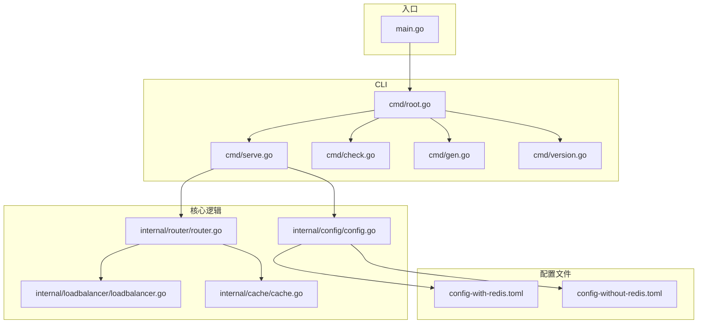
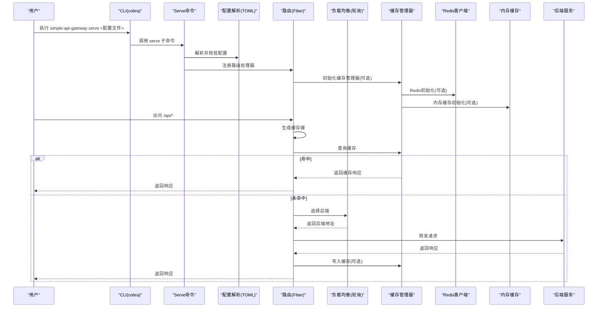
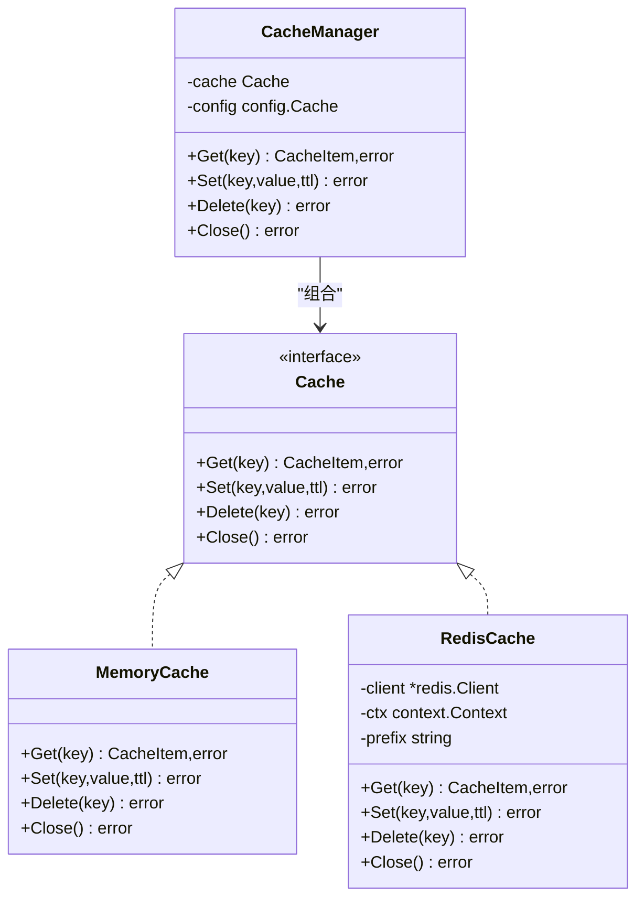
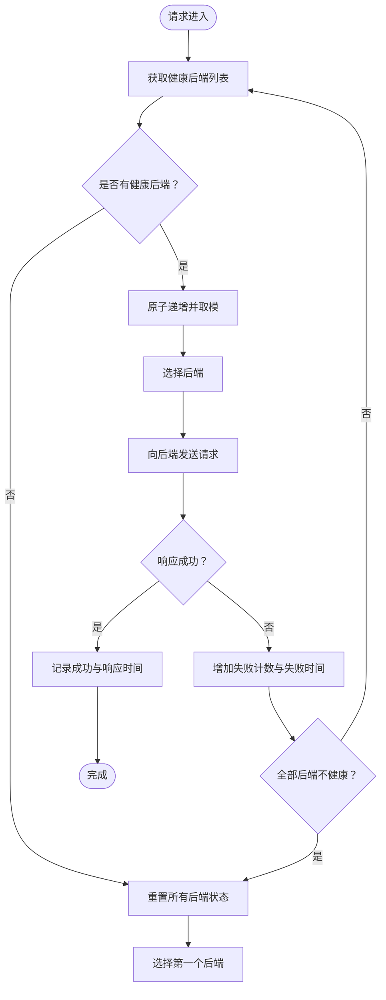
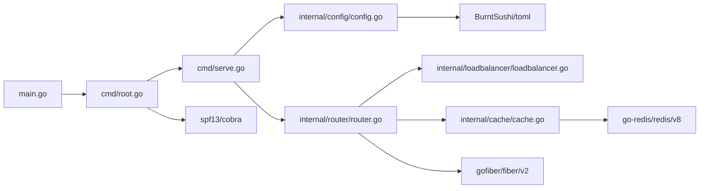

# 技术栈与依赖

<cite>
**本文引用的文件**
- [go.mod](file://go.mod)
- [go.sum](file://go.sum)
- [main.go](file://main.go)
- [cmd/root.go](file://cmd/root.go)
- [cmd/serve.go](file://cmd/serve.go)
- [cmd/version.go](file://cmd/version.go)
- [cmd/check.go](file://cmd/check.go)
- [cmd/gen.go](file://cmd/gen.go)
- [internal/config/config.go](file://internal/config/config.go)
- [internal/cache/cache.go](file://internal/cache/cache.go)
- [internal/router/router.go](file://internal/router/router.go)
- [internal/loadbalancer/loadbalancer.go](file://internal/loadbalancer/loadbalancer.go)
- [config-with-redis.toml](file://config-with-redis.toml)
- [config-without-redis.toml](file://config-without-redis.toml)
</cite>

## 目录
1. [简介](#简介)
2. [项目结构](#项目结构)
3. [核心组件](#核心组件)
4. [架构总览](#架构总览)
5. [详细组件分析](#详细组件分析)
6. [依赖关系分析](#依赖关系分析)
7. [性能与稳定性考量](#性能与稳定性考量)
8. [故障排查指南](#故障排查指南)
9. [结论](#结论)
10. [附录](#附录)

## 简介
本项目是一个轻量级 API 网关，提供基于配置的路由转发、负载均衡与可选的缓存能力。技术栈围绕 Go 生态的关键库构建：
- Web 框架：gofiber/fiber/v2（高性能 HTTP 框架）
- CLI 命令行：spf13/cobra（命令树与子命令）
- 配置解析：BurntSushi/toml（TOML 配置文件解析）
- 缓存支持：go-redis/redis/v8（Redis 客户端）

本文将系统梳理上述依赖的职责、版本选择理由、在系统中的交互方式、依赖关系图谱、安全与稳定性考量，并给出升级与兼容性建议。

## 项目结构
项目采用按功能域划分的目录组织：
- cmd：CLI 命令入口与子命令（serve、check、gen、version）
- internal/config：配置解析与校验
- internal/cache：缓存抽象与实现（内存/Redis）
- internal/router：HTTP 路由注册、请求处理、缓存与负载均衡集成
- internal/loadbalancer：轮询式负载均衡器
- 配置样例：config-with-redis.toml、config-without-redis.toml

图表来源
- [main.go](file://main.go#L1-L49)
- [cmd/root.go](file://cmd/root.go#L1-L50)
- [cmd/serve.go](file://cmd/serve.go#L1-L30)
- [cmd/check.go](file://cmd/check.go#L1-L25)
- [cmd/gen.go](file://cmd/gen.go#L1-L26)
- [cmd/version.go](file://cmd/version.go#L1-L39)
- [internal/config/config.go](file://internal/config/config.go#L1-L263)
- [internal/router/router.go](file://internal/router/router.go#L1-L504)
- [internal/loadbalancer/loadbalancer.go](file://internal/loadbalancer/loadbalancer.go#L1-L248)
- [internal/cache/cache.go](file://internal/cache/cache.go#L1-L369)
- [config-with-redis.toml](file://config-with-redis.toml#L1-L31)
- [config-without-redis.toml](file://config-without-redis.toml#L1-L30)

章节来源
- [main.go](file://main.go#L1-L49)
- [cmd/root.go](file://cmd/root.go#L1-L50)
- [internal/config/config.go](file://internal/config/config.go#L1-L263)

## 核心组件
- Web 框架：gofiber/fiber/v2
  - 职责：提供高性能 HTTP 服务器、路由注册、中间件与请求/响应处理
  - 版本：v2.52.6
  - 选择理由：成熟稳定、生态完善、性能优异，适合高并发场景
- CLI 框架：spf13/cobra
  - 职责：命令树构建、子命令注册（serve/check/gen/version）、参数与标志解析
  - 版本：v1.8.1
  - 选择理由：广泛使用、文档完善、社区成熟
- TOML 解析：BurntSushi/toml
  - 职责：解析 TOML 配置文件，支持嵌入示例配置
  - 版本：v1.4.1-0.20240526193622-a339e1f7089c
  - 选择理由：轻量、可靠、支持 go:embed，便于内嵌示例配置
- Redis 客户端：go-redis/redis/v8
  - 职责：提供 Redis 连接、键值读写、TTL 设置、连接测试与关闭
  - 版本：v8.11.5
  - 选择理由：官方 v8 版本，API 稳定，支持上下文与 Ping 测试

章节来源
- [go.mod](file://go.mod#L1-L40)
- [internal/config/config.go](file://internal/config/config.go#L1-L263)
- [internal/cache/cache.go](file://internal/cache/cache.go#L1-L369)
- [internal/router/router.go](file://internal/router/router.go#L1-L504)

## 架构总览
下图展示 CLI、配置、路由、负载均衡与缓存之间的交互关系。

图表来源
- [cmd/serve.go](file://cmd/serve.go#L1-L30)
- [internal/config/config.go](file://internal/config/config.go#L1-L263)
- [internal/router/router.go](file://internal/router/router.go#L1-L504)
- [internal/loadbalancer/loadbalancer.go](file://internal/loadbalancer/loadbalancer.go#L1-L248)
- [internal/cache/cache.go](file://internal/cache/cache.go#L1-L369)

## 详细组件分析

### Web 框架：gofiber/fiber/v2
- 路由注册与处理
  - 在路由层通过 Fiber 注册通配符路由，将请求交由处理器函数处理
  - 处理器负责缓存判断、负载均衡选择、后端转发与响应回传
- 性能特性
  - 使用 Acquire/Release 对象池减少 GC 压力
  - 支持快速响应与低延迟
- 版本与稳定性
  - 使用 v2.52.6，属于稳定分支，社区活跃，问题修复及时

章节来源
- [internal/router/router.go](file://internal/router/router.go#L445-L504)

### CLI 框架：spf13/cobra
- 命令树
  - root 命令提供通用标志（如 --verbose），并注册子命令
  - 子命令包括：serve（启动网关）、check（校验配置）、gen（生成示例配置）、version（打印版本信息）
- 参数与错误处理
  - serve 接收配置文件路径作为参数；check 仅校验；gen 可选输出路径
  - 所有命令均设置 SilenceUsage，避免冗余帮助输出

章节来源
- [cmd/root.go](file://cmd/root.go#L1-L50)
- [cmd/serve.go](file://cmd/serve.go#L1-L30)
- [cmd/check.go](file://cmd/check.go#L1-L25)
- [cmd/gen.go](file://cmd/gen.go#L1-L26)
- [cmd/version.go](file://cmd/version.go#L1-L39)

### 配置解析：BurntSushi/toml
- 功能
  - 解析 TOML 配置文件，支持嵌入示例配置文件
  - 提供配置校验：端口范围、主机、Redis URL 校验、路由路径唯一性、后端 URL 合法性等
- 集成点
  - serve 子命令调用 ParseConfig 与 ValidateConfig
  - 配置中可启用全局缓存与 Redis 缓存选项

章节来源
- [internal/config/config.go](file://internal/config/config.go#L1-L263)
- [config-with-redis.toml](file://config-with-redis.toml#L1-L31)
- [config-without-redis.toml](file://config-without-redis.toml#L1-L30)

### 缓存支持：go-redis/redis/v8
- 设计
  - Cache 接口抽象内存与 Redis 两种实现
  - CacheManager 根据配置选择 Redis 或内存缓存；Redis 初始化时进行 Ping 连接测试
  - 缓存键生成策略：结合方法、路径、查询串与请求体
  - 响应头过滤：排除易变或代理相关头部，确保缓存一致性
- 错误处理与降级
  - Redis 初始化失败时自动降级为内存缓存
  - 缓存读写失败不影响主流程，记录日志并继续

图表来源
- [internal/cache/cache.go](file://internal/cache/cache.go#L1-L369)

章节来源
- [internal/cache/cache.go](file://internal/cache/cache.go#L1-L369)

### 负载均衡：轮询策略
- 策略
  - RoundRobinLoadBalancer 基于原子计数实现线程安全轮询
  - 后端健康状态维护：连续失败计数、失败超时恢复、响应时间采样
- 降级与恢复
  - 全部后端不可用时重置状态并尝试首个后端
  - 失败超时后允许恢复尝试

图表来源
- [internal/loadbalancer/loadbalancer.go](file://internal/loadbalancer/loadbalancer.go#L1-L248)

章节来源
- [internal/loadbalancer/loadbalancer.go](file://internal/loadbalancer/loadbalancer.go#L1-L248)

## 依赖关系分析
- 直接依赖
  - main.go 依赖 cmd.Execute，进而依赖 cobra
  - serve 子命令依赖 config.ParseConfig/ValidateConfig 与 router.Run
  - router.Run 依赖 fiber、loadbalancer、cache
  - cache 依赖 go-redis/redis/v8
  - config 依赖 BurntSushi/toml
- 版本与稳定性
  - go.mod 明确列出各依赖版本，go.sum 记录校验和，保证可复现构建
  - go 语言版本为 1.23.2，与当前主流发行版兼容

图表来源
- [main.go](file://main.go#L1-L49)
- [cmd/root.go](file://cmd/root.go#L1-L50)
- [cmd/serve.go](file://cmd/serve.go#L1-L30)
- [internal/config/config.go](file://internal/config/config.go#L1-L263)
- [internal/router/router.go](file://internal/router/router.go#L1-L504)
- [internal/loadbalancer/loadbalancer.go](file://internal/loadbalancer/loadbalancer.go#L1-L248)
- [internal/cache/cache.go](file://internal/cache/cache.go#L1-L369)
- [go.mod](file://go.mod#L1-L40)

章节来源
- [go.mod](file://go.mod#L1-L40)
- [go.sum](file://go.sum#L1-L120)

## 性能与稳定性考量
- gofiber/fiber/v2
  - 高性能、低内存占用，适合高并发请求
  - 建议配合连接池与合理的并发模型
- spf13/cobra
  - 命令行工具成熟稳定，注意避免在子命令中引入过多复杂度
- BurntSushi/toml
  - 解析性能良好，建议将示例配置内嵌，减少运行时 IO
- go-redis/redis/v8
  - 使用 Ping 进行连接测试，初始化失败自动降级
  - 建议在生产环境配置合适的超时与重试策略

[本节为通用指导，无需代码来源]

## 故障排查指南
- 配置解析失败
  - 检查配置文件路径与格式；确认端口、主机、Redis URL 合法
  - 参考：[internal/config/config.go](file://internal/config/config.go#L1-L263)
- Redis 连接失败
  - 确认 Redis URL、DB、Prefix 正确；查看初始化日志
  - 若初始化失败，系统会降级为内存缓存
  - 参考：[internal/cache/cache.go](file://internal/cache/cache.go#L1-L369)
- 路由无可用后端
  - 查看负载均衡器健康状态与失败计数；确认后端可达
  - 参考：[internal/loadbalancer/loadbalancer.go](file://internal/loadbalancer/loadbalancer.go#L1-L248)
- 缓存命中率低
  - 检查缓存 TTL、路径白名单与头部过滤策略
  - 参考：[internal/router/router.go](file://internal/router/router.go#L1-L504)

章节来源
- [internal/config/config.go](file://internal/config/config.go#L1-L263)
- [internal/cache/cache.go](file://internal/cache/cache.go#L1-L369)
- [internal/loadbalancer/loadbalancer.go](file://internal/loadbalancer/loadbalancer.go#L1-L248)
- [internal/router/router.go](file://internal/router/router.go#L1-L504)

## 结论
本项目通过 gofiber/fiber/v2、spf13/cobra、BurntSushi/toml 与 go-redis/redis/v8 的协同，构建了一个简洁、可扩展且高性能的 API 网关。依赖版本选择兼顾稳定性与功能需求，配置解析与缓存机制清晰，具备良好的可维护性与可升级性。

[本节为总结，无需代码来源]

## 附录

### 关键依赖清单（来自 go.mod）
- gofiber/fiber/v2 v2.52.6
- spf13/cobra v1.8.1
- BurntSushi/toml v1.4.1-0.20240526193622-a339e1f7089c
- go-redis/redis/v8 v8.11.5
- go.uber.org/zap v1.27.0（日志）
- golang.org/x/net v0.30.0（网络基础库）
- 其他开发与质量工具（golangci-lint、gofumpt 等）

章节来源
- [go.mod](file://go.mod#L1-L40)

### 升级与兼容性建议
- gofiber/fiber/v2
  - 建议在小版本更新时进行回归测试；关注中间件与路由行为变更
- spf13/cobra
  - 注意命令树与标志变化；保持子命令签名稳定
- BurntSushi/toml
  - TOML 规范更新较少；建议保持版本稳定，除非需要新特性
- go-redis/redis/v8
  - 注意 v8 API 的上下文与错误处理差异；升级前进行连接与序列化测试
- go 版本
  - 当前使用 1.23.2；升级 go 版本需同步验证第三方库兼容性

[本节为通用指导，无需代码来源]