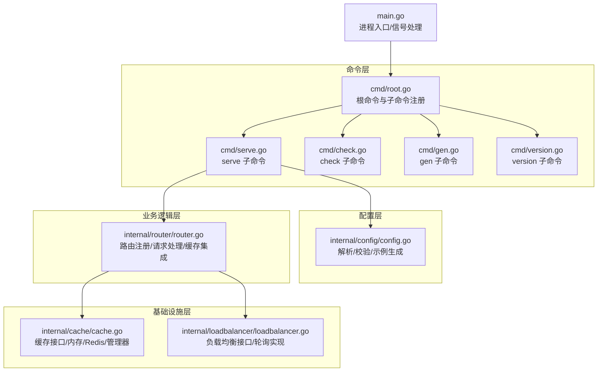
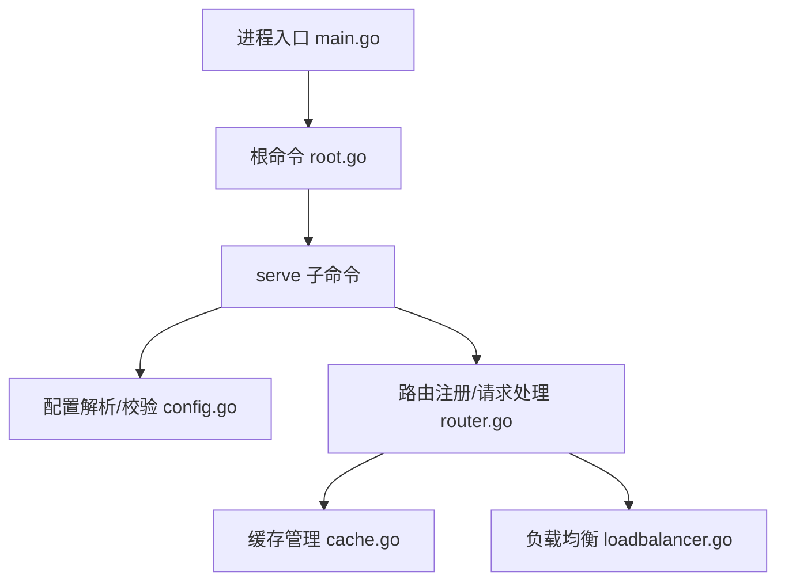
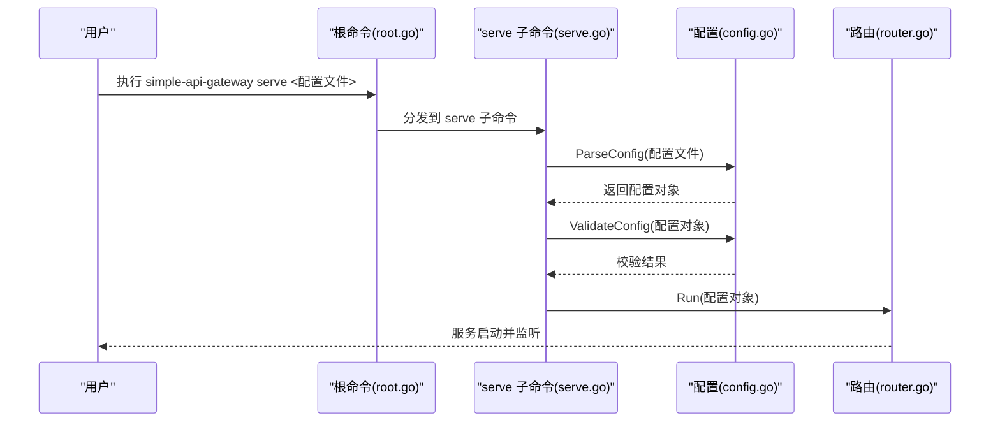
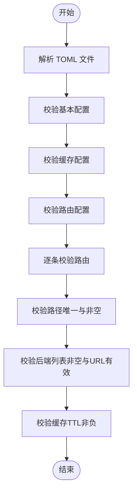
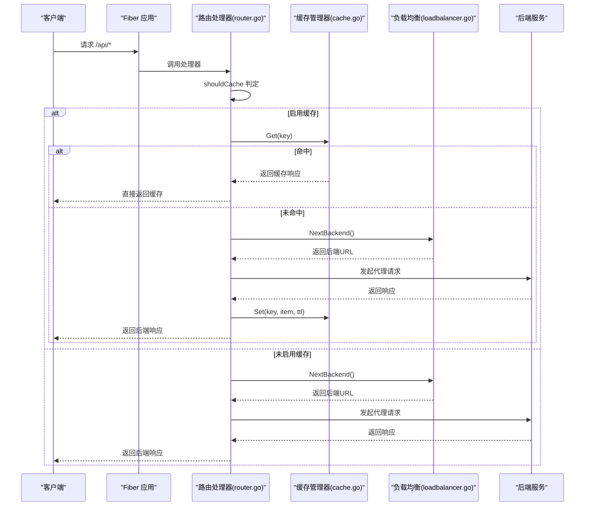
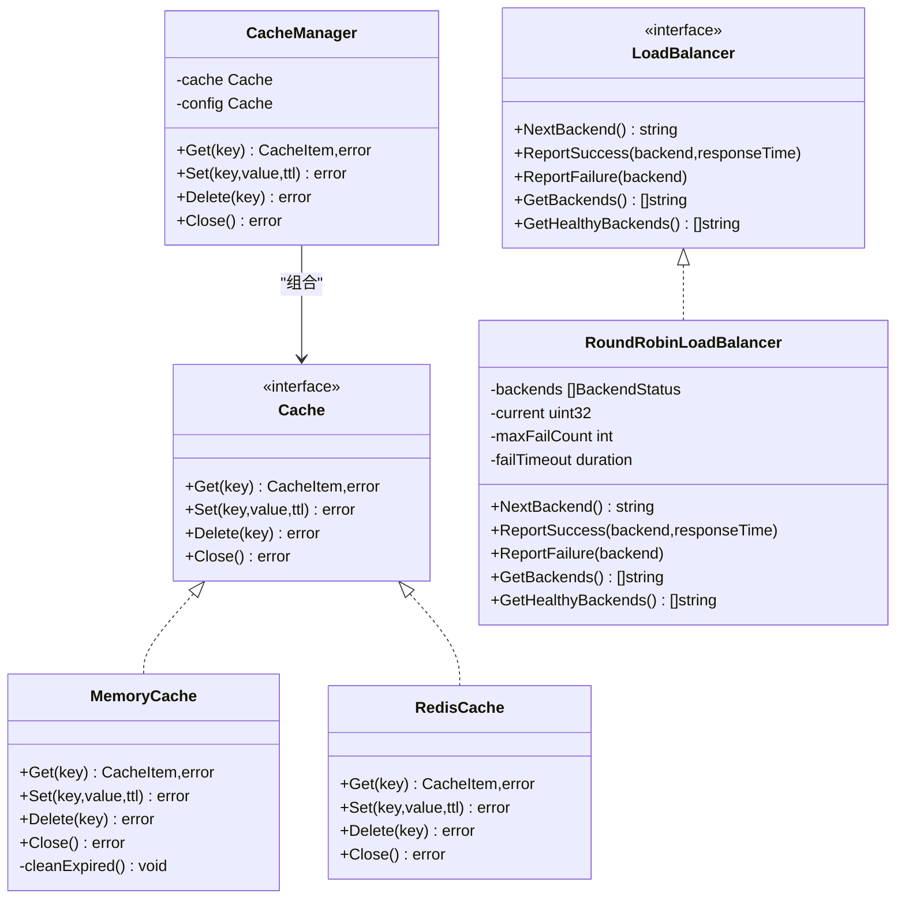
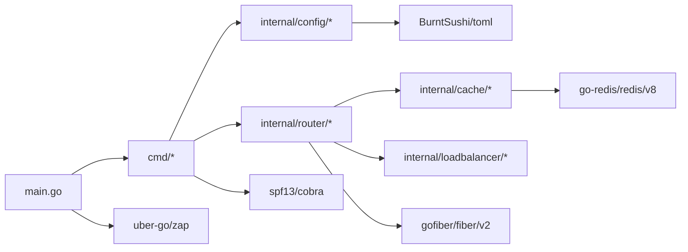
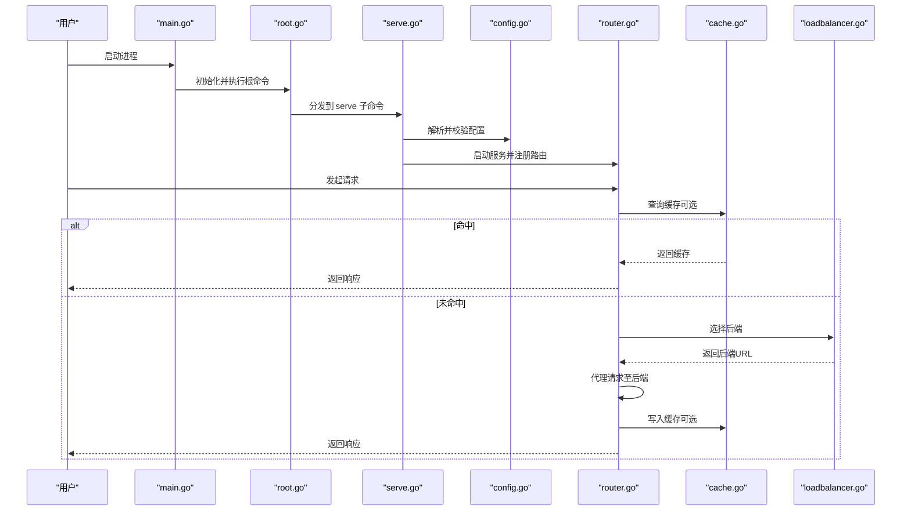

# 架构设计

<cite>
**本文引用的文件**
- [main.go](file://main.go)
- [root.go](file://cmd/root.go)
- [serve.go](file://cmd/serve.go)
- [check.go](file://cmd/check.go)
- [gen.go](file://cmd/gen.go)
- [version.go](file://cmd/version.go)
- [config.go](file://internal/config/config.go)
- [router.go](file://internal/router/router.go)
- [cache.go](file://internal/cache/cache.go)
- [loadbalancer.go](file://internal/loadbalancer/loadbalancer.go)
- [go.mod](file://go.mod)
- [README.md](file://README.md)
- [example_config.toml](file://internal/config/example_config.toml)
</cite>

## 目录
1. [简介](#简介)
2. [项目结构](#项目结构)
3. [核心组件](#核心组件)
4. [架构总览](#架构总览)
5. [详细组件分析](#详细组件分析)
6. [依赖关系分析](#依赖关系分析)
7. [性能考量](#性能考量)
8. [故障排查指南](#故障排查指南)
9. [结论](#结论)
10. [附录](#附录)

## 简介
本文件面向系统架构师与开发者，从高层视角解析 simple_api_gateway 的整体设计。项目采用清晰的分层架构：
- 命令层（cmd/）：基于 Cobra 的 CLI 命令入口，负责参数解析与子命令调度
- 配置层（internal/config/）：负责 TOML 配置解析、校验与示例生成
- 业务逻辑层（internal/router/）：基于 Fiber 的路由注册与请求处理，包含缓存与负载均衡集成
- 基础设施层（internal/cache/、internal/loadbalancer/）：抽象缓存与负载均衡策略，支持内存与 Redis

核心控制流：main.go 作为进程入口，初始化日志与信号处理，随后委托 cmd.Execute 执行根命令；serve 子命令解析并校验配置，再调用 router.Run 启动服务；router.Run 注册路由、初始化缓存管理器，并启动 Fiber 服务器；请求到达后，按路由规则选择后端，结合负载均衡与缓存策略完成转发与响应。

## 项目结构
项目采用 Go 模块化组织，遵循“命令层 cmd/、内部实现 internal/”的分层约定。内部实现通过 internal 目录对外隐藏，仅暴露必要的接口与类型，便于演进与维护。

图表来源
- [main.go](file://main.go#L1-L49)
- [root.go](file://cmd/root.go#L1-L50)
- [serve.go](file://cmd/serve.go#L1-L30)
- [check.go](file://cmd/check.go#L1-L25)
- [gen.go](file://cmd/gen.go#L1-L26)
- [version.go](file://cmd/version.go#L1-L39)
- [config.go](file://internal/config/config.go#L1-L263)
- [router.go](file://internal/router/router.go#L1-L504)
- [cache.go](file://internal/cache/cache.go#L1-L369)
- [loadbalancer.go](file://internal/loadbalancer/loadbalancer.go#L1-L248)

章节来源
- [main.go](file://main.go#L1-L49)
- [root.go](file://cmd/root.go#L1-L50)
- [go.mod](file://go.mod#L1-L203)

## 核心组件
- 命令层（cmd/）
  - 根命令与子命令：version、check、serve、gen
  - serve 子命令负责解析配置、校验配置并启动服务
- 配置层（internal/config/）
  - TOML 配置模型：Config、Cache、Route
  - 解析与校验：ParseConfig、ValidateConfig 及其子函数
  - 示例生成：GetExampleConfig、GenerateExampleConfigPath
- 业务逻辑层（internal/router/）
  - Fiber 应用初始化与路由注册
  - 请求处理流程：缓存判定、负载均衡选择、后端代理、响应回传
  - 缓存集成：CacheManager、CacheItem、头部过滤
- 基础设施层（internal/cache/、internal/loadbalancer/）
  - 缓存：MemoryCache、RedisCache、CacheManager
  - 负载均衡：LoadBalancer 接口与 RoundRobinLoadBalancer 实现

章节来源
- [serve.go](file://cmd/serve.go#L1-L30)
- [config.go](file://internal/config/config.go#L1-L263)
- [router.go](file://internal/router/router.go#L1-L504)
- [cache.go](file://internal/cache/cache.go#L1-L369)
- [loadbalancer.go](file://internal/loadbalancer/loadbalancer.go#L1-L248)

## 架构总览
simple_api_gateway 采用“命令层驱动、配置层约束、业务层编排、基础设施层支撑”的分层设计。main.go 作为进程入口，负责优雅停机与日志初始化；cmd 层负责 CLI 生命周期；serve 子命令将配置交由 internal/config 解析与校验，再由 internal/router 启动 Fiber 并注册路由；请求处理阶段，router 依据路由配置选择后端，结合负载均衡与缓存策略完成代理与响应。

图表来源
- [main.go](file://main.go#L1-L49)
- [root.go](file://cmd/root.go#L1-L50)
- [serve.go](file://cmd/serve.go#L1-L30)
- [config.go](file://internal/config/config.go#L1-L263)
- [router.go](file://internal/router/router.go#L1-L504)
- [cache.go](file://internal/cache/cache.go#L1-L369)
- [loadbalancer.go](file://internal/loadbalancer/loadbalancer.go#L1-L248)

## 详细组件分析

### 命令层（Cobra CLI）
- 根命令：设置短描述、持久化标志（verbose）、注册子命令（version、check、serve、gen）
- 子命令职责：
  - version：输出版本与构建信息
  - check：解析并校验配置文件
  - serve：解析配置、校验配置、启动服务
  - gen：生成示例配置文件

图表来源
- [root.go](file://cmd/root.go#L1-L50)
- [serve.go](file://cmd/serve.go#L1-L30)
- [config.go](file://internal/config/config.go#L1-L263)
- [router.go](file://internal/router/router.go#L1-L504)

章节来源
- [root.go](file://cmd/root.go#L1-L50)
- [serve.go](file://cmd/serve.go#L1-L30)
- [check.go](file://cmd/check.go#L1-L25)
- [gen.go](file://cmd/gen.go#L1-L26)
- [version.go](file://cmd/version.go#L1-L39)

### 配置层（TOML 解析与校验）
- 数据模型：Config（端口、主机、日志、缓存、路由数组）、Cache（启用、Redis 开关、URL、DB、前缀）、Route（路径、后端列表、UA、缓存 TTL、缓存开关、可缓存路径、自定义头部）
- 校验逻辑：
  - 基本配置：端口范围、主机非空
  - 缓存配置：启用且使用 Redis 时，URL 必须有效
  - 路由配置：路由数量非零；路径唯一且非空；后端列表非空且 URL 有效；可选网络连通性提示
- 示例生成：嵌入示例配置，支持写出到指定路径（校验扩展名与目录存在）

图表来源
- [config.go](file://internal/config/config.go#L1-L263)

章节来源
- [config.go](file://internal/config/config.go#L1-L263)
- [example_config.toml](file://internal/config/example_config.toml#L1-L45)

### 业务逻辑层（Fiber 路由与请求处理）
- Fiber 初始化与路由注册：遍历配置路由，注册通配符路径，绑定处理器
- 请求处理流程：
  - 缓存判定：根据路由与全局缓存开关、TTL、可缓存路径决定是否启用缓存
  - 负载均衡：按路由获取或创建负载均衡器，选择健康后端
  - 后端代理：复制请求头、UA、自定义头部、请求体，向后端发起请求
  - 成功/失败上报：成功记录响应时间，失败上报失败并重试策略
  - 响应回传：设置状态码、响应头、响应体
  - 缓存写入：对 2xx 成功响应按 TTL 写入缓存
- 缓存管理器：根据配置选择内存或 Redis；初始化失败自动降级为内存缓存

图表来源
- [router.go](file://internal/router/router.go#L1-L504)
- [cache.go](file://internal/cache/cache.go#L1-L369)
- [loadbalancer.go](file://internal/loadbalancer/loadbalancer.go#L1-L248)

章节来源
- [router.go](file://internal/router/router.go#L1-L504)

### 基础设施层（缓存与负载均衡）
- 缓存接口与实现：
  - MemoryCache：基于 sync.Map 的内存缓存，带过期清理定时任务
  - RedisCache：基于 go-redis 的 Redis 缓存，支持前缀与 TTL
  - CacheManager：统一入口，按配置选择后端；初始化失败自动降级
  - 头部过滤：过滤掉易变或重复的响应头，避免缓存污染
- 负载均衡接口与实现：
  - LoadBalancer 接口：NextBackend、ReportSuccess、ReportFailure、GetBackends、GetHealthyBackends
  - RoundRobinLoadBalancer：轮询选择健康后端；失败计数与超时恢复；原子计数保证线程安全

图表来源
- [cache.go](file://internal/cache/cache.go#L1-L369)
- [loadbalancer.go](file://internal/loadbalancer/loadbalancer.go#L1-L248)

章节来源
- [cache.go](file://internal/cache/cache.go#L1-L369)
- [loadbalancer.go](file://internal/loadbalancer/loadbalancer.go#L1-L248)

## 依赖关系分析
- 外部依赖
  - Fiber：HTTP 框架，用于路由与中间件
  - Cobra：CLI 框架，用于命令与参数解析
  - Redis：可选缓存后端
  - TOML：配置格式
  - Zap：日志
- 内部依赖
  - cmd 依赖 internal/config 与 internal/router
  - internal/router 依赖 internal/cache 与 internal/loadbalancer
  - internal/config 为配置模型与校验

图表来源
- [go.mod](file://go.mod#L1-L203)
- [main.go](file://main.go#L1-L49)
- [root.go](file://cmd/root.go#L1-L50)
- [serve.go](file://cmd/serve.go#L1-L30)
- [router.go](file://internal/router/router.go#L1-L504)
- [cache.go](file://internal/cache/cache.go#L1-L369)
- [loadbalancer.go](file://internal/loadbalancer/loadbalancer.go#L1-L248)

章节来源
- [go.mod](file://go.mod#L1-L203)

## 性能考量
- Fiber 作为高性能 Web 框架，具备较低的请求处理开销
- 轮询负载均衡与健康检查机制，提升可用性与吞吐
- 缓存策略（内存/Redis）显著降低重复请求的后端压力
- 头部过滤减少缓存体积与序列化成本
- 建议
  - 在高并发场景下优先使用 Redis 缓存
  - 合理设置缓存 TTL 与可缓存路径，避免缓存污染
  - 监控后端健康状态与响应时间，动态调整后端权重（可在现有接口基础上扩展）

[本节为通用指导，无需列出具体文件来源]

## 故障排查指南
- 启动失败
  - 检查配置文件路径与权限；使用 check 子命令验证配置
  - 关注日志中“failed to run server”等错误
- 缓存异常
  - 若 Redis 初始化失败，系统会降级为内存缓存；确认 Redis URL 与网络连通性
  - 检查缓存键生成与头部过滤逻辑
- 负载均衡问题
  - 观察后端失败计数与恢复超时；确认健康后端列表
  - 如全部后端不可用，系统会重置并重试
- 请求无响应
  - 检查后端可达性与路由路径匹配；确认自定义头部与 UA 设置

章节来源
- [serve.go](file://cmd/serve.go#L1-L30)
- [config.go](file://internal/config/config.go#L1-L263)
- [router.go](file://internal/router/router.go#L1-L504)
- [cache.go](file://internal/cache/cache.go#L1-L369)
- [loadbalancer.go](file://internal/loadbalancer/loadbalancer.go#L1-L248)

## 结论
simple_api_gateway 通过清晰的分层设计与模块化实现，提供了简洁而高效的 API 网关能力。命令层以 Cobra 统一入口，配置层以 TOML 与严格校验保障正确性，业务层以 Fiber 驱动请求处理，基础设施层以可插拔的缓存与负载均衡满足不同场景需求。该架构在简单性与可扩展性之间取得良好平衡，易于演进与维护。

[本节为总结性内容，无需列出具体文件来源]

## 附录

### 请求处理生命周期（端到端）

图表来源
- [main.go](file://main.go#L1-L49)
- [root.go](file://cmd/root.go#L1-L50)
- [serve.go](file://cmd/serve.go#L1-L30)
- [config.go](file://internal/config/config.go#L1-L263)
- [router.go](file://internal/router/router.go#L1-L504)
- [cache.go](file://internal/cache/cache.go#L1-L369)
- [loadbalancer.go](file://internal/loadbalancer/loadbalancer.go#L1-L248)

### 架构决策与权衡
- internal 目录保护内部实现：隔离外部依赖与内部细节，便于未来重构与演进
- Cobra 命令模式：统一 CLI 入口，便于扩展新命令与参数
- Fiber 选择：高性能、轻量、生态成熟，适合网关场景
- 缓存与负载均衡可插拔：通过接口抽象，支持新增算法与后端
- 简单性 vs 灵活性：当前实现聚焦核心能力，复杂度可控；可通过扩展接口引入更复杂的策略（如加权轮询、一致性哈希、多级缓存）

章节来源
- [README.md](file://README.md#L1-L474)
- [router.go](file://internal/router/router.go#L1-L504)
- [cache.go](file://internal/cache/cache.go#L1-L369)
- [loadbalancer.go](file://internal/loadbalancer/loadbalancer.go#L1-L248)