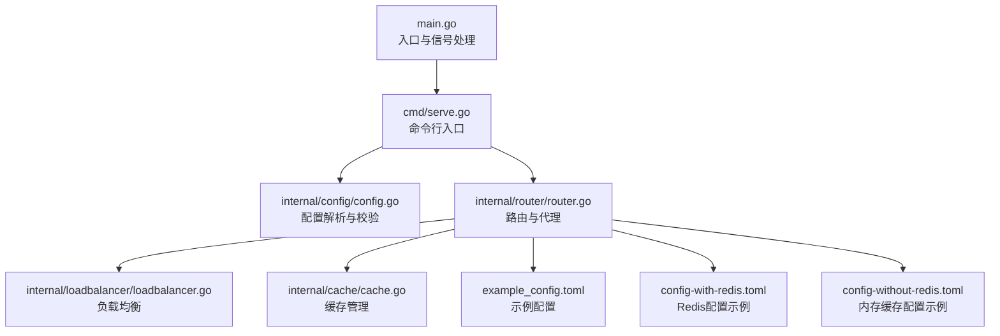
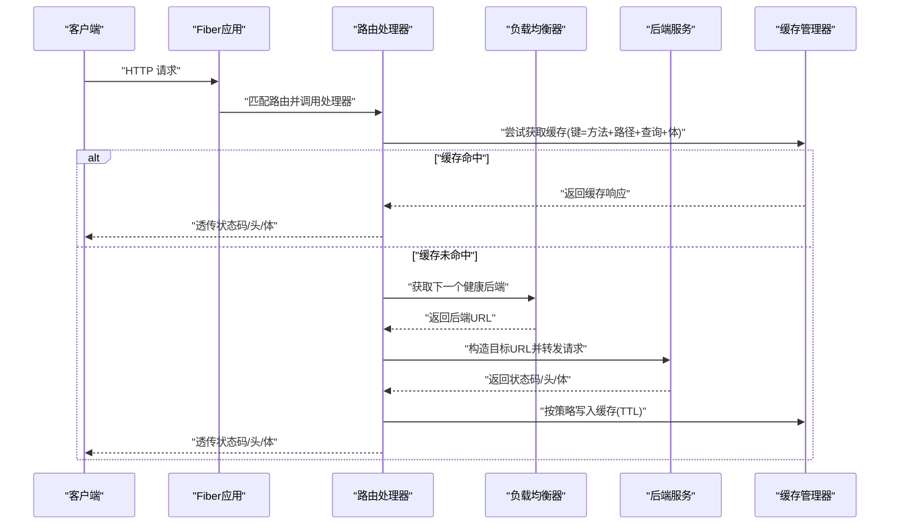
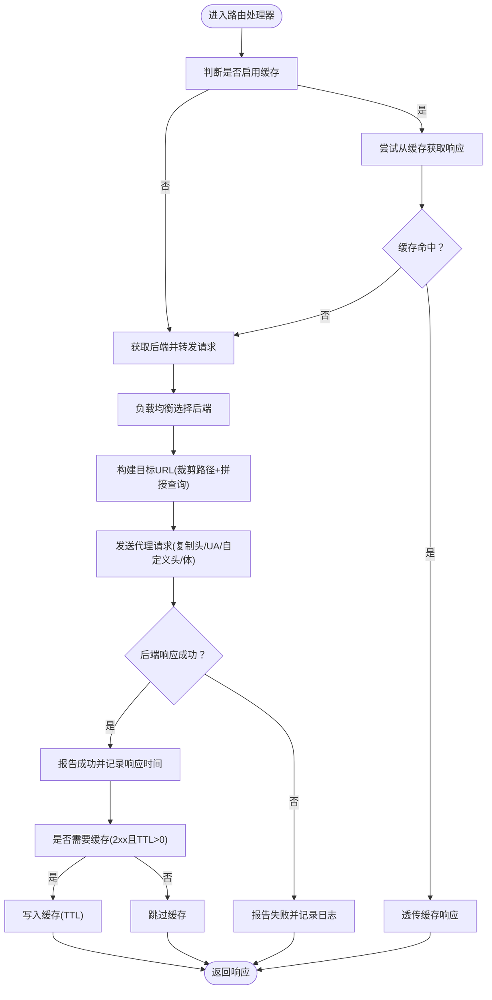
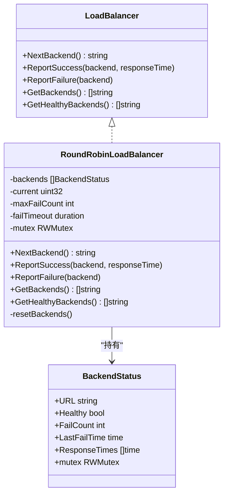
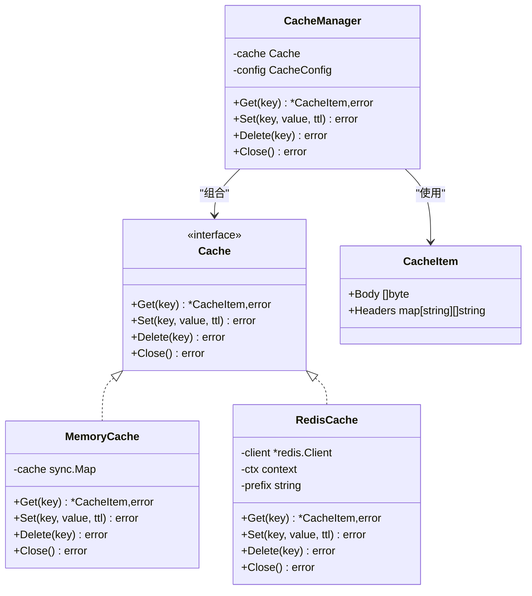
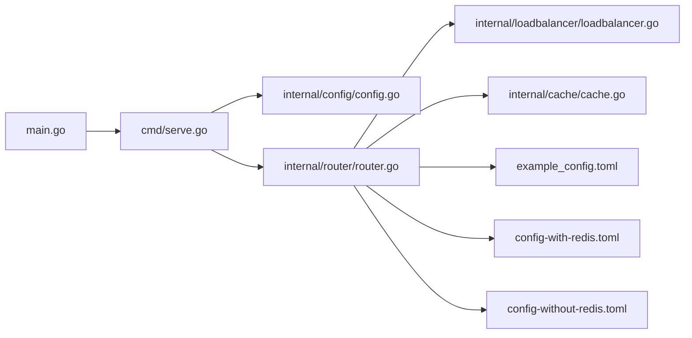

# 核心功能详解

<cite>
**本文引用的文件**
- [main.go](file://main.go)
- [cmd/serve.go](file://cmd/serve.go)
- [internal/config/config.go](file://internal/config/config.go)
- [internal/router/router.go](file://internal/router/router.go)
- [internal/loadbalancer/loadbalancer.go](file://internal/loadbalancer/loadbalancer.go)
- [internal/cache/cache.go](file://internal/cache/cache.go)
- [example_config.toml](file://example_config.toml)
- [config-with-redis.toml](file://config-with-redis.toml)
- [config-without-redis.toml](file://config-without-redis.toml)
</cite>

## 目录
1. [简介](#简介)
2. [项目结构](#项目结构)
3. [核心组件](#核心组件)
4. [架构总览](#架构总览)
5. [详细组件分析](#详细组件分析)
6. [依赖关系分析](#依赖关系分析)
7. [性能考量](#性能考量)
8. [故障排查指南](#故障排查指南)
9. [结论](#结论)
10. [附录](#附录)

## 简介
本文件深入剖析 simple_api_gateway 的三大核心能力：
- 请求代理：在 router.go 中实现 HTTP 请求的拦截、重写与转发，涵盖请求头处理与响应透传机制。
- 负载均衡：在 loadbalancer.go 中实现轮询算法、健康检查（主动探测与自动恢复）、故障转移逻辑。
- 缓存管理：在 cache.go 中实现内存缓存与 Redis 缓存的统一接口设计、缓存键生成策略与 TTL 控制，并说明与路由模块的协作流程。

同时给出性能优化建议与典型使用模式，帮助读者快速上手并稳定运行。

## 项目结构
项目采用分层与按功能域划分的组织方式：
- 入口与命令行：main.go 与 cmd/serve.go 负责启动与配置解析。
- 配置模块：internal/config/config.go 提供配置解析、校验与示例生成。
- 路由与代理：internal/router/router.go 实现请求拦截、重写、转发、缓存与响应透传。
- 负载均衡：internal/loadbalancer/loadbalancer.go 实现轮询、健康检查与故障转移。
- 缓存：internal/cache/cache.go 实现统一缓存接口、内存与 Redis 后端、键过滤与 TTL。

图表来源
- [main.go](file://main.go#L1-L49)
- [cmd/serve.go](file://cmd/serve.go#L1-L30)
- [internal/config/config.go](file://internal/config/config.go#L1-L263)
- [internal/router/router.go](file://internal/router/router.go#L1-L504)
- [internal/loadbalancer/loadbalancer.go](file://internal/loadbalancer/loadbalancer.go#L1-L248)
- [internal/cache/cache.go](file://internal/cache/cache.go#L1-L369)
- [example_config.toml](file://example_config.toml#L1-L45)
- [config-with-redis.toml](file://config-with-redis.toml#L1-L31)
- [config-without-redis.toml](file://config-without-redis.toml#L1-L30)

章节来源
- [main.go](file://main.go#L1-L49)
- [cmd/serve.go](file://cmd/serve.go#L1-L30)
- [internal/config/config.go](file://internal/config/config.go#L1-L263)

## 核心组件
- 路由与代理（router.go）
  - 请求拦截与重写：根据路由配置重写路径与查询参数，构建目标后端 URL。
  - 请求头处理：复制上游请求头，支持 UA 重写与自定义头部注入。
  - 响应透传：将后端响应状态码、头与体透传给客户端。
  - 缓存集成：在命中缓存时直接返回；未命中则向后端发起请求并按策略缓存。
- 负载均衡（loadbalancer.go）
  - 轮询算法：基于原子计数的线程安全轮询。
  - 健康检查：记录连续失败次数与最后失败时间，超时后自动恢复为健康。
  - 故障转移：优先选择健康节点；若无健康节点，重置并回退至首个节点。
- 缓存管理（cache.go）
  - 统一接口：Cache 接口抽象内存与 Redis 两种实现。
  - 键生成策略：基于方法、路径、查询串与请求体生成唯一键。
  - TTL 控制：按路由配置的 TTL 写入缓存；内存缓存定时清理过期项。
  - 头部过滤：过滤掉易变或重复的响应头，确保缓存一致性。

章节来源
- [internal/router/router.go](file://internal/router/router.go#L1-L504)
- [internal/loadbalancer/loadbalancer.go](file://internal/loadbalancer/loadbalancer.go#L1-L248)
- [internal/cache/cache.go](file://internal/cache/cache.go#L1-L369)

## 架构总览
下图展示请求从进入网关到后端、再到缓存与负载均衡的交互流程。

图表来源
- [internal/router/router.go](file://internal/router/router.go#L271-L340)
- [internal/router/router.go](file://internal/router/router.go#L356-L443)
- [internal/loadbalancer/loadbalancer.go](file://internal/loadbalancer/loadbalancer.go#L84-L109)
- [internal/cache/cache.go](file://internal/cache/cache.go#L252-L328)

## 详细组件分析

### 请求代理（router.go）
- 请求拦截与重写
  - 路由注册：为每个路由绑定通配路径，统一交由处理器处理。
  - 目标 URL 构造：将请求路径裁剪为相对后端路径，并拼接查询串。
  - 请求头处理：复制上游请求头，支持 UA 重写与自定义头部注入。
  - 请求体透传：当存在请求体时，完整透传到后端。
- 响应透传机制
  - 状态码透传：直接设置响应状态码。
  - 响应头透传：遍历后端响应头逐条添加。
  - 响应体透传：直接发送后端响应体。
- 缓存集成
  - 缓存开关：路由级开启/关闭与全局缓存开关共同决定是否缓存。
  - 缓存路径白名单：仅对指定相对路径进行缓存。
  - 缓存键生成：基于方法、路径、查询串与请求体生成唯一键。
  - 命中即返回：命中缓存时直接透传缓存响应。
  - 成功响应缓存：仅对 2xx 响应进行缓存，按路由 TTL 写入。

图表来源
- [internal/router/router.go](file://internal/router/router.go#L271-L340)
- [internal/router/router.go](file://internal/router/router.go#L356-L443)
- [internal/router/router.go](file://internal/router/router.go#L138-L202)
- [internal/router/router.go](file://internal/router/router.go#L249-L269)

章节来源
- [internal/router/router.go](file://internal/router/router.go#L1-L504)

### 负载均衡（loadbalancer.go）
- 轮询算法
  - 健康节点优先：优先从健康节点集合中轮询。
  - 原子计数：使用原子操作递增当前索引，保证线程安全。
  - 无健康节点回退：若无健康节点，重置所有节点并回退至首个节点。
- 健康检查与自动恢复
  - 失败计数：连续失败超过阈值标记为不健康。
  - 失败超时：超过失败超时后自动恢复为健康，允许重试。
  - 所有节点不健康：触发全量重置，恢复初始健康状态。
- 成功/失败上报
  - 成功上报：清零失败计数并记录最近响应时间。
  - 失败上报：增加失败计数并记录最后失败时间。

图表来源
- [internal/loadbalancer/loadbalancer.go](file://internal/loadbalancer/loadbalancer.go#L1-L248)

章节来源
- [internal/loadbalancer/loadbalancer.go](file://internal/loadbalancer/loadbalancer.go#L1-L248)

### 缓存管理（cache.go）
- 统一接口设计
  - Cache 接口：Get/Set/Delete/Close，屏蔽内存与 Redis 差异。
  - CacheManager：对外提供统一的 Get/Set/Delete/Close，内部根据配置选择具体实现。
- 内存缓存
  - 存储结构：sync.Map + 过期时间字段。
  - 清理策略：每分钟扫描一次，删除已过期项。
  - TTL 写入：按秒计算过期时间。
- Redis 缓存
  - 连接测试：启动时 Ping 校验连接有效性。
  - 键命名：使用配置前缀拼接键，避免冲突。
  - 序列化：JSON 编解码存储 CacheItem。
  - TTL 写入：按秒设置过期时间。
- 键生成与头部过滤
  - 键生成：方法、路径、查询串、请求体组合生成唯一键。
  - 头部过滤：过滤 Date、Connection、Transfer-Encoding、Server、Via、Alt-Svc、Content-Length 等易变或重复头，避免缓存污染。
- 降级策略
  - Redis 初始化失败时自动降级为内存缓存，保证可用性。

图表来源
- [internal/cache/cache.go](file://internal/cache/cache.go#L1-L369)

章节来源
- [internal/cache/cache.go](file://internal/cache/cache.go#L1-L369)

## 依赖关系分析
- 启动链路
  - main.go 注册信号处理，调用 cmd.Execute 启动。
  - cmd/serve.go 解析配置并校验，随后调用 router.Run。
  - router.Run 初始化缓存管理器（可选），为每个路由创建负载均衡器并注册处理器。
- 路由处理器依赖
  - 路由处理器依赖配置模块提供的 Route 信息。
  - 路由处理器依赖负载均衡器接口，实现轮询与健康状态维护。
  - 路由处理器依赖缓存管理器，实现缓存读写与 TTL 控制。
- 配置与示例
  - 配置模块提供解析、校验与示例生成。
  - 示例配置文件展示路由、后端、缓存与自定义头部等典型用法。

图表来源
- [main.go](file://main.go#L1-L49)
- [cmd/serve.go](file://cmd/serve.go#L1-L30)
- [internal/config/config.go](file://internal/config/config.go#L1-L263)
- [internal/router/router.go](file://internal/router/router.go#L1-L504)
- [internal/loadbalancer/loadbalancer.go](file://internal/loadbalancer/loadbalancer.go#L1-L248)
- [internal/cache/cache.go](file://internal/cache/cache.go#L1-L369)
- [example_config.toml](file://example_config.toml#L1-L45)
- [config-with-redis.toml](file://config-with-redis.toml#L1-L31)
- [config-without-redis.toml](file://config-without-redis.toml#L1-L30)

章节来源
- [main.go](file://main.go#L1-L49)
- [cmd/serve.go](file://cmd/serve.go#L1-L30)
- [internal/config/config.go](file://internal/config/config.go#L1-L263)
- [internal/router/router.go](file://internal/router/router.go#L1-L504)
- [internal/loadbalancer/loadbalancer.go](file://internal/loadbalancer/loadbalancer.go#L1-L248)
- [internal/cache/cache.go](file://internal/cache/cache.go#L1-L369)

## 性能考量
- 负载均衡
  - 轮询算法为 O(1)，线程安全，适合高并发场景。
  - 健康检查与自动恢复避免长时间故障导致流量积压。
  - 建议：合理设置最大失败次数与失败超时，平衡恢复速度与稳定性。
- 缓存
  - 内存缓存：适合单实例部署，清理周期为 1 分钟，降低内存碎片。
  - Redis 缓存：适合多实例部署，具备持久化与共享能力，注意网络延迟与序列化开销。
  - 建议：对热点数据设置合理的 TTL；对频繁变更的数据禁用缓存或缩短 TTL。
- 代理转发
  - 复制请求头与请求体为 O(n) 操作，建议对大体积请求体进行限流或压缩。
  - 建议：在路由层限制请求体大小与超时时间，防止资源耗尽。
- 日志与可观测性
  - 路由与负载均衡均输出详细日志，便于定位问题。
  - 建议：生产环境调整日志级别，避免过多 I/O 影响吞吐。

[本节为通用性能建议，无需特定文件引用]

## 故障排查指南
- 启动失败
  - 检查配置文件路径与格式，确认 host/port 合法。
  - 若启用 Redis 缓存，确认 redis_url 可达且数据库编号正确。
- 路由无法访问
  - 确认路由 path 与后端 backends 配置正确，后端可达。
  - 查看日志中“No backend servers available”提示，检查负载均衡健康状态。
- 缓存异常
  - 若 Redis 初始化失败，系统会自动降级为内存缓存；检查 Redis 连接与权限。
  - 若命中率低，检查 cache_paths 与 cache_ttl 配置是否符合预期。
- 响应头异常
  - 确认自定义头部与 UA 重写是否按预期生效。
  - 注意 Content-Length 会在缓存命中时重新设置，避免重复设置。

章节来源
- [internal/config/config.go](file://internal/config/config.go#L90-L224)
- [internal/router/router.go](file://internal/router/router.go#L445-L504)
- [internal/cache/cache.go](file://internal/cache/cache.go#L252-L328)

## 结论
simple_api_gateway 通过清晰的模块划分与统一接口设计，将请求代理、负载均衡与缓存管理有机整合：
- 路由模块负责请求拦截、重写与透传，并与缓存/负载均衡紧密协作。
- 负载均衡提供稳定的轮询与健康检查机制，保障后端可用性。
- 缓存模块提供内存与 Redis 两种实现，支持 TTL 与头部过滤，兼顾性能与一致性。

建议在生产环境中结合示例配置文件进行部署，并根据业务特点调整 TTL、失败阈值与超时参数，以获得最佳性能与稳定性。

[本节为总结性内容，无需特定文件引用]

## 附录
- 典型使用模式
  - 单实例部署：使用内存缓存，简化运维。
  - 多实例部署：使用 Redis 缓存，提升共享与持久化能力。
  - 热点接口：设置较短 TTL 并启用缓存路径白名单，减少无效缓存。
- 配置要点
  - 路由 path 唯一且合法，backends 至少包含一个有效地址。
  - cache_ttl=0 表示不缓存；cache_paths 为空表示对路由下所有路径缓存。
  - 自定义头部与 UA 重写可按需配置，注意与后端兼容性。

章节来源
- [example_config.toml](file://example_config.toml#L1-L45)
- [config-with-redis.toml](file://config-with-redis.toml#L1-L31)
- [config-without-redis.toml](file://config-without-redis.toml#L1-L30)
- [internal/config/config.go](file://internal/config/config.go#L18-L46)