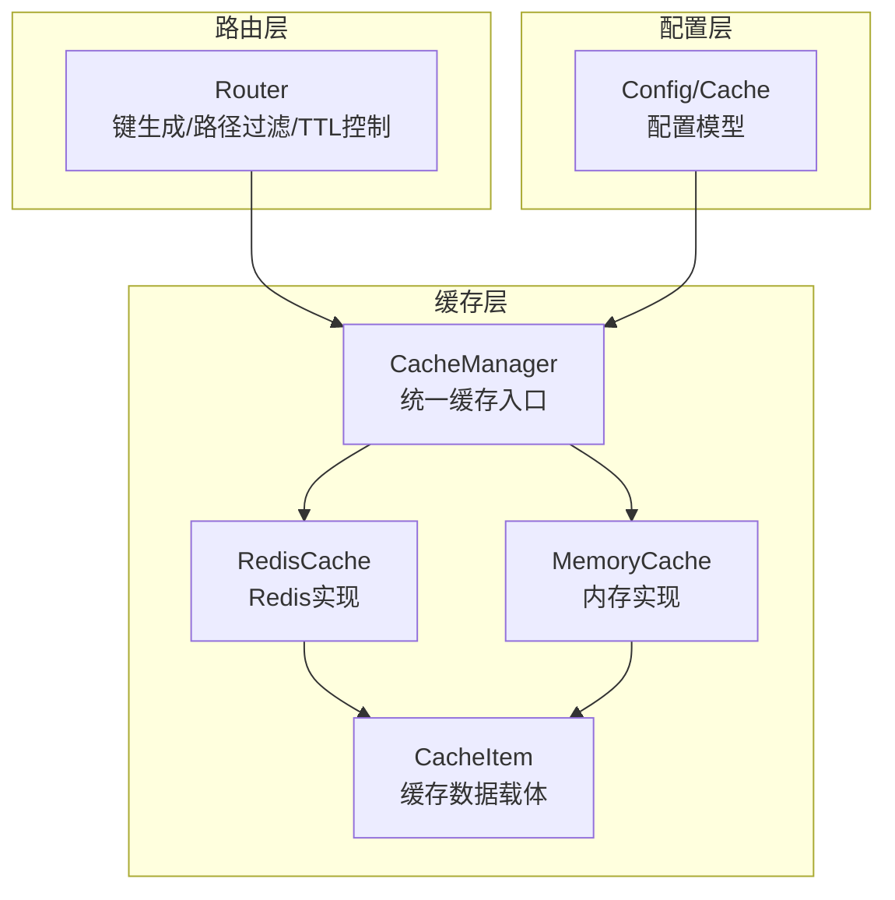
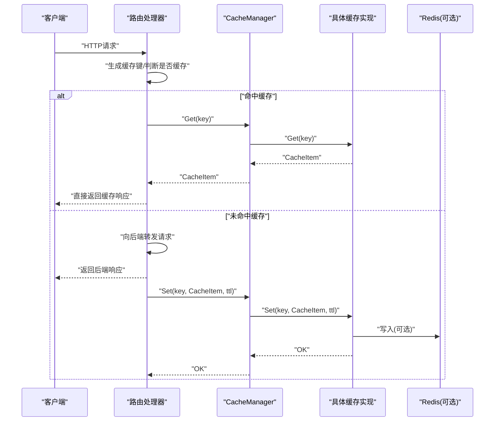
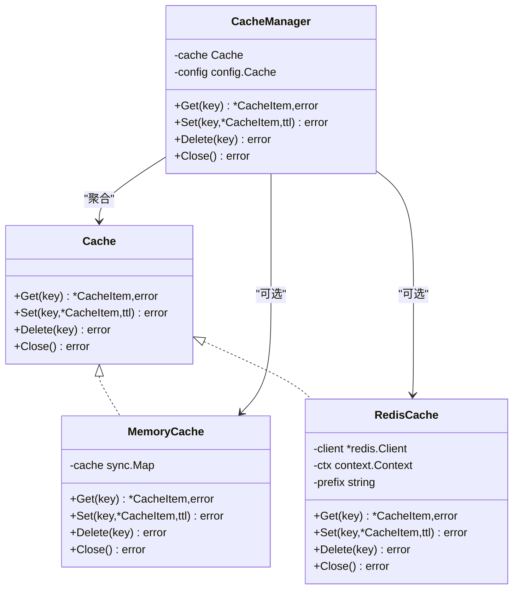
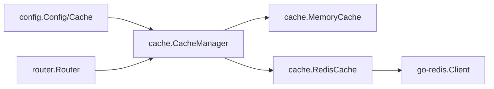

# 缓存管理机制

<cite>
**本文引用的文件**
- [internal/cache/cache.go](file://internal/cache/cache.go)
- [internal/config/config.go](file://internal/config/config.go)
- [internal/router/router.go](file://internal/router/router.go)
- [example_config.toml](file://example_config.toml)
- [README.md](file://README.md)
</cite>

## 目录
1. [简介](#简介)
2. [项目结构](#项目结构)
3. [核心组件](#核心组件)
4. [架构总览](#架构总览)
5. [详细组件分析](#详细组件分析)
6. [依赖关系分析](#依赖关系分析)
7. [性能考量](#性能考量)
8. [故障排查指南](#故障排查指南)
9. [结论](#结论)
10. [附录](#附录)

## 简介
本文件深入剖析缓存系统的双层实现架构，围绕 CacheManager 如何依据配置选择 RedisCache 或 MemoryCache 实现统一接口；解析 RedisCache 的连接初始化与 Ping 健康检查机制，以及 Get/Set 操作的序列化与反序列化流程；阐述 MemoryCache 中 sync.Map 的并发安全设计与 cleanExpired 定期清理过期项的 goroutine 实现；解释 CacheItem 中响应头过滤机制（FilterHeaders）如何排除动态头部字段；结合代码说明缓存键生成策略与 TTL 控制机制，并给出缓存穿透与雪崩的预防建议。

## 项目结构
缓存系统位于 internal/cache，配置模型位于 internal/config，路由与缓存集成逻辑位于 internal/router，示例配置位于根目录。

图表来源
- [internal/cache/cache.go](file://internal/cache/cache.go#L252-L369)
- [internal/config/config.go](file://internal/config/config.go#L21-L46)
- [internal/router/router.go](file://internal/router/router.go#L33-L110)

章节来源
- [internal/cache/cache.go](file://internal/cache/cache.go#L1-L369)
- [internal/config/config.go](file://internal/config/config.go#L1-L124)
- [internal/router/router.go](file://internal/router/router.go#L1-L110)

## 核心组件
- Cache 接口：定义 Get/Set/Delete/Close 统一方法，屏蔽具体实现差异。
- MemoryCache：基于 sync.Map 的内存缓存，内置定期清理过期项的 goroutine。
- RedisCache：基于 go-redis 的 Redis 缓存，包含连接初始化与 Ping 健康检查。
- CacheManager：根据配置选择具体实现，提供统一的 Get/Set/Delete/Close。
- CacheItem：缓存的数据载体，包含 Body 与 Headers。
- FilterHeaders：过滤掉动态与易变的响应头，避免缓存污染。
- 路由层：负责缓存键生成、路径白名单过滤、TTL 控制与缓存命中/落盘。

章节来源
- [internal/cache/cache.go](file://internal/cache/cache.go#L19-L369)
- [internal/router/router.go](file://internal/router/router.go#L33-L110)

## 架构总览
CacheManager 作为统一入口，依据配置决定使用 RedisCache 或 MemoryCache。路由层在每次请求时：
- 生成缓存键（方法、路径、查询参数、请求体）
- 判断是否应缓存（全局开关、路由开关、TTL、路径白名单）
- 若命中缓存则直接返回；否则向后端发起请求，成功后按 TTL 写入缓存

图表来源
- [internal/router/router.go](file://internal/router/router.go#L271-L443)
- [internal/cache/cache.go](file://internal/cache/cache.go#L252-L322)

## 详细组件分析

### CacheManager：统一缓存入口与实现选择
- 配置驱动的选择逻辑：
  - 全局禁用：直接返回错误，路由层不使用缓存。
  - 使用 Redis：优先尝试 NewRedisCache，失败则回退到 NewMemoryCache。
  - 不使用 Redis：直接使用 MemoryCache。
- 提供 Get/Set/Delete/Close 统一方法，内部委托给具体实现。

图表来源
- [internal/cache/cache.go](file://internal/cache/cache.go#L19-L322)

章节来源
- [internal/cache/cache.go](file://internal/cache/cache.go#L252-L322)

### RedisCache：连接初始化与健康检查、序列化/反序列化
- 连接初始化：
  - 从配置解析 Redis URL，设置 DB 编号。
  - 新建 redis.Client 并执行 Ping 健康检查，失败则返回错误。
- Get/Set 操作：
  - Get：拼接 key 前缀，读取字节数组并通过 JSON 反序列化为 CacheItem。
  - Set：将 CacheItem JSON 序列化为字节数组，按 TTL 写入 Redis。
  - Delete：删除指定 key。
  - Close：关闭 Redis 客户端连接。
- 健康检查：NewRedisCache 中的 Ping 失败即回退到 MemoryCache，保证可用性。

章节来源
- [internal/cache/cache.go](file://internal/cache/cache.go#L143-L251)

### MemoryCache：并发安全与过期清理
- 并发安全：
  - 使用 sync.Map 作为底层存储，天然支持高并发读写。
- 过期清理：
  - NewMemoryCache 启动一个 goroutine，每分钟扫描一次，删除已过期项。
  - Get 时也会即时检查过期并删除，避免返回过期数据。
- TTL 行为：
  - Set 时若 ttl>0，计算过期时间；Get 时若过期则删除并返回错误。

章节来源
- [internal/cache/cache.go](file://internal/cache/cache.go#L28-L141)

### CacheItem 与响应头过滤：FilterHeaders
- CacheItem 字段：
  - Body：响应体字节切片。
  - Headers：响应头映射。
- 过滤策略：
  - FilterHeaders 会过滤掉一组“动态/易变/与上游相关”的头部，如 Date、Connection、Transfer-Encoding、Content-Length、X-Forwarded-*、Cf-* 等，避免缓存污染。
  - 过滤规则不区分大小写，使用标题化键名进行匹配。
- 序列化影响：
  - Redis 与 Memory 的 Set 前均调用 FilterHeaders，确保只缓存稳定的响应头。

章节来源
- [internal/cache/cache.go](file://internal/cache/cache.go#L330-L369)

### 缓存键生成策略与 TTL 控制
- 键生成：
  - 使用 MD5 对请求方法、路径、查询参数、请求体进行哈希，再与路由路径拼接形成唯一键。
  - 保证相同请求命中同一缓存，不同请求命中不同缓存。
- TTL 控制：
  - 路由层根据 route.CacheTTL 决定缓存有效期；仅当状态码在 2xx 且 TTL>0 时才缓存。
  - 路由层还支持 cache_paths 白名单，仅对匹配路径进行缓存。
- 全局与路由开关：
  - 全局 cache.enabled=false 时，不初始化缓存；路由 cache_enable=false 或 TTL<=0 时不缓存。

章节来源
- [internal/router/router.go](file://internal/router/router.go#L33-L110)
- [internal/router/router.go](file://internal/router/router.go#L271-L443)
- [internal/config/config.go](file://internal/config/config.go#L29-L46)
- [README.md](file://README.md#L343-L360)

## 依赖关系分析
- CacheManager 依赖配置模块（config.Cache）决定实现类型。
- 路由层依赖 CacheManager 进行缓存读写。
- RedisCache 依赖 go-redis 客户端库。
- MemoryCache 依赖 Go 标准库 sync.Map。

图表来源
- [internal/config/config.go](file://internal/config/config.go#L21-L46)
- [internal/cache/cache.go](file://internal/cache/cache.go#L252-L322)
- [internal/router/router.go](file://internal/router/router.go#L445-L478)

章节来源
- [internal/config/config.go](file://internal/config/config.go#L1-L124)
- [internal/cache/cache.go](file://internal/cache/cache.go#L1-L369)
- [internal/router/router.go](file://internal/router/router.go#L1-L110)

## 性能考量
- 内存缓存：sync.Map 提供高并发读写能力，定期清理降低内存占用。
- Redis 缓存：序列化/反序列化带来额外 CPU 开销，但具备分布式共享与持久化优势。
- 键生成：MD5 哈希成本较低，但需注意请求体过大可能增加哈希与序列化开销。
- TTL 策略：合理设置 TTL 可显著减少后端压力，但需平衡新鲜度与命中率。

[本节为通用性能讨论，无需列出具体文件来源]

## 故障排查指南
- Redis 连接失败：
  - NewRedisCache 中 Ping 失败会返回错误，CacheManager 会回退到 MemoryCache。
  - 检查配置中的 redis_url、redis_db、redis_prefix 是否正确。
- 缓存未生效：
  - 确认全局 cache.enabled=true，路由 cache_enable=true，且 route.CacheTTL>0。
  - 检查 cache_paths 是否限制了请求路径。
- 响应头异常：
  - 检查 FilterHeaders 是否过滤了必要的头部；必要时调整过滤策略。
- 内存泄漏/内存增长：
  - 确认 TTL 设置合理；MemoryCache 的定期清理 goroutine 默认每分钟运行一次。

章节来源
- [internal/cache/cache.go](file://internal/cache/cache.go#L252-L322)
- [internal/router/router.go](file://internal/router/router.go#L271-L443)
- [README.md](file://README.md#L343-L360)

## 结论
该缓存系统通过 CacheManager 提供统一接口，结合配置在 Redis 与 Memory 之间无缝切换。路由层负责精细化的键生成、路径白名单与 TTL 控制，配合响应头过滤避免缓存污染。MemoryCache 的并发安全与定期清理保障了内存稳定性；RedisCache 提供分布式共享能力。整体设计兼顾可用性、性能与可维护性。

[本节为总结性内容，无需列出具体文件来源]

## 附录

### 缓存穿透与雪崩预防建议
- 缓存穿透（查询不存在数据）：
  - 短暂缓存空结果：对不存在的 key 设置极短 TTL，快速返回，避免持续打后端。
  - 布隆过滤器：在进入路由层前对 key 做存在性校验（可选扩展）。
- 缓存雪崩（大量 key 同时过期）：
  - TTL 随机化：在 route.CacheTTL 基础上增加随机抖动，使过期时间分散。
  - 分层缓存：热点数据同时缓存在多级（本地+Redis），降低集中过期风险。
  - 限流与熔断：在路由层或上游增加限流与熔断策略，保护后端。
- 命中率优化：
  - 合理设置 cache_paths，仅缓存稳定接口。
  - 对高频小体积响应优先缓存，避免大体积响应频繁序列化。

[本节为通用建议，无需列出具体文件来源]