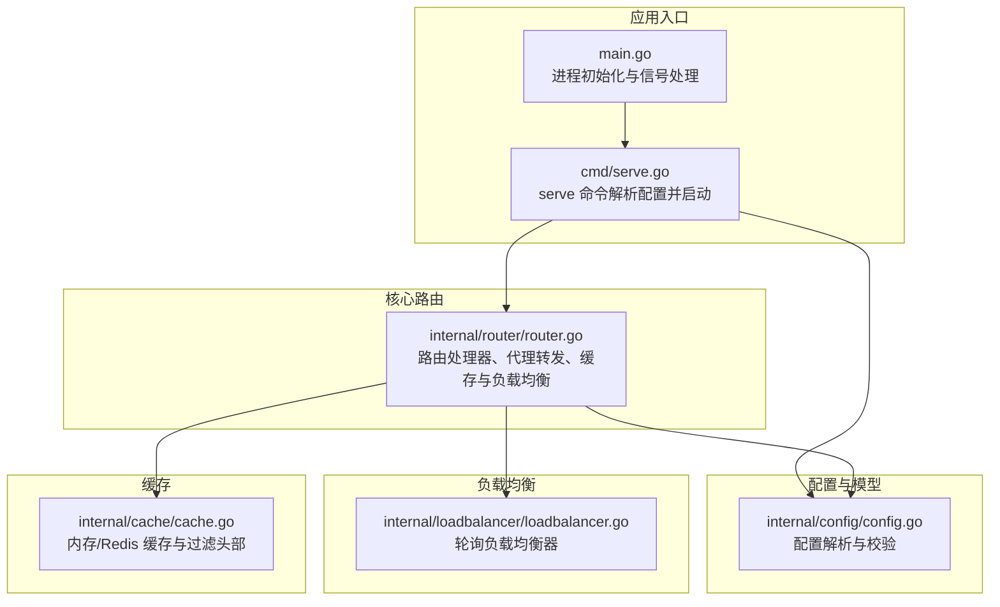
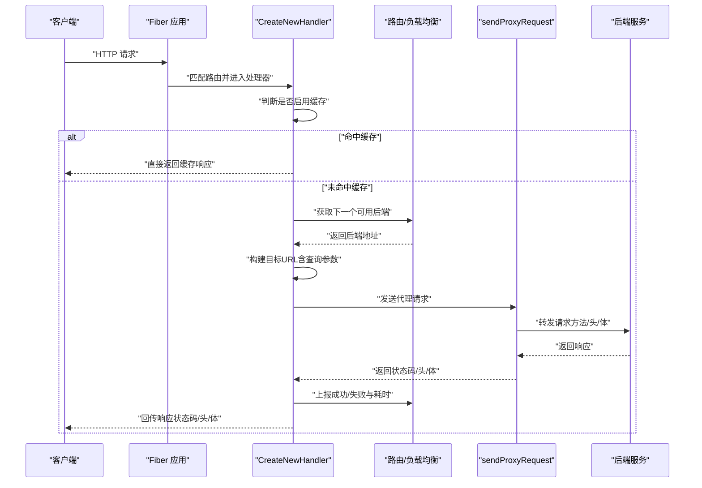
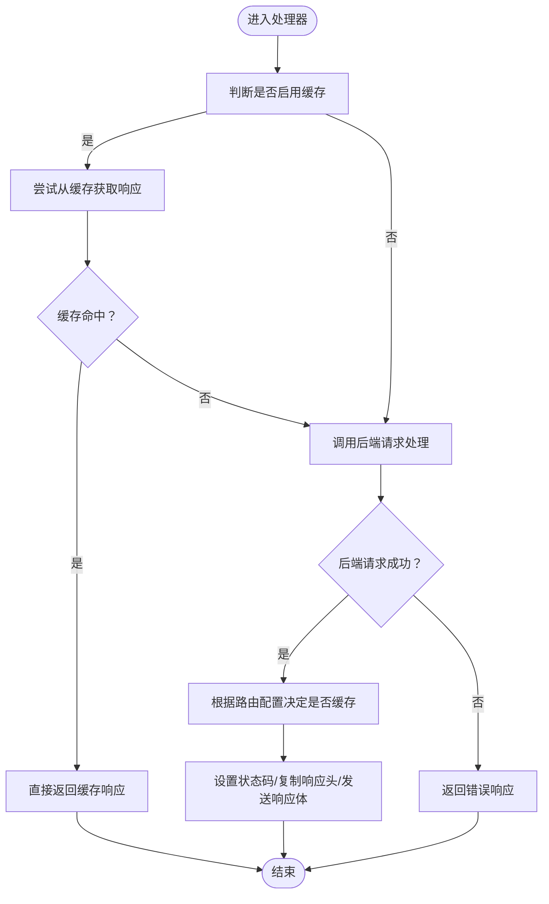
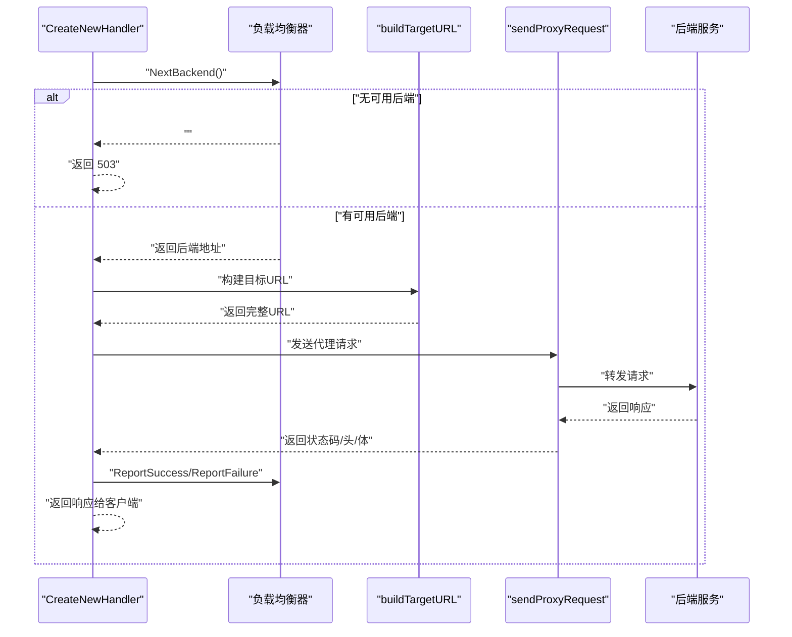
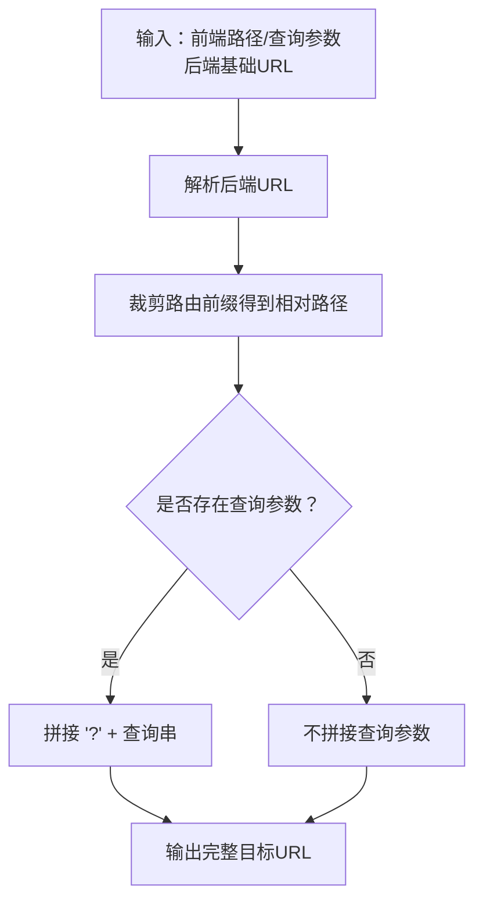
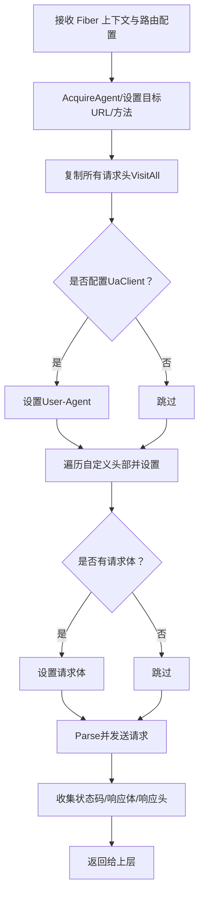
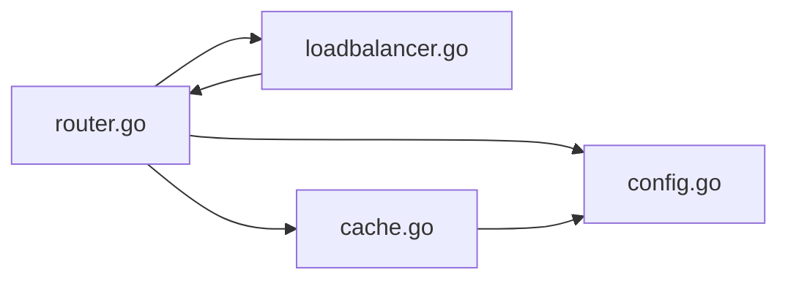

# 请求代理机制

<cite>
**本文引用的文件**
- [router.go](file://internal/router/router.go)
- [config.go](file://internal/config/config.go)
- [loadbalancer.go](file://internal/loadbalancer/loadbalancer.go)
- [cache.go](file://internal/cache/cache.go)
- [serve.go](file://cmd/serve.go)
- [main.go](file://main.go)
- [example_config.toml](file://example_config.toml)
</cite>

## 目录
1. [简介](#简介)
2. [项目结构](#项目结构)
3. [核心组件](#核心组件)
4. [架构总览](#架构总览)
5. [详细组件分析](#详细组件分析)
6. [依赖关系分析](#依赖关系分析)
7. [性能考量](#性能考量)
8. [故障排查指南](#故障排查指南)
9. [结论](#结论)
10. [附录](#附录)

## 简介
本文件深入解析 simple_api_gateway 中基于 Fiber 框架的请求代理实现，重点围绕以下三个函数展开：
- CreateNewHandler：如何为路由创建 Fiber 处理器
- handleBackendRequest：如何选择后端并执行后端请求转发
- buildTargetURL：如何重构目标 URL 路径

同时，文档还详细说明 sendProxyRequest 的请求头复制、自定义头部添加与请求体透传实现，并结合配置示例解释 HTTP 方法、查询参数与请求头的完整代理流程；最后阐述错误处理机制（如后端不可用的 503 响应与 URL 解析错误）及性能优化建议（连接复用与超时配置）。

## 项目结构
该网关采用模块化设计，核心逻辑集中在 internal/router，路由配置在 internal/config，负载均衡在 internal/loadbalancer，缓存在 internal/cache，命令入口在 cmd，应用启动在 main。

图表来源
- [main.go](file://main.go#L1-L49)
- [serve.go](file://cmd/serve.go#L1-L30)
- [router.go](file://internal/router/router.go#L445-L504)
- [config.go](file://internal/config/config.go#L1-L263)
- [loadbalancer.go](file://internal/loadbalancer/loadbalancer.go#L1-L248)
- [cache.go](file://internal/cache/cache.go#L1-L369)

章节来源
- [main.go](file://main.go#L1-L49)
- [serve.go](file://cmd/serve.go#L1-L30)
- [router.go](file://internal/router/router.go#L445-L504)
- [config.go](file://internal/config/config.go#L1-L263)
- [loadbalancer.go](file://internal/loadbalancer/loadbalancer.go#L1-L248)
- [cache.go](file://internal/cache/cache.go#L1-L369)

## 核心组件
- 路由处理器工厂：CreateNewHandler 为每个路由创建 Fiber 处理器，负责缓存判断、负载均衡、后端请求与响应回传。
- 后端请求执行：handleBackendRequest 负责选择后端、构建目标 URL、调用 sendProxyRequest 并上报负载均衡结果。
- 目标 URL 构造：buildTargetURL 将前端请求路径与查询参数拼接到后端基础 URL 上。
- 代理请求发送：sendProxyRequest 使用 Fiber Agent 完成请求头复制、自定义头部注入与请求体透传，并收集后端响应。
- 负载均衡：轮询策略，支持健康检查、失败计数与恢复。
- 缓存：内存或 Redis 缓存，过滤特定响应头，按路由配置缓存成功响应。

章节来源
- [router.go](file://internal/router/router.go#L112-L202)
- [router.go](file://internal/router/router.go#L204-L269)
- [router.go](file://internal/router/router.go#L271-L340)
- [loadbalancer.go](file://internal/loadbalancer/loadbalancer.go#L49-L110)
- [cache.go](file://internal/cache/cache.go#L252-L369)

## 架构总览
下图展示从 Fiber 入口到后端服务的完整代理链路，包括缓存、负载均衡与错误处理。

图表来源
- [router.go](file://internal/router/router.go#L271-L340)
- [router.go](file://internal/router/router.go#L204-L269)
- [router.go](file://internal/router/router.go#L138-L202)
- [loadbalancer.go](file://internal/loadbalancer/loadbalancer.go#L84-L110)

## 详细组件分析

### CreateNewHandler：路由处理器创建与缓存控制
- 功能要点
  - 为每个路由创建 Fiber 处理器，内部封装完整的代理流程。
  - 通过 shouldCache 判断是否启用缓存，并结合全局开关与路由配置决定是否走缓存路径。
  - 若缓存命中，直接回传缓存响应；否则继续后端请求。
  - 成功后端响应会根据路由配置进行缓存。
  - 统一设置响应状态码、复制响应头并发送响应体。
- 关键实现位置
  - 路由处理器工厂：[CreateNewHandler](file://internal/router/router.go#L271-L340)
  - 缓存决策与命中处理：[shouldCache](file://internal/router/router.go#L52-L110)、[tryGetFromCache](file://internal/router/router.go#L356-L401)
  - 缓存写入：[tryCacheResponse](file://internal/router/router.go#L403-L443)

图表来源
- [router.go](file://internal/router/router.go#L271-L340)
- [router.go](file://internal/router/router.go#L356-L443)

章节来源
- [router.go](file://internal/router/router.go#L271-L340)
- [router.go](file://internal/router/router.go#L52-L110)
- [router.go](file://internal/router/router.go#L356-L443)

### handleBackendRequest：后端请求转发与负载均衡
- 功能要点
  - 记录开始时间，用于统计响应时间。
  - 通过负载均衡器获取下一个可用后端；若无可用后端，返回 503。
  - 构建目标 URL（包含路径裁剪与查询参数拼接）。
  - 调用 sendProxyRequest 执行代理请求；若失败，上报失败并返回 500。
  - 成功后上报成功与响应时间，记录日志。
- 关键实现位置
  - 后端请求处理：[handleBackendRequest](file://internal/router/router.go#L204-L247)
  - 目标 URL 构造：[buildTargetURL](file://internal/router/router.go#L249-L269)
  - 负载均衡器接口与实现：[LoadBalancer 接口](file://internal/loadbalancer/loadbalancer.go#L25-L47)、[轮询实现](file://internal/loadbalancer/loadbalancer.go#L49-L110)

图表来源
- [router.go](file://internal/router/router.go#L204-L247)
- [router.go](file://internal/router/router.go#L249-L269)
- [loadbalancer.go](file://internal/loadbalancer/loadbalancer.go#L84-L110)

章节来源
- [router.go](file://internal/router/router.go#L204-L247)
- [router.go](file://internal/router/router.go#L249-L269)
- [loadbalancer.go](file://internal/loadbalancer/loadbalancer.go#L84-L110)

### buildTargetURL：目标 URL 重构
- 功能要点
  - 解析后端基础 URL。
  - 裁剪前端请求路径中与路由前缀对应的部分，得到相对后端的路径片段。
  - 拼接查询参数，形成最终目标 URL。
- 关键实现位置
  - [buildTargetURL](file://internal/router/router.go#L249-L269)

图表来源
- [router.go](file://internal/router/router.go#L249-L269)

章节来源
- [router.go](file://internal/router/router.go#L249-L269)

### sendProxyRequest：请求头复制、自定义头部与请求体透传
- 功能要点
  - 使用 Fiber Agent 创建代理请求，设置方法与目标 URL。
  - 复制所有请求头（遍历源请求头并设置到代理请求头）。
  - 若路由配置了 UaClient，则覆盖 User-Agent。
  - 遍历路由自定义头部并设置到代理请求头。
  - 若存在请求体，设置到代理请求体。
  - 解析代理请求并获取响应；收集响应状态码、响应体与响应头。
- 关键实现位置
  - [sendProxyRequest](file://internal/router/router.go#L138-L202)

图表来源
- [router.go](file://internal/router/router.go#L138-L202)

章节来源
- [router.go](file://internal/router/router.go#L138-L202)

### HTTP 方法、查询参数与请求头的完整代理流程
- 方法与路径
  - 处理器从 Fiber 上下文中读取 HTTP 方法与原始路径，随后在 buildTargetURL 中裁剪路由前缀，确保只转发相对后端的路径部分。
- 查询参数
  - 从源请求 URI 中提取查询串，并原样拼接到目标 URL，保证后端收到完整的查询参数。
- 请求头
  - 复制所有请求头到代理请求；若配置了 UaClient 或自定义头部，则覆盖或追加相应头部。
- 响应回传
  - 将后端返回的状态码、响应头与响应体逐字节回传给客户端。

章节来源
- [router.go](file://internal/router/router.go#L249-L269)
- [router.go](file://internal/router/router.go#L138-L202)
- [router.go](file://internal/router/router.go#L324-L339)

### 错误处理机制
- 后端不可用（503）
  - 当负载均衡器无法提供可用后端时，直接返回 503。
  - 参考：[handleBackendRequest](file://internal/router/router.go#L213-L216)
- URL 解析错误（500）
  - 构建目标 URL 时解析后端基础 URL 失败，返回 500。
  - 参考：[handleBackendRequest](file://internal/router/router.go#L220-L224)
- 后端请求失败（500）
  - sendProxyRequest 返回错误时，上报失败并返回 500。
  - 参考：[handleBackendRequest](file://internal/router/router.go#L228-L235)
- 负载均衡器失败上报
  - 在失败场景调用 ReportFailure，更新后端健康状态与失败计数。
  - 参考：[handleBackendRequest](file://internal/router/router.go#L228-L235)、[loadbalancer.ReportFailure](file://internal/loadbalancer/loadbalancer.go#L139-L182)

章节来源
- [router.go](file://internal/router/router.go#L204-L247)
- [loadbalancer.go](file://internal/loadbalancer/loadbalancer.go#L139-L182)

## 依赖关系分析
- 路由处理器依赖
  - 负载均衡器：用于选择后端与上报健康状态。
  - 缓存管理器：用于缓存命中与写入。
  - 配置模型：用于读取路由配置（UA、自定义头部、缓存 TTL/路径等）。
- 负载均衡器依赖
  - BackendStatus 记录健康状态、失败计数与响应时间历史。
- 缓存依赖
  - 支持内存与 Redis 两种实现，统一通过 CacheManager 管理。
  - 对响应头进行过滤，避免污染缓存。

图表来源
- [router.go](file://internal/router/router.go#L112-L202)
- [loadbalancer.go](file://internal/loadbalancer/loadbalancer.go#L1-L248)
- [cache.go](file://internal/cache/cache.go#L252-L369)
- [config.go](file://internal/config/config.go#L1-L263)

章节来源
- [router.go](file://internal/router/router.go#L112-L202)
- [loadbalancer.go](file://internal/loadbalancer/loadbalancer.go#L1-L248)
- [cache.go](file://internal/cache/cache.go#L252-L369)
- [config.go](file://internal/config/config.go#L1-L263)

## 性能考量
- 连接复用
  - 代码中使用 Fiber Agent 发送请求，其内部具备连接池与复用能力，有助于降低 TCP/TLS 握手开销。
  - 参考：[sendProxyRequest](file://internal/router/router.go#L138-L202)
- 超时配置
  - 当前实现未显式设置超时参数，建议在生产环境为代理请求增加超时控制，避免阻塞导致资源占用。
  - 可在 sendProxyRequest 中引入超时设置，或在上游 Fiber 配置中统一设置请求超时。
- 负载均衡与健康检查
  - 轮询策略简单高效；失败阈值与恢复超时可按业务调整，减少雪崩效应。
  - 参考：[轮询实现](file://internal/loadbalancer/loadbalancer.go#L49-L110)
- 缓存策略
  - 成功响应（2xx）才缓存，避免缓存异常响应；对响应头进行过滤，避免污染缓存。
  - 参考：[tryCacheResponse](file://internal/router/router.go#L403-L443)、[FilterHeaders](file://internal/cache/cache.go#L330-L362)
- 日志与可观测性
  - 关键路径均记录日志，便于定位性能瓶颈与错误原因。
  - 参考：[handleBackendRequest](file://internal/router/router.go#L237-L246)

## 故障排查指南
- 503 后端不可用
  - 检查路由配置的后端列表是否为空或全部标记为不健康。
  - 参考：[handleBackendRequest](file://internal/router/router.go#L213-L216)
- 500 URL 解析错误
  - 检查后端基础 URL 是否合法且可连通。
  - 参考：[handleBackendRequest](file://internal/router/router.go#L220-L224)
- 500 后端请求失败
  - 查看日志中的错误详情，确认网络连通性与后端服务状态。
  - 参考：[handleBackendRequest](file://internal/router/router.go#L228-L235)
- 缓存问题
  - 若缓存未生效，检查路由缓存开关、TTL 与可缓存路径列表。
  - 参考：[shouldCache](file://internal/router/router.go#L52-L110)、[example_config.toml](file://example_config.toml#L1-L45)

章节来源
- [router.go](file://internal/router/router.go#L204-L247)
- [example_config.toml](file://example_config.toml#L1-L45)

## 结论
simple_api_gateway 通过 Fiber 提供高性能的请求代理能力，结合轮询负载均衡与可选缓存，能够稳定地将前端请求转发至后端服务。核心流程清晰：路由处理器负责缓存与代理调度，负载均衡器保障高可用，sendProxyRequest 完成请求头与请求体的完整透传。建议在生产环境中补充超时控制与更细粒度的监控指标，以进一步提升稳定性与可观测性。

## 附录
- 配置示例参考
  - [example_config.toml](file://example_config.toml#L1-L45)
- 启动流程参考
  - [main.go](file://main.go#L1-L49)
  - [serve.go](file://cmd/serve.go#L1-L30)
- 路由注册与运行
  - [router.go](file://internal/router/router.go#L445-L504)