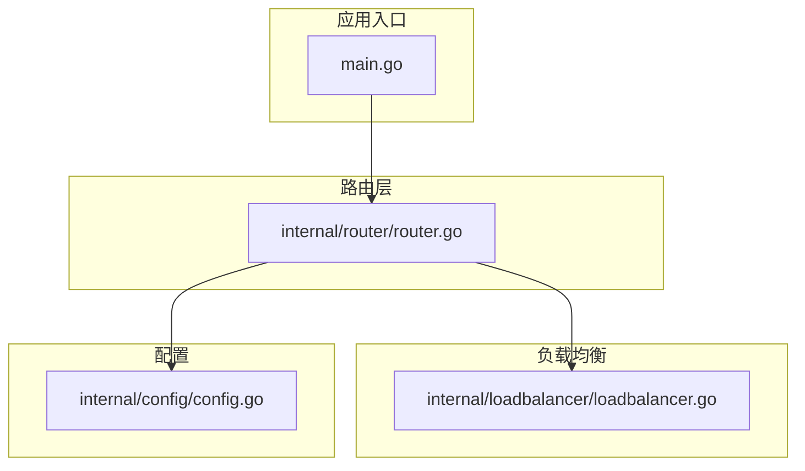
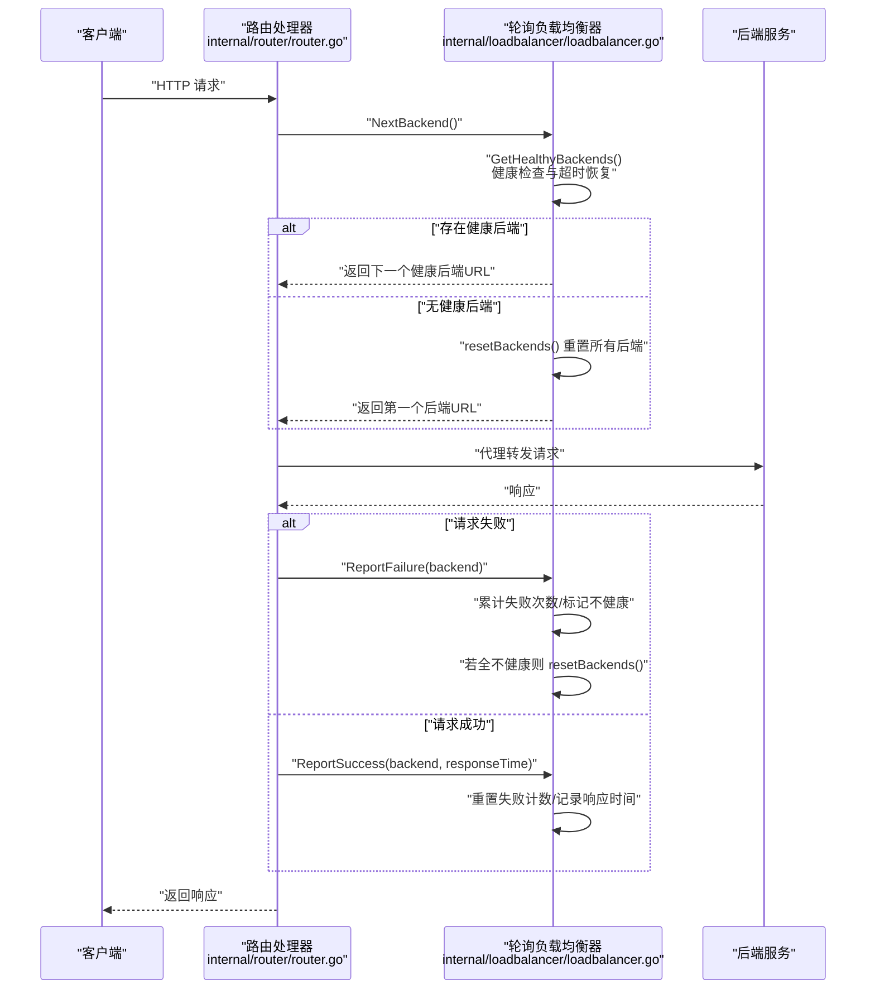
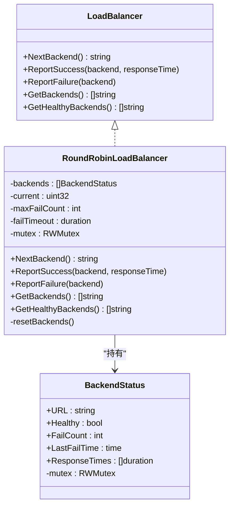
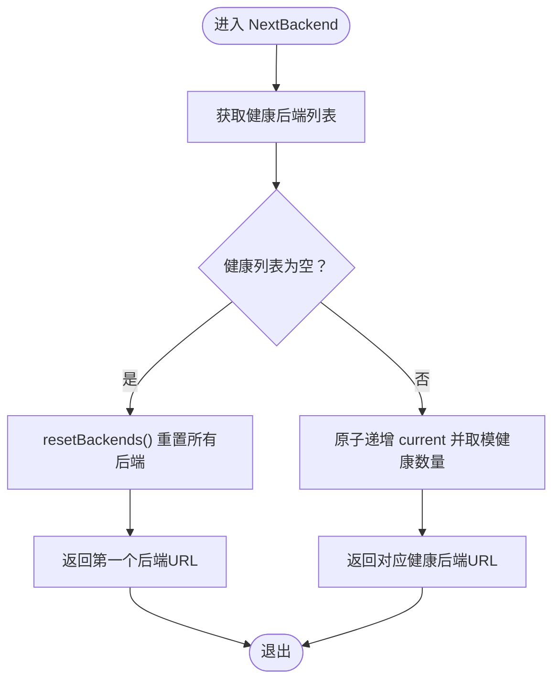
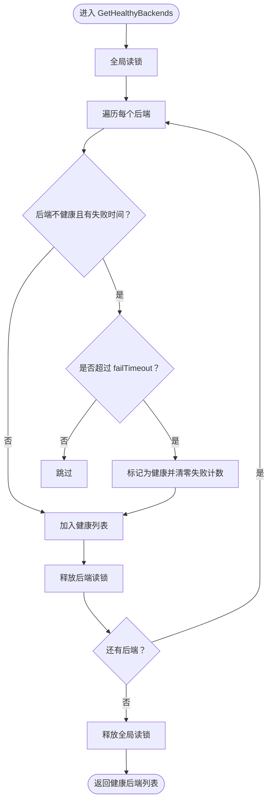
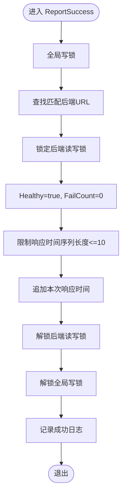
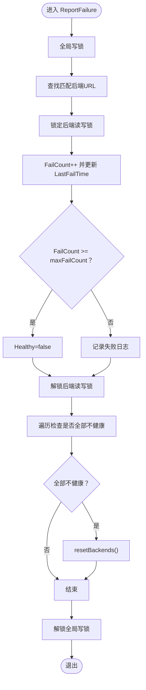
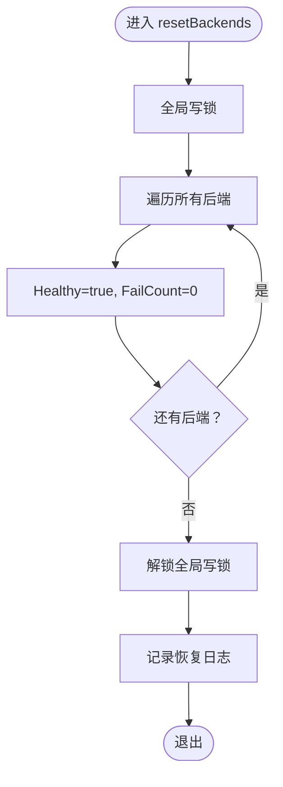
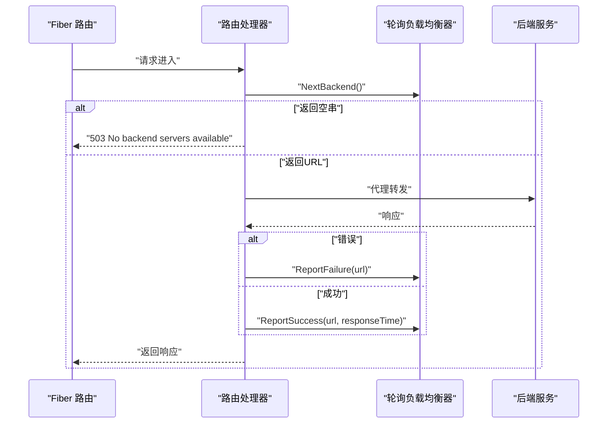
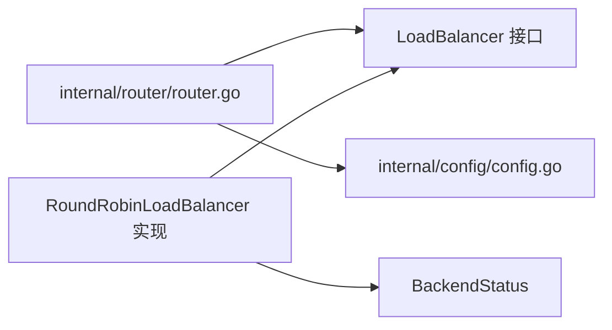

# 负载均衡策略

<cite>
**本文引用的文件**
- [internal/loadbalancer/loadbalancer.go](file://internal/loadbalancer/loadbalancer.go)
- [internal/router/router.go](file://internal/router/router.go)
- [internal/config/config.go](file://internal/config/config.go)
- [main.go](file://main.go)
</cite>

## 目录
1. [简介](#简介)
2. [项目结构](#项目结构)
3. [核心组件](#核心组件)
4. [架构总览](#架构总览)
5. [详细组件分析](#详细组件分析)
6. [依赖关系分析](#依赖关系分析)
7. [性能考量与调优建议](#性能考量与调优建议)
8. [故障排查指南](#故障排查指南)
9. [结论](#结论)

## 简介
本文件围绕轮询负载均衡器 RoundRobinLoadBalancer 的实现进行系统化解析，重点覆盖以下方面：
- NextBackend 如何实现线程安全的轮询算法
- GetHealthyBackends 如何结合健康状态与故障超时时间实现自动恢复
- ReportSuccess 与 ReportFailure 如何通过原子操作与互斥锁更新后端状态并记录响应时间
- BackendStatus 结构体中的健康检查逻辑（连续失败计数与故障转移）
- 当所有后端不可用时 resetBackends 的恢复策略
- 性能调优建议：maxFailCount 与 failTimeout 参数的调整策略

## 项目结构
该仓库采用按功能模块划分的组织方式，与负载均衡相关的核心文件位于 internal/loadbalancer 与 internal/router：
- internal/loadbalancer/loadbalancer.go：定义负载均衡接口与轮询实现
- internal/router/router.go：路由层集成负载均衡器，负责请求转发与统计
- internal/config/config.go：配置解析与校验，包含路由后端列表等
- main.go：应用入口，启动命令与信号处理

图表来源
- [main.go](file://main.go#L1-L49)
- [internal/router/router.go](file://internal/router/router.go#L1-L136)
- [internal/loadbalancer/loadbalancer.go](file://internal/loadbalancer/loadbalancer.go#L1-L82)
- [internal/config/config.go](file://internal/config/config.go#L1-L67)

章节来源
- [main.go](file://main.go#L1-L49)
- [internal/router/router.go](file://internal/router/router.go#L1-L136)
- [internal/loadbalancer/loadbalancer.go](file://internal/loadbalancer/loadbalancer.go#L1-L82)
- [internal/config/config.go](file://internal/config/config.go#L1-L67)

## 核心组件
- 负载均衡接口 LoadBalancer：定义 NextBackend、ReportSuccess、ReportFailure、GetBackends、GetHealthyBackends 等方法
- 轮询实现 RoundRobinLoadBalancer：维护后端列表、当前索引、最大失败次数阈值与故障超时时间，并通过互斥锁与原子操作保证线程安全
- 后端状态 BackendStatus：记录 URL、健康状态、连续失败次数、最后失败时间、最近响应时间序列与对应读写锁

章节来源
- [internal/loadbalancer/loadbalancer.go](file://internal/loadbalancer/loadbalancer.go#L24-L82)

## 架构总览
下图展示了请求在路由层与负载均衡器之间的交互流程，以及负载均衡器内部的健康检查与恢复机制。

图表来源
- [internal/router/router.go](file://internal/router/router.go#L204-L247)
- [internal/loadbalancer/loadbalancer.go](file://internal/loadbalancer/loadbalancer.go#L84-L181)

## 详细组件分析

### 类型与接口设计
- LoadBalancer 接口：统一抽象 NextBackend、ReportSuccess、ReportFailure、GetBackends、GetHealthyBackends
- RoundRobinLoadBalancer 结构体：包含后端数组、当前索引、最大失败次数阈值、故障超时时间与全局读写锁
- BackendStatus 结构体：包含后端 URL、健康标志、连续失败次数、最后失败时间、最近响应时间序列与对应读写锁

图表来源
- [internal/loadbalancer/loadbalancer.go](file://internal/loadbalancer/loadbalancer.go#L24-L82)

章节来源
- [internal/loadbalancer/loadbalancer.go](file://internal/loadbalancer/loadbalancer.go#L24-L82)

### NextBackend：线程安全的轮询算法
- 步骤一：优先获取健康后端列表
- 步骤二：若健康列表为空，则执行 resetBackends 并返回第一个后端
- 步骤三：使用原子操作对 current 增量并取模，确保多协程下的线程安全轮询

图表来源
- [internal/loadbalancer/loadbalancer.go](file://internal/loadbalancer/loadbalancer.go#L84-L109)

章节来源
- [internal/loadbalancer/loadbalancer.go](file://internal/loadbalancer/loadbalancer.go#L84-L109)

### GetHealthyBackends：健康状态与故障超时恢复
- 对每个后端：
  - 若不健康且 LastFailTime 非零，且当前时间减去 LastFailTime 超过 failTimeout，则将其 Healthy 置为 true、FailCount 清零，允许重试
  - 将 Healthy 的后端加入结果集
- 该过程在全局读锁保护下遍历，同时对单个后端使用其独立读写锁进行细粒度控制

图表来源
- [internal/loadbalancer/loadbalancer.go](file://internal/loadbalancer/loadbalancer.go#L198-L231)

章节来源
- [internal/loadbalancer/loadbalancer.go](file://internal/loadbalancer/loadbalancer.go#L198-L231)

### ReportSuccess：成功上报与响应时间记录
- 全局写锁保护下定位目标后端
- 将 Healthy 置为 true、FailCount 清零
- 限制最近响应时间序列长度为 10，新值追加至末尾
- 记录调试日志

图表来源
- [internal/loadbalancer/loadbalancer.go](file://internal/loadbalancer/loadbalancer.go#L112-L137)

章节来源
- [internal/loadbalancer/loadbalancer.go](file://internal/loadbalancer/loadbalancer.go#L112-L137)

### ReportFailure：失败上报与故障转移
- 全局写锁保护下定位目标后端
- FailCount 自增并更新 LastFailTime
- 若 FailCount 达到阈值 maxFailCount，则标记 Healthy=false
- 遍历检查所有后端是否均不健康，若是则触发 resetBackends()

图表来源
- [internal/loadbalancer/loadbalancer.go](file://internal/loadbalancer/loadbalancer.go#L140-L181)

章节来源
- [internal/loadbalancer/loadbalancer.go](file://internal/loadbalancer/loadbalancer.go#L140-L181)

### resetBackends：全量恢复策略
- 全局写锁保护下将所有后端 Healthy 置为 true、FailCount 清零
- 记录警告日志，提示已重置所有后端

图表来源
- [internal/loadbalancer/loadbalancer.go](file://internal/loadbalancer/loadbalancer.go#L233-L247)

章节来源
- [internal/loadbalancer/loadbalancer.go](file://internal/loadbalancer/loadbalancer.go#L233-L247)

### BackendStatus 健康检查逻辑要点
- 连续失败计数 FailCount：每次失败自增，成功时清零
- 故障超时时间 failTimeout：超过该时间后允许自动恢复重试
- 最近响应时间序列 ResponseTimes：上限 10，用于后续统计或监控（当前实现中未在负载均衡决策中使用）

章节来源
- [internal/loadbalancer/loadbalancer.go](file://internal/loadbalancer/loadbalancer.go#L14-L23)
- [internal/loadbalancer/loadbalancer.go](file://internal/loadbalancer/loadbalancer.go#L112-L137)
- [internal/loadbalancer/loadbalancer.go](file://internal/loadbalancer/loadbalancer.go#L140-L181)
- [internal/loadbalancer/loadbalancer.go](file://internal/loadbalancer/loadbalancer.go#L198-L231)

### 与路由层的集成
- 路由层为每个路由维护一个负载均衡器实例，使用读写锁避免并发创建
- 请求到达时：
  - 调用 lb.NextBackend() 获取后端
  - 若返回空串，返回 503
  - 发起代理请求，失败时调用 lb.ReportFailure，成功时计算响应时间并调用 lb.ReportSuccess

图表来源
- [internal/router/router.go](file://internal/router/router.go#L112-L136)
- [internal/router/router.go](file://internal/router/router.go#L204-L247)

章节来源
- [internal/router/router.go](file://internal/router/router.go#L112-L136)
- [internal/router/router.go](file://internal/router/router.go#L204-L247)

## 依赖关系分析
- 路由层依赖负载均衡接口，具体实现为轮询策略
- 负载均衡器内部依赖后端状态结构体，使用互斥锁与原子操作保障并发安全
- 配置层提供路由后端列表，路由层据此创建负载均衡器实例

图表来源
- [internal/router/router.go](file://internal/router/router.go#L1-L136)
- [internal/loadbalancer/loadbalancer.go](file://internal/loadbalancer/loadbalancer.go#L24-L82)
- [internal/config/config.go](file://internal/config/config.go#L1-L67)

章节来源
- [internal/router/router.go](file://internal/router/router.go#L1-L136)
- [internal/loadbalancer/loadbalancer.go](file://internal/loadbalancer/loadbalancer.go#L24-L82)
- [internal/config/config.go](file://internal/config/config.go#L1-L67)

## 性能考量与调优建议
- maxFailCount（默认 3）：决定故障转移的敏感度
  - 建议：在高抖动网络中适当提高，避免频繁误判；在稳定性较好的环境中降低，提升故障感知速度
- failTimeout（默认 30 秒）：决定自动恢复的时间窗口
  - 建议：根据后端平均恢复时间与业务 SLA 调整；过短可能导致反复切换，过长可能延长故障暴露时间
- 响应时间序列上限 10：当前仅用于记录，未参与决策
  - 建议：若未来扩展为基于历史响应时间的权重轮询，可考虑增大上限并引入平滑统计
- 锁粒度优化：
  - 当前对每个后端使用独立读写锁，整体并发性较好
  - 可评估是否在高频场景下进一步拆分热点字段（例如将 Healthy 与 FailCount 分离），减少锁竞争
- 原子轮询：
  - 使用原子增量与取模，避免锁竞争，适合高并发轮询场景
  - 建议：保持该策略不变，配合合理的 maxFailCount 与 failTimeout 即可获得良好性能

[本节为通用性能建议，不直接分析具体文件]

## 故障排查指南
- 503 无可用后端
  - 现象：NextBackend 返回空串并返回 503
  - 可能原因：所有后端均标记为不健康且未超过 failTimeout
  - 处理：检查后端连通性、网络状况；等待 failTimeout 到期后自动恢复，或手动重启后端
  - 参考路径：[internal/router/router.go](file://internal/router/router.go#L213-L216)
- 全部不健康触发 resetBackends
  - 现象：日志出现“重置所有后端”的警告
  - 可能原因：ReportFailure 导致 FailCount 达到阈值，随后全不健康触发 resetBackends
  - 处理：确认 maxFailCount 与 failTimeout 设置是否合理；检查后端健康状况
  - 参考路径：[internal/loadbalancer/loadbalancer.go](file://internal/loadbalancer/loadbalancer.go#L140-L181)
- 成功/失败上报日志
  - 成功：记录响应时间
  - 失败：记录失败次数
  - 参考路径：[internal/loadbalancer/loadbalancer.go](file://internal/loadbalancer/loadbalancer.go#L112-L137), [internal/loadbalancer/loadbalancer.go](file://internal/loadbalancer/loadbalancer.go#L140-L181)

章节来源
- [internal/router/router.go](file://internal/router/router.go#L204-L247)
- [internal/loadbalancer/loadbalancer.go](file://internal/loadbalancer/loadbalancer.go#L112-L181)

## 结论
- 轮询负载均衡器通过原子操作与细粒度互斥锁实现了线程安全的轮询与健康状态管理
- GetHealthyBackends 结合连续失败计数与故障超时时间，实现了自动恢复与故障转移
- ReportSuccess 与 ReportFailure 通过原子与互斥组合，确保状态更新的一致性与可观测性
- 当所有后端不可用时，resetBackends 提供了兜底恢复策略
- 性能调优建议集中在 maxFailCount 与 failTimeout 的合理配置，以平衡故障感知速度与稳定性