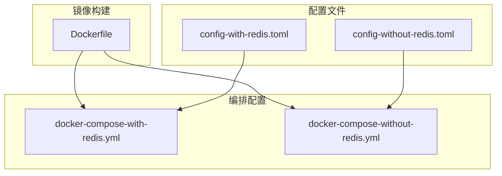
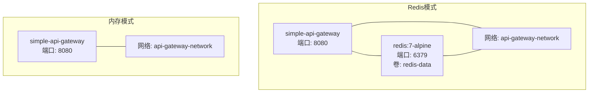
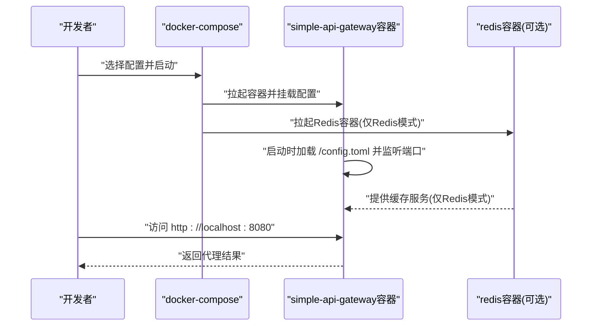
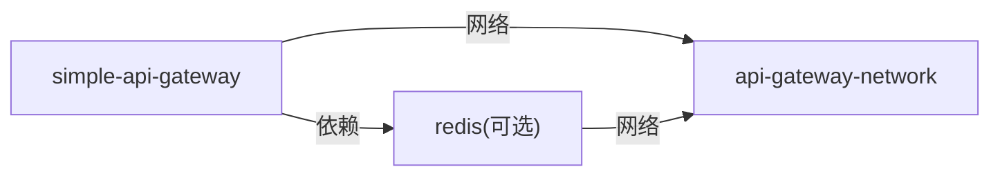

# Docker部署

<cite>
**本文引用的文件**
- [Dockerfile](file://Dockerfile)
- [docker-compose-with-redis.yml](file://docker-compose-with-redis.yml)
- [docker-compose-without-redis.yml](file://docker-compose-without-redis.yml)
- [config-with-redis.toml](file://config-with-redis.toml)
- [config-without-redis.toml](file://config-without-redis.toml)
- [DOCKER-README.md](file://DOCKER-README.md)
- [README.md](file://README.md)
- [Makefile](file://Makefile)
</cite>

## 目录
1. [简介](#简介)
2. [项目结构](#项目结构)
3. [核心组件](#核心组件)
4. [架构总览](#架构总览)
5. [详细组件分析](#详细组件分析)
6. [依赖分析](#依赖分析)
7. [性能考量](#性能考量)
8. [故障排查指南](#故障排查指南)
9. [结论](#结论)
10. [附录](#附录)

## 简介
本指南面向希望在生产或开发环境中使用Docker部署 simple_api_gateway 的用户，覆盖从镜像构建、Compose编排到服务启停与验证的完整流程。文档重点解析：
- Dockerfile 的单层镜像策略与基础镜像选择（alpine:latest）优势
- docker-compose-with-redis.yml 与 docker-compose-without-redis.yml 的配置差异与适用场景
- 启用Redis缓存与仅使用内存缓存两种模式的性能与可靠性权衡
- 通过 Makefile 构建自定义镜像与通过 docker-compose 快速启动验证服务
- 常见问题排查（端口冲突、配置挂载失败、容器间通信）

## 项目结构
与Docker部署直接相关的文件与角色如下：
- Dockerfile：定义容器镜像构建步骤，采用最小化基础镜像与单层复制策略
- docker-compose-with-redis.yml：包含API网关与Redis缓存服务的完整编排
- docker-compose-without-redis.yml：仅包含API网关服务（内存缓存）
- config-with-redis.toml / config-without-redis.toml：两套配置文件，分别启用Redis缓存与内存缓存
- DOCKER-README.md / README.md：官方Docker部署说明与使用示例
- Makefile：提供构建二进制与常用开发任务的命令入口

图表来源
- [Dockerfile](file://Dockerfile#L1-L7)
- [docker-compose-with-redis.yml](file://docker-compose-with-redis.yml#L1-L38)
- [docker-compose-without-redis.yml](file://docker-compose-without-redis.yml#L1-L17)
- [config-with-redis.toml](file://config-with-redis.toml#L1-L31)
- [config-without-redis.toml](file://config-without-redis.toml#L1-L30)

章节来源
- [Dockerfile](file://Dockerfile#L1-L7)
- [docker-compose-with-redis.yml](file://docker-compose-with-redis.yml#L1-L38)
- [docker-compose-without-redis.yml](file://docker-compose-without-redis.yml#L1-L17)
- [config-with-redis.toml](file://config-with-redis.toml#L1-L31)
- [config-without-redis.toml](file://config-without-redis.toml#L1-L30)
- [DOCKER-README.md](file://DOCKER-README.md#L1-L65)
- [README.md](file://README.md#L102-L206)

## 核心组件
- 容器镜像（simple_api_gateway）
  - 基于 alpine:latest 最小化基础镜像，减少镜像体积与攻击面
  - 将二进制与示例配置复制入镜像，入口命令为“serve /config.toml”
- 缓存模式
  - Redis缓存：通过 docker-compose-with-redis.yml 启动独立Redis服务，网关通过配置文件连接
  - 内存缓存：docker-compose-without-redis.yml 仅启动网关，使用内存缓存
- 配置文件
  - 两套配置文件分别控制缓存开关、是否使用Redis、Redis连接串、路由与缓存路径等

章节来源
- [Dockerfile](file://Dockerfile#L1-L7)
- [docker-compose-with-redis.yml](file://docker-compose-with-redis.yml#L1-L38)
- [docker-compose-without-redis.yml](file://docker-compose-without-redis.yml#L1-L17)
- [config-with-redis.toml](file://config-with-redis.toml#L1-L31)
- [config-without-redis.toml](file://config-without-redis.toml#L1-L30)

## 架构总览
下图展示两种部署模式的容器交互与网络拓扑：

图表来源
- [docker-compose-with-redis.yml](file://docker-compose-with-redis.yml#L1-L38)
- [docker-compose-without-redis.yml](file://docker-compose-without-redis.yml#L1-L17)

## 详细组件分析

### Dockerfile 多阶段构建策略与镜像优化
- 单层镜像策略
  - 使用 alpine:latest 作为基础镜像，显著降低镜像体积与下载时间
  - 仅执行一次COPY，将二进制与配置复制到根目录，避免中间层冗余
  - 入口命令固定为“serve /config.toml”，便于容器启动时直接加载配置
- 优化建议（基于现有实现）
  - 若需进一步瘦身，可在构建阶段使用多阶段构建，将编译产物与运行时镜像分离
  - 在运行时镜像中仅保留必要文件，移除调试符号与未使用的库
  - 使用只读根文件系统与非root用户运行（需配合安全策略评估）

章节来源
- [Dockerfile](file://Dockerfile#L1-L7)

### docker-compose-with-redis.yml 配置详解
- 服务定义
  - simple-api-gateway：映射宿主8080端口至容器8080；挂载 ./config-with-redis.toml 至 /config.toml；依赖 redis 服务；重启策略为 always；命令为“serve /config.toml”；加入 api-gateway-network
  - redis：镜像 redis:7-alpine；映射6379端口；挂载 redis-data 卷；开启 appendonly；sysctl 设置 vm.overcommit_memory=1；命令为 redis-server --appendonly yes；加入 api-gateway-network
- 网络与卷
  - 使用自定义桥接网络 api-gateway-network，确保容器间通过服务名通信
  - redis-data 卷持久化Redis数据，避免容器删除导致数据丢失
- 适用场景
  - 需要跨实例共享缓存、高并发读取、持久化需求强的场景
  - 对延迟敏感且缓存命中率高的业务

章节来源
- [docker-compose-with-redis.yml](file://docker-compose-with-redis.yml#L1-L38)
- [config-with-redis.toml](file://config-with-redis.toml#L1-L31)

### docker-compose-without-redis.yml 配置详解
- 服务定义
  - simple-api-gateway：映射宿主8080端口至容器8080；挂载 ./config-without-redis.toml 至 /config.toml；重启策略为 always；命令为“serve /config.toml”；加入 api-gateway-network
- 适用场景
  - 单实例部署、无外部缓存依赖、对延迟极敏感但缓存规模较小的场景
  - 开发与测试环境，简化依赖

章节来源
- [docker-compose-without-redis.yml](file://docker-compose-without-redis.yml#L1-L17)
- [config-without-redis.toml](file://config-without-redis.toml#L1-L30)

### 配置文件差异与缓存模式
- 全局缓存开关
  - use_redis=true：启用Redis缓存
  - use_redis=false：使用内存缓存
- Redis连接串
  - Redis模式下，网关通过配置文件中的 redis_url 连接 redis 服务（容器内通过服务名访问）
- 路由级缓存
  - 可按路由设置 cache_ttl、cache_enable、cache_paths 等，实现细粒度缓存控制

章节来源
- [config-with-redis.toml](file://config-with-redis.toml#L1-L31)
- [config-without-redis.toml](file://config-without-redis.toml#L1-L30)

### 启动与验证流程（序列图）

图表来源
- [docker-compose-with-redis.yml](file://docker-compose-with-redis.yml#L1-L38)
- [docker-compose-without-redis.yml](file://docker-compose-without-redis.yml#L1-L17)
- [config-with-redis.toml](file://config-with-redis.toml#L1-L31)
- [config-without-redis.toml](file://config-without-redis.toml#L1-L30)

## 依赖分析
- 组件耦合
  - Redis模式下，simple-api-gateway 与 redis 服务存在显式依赖（depends_on），通过服务名通信
  - 两者均加入同一自定义网络，保证容器间可达
- 外部依赖
  - Redis镜像版本：redis:7-alpine
  - 基础镜像：alpine:latest
- 潜在风险
  - 两个Compose配置均使用宿主8080端口，不可同时运行
  - Redis数据持久化依赖 redis-data 卷，需确保卷权限与路径正确

图表来源
- [docker-compose-with-redis.yml](file://docker-compose-with-redis.yml#L1-L38)
- [docker-compose-without-redis.yml](file://docker-compose-without-redis.yml#L1-L17)

章节来源
- [docker-compose-with-redis.yml](file://docker-compose-with-redis.yml#L1-L38)
- [docker-compose-without-redis.yml](file://docker-compose-without-redis.yml#L1-L17)

## 性能考量
- 基础镜像选择（alpine:latest）
  - 体积小、启动快、安全基线高，适合边缘与云原生环境
- 缓存模式对比
  - Redis模式：跨实例共享缓存、持久化、高并发读取友好，适合生产高吞吐场景
  - 内存模式：零依赖、低延迟、适合单实例或开发测试
- 端口与网络
  - 8080端口为默认监听端口；Redis模式下6379端口暴露，注意防火墙与安全组策略
- 数据持久化
  - Redis持久化开启 appendonly，结合卷 redis-data 实现数据落盘

章节来源
- [Dockerfile](file://Dockerfile#L1-L7)
- [docker-compose-with-redis.yml](file://docker-compose-with-redis.yml#L1-L38)
- [README.md](file://README.md#L374-L396)

## 故障排查指南
- 端口冲突
  - 现象：容器启动失败或端口占用
  - 排查：确认宿主机8080端口未被占用；若需并行部署，修改其中一个配置的宿主端口映射
  - 参考：两个Compose配置均映射宿主8080端口
- 配置挂载失败
  - 现象：容器启动但无法加载配置
  - 排查：确认挂载路径正确、文件存在且可读；核对挂载目标 /config.toml 是否与入口命令一致
  - 参考：Redis模式挂载 ./config-with-redis.toml；内存模式挂载 ./config-without-redis.toml
- 容器间通信
  - 现象：网关无法连接Redis
  - 排查：确认两者在同一自定义网络 api-gateway-network；Redis服务名与配置中的 redis_url 一致；检查容器日志与网络连通性
- Redis数据丢失
  - 现象：容器重启后缓存清空
  - 排查：确认 redis-data 卷存在且未被清理；检查卷权限与存储路径
- 同时运行冲突
  - 现象：两个配置同时运行导致端口冲突
  - 排查：仅运行一种配置；或修改其中一个的宿主端口映射

章节来源
- [docker-compose-with-redis.yml](file://docker-compose-with-redis.yml#L1-L38)
- [docker-compose-without-redis.yml](file://docker-compose-without-redis.yml#L1-L17)
- [DOCKER-README.md](file://DOCKER-README.md#L60-L65)

## 结论
- 采用 alpine:latest 的单层镜像策略，兼顾体积与启动速度
- Redis模式适合生产高并发与跨实例共享缓存场景；内存模式适合单实例与开发测试
- 通过 docker-compose 快速拉起服务，结合配置文件灵活切换缓存模式
- 注意端口冲突、挂载路径与容器间网络连通性，确保稳定运行

## 附录

### 构建自定义镜像（Makefile命令）
- 构建二进制
  - 目标：build
  - 作用：生成可执行二进制文件
  - 参考：[Makefile](file://Makefile#L9-L12)
- 构建镜像
  - 当前Dockerfile直接复制二进制与配置，无需额外构建步骤
  - 如需多阶段构建，可在Dockerfile中增加构建阶段与精简运行时镜像
- 其他常用命令
  - run：本地运行应用
  - install：安装二进制
  - test/clean/lint/vet 等：开发辅助命令

章节来源
- [Makefile](file://Makefile#L1-L85)
- [Dockerfile](file://Dockerfile#L1-L7)

### 快速启动与验证
- 使用Redis缓存
  - 启动：docker-compose -f docker-compose-with-redis.yml up -d
  - 停止：docker-compose -f docker-compose-with-redis.yml down
  - 参考：[DOCKER-README.md](file://DOCKER-README.md#L13-L15)
- 使用内存缓存
  - 启动：docker-compose -f docker-compose-without-redis.yml up -d
  - 停止：docker-compose -f docker-compose-without-redis.yml down
  - 参考：[DOCKER-README.md](file://DOCKER-README.md#L29-L31)
- 访问验证
  - 默认监听8080端口，访问 http://localhost:8080
  - 参考：[README.md](file://README.md#L102-L110)