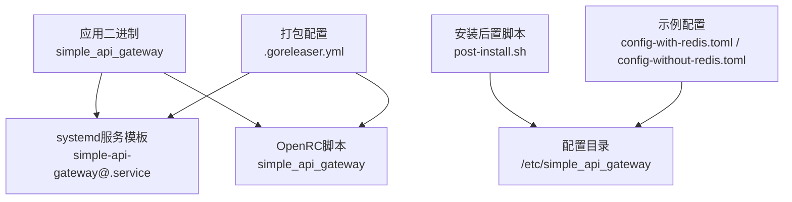
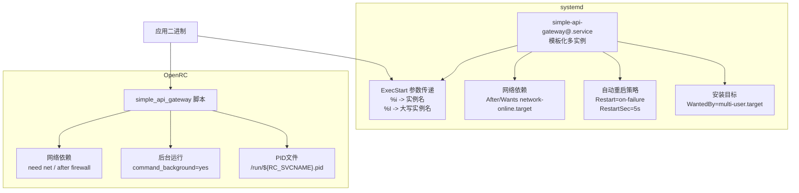
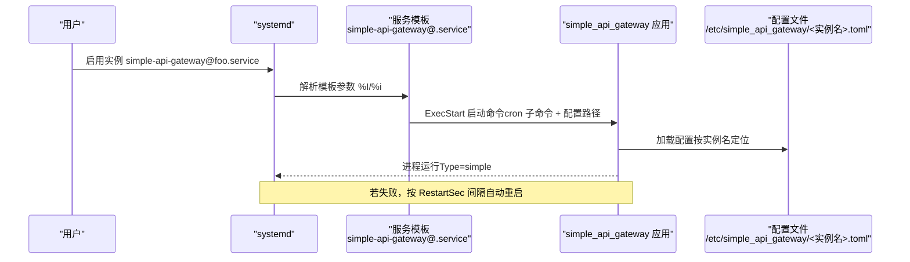
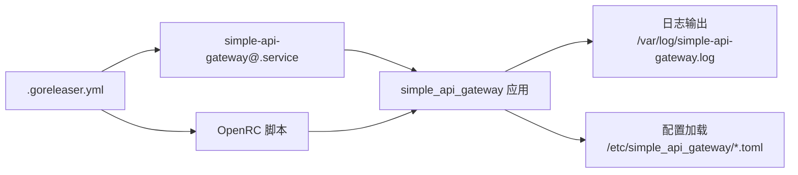

# systemd部署

<cite>
**本文引用的文件**
- [scripts/systemctl/simple-api-gateway@.service](file://scripts/systemctl/simple-api-gateway@.service)
- [scripts/rc/simple_api_gateway](file://scripts/rc/simple_api_gateway)
- [scripts/post-install.sh](file://scripts/post-install.sh)
- [scripts/post-remove.sh](file://scripts/post-remove.sh)
- [.goreleaser.yml](file://.goreleaser.yml)
- [README.md](file://README.md)
- [config-with-redis.toml](file://config-with-redis.toml)
- [config-without-redis.toml](file://config-without-redis.toml)
- [main.go](file://main.go)
</cite>

## 目录
1. [简介](#简介)
2. [项目结构](#项目结构)
3. [核心组件](#核心组件)
4. [架构总览](#架构总览)
5. [详细组件分析](#详细组件分析)
6. [依赖关系分析](#依赖关系分析)
7. [性能与稳定性考量](#性能与稳定性考量)
8. [故障排查指南](#故障排查指南)
9. [结论](#结论)
10. [附录](#附录)

## 简介
本指南面向在Linux发行版上通过systemd部署simple-api-gateway服务的运维与开发人员，重点解析simple-api-gateway@.service服务模板的配置项与多实例部署机制，说明ExecStart参数传递与网络依赖配置，对比OpenRC（scripts/rc/simple_api_gateway）的差异与适用场景，并提供安装、启用、状态监控、日志管理、自动重启策略以及生产环境最佳实践（资源限制、安全上下文与权限控制）。

## 项目结构
与systemd部署直接相关的文件位于scripts目录下：
- systemd服务模板：scripts/systemctl/simple-api-gateway@.service
- OpenRC脚本：scripts/rc/simple_api_gateway
- 安装后置脚本：scripts/post-install.sh、scripts/post-remove.sh
- 打包配置：.goreleaser.yml（定义了systemd服务文件的安装位置与打包脚本）
- 示例配置：config-with-redis.toml、config-without-redis.toml
- 应用入口：main.go（应用主程序）

图表来源
- [scripts/systemctl/simple-api-gateway@.service](file://scripts/systemctl/simple-api-gateway@.service#L1-L13)
- [scripts/rc/simple_api_gateway](file://scripts/rc/simple_api_gateway#L1-L18)
- [.goreleaser.yml](file://.goreleaser.yml#L90-L121)
- [scripts/post-install.sh](file://scripts/post-install.sh#L1-L8)
- [config-with-redis.toml](file://config-with-redis.toml#L1-L31)
- [config-without-redis.toml](file://config-without-redis.toml#L1-L30)

章节来源
- [scripts/systemctl/simple-api-gateway@.service](file://scripts/systemctl/simple-api-gateway@.service#L1-L13)
- [scripts/rc/simple_api_gateway](file://scripts/rc/simple_api_gateway#L1-L18)
- [.goreleaser.yml](file://.goreleaser.yml#L90-L121)
- [scripts/post-install.sh](file://scripts/post-install.sh#L1-L8)
- [config-with-redis.toml](file://config-with-redis.toml#L1-L31)
- [config-without-redis.toml](file://config-without-redis.toml#L1-L30)

## 核心组件
- systemd服务模板：提供多实例能力（@符号），按实例名传入配置文件路径，自动重启策略，网络依赖。
- OpenRC脚本：兼容旧发行版，提供网络等待与后台运行等基础能力。
- 安装后置脚本：创建配置与日志目录，生成默认配置。
- 打包配置：定义systemd服务文件安装路径与打包脚本，便于分发。
- 示例配置：演示启用Redis缓存与内存缓存两种部署形态。

章节来源
- [scripts/systemctl/simple-api-gateway@.service](file://scripts/systemctl/simple-api-gateway@.service#L1-L13)
- [scripts/rc/simple_api_gateway](file://scripts/rc/simple_api_gateway#L1-L18)
- [scripts/post-install.sh](file://scripts/post-install.sh#L1-L8)
- [.goreleaser.yml](file://.goreleaser.yml#L90-L121)
- [config-with-redis.toml](file://config-with-redis.toml#L1-L31)
- [config-without-redis.toml](file://config-without-redis.toml#L1-L30)

## 架构总览
下图展示了systemd与OpenRC两种init系统在部署simple-api-gateway时的差异与交互关系。

图表来源
- [scripts/systemctl/simple-api-gateway@.service](file://scripts/systemctl/simple-api-gateway@.service#L1-L13)
- [scripts/rc/simple_api_gateway](file://scripts/rc/simple_api_gateway#L1-L18)

## 详细组件分析

### systemd服务模板：simple-api-gateway@.service
- [Unit]段落
  - Description：描述服务，包含实例占位符%I，便于区分不同实例。
  - After与Wants：声明在网络在线后启动，并依赖network-online.target，确保网络可用再启动。
- [Service]段落
  - Type：simple，表示systemd不接管子进程，由应用自行管理生命周期。
  - ExecStart：启动命令，使用cron子命令与配置文件路径。配置文件路径通过%I（大写实例名）与%i（小写实例名）传参，最终拼接为/etc/simple_api_gateway/<实例名>.toml。
  - Restart与RestartSec：当服务失败时自动重启，间隔5秒。
- [Install]段落
  - WantedBy：服务随multi-user.target启用，适合多用户运行级别。

图表来源
- [scripts/systemctl/simple-api-gateway@.service](file://scripts/systemctl/simple-api-gateway@.service#L1-L13)
- [config-with-redis.toml](file://config-with-redis.toml#L1-L31)
- [config-without-redis.toml](file://config-without-redis.toml#L1-L30)

章节来源
- [scripts/systemctl/simple-api-gateway@.service](file://scripts/systemctl/simple-api-gateway@.service#L1-L13)

### OpenRC脚本：scripts/rc/simple_api_gateway
- 用途：兼容旧发行版或未采用systemd的环境。
- 关键点：
  - name与description：服务名称与描述。
  - command与command_args：调用应用二进制与参数，参数中通过RC_SVCNAME#simple_api_gateway.提取实例名后缀作为配置文件名。
  - pidfile：PID文件路径。
  - command_background：后台运行。
  - depend：声明网络依赖（need net）与顺序（after firewall）。
  - start_pre：启动前等待网络完全在线。

章节来源
- [scripts/rc/simple_api_gateway](file://scripts/rc/simple_api_gateway#L1-L18)

### 安装后置脚本：post-install.sh 与 post-remove.sh
- post-install.sh：创建配置目录与日志目录，并生成默认配置文件。
- post-remove.sh：卸载时清理配置目录。

章节来源
- [scripts/post-install.sh](file://scripts/post-install.sh#L1-L8)
- [scripts/post-remove.sh](file://scripts/post-remove.sh#L1-L4)

### 打包配置：.goreleaser.yml
- contents：定义systemd服务文件安装路径（Deb/RPM/APK），确保在各包管理器下正确放置。
- scripts.postinstall/postremove：安装/卸载时执行脚本。
- nfpms：统一打包格式与元数据，便于分发。

章节来源
- [.goreleaser.yml](file://.goreleaser.yml#L90-L121)

### 配置文件示例：config-with-redis.toml 与 config-without-redis.toml
- 两者均包含端口、主机绑定、日志路径、缓存开关与Redis连接信息（或内存缓存）。
- 路由配置示例展示多后端与自定义头部。

章节来源
- [config-with-redis.toml](file://config-with-redis.toml#L1-L31)
- [config-without-redis.toml](file://config-without-redis.toml#L1-L30)

## 依赖关系分析
- systemd服务模板与OpenRC脚本分别承担多实例部署与兼容性支持。
- 打包配置确保服务文件与安装脚本正确分发到各平台。
- 应用入口main.go负责信号处理与优雅关闭，配合systemd的自动重启策略形成稳定的服务生命周期。

图表来源
- [.goreleaser.yml](file://.goreleaser.yml#L90-L121)
- [scripts/systemctl/simple-api-gateway@.service](file://scripts/systemctl/simple-api-gateway@.service#L1-L13)
- [scripts/rc/simple_api_gateway](file://scripts/rc/simple_api_gateway#L1-L18)
- [config-with-redis.toml](file://config-with-redis.toml#L1-L31)
- [config-without-redis.toml](file://config-without-redis.toml#L1-L30)

章节来源
- [.goreleaser.yml](file://.goreleaser.yml#L90-L121)
- [main.go](file://main.go#L1-L49)

## 性能与稳定性考量
- 自动重启策略
  - systemd：on-failure + RestartSec=5s，快速恢复。
  - OpenRC：脚本未显式定义自动重启，需结合系统策略或手动干预。
- 网络依赖
  - systemd：After/Wants network-online.target，避免网络未就绪导致启动失败。
  - OpenRC：need net，等待网络上线。
- 日志管理
  - 应用日志路径在配置中指定；systemd可通过journalctl集中收集。
- 优雅关闭
  - 应用入口监听SIGTERM并执行同步日志与关闭流程，有利于systemd平滑重启。

章节来源
- [scripts/systemctl/simple-api-gateway@.service](file://scripts/systemctl/simple-api-gateway@.service#L1-L13)
- [scripts/rc/simple_api_gateway](file://scripts/rc/simple_api_gateway#L1-L18)
- [config-with-redis.toml](file://config-with-redis.toml#L1-L31)
- [config-without-redis.toml](file://config-without-redis.toml#L1-L30)
- [main.go](file://main.go#L1-L49)

## 故障排查指南
- 启动失败
  - 检查配置文件是否存在且可读（/etc/simple_api_gateway/<实例名>.toml）。
  - 查看systemd日志：journalctl -u simple-api-gateway@<实例名>.service -n 100
  - 查看应用日志：/var/log/simple-api-gateway.log
- 网络相关问题
  - systemd：确认After/Wants network-online.target是否生效。
  - OpenRC：确认need net依赖是否满足。
- 卸载后残留
  - 执行post-remove.sh清理配置目录。
- 优雅退出
  - 观察应用是否收到SIGTERM并完成日志同步与关闭。

章节来源
- [scripts/systemctl/simple-api-gateway@.service](file://scripts/systemctl/simple-api-gateway@.service#L1-L13)
- [scripts/rc/simple_api_gateway](file://scripts/rc/simple_api_gateway#L1-L18)
- [scripts/post-remove.sh](file://scripts/post-remove.sh#L1-L4)
- [README.md](file://README.md#L1-L474)

## 结论
simple-api-gateway同时提供systemd与OpenRC两种init系统支持。systemd通过模板化服务实现多实例部署，配合网络依赖与自动重启策略，适合现代Linux发行版；OpenRC脚本提供兼容性保障。结合打包配置与安装后置脚本，可实现跨平台的一致化部署体验。生产环境建议结合systemd的自动重启、网络依赖与日志管理，配合应用自身的优雅关闭逻辑，确保高可用与可观测性。

## 附录

### systemd服务模板化与参数传递机制
- 模板化设计（@符号）
  - 通过simple-api-gateway@.service定义模板，实例名为%I（大写）与%i（小写）。
  - ExecStart中使用%I与%i将实例名映射到配置文件路径，实现多实例独立配置。
- 参数传递
  - %I：实例名的大写形式，用于配置文件命名。
  - %i：实例名的小写形式，用于其他场景（如日志文件名）。
- 依赖网络
  - After与Wants指向network-online.target，确保网络可用后再启动。

章节来源
- [scripts/systemctl/simple-api-gateway@.service](file://scripts/systemctl/simple-api-gateway@.service#L1-L13)

### 安装步骤、启用命令与状态监控
- 安装
  - 使用打包产物（deb/rpm/apk）安装，系统会自动将服务文件放置到标准路径，并执行post-install.sh创建配置与日志目录。
- 启用
  - 启用多实例：systemctl enable simple-api-gateway@<实例名>.service
  - 启用单实例：systemctl enable simple-api-gateway.service（若存在）
- 状态监控
  - 查看状态：systemctl status simple-api-gateway@<实例名>.service
  - 查看日志：journalctl -u simple-api-gateway@<实例名>.service -n 100
  - 实时跟踪：journalctl -u simple-api-gateway@<实例名>.service -f

章节来源
- [.goreleaser.yml](file://.goreleaser.yml#L90-L121)
- [scripts/systemctl/simple-api-gateway@.service](file://scripts/systemctl/simple-api-gateway@.service#L1-L13)

### 日志管理（journalctl）
- 常用命令
  - 最近N条：journalctl -u simple-api-gateway@<实例名>.service -n 100
  - 实时跟踪：journalctl -u simple-api-gateway@<实例名>.service -f
  - 清理旧日志：journalctl --vacuum-time=7d（按需设置）
- 应用日志
  - 应用日志路径在配置中指定，也可通过journalctl统一收集。

章节来源
- [scripts/systemctl/simple-api-gateway@.service](file://scripts/systemctl/simple-api-gateway@.service#L1-L13)
- [config-with-redis.toml](file://config-with-redis.toml#L1-L31)
- [config-without-redis.toml](file://config-without-redis.toml#L1-L30)

### 自动重启策略与网络依赖
- 自动重启
  - Restart=on-failure + RestartSec=5s，快速恢复。
- 网络依赖
  - After=Wants=network-online.target，避免网络未就绪启动。
- OpenRC对比
  - OpenRC脚本声明need net与after firewall，但未显式定义自动重启策略。

章节来源
- [scripts/systemctl/simple-api-gateway@.service](file://scripts/systemctl/simple-api-gateway@.service#L1-L13)
- [scripts/rc/simple_api_gateway](file://scripts/rc/simple_api_gateway#L1-L18)

### systemd与OpenRC配置差异与适用场景
- systemd
  - 优点：模板化多实例、网络依赖、自动重启、统一日志（journalctl）、与systemd生态集成度高。
  - 适用：主流Linux发行版（Debian/Ubuntu/RHEL/SUSE等）。
- OpenRC
  - 优点：兼容旧系统或轻量发行版。
  - 适用：未采用systemd的环境或嵌入式系统。
- 选择建议
  - 新部署优先使用systemd；存量旧系统可保留OpenRC脚本作为回退方案。

章节来源
- [scripts/systemctl/simple-api-gateway@.service](file://scripts/systemctl/simple-api-gateway@.service#L1-L13)
- [scripts/rc/simple_api_gateway](file://scripts/rc/simple_api_gateway#L1-L18)

### 生产环境最佳实践
- 资源限制
  - 使用systemd的LimitNOFILE、LimitNPROC等限制资源消耗。
  - 在[Service]段落中设置CPU/内存相关限制（如需要）。
- 安全上下文
  - 使用systemd的User/Group、PrivateTmp、ProtectSystem等选项提升安全性。
- 权限控制
  - 配置文件与日志目录仅允许必要用户访问。
  - 使用SELinux/AppArmor（如可用）限制进程能力。
- 可观测性
  - 使用journalctl集中收集日志，结合外部日志系统。
  - 在配置中设置合适的日志级别与轮转策略。
- 优雅关闭
  - 应用已具备信号处理与日志同步逻辑，配合systemd自动重启形成闭环。

章节来源
- [main.go](file://main.go#L1-L49)
- [README.md](file://README.md#L1-L474)