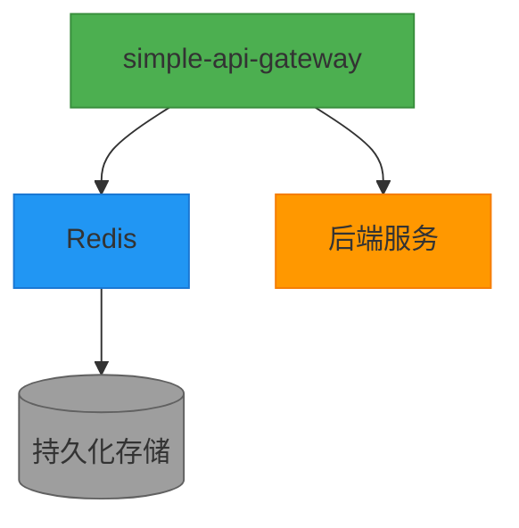
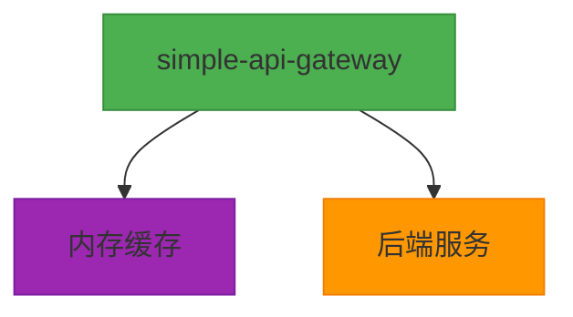

# 部署指南

<cite>
**本文档中引用的文件**  
- [Dockerfile](file://Dockerfile)
- [docker-compose-with-redis.yml](file://docker-compose-with-redis.yml)
- [docker-compose-without-redis.yml](file://docker-compose-without-redis.yml)
- [config-with-redis.toml](file://config-with-redis.toml)
- [config-without-redis.toml](file://config-without-redis.toml)
- [scripts/systemctl/simple-api-gateway@.service](file://scripts/systemctl/simple-api-gateway@.service)
- [scripts/post-install.sh](file://scripts/post-install.sh)
- [scripts/post-remove.sh](file://scripts/post-remove.sh)
- [DOCKER-README.md](file://DOCKER-README.md)
- [README.md](file://README.md)
</cite>

## 目录
1. [简介](#简介)
2. [Docker部署](#docker部署)
3. [systemd部署](#systemd部署)
4. [生产环境最佳实践](#生产环境最佳实践)
5. [部署验证流程](#部署验证流程)
6. [部署方式迁移路径](#部署方式迁移路径)

## 简介
Simple API Gateway 提供了多种部署方式，包括基于Docker的容器化部署和基于systemd的传统系统服务部署。本指南详细说明各种部署方式的配置、优化和管理方法，帮助用户根据实际需求选择合适的部署方案。

## Docker部署

### Dockerfile多阶段构建与镜像优化
项目当前的Dockerfile采用单阶段构建，基于轻量级的Alpine Linux镜像，确保最终镜像体积最小化。通过仅复制编译后的二进制文件和必要配置文件，实现了镜像的精简。

**镜像优化技巧包括**：
- 使用Alpine Linux作为基础镜像，减少基础系统开销
- 仅包含运行时必需的文件，移除编译工具链和源代码
- 使用小体积基础镜像，加快拉取和启动速度

**Section sources**
- [Dockerfile](file://Dockerfile#L1-L7)

### docker-compose部署说明
项目提供了两种docker-compose配置文件，分别支持Redis缓存和内存缓存模式。

#### with-redis部署模式


**适用场景**：
- 需要跨多个网关实例共享缓存
- 要求缓存数据持久化
- 高可用性要求的生产环境
- 缓存数据量较大的场景

**Diagram sources**
- [docker-compose-with-redis.yml](file://docker-compose-with-redis.yml#L1-L38)
- [config-with-redis.toml](file://config-with-redis.toml#L1-L31)

#### without-redis部署模式


**适用场景**：
- 单实例部署场景
- 对缓存持久化无要求
- 资源受限的开发或测试环境
- 缓存数据量较小且可丢失的场景

**Diagram sources**
- [docker-compose-without-redis.yml](file://docker-compose-without-redis.yml#L1-L17)
- [config-without-redis.toml](file://config-without-redis.toml#L1-L30)

### Docker运行命令
**启动Redis模式**：
```bash
docker-compose -f docker-compose-with-redis.yml up -d
```

**启动内存缓存模式**：
```bash
docker-compose -f docker-compose-without-redis.yml up -d
```

**停止服务**：
```bash
# Redis模式
docker-compose -f docker-compose-with-redis.yml down

# 内存缓存模式  
docker-compose -f docker-compose-without-redis.yml down
```

**Section sources**
- [docker-compose-with-redis.yml](file://docker-compose-with-redis.yml#L1-L38)
- [docker-compose-without-redis.yml](file://docker-compose-without-redis.yml#L1-L17)
- [DOCKER-README.md](file://DOCKER-README.md#L1-L65)

## systemd部署

### 服务文件配置
`simple-api-gateway@.service` 是一个模板服务文件，支持多实例部署。通过实例名称区分不同配置的网关实例。

```ini
[Unit]
Description=Simple API Gateway Service for %I
After=network-online.target
Wants=network-online.target

[Service]
Type=simple
ExecStart=/usr/bin/simple_api_gateway cron /etc/simple_api_gateway/%i.toml
Restart=on-failure
RestartSec=5s

[Install]
WantedBy=multi-user.target
```

**关键参数说明**：
- `Description`：服务描述，`%I` 会被实例名称替换
- `After` 和 `Wants`：确保网络就绪后再启动服务
- `ExecStart`：启动命令，`%i` 代表实例名称，对应配置文件名
- `Restart`：服务异常退出时自动重启
- `RestartSec`：重启前等待5秒

**Section sources**
- [scripts/systemctl/simple-api-gateway@.service](file://scripts/systemctl/simple-api-gateway@.service#L1-L13)

### 环境变量设置
服务通过配置文件而非环境变量进行配置。配置文件位于 `/etc/simple_api_gateway/` 目录下，日志文件位于 `/var/log/simple_api_gateway.log`。

### 日志管理
系统通过post-install.sh脚本自动创建日志目录，并配置日志文件路径。服务使用Zap日志库进行结构化日志记录，便于日志分析和监控。

```bash
# 查看服务日志
journalctl -u simple-api-gateway@config.service -f

# 查看日志文件
tail -f /var/log/simple-api-gateway.log
```

**Section sources**
- [scripts/post-install.sh](file://scripts/post-install.sh#L1-L8)
- [config-with-redis.toml](file://config-with-redis.toml#L3)
- [config-without-redis.toml](file://config-without-redis.toml#L3)

## 生产环境最佳实践

### 资源限制
在生产环境中，建议通过容器或systemd配置资源限制：

**Docker资源限制示例**：
```yaml
services:
  simple-api-gateway:
    # ...
    deploy:
      resources:
        limits:
          cpus: '1.0'
          memory: 512M
        reservations:
          cpus: '0.5'
          memory: 256M
```

**systemd资源限制**：
```ini
[Service]
# ...
MemoryLimit=512M
CPUQuota=100%
```

### 健康检查配置
**Docker健康检查**：
```yaml
services:
  simple-api-gateway:
    # ...
    healthcheck:
      test: ["CMD", "curl", "-f", "http://localhost:8080/health"]
      interval: 30s
      timeout: 10s
      retries: 3
      start_period: 40s
```

### 安全加固措施
1. **网络隔离**：使用专用网络，限制不必要的端口暴露
2. **配置文件权限**：确保配置文件权限为600，仅root可读写
3. **最小权限原则**：容器以非root用户运行
4. **定期更新**：及时更新基础镜像和依赖组件

**Section sources**
- [docker-compose-with-redis.yml](file://docker-compose-with-redis.yml#L1-L38)
- [scripts/systemctl/simple-api-gateway@.service](file://scripts/systemctl/simple-api-gateway@.service#L1-L13)

## 部署验证流程

### 部署前检查
```bash
# 验证配置文件
simple-api-gateway check /path/to/config.toml

# 生成默认配置
simple-api-gateway gen /etc/simple_api_gateway/config.toml
```

### 部署步骤
1. **准备配置文件**：选择合适的配置模板（with-redis或without-redis）
2. **部署服务**：根据选择的部署方式启动服务
3. **验证运行状态**：
   ```bash
   # Docker
   docker-compose ps
   
   # systemd
   systemctl status simple-api-gateway@config.service
   ```
4. **功能测试**：
   ```bash
   curl -v http://localhost:8080/api/health
   ```

### 验证要点
- 服务进程是否正常运行
- 端口是否成功监听
- 日志是否有错误信息
- 健康检查接口是否返回正常
- 缓存功能是否按预期工作

**Section sources**
- [cmd/check.go](file://cmd/check.go)
- [cmd/gen.go](file://cmd/gen.go)
- [cmd/serve.go](file://cmd/serve.go)

## 部署方式迁移路径

### Docker到systemd迁移
1. 停止Docker容器
2. 复制配置文件到 `/etc/simple_api_gateway/`
3. 安装二进制文件到 `/usr/bin/`
4. 复制服务文件到 `/etc/systemd/system/`
5. 启动systemd服务

### systemd到Docker迁移
1. 停止systemd服务
2. 准备docker-compose文件和配置文件
3. 启动Docker容器
4. 验证服务状态

### 配置迁移
两种部署方式使用相同的配置文件格式，可以直接复用配置文件。主要区别在于文件路径：
- Docker：配置文件挂载在容器内路径
- systemd：配置文件位于 `/etc/simple_api_gateway/`

**Section sources**
- [config-with-redis.toml](file://config-with-redis.toml)
- [config-without-redis.toml](file://config-without-redis.toml)
- [scripts/systemctl/simple-api-gateway@.service](file://scripts/systemctl/simple-api-gateway@.service)
- [docker-compose-with-redis.yml](file://docker-compose-with-redis.yml)
- [docker-compose-without-redis.yml](file://docker-compose-without-redis.yml)