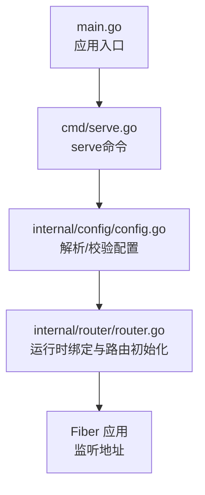
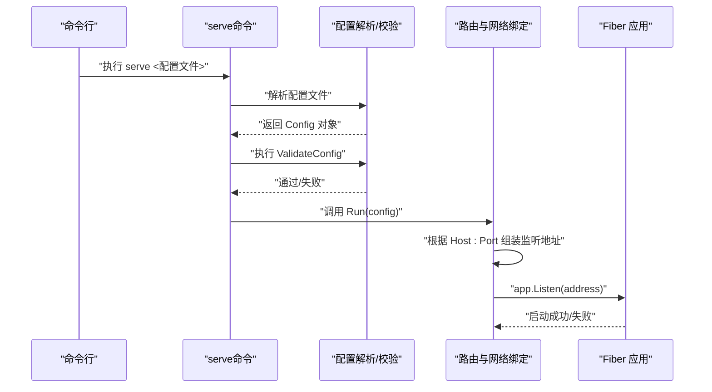
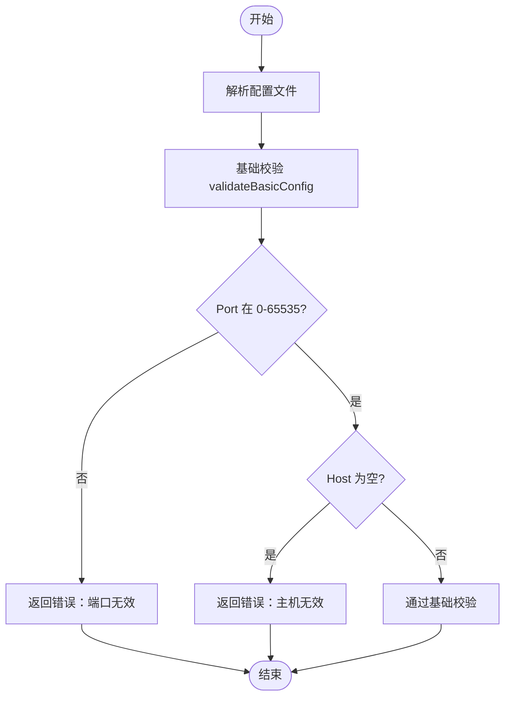
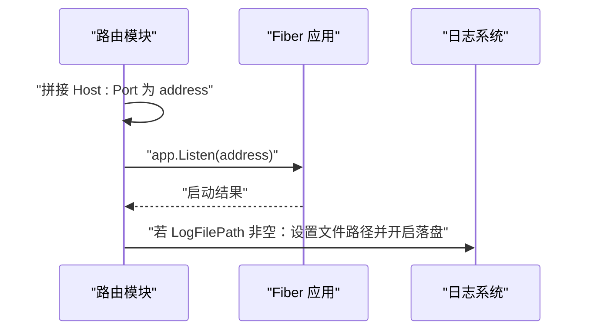
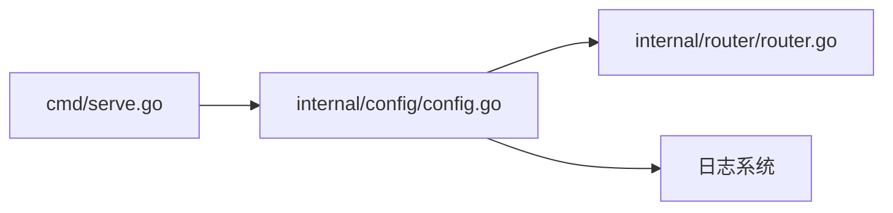

# 全局配置

<cite>
**本文引用的文件**
- [internal/config/config.go](file://internal/config/config.go)
- [cmd/serve.go](file://cmd/serve.go)
- [internal/router/router.go](file://internal/router/router.go)
- [config-with-redis.toml](file://config-with-redis.toml)
- [config-without-redis.toml](file://config-without-redis.toml)
- [example_config.toml](file://example_config.toml)
- [main.go](file://main.go)
</cite>

## 目录
1. [简介](#简介)
2. [项目结构](#项目结构)
3. [核心组件](#核心组件)
4. [架构总览](#架构总览)
5. [详细组件分析](#详细组件分析)
6. [依赖关系分析](#依赖关系分析)
7. [性能考量](#性能考量)
8. [故障排查指南](#故障排查指南)
9. [结论](#结论)
10. [附录](#附录)

## 简介
本文件聚焦于 simple_api_gateway 的全局配置，围绕 Config 结构体中的基础字段：Port、Host、LogFilePath 进行系统化说明。内容涵盖：
- 字段用途、数据类型、取值范围与配置约束
- 基于 config-with-redis.toml 与 config-without-redis.toml 的真实配置示例解读
- 配置对服务网络绑定与日志行为的影响
- 常见错误配置（端口冲突、无效主机）的排查方法
- validateBasicConfig 验证逻辑与配置正确性的重要性

## 项目结构
与全局配置直接相关的关键文件与职责如下：
- internal/config/config.go：定义 Config 结构体及解析、校验逻辑
- cmd/serve.go：命令入口，负责加载配置并启动服务
- internal/router/router.go：运行时根据配置进行网络绑定与路由初始化
- config-with-redis.toml / config-without-redis.toml / example_config.toml：示例配置文件
- main.go：应用入口，负责信号处理与日志生命周期

图表来源
- [main.go](file://main.go#L34-L49)
- [cmd/serve.go](file://cmd/serve.go#L10-L30)
- [internal/config/config.go](file://internal/config/config.go#L47-L104)
- [internal/router/router.go](file://internal/router/router.go#L446-L503)

章节来源
- [main.go](file://main.go#L34-L49)
- [cmd/serve.go](file://cmd/serve.go#L10-L30)
- [internal/config/config.go](file://internal/config/config.go#L47-L104)
- [internal/router/router.go](file://internal/router/router.go#L446-L503)

## 核心组件
本节对 Config 结构体的基础字段进行逐项说明，并给出取值范围与约束条件。

- 字段：Port
  - 类型：整数
  - 用途：指定服务监听的 TCP 端口号
  - 取值范围：0 到 65535（包含边界）
  - 约束：
    - 必须为非负整数且不超过 65535
    - 若超出范围，将触发基础校验失败
  - 影响：
    - 与 Host 组合形成监听地址，决定服务对外暴露的网络接口
    - 若端口被占用或权限不足，将导致启动失败

- 字段：Host
  - 类型：字符串
  - 用途：指定服务绑定的网络地址（主机名或 IP）
  - 取值范围：任意非空字符串
  - 约束：
    - 不允许为空字符串
    - 通常建议使用 0.0.0.0 或具体 IP 地址
  - 影响：
    - 与 Port 组合形成监听地址
    - 控制服务对内网或公网的可见性

- 字段：LogFilePath
  - 类型：字符串
  - 用途：指定日志输出到文件的路径
  - 取值范围：任意有效文件路径字符串
  - 约束：
    - 若为空则不启用文件落盘；若非空则会开启文件写入
    - 文件所在目录需存在且具备写权限
  - 影响：
    - 控制日志落盘行为与输出位置
    - 便于生产环境集中收集与轮转

章节来源
- [internal/config/config.go](file://internal/config/config.go#L21-L27)
- [internal/config/config.go](file://internal/config/config.go#L90-L104)
- [internal/config/config.go](file://internal/config/config.go#L47-L67)
- [internal/router/router.go](file://internal/router/router.go#L498-L503)

## 架构总览
下图展示了从命令行到服务启动的关键流程，以及配置如何影响网络绑定与日志行为。

图表来源
- [cmd/serve.go](file://cmd/serve.go#L16-L27)
- [internal/config/config.go](file://internal/config/config.go#L47-L104)
- [internal/router/router.go](file://internal/router/router.go#L498-L503)

## 详细组件分析

### 配置解析与基础校验
- 解析流程
  - 读取 TOML 配置文件并映射到 Config 结构体
  - 若 LogFilePath 非空，设置日志文件路径并开启文件写入
- 基础校验 validateBasicConfig
  - 校验 Port 范围（0-65535）
  - 校验 Host 非空
  - 任一不满足即返回错误

图表来源
- [internal/config/config.go](file://internal/config/config.go#L47-L67)
- [internal/config/config.go](file://internal/config/config.go#L90-L104)

章节来源
- [internal/config/config.go](file://internal/config/config.go#L47-L67)
- [internal/config/config.go](file://internal/config/config.go#L90-L104)

### 网络绑定与日志行为
- 网络绑定
  - 将 Host 与 Port 组合为 address 字符串
  - 交由 Fiber 应用监听该地址
- 日志行为
  - 若 LogFilePath 非空：设置日志文件路径并开启文件写入
  - 日志在应用生命周期内同步与关闭

图表来源
- [internal/router/router.go](file://internal/router/router.go#L498-L503)
- [internal/config/config.go](file://internal/config/config.go#L47-L67)
- [main.go](file://main.go#L21-L33)

章节来源
- [internal/router/router.go](file://internal/router/router.go#L498-L503)
- [internal/config/config.go](file://internal/config/config.go#L47-L67)
- [main.go](file://main.go#L21-L33)

### 配置示例与字段使用
以下示例均来自仓库提供的配置文件，展示 Port、Host、LogFilePath 的实际用法。

- 示例一：config-with-redis.toml
  - Port：8080
  - Host：0.0.0.0
  - LogFilePath：/var/log/simple-api-gateway.log
  - 说明：监听所有网络接口，启用文件日志

- 示例二：config-without-redis.toml
  - Port：8080
  - Host：0.0.0.0
  - LogFilePath：/var/log/simple-api-gateway.log
  - 说明：监听所有网络接口，启用文件日志（未使用 Redis）

- 示例三：example_config.toml
  - Port：8080
  - Host：0.0.0.0
  - LogFilePath：/var/log/simple-api-gateway.log
  - 说明：演示基础字段与路由配置

章节来源
- [config-with-redis.toml](file://config-with-redis.toml#L1-L3)
- [config-without-redis.toml](file://config-without-redis.toml#L1-L3)
- [example_config.toml](file://example_config.toml#L1-L3)

### 配置对服务行为的影响
- 端口与主机组合决定监听地址
  - 若 Host 为 0.0.0.0，服务对所有网络接口开放
  - 若 Host 为特定 IP，仅对该接口开放
- 端口冲突
  - 当端口已被占用或权限不足时，Fiber Listen 将失败
- 日志落盘
  - LogFilePath 非空时，日志写入指定文件；否则仅输出到标准输出

章节来源
- [internal/router/router.go](file://internal/router/router.go#L498-L503)
- [internal/config/config.go](file://internal/config/config.go#L47-L67)

## 依赖关系分析
- serve 命令依赖配置解析与校验
- 路由模块依赖配置中的 Host 与 Port 进行网络绑定
- 日志系统依赖配置中的 LogFilePath 进行文件落盘

图表来源
- [cmd/serve.go](file://cmd/serve.go#L16-L27)
- [internal/config/config.go](file://internal/config/config.go#L47-L104)
- [internal/router/router.go](file://internal/router/router.go#L498-L503)

章节来源
- [cmd/serve.go](file://cmd/serve.go#L16-L27)
- [internal/config/config.go](file://internal/config/config.go#L47-L104)
- [internal/router/router.go](file://internal/router/router.go#L498-L503)

## 性能考量
- 端口选择
  - 避免使用高占用端口或特权端口（1-1023），优先选择 1024+ 的可用端口
- 主机绑定
  - 仅绑定必要接口，减少不必要的网络暴露
- 日志落盘
  - 文件路径所在分区应具备足够空间与良好 I/O 性能
  - 生产环境建议配合日志轮转策略

## 故障排查指南
- 端口无效（超出范围）
  - 现象：基础校验失败
  - 排查：确认 Port 在 0-65535 之间
  - 参考：validateBasicConfig 对 Port 的校验逻辑

- 主机为空
  - 现象：基础校验失败
  - 排查：确保 Host 非空，建议使用 0.0.0.0 或具体 IP
  - 参考：validateBasicConfig 对 Host 的校验逻辑

- 端口冲突或权限不足
  - 现象：Fiber Listen 失败
  - 排查：更换端口、检查防火墙、确认进程权限、释放被占用端口
  - 参考：路由模块的网络绑定与启动流程

- 日志文件无法写入
  - 现象：日志未落盘或启动报错
  - 排查：确认 LogFilePath 所在目录存在且具备写权限；路径扩展名为 .log 或 .txt 等可写格式
  - 参考：配置解析中对 LogFilePath 的处理逻辑

- 配置正确性验证
  - 建议在启动前先执行配置校验，确保 Port、Host、LogFilePath 等基础字段符合要求
  - 参考：ValidateConfig 与 validateBasicConfig 的调用链

章节来源
- [internal/config/config.go](file://internal/config/config.go#L90-L104)
- [internal/config/config.go](file://internal/config/config.go#L47-L67)
- [internal/router/router.go](file://internal/router/router.go#L498-L503)

## 结论
- Port、Host、LogFilePath 是 simple_api_gateway 的基础配置字段，直接影响服务的网络绑定与日志行为
- 基础校验 validateBasicConfig 明确了 Port 的取值范围与 Host 的非空约束
- 实际部署中，应结合示例配置文件合理设置端口与主机，确保日志路径可写，避免端口冲突
- 通过 ValidateConfig 与 validateBasicConfig 的前置校验，可以显著降低启动失败与运行期异常的风险

## 附录
- 配置文件示例路径
  - [config-with-redis.toml](file://config-with-redis.toml#L1-L3)
  - [config-without-redis.toml](file://config-without-redis.toml#L1-L3)
  - [example_config.toml](file://example_config.toml#L1-L3)