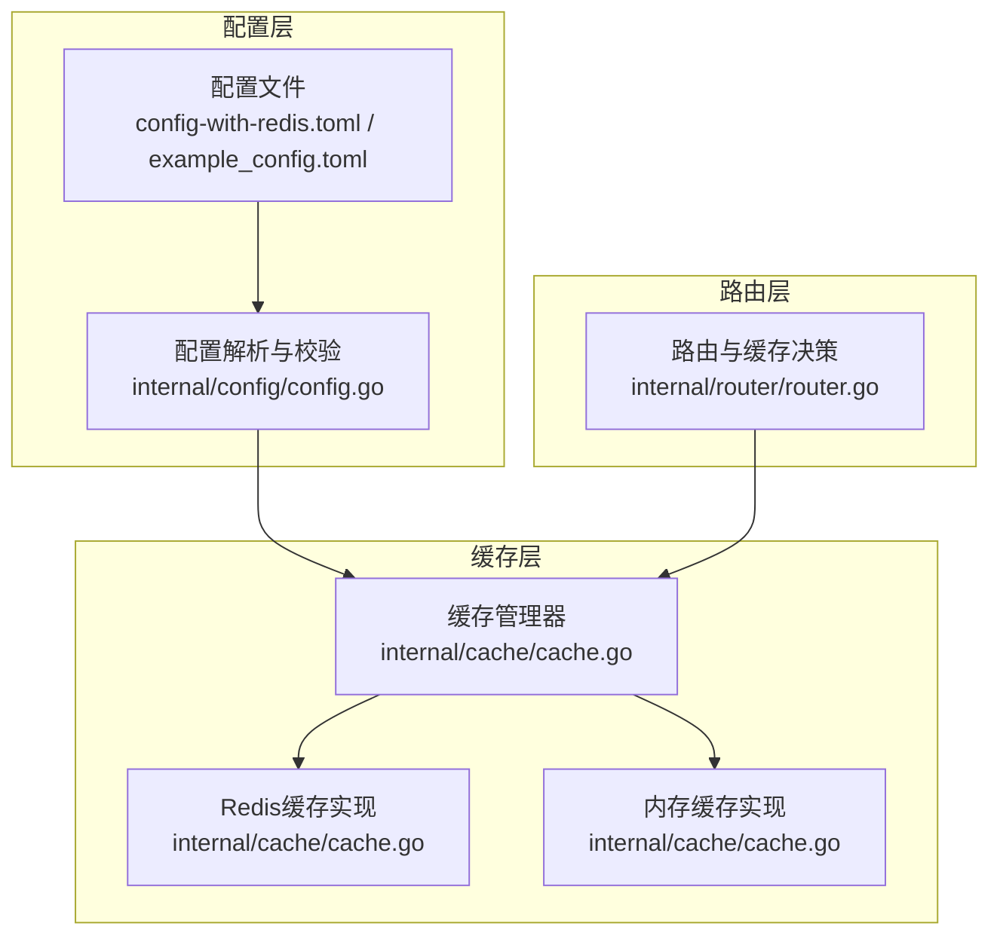
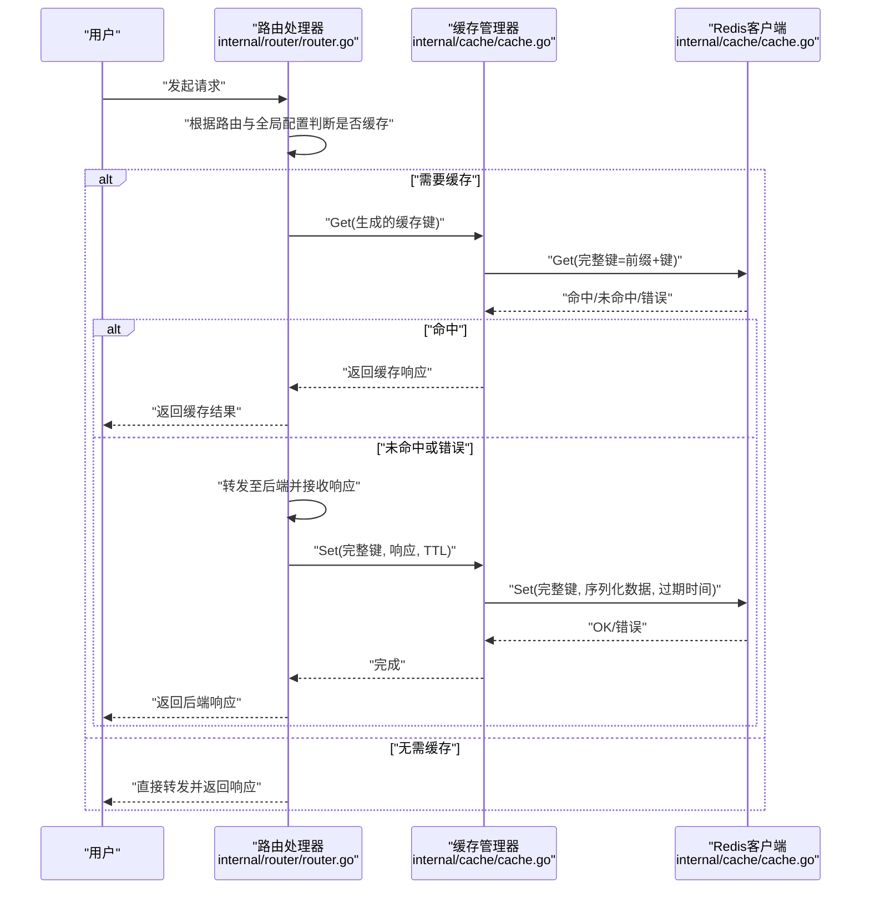
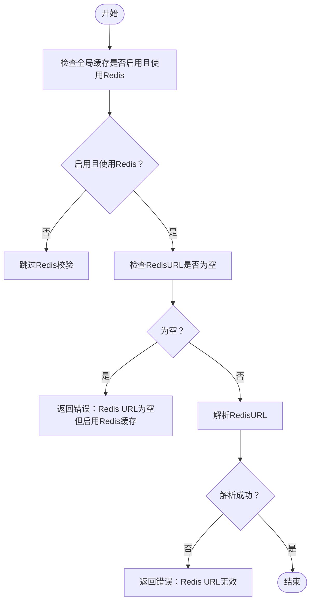
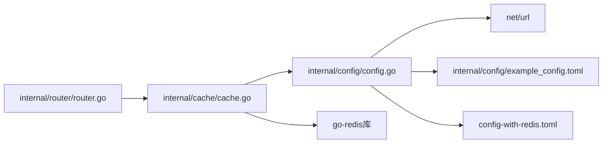

# Redis缓存配置

<cite>
**本文引用的文件**
- [config-with-redis.toml](file://config-with-redis.toml)
- [example_config.toml](file://internal/config/example_config.toml)
- [config.go](file://internal/config/config.go)
- [cache.go](file://internal/cache/cache.go)
- [router.go](file://internal/router/router.go)
- [README.md](file://README.md)
</cite>

## 目录
1. [简介](#简介)
2. [项目结构](#项目结构)
3. [核心组件](#核心组件)
4. [架构总览](#架构总览)
5. [详细组件分析](#详细组件分析)
6. [依赖关系分析](#依赖关系分析)
7. [性能考量](#性能考量)
8. [故障排查指南](#故障排查指南)
9. [结论](#结论)
10. [附录](#附录)

## 简介
本章节聚焦于Redis缓存专项配置参数，系统讲解以下关键点：
- RedisURL的标准格式与必填规则（UseRedis为true时必须提供有效URL）
- RedisDB用于选择Redis数据库编号的作用
- RedisPrefix用于缓存键命名空间隔离，避免键冲突
- 基于config-with-redis.toml的实际配置示例，展示完整Redis连接设置
- 连接字符串常见变体与最佳实践
- 基于validateCacheConfig中的URL解析逻辑，说明格式错误的诊断方法与修复建议

## 项目结构
围绕Redis缓存配置，涉及的关键文件与职责如下：
- 配置文件：config-with-redis.toml、internal/config/example_config.toml
- 配置解析与校验：internal/config/config.go
- 缓存实现与Redis集成：internal/cache/cache.go
- 请求路由与缓存决策：internal/router/router.go
- 文档与示例：README.md

图表来源
- [config-with-redis.toml](file://config-with-redis.toml#L5-L10)
- [example_config.toml](file://internal/config/example_config.toml#L5-L10)
- [config.go](file://internal/config/config.go#L29-L35)
- [cache.go](file://internal/cache/cache.go#L143-L287)
- [router.go](file://internal/router/router.go#L52-L110)

章节来源
- [config-with-redis.toml](file://config-with-redis.toml#L5-L10)
- [example_config.toml](file://internal/config/example_config.toml#L5-L10)
- [config.go](file://internal/config/config.go#L29-L35)
- [cache.go](file://internal/cache/cache.go#L143-L287)
- [router.go](file://internal/router/router.go#L52-L110)

## 核心组件
- 配置结构中的缓存子结构包含三个与Redis直接相关的字段：
  - RedisURL：Redis连接URL
  - RedisDB：Redis数据库编号
  - RedisPrefix：Redis键前缀（命名空间隔离）

- 配置校验逻辑：
  - 当全局缓存启用且使用Redis时，RedisURL必须非空
  - RedisURL需通过URL解析校验

- Redis连接建立与使用：
  - 使用Redis库提供的URL解析函数解析RedisURL
  - 设置目标数据库编号
  - Ping测试连接
  - 所有键操作均在Get/Set/Delete前加上RedisPrefix形成完整键

章节来源
- [config.go](file://internal/config/config.go#L29-L35)
- [config.go](file://internal/config/config.go#L106-L124)
- [cache.go](file://internal/cache/cache.go#L151-L176)
- [cache.go](file://internal/cache/cache.go#L178-L244)

## 架构总览
Redis缓存配置在系统中的位置与交互如下：

图表来源
- [router.go](file://internal/router/router.go#L273-L416)
- [cache.go](file://internal/cache/cache.go#L252-L328)
- [cache.go](file://internal/cache/cache.go#L178-L244)

## 详细组件分析

### RedisURL：标准格式与必填性
- 标准格式
  - 使用redis://协议前缀，后跟主机与端口，例如redis://host:port
  - 在示例配置中可见redis://localhost:6379与redis://redis:6379
- 必填性
  - 当UseRedis为true且全局缓存启用时，RedisURL必须非空
  - 配置校验阶段会对RedisURL进行URL解析，若解析失败则报错
- 常见变体与最佳实践
  - 带密码认证的URL：redis://:password@host:port/db
  - 带数据库编号的URL：redis://host:port/0
  - 建议将密码置于URL中时使用安全传输（如TLS/加密网络），并在生产环境中通过环境变量注入敏感信息
  - 建议为不同环境或业务线使用不同的RedisDB或RedisPrefix，避免键冲突
- 诊断与修复
  - 若出现“Redis URL is not valid”错误，检查URL格式是否正确、协议前缀是否为redis://、主机与端口是否可达
  - 若出现“Redis URL is empty but Redis cache is enabled”，请在配置中填写有效的RedisURL

章节来源
- [config-with-redis.toml](file://config-with-redis.toml#L8-L8)
- [example_config.toml](file://internal/config/example_config.toml#L8-L8)
- [config.go](file://internal/config/config.go#L106-L124)

### RedisDB：数据库编号的选择
- 作用
  - 通过opts.DB设置目标Redis数据库编号
  - 与RedisPrefix共同实现命名空间隔离，避免不同业务共享同一DB时的键冲突
- 使用建议
  - 生产环境建议为不同租户、环境或业务线分配独立DB
  - 若DB数量有限，优先使用RedisPrefix进行更细粒度的隔离

章节来源
- [cache.go](file://internal/cache/cache.go#L151-L176)

### RedisPrefix：命名空间隔离与键冲突避免
- 作用
  - 在Get/Set/Delete操作前，将RedisPrefix与原始键拼接形成完整键
  - 通过前缀实现不同模块、环境或租户之间的键隔离
- 使用建议
  - 建议采用“业务域:环境:”形式的前缀，例如api_gateway:prod:
  - 与RedisDB配合使用，进一步降低冲突概率
- 影响范围
  - Get/Set/Delete三类操作均受此前缀影响，确保读写一致性

章节来源
- [cache.go](file://internal/cache/cache.go#L178-L244)

### 完整Redis连接设置示例
- 示例配置片段（来自config-with-redis.toml与internal/config/example_config.toml）
  - [cache]段落包含enabled、use_redis、redis_url、redis_db、redis_prefix等字段
  - 全局启用缓存且使用Redis时，RedisURL必填且需通过URL解析校验
- 实际使用流程
  - 配置文件加载与解析
  - ValidateConfig执行缓存配置校验
  - NewCacheManager根据UseRedis创建RedisCache或回退到MemoryCache
  - RedisCache初始化时解析URL、设置DB、Ping连通性测试
  - 路由层在命中条件满足时调用缓存管理器进行读写

章节来源
- [config-with-redis.toml](file://config-with-redis.toml#L5-L10)
- [example_config.toml](file://internal/config/example_config.toml#L5-L10)
- [config.go](file://internal/config/config.go#L69-L88)
- [config.go](file://internal/config/config.go#L106-L124)
- [cache.go](file://internal/cache/cache.go#L252-L287)
- [cache.go](file://internal/cache/cache.go#L151-L176)

### URL解析与错误诊断流程

图表来源
- [config.go](file://internal/config/config.go#L106-L124)

章节来源
- [config.go](file://internal/config/config.go#L106-L124)

## 依赖关系分析
- 配置层依赖net/url进行URL解析
- 缓存层依赖go-redis库进行连接与操作
- 路由层依赖缓存管理器进行读写决策
- 文档层提供示例配置与使用说明

图表来源
- [config.go](file://internal/config/config.go#L1-L20)
- [cache.go](file://internal/cache/cache.go#L1-L20)
- [router.go](file://internal/router/router.go#L1-L40)

章节来源
- [config.go](file://internal/config/config.go#L1-L20)
- [cache.go](file://internal/cache/cache.go#L1-L20)
- [router.go](file://internal/router/router.go#L1-L40)

## 性能考量
- Redis连接池与Ping测试
  - 初始化Redis客户端后执行Ping测试，确保连接可用
  - 建议在高并发场景下合理设置连接池大小与超时参数（可在应用启动时通过Redis选项配置）
- 键前缀与TTL
  - 使用RedisPrefix减少键冲突，提升检索效率
  - TTL设置直接影响缓存命中率与内存占用，建议结合业务特征进行调优
- 失败回退
  - Redis连接失败时自动降级为内存缓存，保障服务连续性

章节来源
- [cache.go](file://internal/cache/cache.go#L151-L176)
- [cache.go](file://internal/cache/cache.go#L252-L287)

## 故障排查指南
- 常见错误与修复
  - “Redis URL is empty but Redis cache is enabled”
    - 现象：UseRedis为true且全局缓存启用，但RedisURL为空
    - 修复：在配置文件中填写有效的RedisURL（如redis://host:port）
  - “Redis URL is not valid”
    - 现象：RedisURL无法通过URL解析
    - 修复：检查协议前缀、主机名、端口、路径与认证信息是否正确；必要时使用带密码的URL格式
- 连接问题定位
  - 使用Redis客户端Ping测试确认连通性
  - 检查网络策略、防火墙与容器编排环境中的服务发现
- 命名空间冲突
  - 若出现键覆盖或误命中，检查RedisPrefix是否唯一；必要时增加环境标识或业务域前缀

章节来源
- [config.go](file://internal/config/config.go#L106-L124)
- [cache.go](file://internal/cache/cache.go#L151-L176)

## 结论
- RedisURL、RedisDB与RedisPrefix是Redis缓存配置的核心要素
- RedisURL在UseRedis为true时必须提供且格式有效
- RedisDB与RedisPrefix共同实现数据库级与键级的命名空间隔离
- 基于配置校验与URL解析逻辑，可快速定位并修复格式错误
- 通过合理的前缀设计与TTL策略，可在保证性能的同时避免键冲突

## 附录
- 配置示例参考
  - 全局缓存配置示例（包含Redis相关字段）
  - 使用Redis的完整配置示例
- 最佳实践清单
  - 使用稳定的RedisURL格式
  - 为不同环境/租户设置独立的RedisDB或RedisPrefix
  - 在生产环境谨慎处理密码与敏感信息
  - 对Redis连接进行健康检查与监控

章节来源
- [README.md](file://README.md#L296-L314)
- [README.md](file://README.md#L210-L243)
- [config-with-redis.toml](file://config-with-redis.toml#L5-L10)
- [example_config.toml](file://internal/config/example_config.toml#L5-L10)