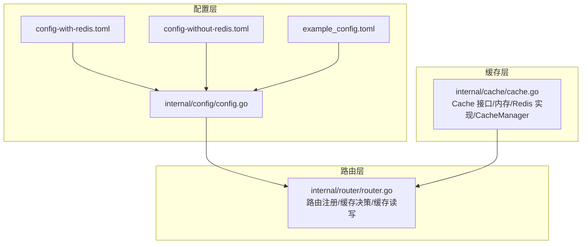
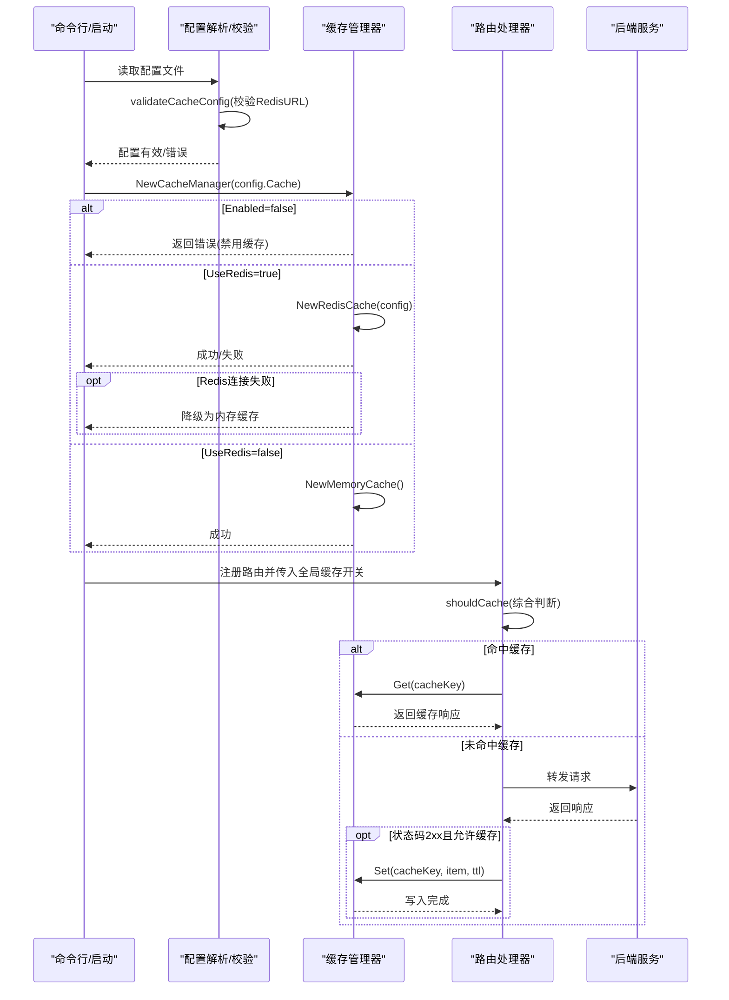
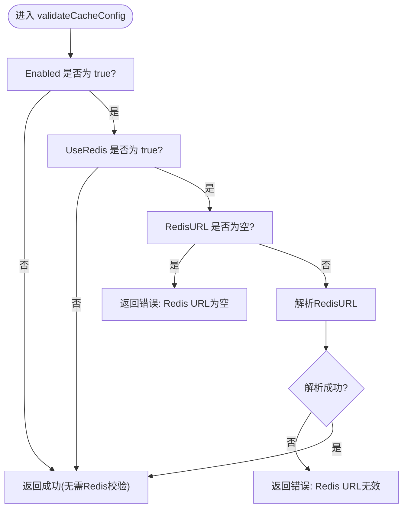
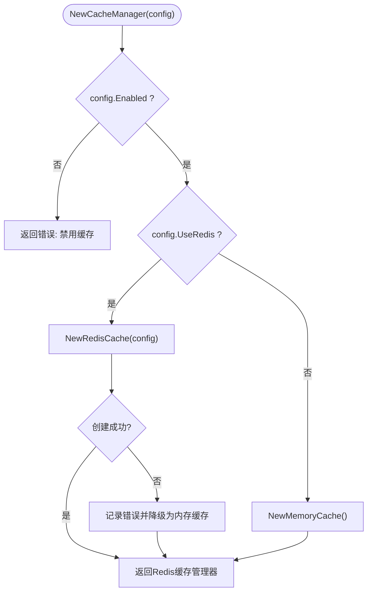
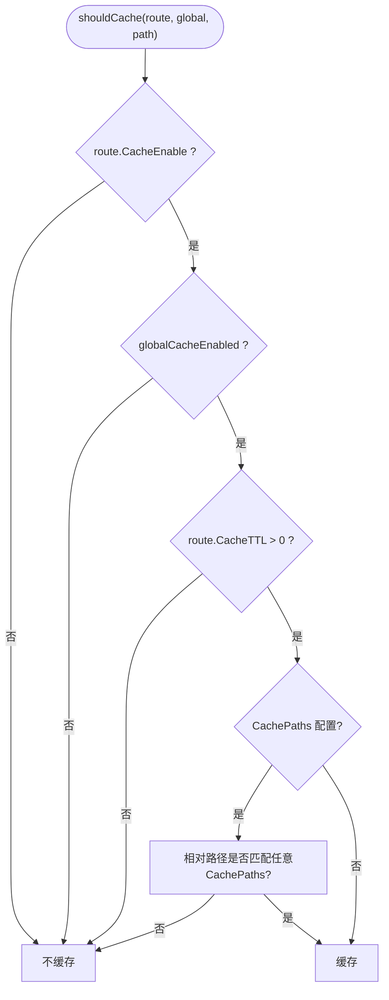
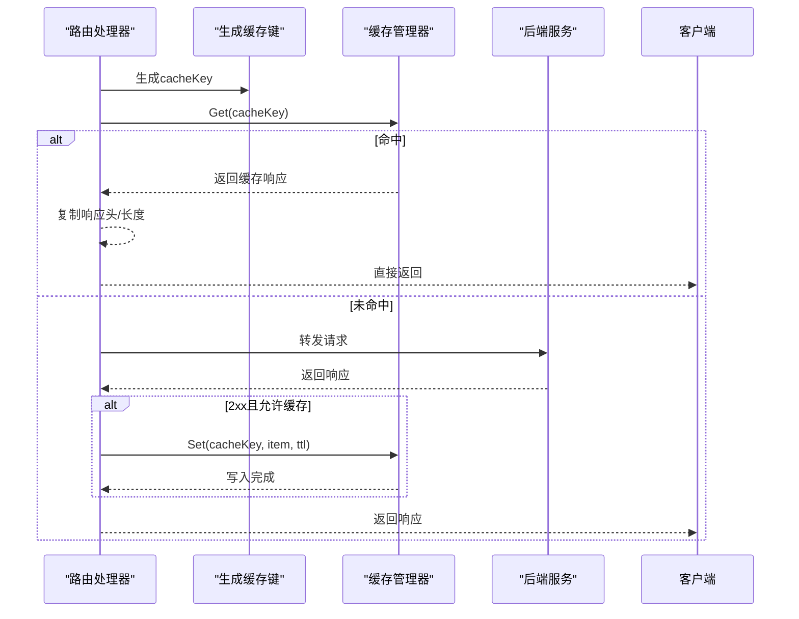
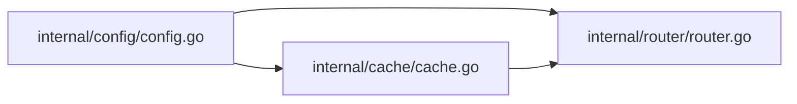

# 缓存启用策略

<cite>
**本文引用的文件**
- [internal/cache/cache.go](file://internal/cache/cache.go)
- [internal/config/config.go](file://internal/config/config.go)
- [internal/router/router.go](file://internal/router/router.go)
- [config-with-redis.toml](file://config-with-redis.toml)
- [config-without-redis.toml](file://config-without-redis.toml)
- [example_config.toml](file://example_config.toml)
- [README.md](file://README.md)
</cite>

## 目录
1. [简介](#简介)
2. [项目结构](#项目结构)
3. [核心组件](#核心组件)
4. [架构总览](#架构总览)
5. [详细组件分析](#详细组件分析)
6. [依赖关系分析](#依赖关系分析)
7. [性能考量](#性能考量)
8. [故障排查指南](#故障排查指南)
9. [结论](#结论)
10. [附录](#附录)

## 简介
本文件围绕缓存启用机制展开，重点解析 Cache 结构体中 Enabled 与 UseRedis 字段的协同逻辑，阐明当 Enabled 为 true 且 UseRedis 为 true 时必须提供有效 RedisURL 的强制要求，并结合 validateCacheConfig 函数的实现展示配置验证流程。同时对比 config-with-redis.toml 与 config-without-redis.toml 中缓存配置的差异，解释如何通过设置 UseRedis 为 false 来切换至内存缓存模式；提供启用/禁用缓存的不同场景示例；列出常见配置错误及解决方案；说明全局缓存开关对各路由 CacheEnable 字段的默认影响。

## 项目结构
本项目采用分层与按功能模块组织的结构：
- internal/config：负责配置解析与校验，包含 Cache 结构体与配置验证函数
- internal/cache：实现缓存接口与具体实现（内存缓存、Redis 缓存），以及缓存管理器
- internal/router：路由注册与请求处理，包含缓存决策逻辑与缓存读写调用
- 配置样例：config-with-redis.toml 与 config-without-redis.toml 展示不同缓存模式

图表来源
- [internal/config/config.go](file://internal/config/config.go#L1-L124)
- [internal/cache/cache.go](file://internal/cache/cache.go#L1-L120)
- [internal/router/router.go](file://internal/router/router.go#L445-L503)
- [config-with-redis.toml](file://config-with-redis.toml#L1-L31)
- [config-without-redis.toml](file://config-without-redis.toml#L1-L30)
- [example_config.toml](file://example_config.toml#L1-L45)

章节来源
- [internal/config/config.go](file://internal/config/config.go#L1-L124)
- [internal/cache/cache.go](file://internal/cache/cache.go#L1-L120)
- [internal/router/router.go](file://internal/router/router.go#L445-L503)
- [config-with-redis.toml](file://config-with-redis.toml#L1-L31)
- [config-without-redis.toml](file://config-without-redis.toml#L1-L30)
- [example_config.toml](file://example_config.toml#L1-L45)

## 核心组件
- Cache 结构体：包含 Enabled、UseRedis、RedisURL、RedisDB、RedisPrefix 等字段，用于控制缓存启用与后端类型
- 配置验证函数 validateCacheConfig：在全局启用且选择 Redis 模式时，强制要求提供有效的 RedisURL
- 缓存管理器 NewCacheManager：根据配置选择 Redis 或内存缓存；若 Redis 初始化失败则自动降级为内存缓存
- 路由层 shouldCache：综合全局缓存开关、路由 CacheEnable、CacheTTL、CachePaths 等因素决定是否缓存
- 缓存读写：在路由处理链路中，先尝试从缓存命中，否则转发后端并按条件写入缓存

章节来源
- [internal/config/config.go](file://internal/config/config.go#L21-L46)
- [internal/config/config.go](file://internal/config/config.go#L106-L124)
- [internal/cache/cache.go](file://internal/cache/cache.go#L252-L287)
- [internal/router/router.go](file://internal/router/router.go#L52-L110)
- [internal/router/router.go](file://internal/router/router.go#L271-L340)
- [internal/router/router.go](file://internal/router/router.go#L356-L443)

## 架构总览
下图展示了从配置到路由处理再到缓存读写的完整流程，突出 Enabled 与 UseRedis 的协同作用以及 validateCacheConfig 的前置校验。

图表来源
- [internal/config/config.go](file://internal/config/config.go#L69-L124)
- [internal/cache/cache.go](file://internal/cache/cache.go#L259-L287)
- [internal/router/router.go](file://internal/router/router.go#L445-L503)
- [internal/router/router.go](file://internal/router/router.go#L52-L110)
- [internal/router/router.go](file://internal/router/router.go#L356-L443)

## 详细组件分析

### Cache 结构体与字段语义
- Enabled：全局缓存开关。当为 false 时，NewCacheManager 直接返回错误，路由层不会启用缓存
- UseRedis：缓存后端选择。true 时优先使用 Redis；false 时使用内存缓存
- RedisURL/RedisDB/RedisPrefix：Redis 连接与键前缀配置

章节来源
- [internal/config/config.go](file://internal/config/config.go#L21-L46)

### 配置验证流程：validateCacheConfig
- 当 Enabled 为 true 且 UseRedis 为 true 时，必须满足：
  - RedisURL 非空
  - RedisURL 可被正确解析为合法 URL
- 若上述任一条件不满足，validateCacheConfig 返回错误，阻止后续初始化

图表来源
- [internal/config/config.go](file://internal/config/config.go#L106-L124)

章节来源
- [internal/config/config.go](file://internal/config/config.go#L106-L124)

### 缓存管理器：NewCacheManager 的协同逻辑
- 全局禁用：Enabled=false 时直接返回错误，路由层不会启用缓存
- 启用且 UseRedis=true：尝试创建 Redis 缓存；失败则记录错误并自动降级为内存缓存
- 启用且 UseRedis=false：直接创建内存缓存

图表来源
- [internal/cache/cache.go](file://internal/cache/cache.go#L259-L287)

章节来源
- [internal/cache/cache.go](file://internal/cache/cache.go#L259-L287)

### 路由层缓存决策：shouldCache
- 路由显式禁用：CacheEnable=false 则不缓存
- 全局禁用：globalCacheEnabled=false 则不缓存
- TTL 限制：CacheTTL<=0 则不缓存
- 路径白名单：若配置了 CachePaths，仅匹配相对路径才缓存；否则全路径缓存

图表来源
- [internal/router/router.go](file://internal/router/router.go#L52-L110)

章节来源
- [internal/router/router.go](file://internal/router/router.go#L52-L110)

### 缓存读写：路由处理链路
- 生成缓存键：基于请求方法、路径、查询参数与请求体
- 命中缓存：直接返回缓存响应并复制响应头
- 未命中缓存：转发后端，成功响应（2xx）且允许缓存时写入缓存

图表来源
- [internal/router/router.go](file://internal/router/router.go#L356-L443)
- [internal/cache/cache.go](file://internal/cache/cache.go#L330-L369)

章节来源
- [internal/router/router.go](file://internal/router/router.go#L356-L443)
- [internal/cache/cache.go](file://internal/cache/cache.go#L330-L369)

### 配置文件对比：Redis 与内存缓存
- config-with-redis.toml
  - cache.enabled = true
  - cache.use_redis = true
  - cache.redis_url = "redis://redis:6379"
  - 适合生产环境或需要跨进程共享缓存的场景
- config-without-redis.toml
  - cache.enabled = true
  - cache.use_redis = false
  - cache.redis_url = ""
  - 适合单实例部署或快速测试场景

章节来源
- [config-with-redis.toml](file://config-with-redis.toml#L1-L31)
- [config-without-redis.toml](file://config-without-redis.toml#L1-L30)

### 全局缓存开关对路由 CacheEnable 的默认影响
- README 中明确指出：若全局禁用缓存（cache.enabled = false），则所有路由都不会被缓存
- 路由层 shouldCache 会先检查 globalCacheEnabled，再检查 route.CacheEnable
- 因此，即使某路由设置了 cache_enable = true，只要全局禁用，也不会缓存

章节来源
- [README.md](file://README.md#L343-L360)
- [internal/router/router.go](file://internal/router/router.go#L52-L110)

## 依赖关系分析
- internal/config/config.go
  - 定义 Cache 结构体与配置验证函数 validateCacheConfig
  - 依赖 toml 解码与 URL 校验
- internal/cache/cache.go
  - 定义 Cache 接口、内存/Redis 实现、CacheManager
  - 依赖 go-redis/redis/v8 进行 Redis 连接与校验
- internal/router/router.go
  - 依赖 config 与 cache，在路由处理中执行 shouldCache 与缓存读写
  - 依赖 fiber 进行请求处理与响应返回

图表来源
- [internal/config/config.go](file://internal/config/config.go#L1-L124)
- [internal/cache/cache.go](file://internal/cache/cache.go#L1-L120)
- [internal/router/router.go](file://internal/router/router.go#L1-L120)

章节来源
- [internal/config/config.go](file://internal/config/config.go#L1-L124)
- [internal/cache/cache.go](file://internal/cache/cache.go#L1-L120)
- [internal/router/router.go](file://internal/router/router.go#L1-L120)

## 性能考量
- Redis 模式：跨进程共享缓存，命中率高，适合高并发场景
- 内存模式：本地进程内缓存，延迟更低，适合单实例部署
- 自动降级：Redis 初始化失败时自动回退内存缓存，保证可用性
- 路由层缓存决策：通过 TTL 与路径白名单减少不必要的缓存写入

章节来源
- [internal/cache/cache.go](file://internal/cache/cache.go#L259-L287)
- [internal/router/router.go](file://internal/router/router.go#L52-L110)
- [README.md](file://README.md#L343-L360)

## 故障排查指南
- 常见错误与解决
  - 仅启用缓存但未指定 Redis 连接信息
    - 现象：validateCacheConfig 报错，提示 Redis URL 为空
    - 解决：在 config-with-redis.toml 中填写有效的 redis_url
  - Redis URL 无效
    - 现象：validateCacheConfig 报错，提示 Redis URL 无效
    - 解决：修正为合法的 redis:// 或其他支持的 URL 格式
  - Redis 连接失败
    - 现象：NewRedisCache 失败，NewCacheManager 自动降级为内存缓存
    - 解决：检查 Redis 服务可达性、网络与认证配置
  - 全局禁用缓存导致路由不缓存
    - 现象：即使路由开启 cache_enable，也不会缓存
    - 解决：将 config 中 cache.enabled 设置为 true
  - 路由 TTL 为 0 导致不缓存
    - 现象：shouldCache 返回 false
    - 解决：将 route.cache_ttl 设置为正数

章节来源
- [internal/config/config.go](file://internal/config/config.go#L106-L124)
- [internal/cache/cache.go](file://internal/cache/cache.go#L259-L287)
- [internal/router/router.go](file://internal/router/router.go#L52-L110)

## 结论
- Enabled 与 UseRedis 协同决定了缓存后端类型与初始化路径
- validateCacheConfig 在启用 Redis 模式时强制要求提供有效 RedisURL
- NewCacheManager 在 Redis 初始化失败时自动降级为内存缓存，提升可用性
- 路由层 shouldCache 综合全局开关、路由开关、TTL 与路径白名单，确保缓存策略可控
- 通过合理配置 RedisURL 与 TTL，可在性能与一致性之间取得平衡

## 附录

### 配置示例与最佳实践
- 启用 Redis 缓存（生产推荐）
  - 参考：config-with-redis.toml
  - 关键点：enabled=true、use_redis=true、redis_url 指向可用 Redis
- 启用内存缓存（单实例/测试）
  - 参考：config-without-redis.toml
  - 关键点：enabled=true、use_redis=false、redis_url 留空
- 禁用缓存（调试/开发）
  - 参考：example_config.toml 中部分路由 cache_enable=false 或 cache_ttl=0
  - 关键点：全局禁用或路由禁用均生效

章节来源
- [config-with-redis.toml](file://config-with-redis.toml#L1-L31)
- [config-without-redis.toml](file://config-without-redis.toml#L1-L30)
- [example_config.toml](file://example_config.toml#L1-L45)