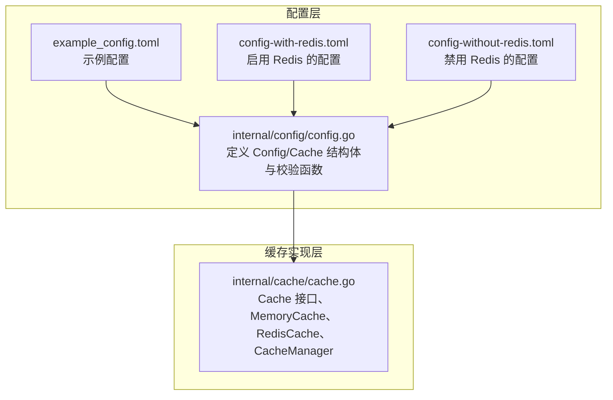
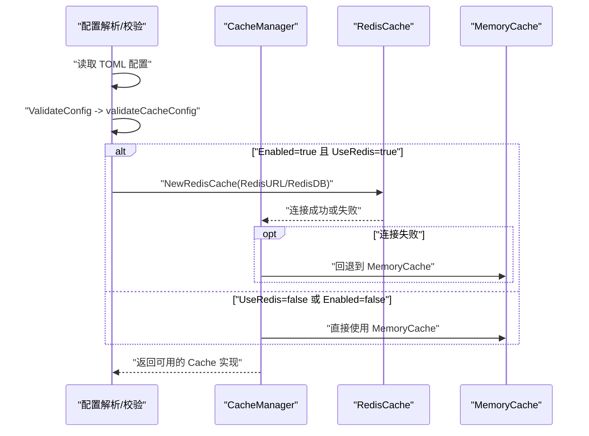
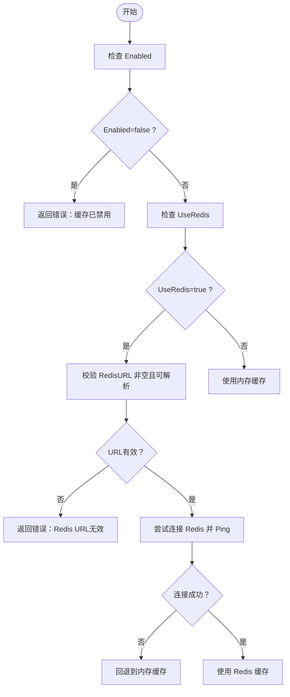
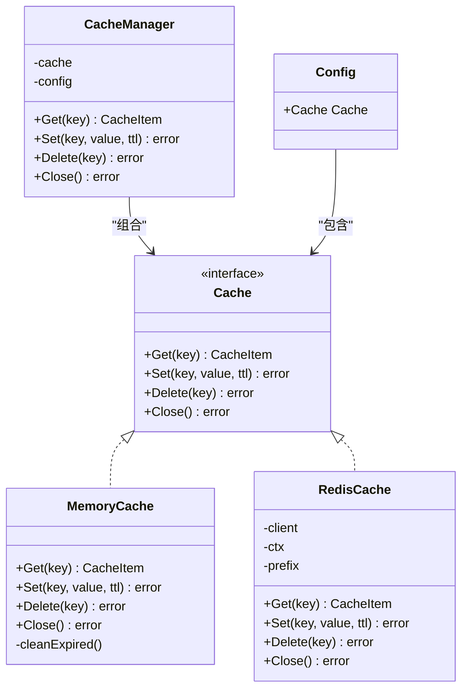
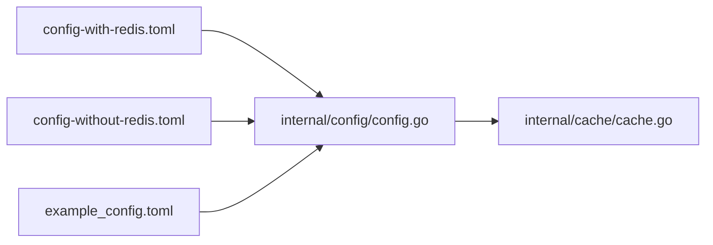

# 缓存配置

<cite>
**本文引用的文件**
- [internal/cache/cache.go](file://internal/cache/cache.go)
- [internal/config/config.go](file://internal/config/config.go)
- [config-with-redis.toml](file://config-with-redis.toml)
- [config-without-redis.toml](file://config-without-redis.toml)
- [example_config.toml](file://example_config.toml)
</cite>

## 目录
1. [简介](#简介)
2. [项目结构](#项目结构)
3. [核心组件](#核心组件)
4. [架构总览](#架构总览)
5. [详细组件分析](#详细组件分析)
6. [依赖关系分析](#依赖关系分析)
7. [性能考虑](#性能考虑)
8. [故障排查指南](#故障排查指南)
9. [结论](#结论)
10. [附录](#附录)

## 简介
本文件围绕缓存子系统的配置与行为进行深入说明，重点覆盖以下主题：
- Cache 结构体的字段含义与用途：Enabled、UseRedis、RedisURL、RedisDB、RedisPrefix
- 启用缓存的条件逻辑：当 Enabled 为 true 且 UseRedis 为 true 时，必须提供有效的 RedisURL
- 对比 config-with-redis.toml 与 config-without-redis.toml 的缓存配置差异，解释如何在 Redis 与内存缓存之间切换
- Redis 连接字符串的格式规范以及 RedisPrefix 在键命名空间隔离中的作用
- 基于 validateCacheConfig 函数的配置验证规则与常见错误场景
- 性能调优建议：Redis 数据库编号选择与前缀策略

## 项目结构
缓存相关的核心代码位于 internal/cache 子目录，配置模型与校验位于 internal/config 子目录；示例配置文件位于仓库根目录。

图表来源
- [internal/config/config.go](file://internal/config/config.go#L21-L46)
- [internal/cache/cache.go](file://internal/cache/cache.go#L19-L369)
- [config-with-redis.toml](file://config-with-redis.toml#L1-L31)
- [config-without-redis.toml](file://config-without-redis.toml#L1-L30)
- [example_config.toml](file://example_config.toml#L1-L45)

章节来源
- [internal/config/config.go](file://internal/config/config.go#L21-L46)
- [internal/cache/cache.go](file://internal/cache/cache.go#L19-L369)
- [config-with-redis.toml](file://config-with-redis.toml#L1-L31)
- [config-without-redis.toml](file://config-without-redis.toml#L1-L30)
- [example_config.toml](file://example_config.toml#L1-L45)

## 核心组件
- Cache 结构体：用于承载缓存相关的配置项，包括是否启用、是否使用 Redis、Redis 连接串、数据库编号、键前缀等。
- Cache 接口：抽象缓存操作（Get/Set/Delete/Close）。
- MemoryCache：基于内存的缓存实现，包含过期清理机制。
- RedisCache：基于 Redis 的缓存实现，支持键前缀、TTL 设置与连接测试。
- CacheManager：根据配置动态选择具体缓存实现（优先 Redis，失败则回退内存缓存），并提供统一的对外接口。

章节来源
- [internal/config/config.go](file://internal/config/config.go#L29-L35)
- [internal/cache/cache.go](file://internal/cache/cache.go#L19-L369)

## 架构总览
下图展示了配置解析、校验与缓存初始化的整体流程，以及 Redis 与内存缓存在运行时的选择逻辑。

图表来源
- [internal/config/config.go](file://internal/config/config.go#L69-L124)
- [internal/cache/cache.go](file://internal/cache/cache.go#L252-L287)

## 详细组件分析

### Cache 结构体字段详解
- Enabled（布尔）：控制是否启用缓存功能。若为 false，则缓存管理器将直接返回错误，不会创建任何缓存实例。
- UseRedis（布尔）：控制是否使用 Redis 作为缓存后端。为 true 时，需要提供有效的 RedisURL；否则将使用内存缓存。
- RedisURL（字符串）：Redis 连接字符串，需符合标准 URL 格式。当 UseRedis 为 true 且 Enabled 也为 true 时，该字段不能为空。
- RedisDB（整数）：Redis 数据库编号。在创建 Redis 客户端时会应用该编号。
- RedisPrefix（字符串）：Redis 键前缀。所有键操作都会在实际键名前加上该前缀，用于命名空间隔离与多环境共存。

章节来源
- [internal/config/config.go](file://internal/config/config.go#L29-L35)

### 启用缓存的条件逻辑
- 当 Enabled 为 false 时，缓存管理器直接报错并拒绝创建缓存实例。
- 当 Enabled 为 true 且 UseRedis 为 true 时：
  - 必须提供非空且可解析的 RedisURL；
  - 初始化 Redis 客户端并执行 Ping 测试，失败则回退到内存缓存。
- 当 UseRedis 为 false 或 Enabled 为 false 时，使用内存缓存。

图表来源
- [internal/config/config.go](file://internal/config/config.go#L106-L124)
- [internal/cache/cache.go](file://internal/cache/cache.go#L259-L287)

章节来源
- [internal/config/config.go](file://internal/config/config.go#L106-L124)
- [internal/cache/cache.go](file://internal/cache/cache.go#L259-L287)

### Redis 连接字符串格式规范
- RedisURL 必须是一个可解析的标准 URL 字符串，内部通过解析函数进行校验。
- 在 RedisCache 初始化过程中，会将 RedisURL 解析为连接选项，并将 RedisDB 应用到客户端。
- 连接建立后会执行 Ping 测试，确保可用性。

章节来源
- [internal/cache/cache.go](file://internal/cache/cache.go#L153-L176)
- [internal/config/config.go](file://internal/config/config.go#L116-L120)

### RedisPrefix 的键命名空间隔离作用
- 所有键操作（Get/Set/Delete）都会在键名前拼接 RedisPrefix，形成完整键名。
- 通过前缀可以实现：
  - 多环境隔离（开发/测试/生产使用不同前缀）
  - 多实例隔离（同一数据库内多实例共享）
  - 方便清理与审计（统一前缀便于批量操作）

章节来源
- [internal/cache/cache.go](file://internal/cache/cache.go#L180-L244)

### 在 Redis 与内存缓存之间切换
- 切换依据：UseRedis 字段。
- 切换行为：
  - UseRedis=true：优先尝试 Redis；失败则自动回退到内存缓存。
  - UseRedis=false：直接使用内存缓存。
- 配置示例差异：
  - 启用 Redis：UseRedis=true，RedisURL 为有效 URL，RedisDB 为整数，RedisPrefix 为字符串。
  - 禁用 Redis：UseRedis=false，RedisURL 可为空，RedisDB/Prefix 仍可配置但不生效。

章节来源
- [config-with-redis.toml](file://config-with-redis.toml#L5-L11)
- [config-without-redis.toml](file://config-without-redis.toml#L5-L11)
- [internal/cache/cache.go](file://internal/cache/cache.go#L259-L287)

### 配置验证规则与常见错误
- 规则来源：validateCacheConfig
  - 当 Enabled 为 true 且 UseRedis 为 true 时，RedisURL 必须非空且可解析。
  - 其他错误（如端口、主机、路由等）由其他校验函数处理。
- 常见错误场景：
  - RedisURL 为空：当启用 Redis 缓存时，若未提供 URL，将返回错误。
  - RedisURL 不是合法 URL：解析失败将返回错误。
  - Redis 连接失败：Ping 失败将触发回退逻辑，但初始化阶段会记录错误日志。

章节来源
- [internal/config/config.go](file://internal/config/config.go#L106-L124)
- [internal/cache/cache.go](file://internal/cache/cache.go#L166-L170)

### 类关系与关键方法

图表来源
- [internal/cache/cache.go](file://internal/cache/cache.go#L19-L369)
- [internal/config/config.go](file://internal/config/config.go#L21-L46)

## 依赖关系分析
- 配置层（internal/config/config.go）定义 Cache 结构体与校验逻辑 validateCacheConfig。
- 缓存层（internal/cache/cache.go）根据配置创建具体缓存实现，并在 Redis 初始化时进行连接与 Ping 测试。
- 配置文件（config-with-redis.toml、config-without-redis.toml、example_config.toml）提供不同场景下的示例。

图表来源
- [internal/config/config.go](file://internal/config/config.go#L21-L46)
- [internal/cache/cache.go](file://internal/cache/cache.go#L252-L287)
- [config-with-redis.toml](file://config-with-redis.toml#L1-L31)
- [config-without-redis.toml](file://config-without-redis.toml#L1-L30)
- [example_config.toml](file://example_config.toml#L1-L45)

章节来源
- [internal/config/config.go](file://internal/config/config.go#L69-L124)
- [internal/cache/cache.go](file://internal/cache/cache.go#L153-L176)

## 性能考虑
- Redis 数据库编号选择
  - 建议为不同环境或实例使用不同的 RedisDB，避免键冲突与数据污染。
  - 注意：RedisDB 是整数索引，通常从 0 开始；请确保目标数据库已创建并可访问。
- 键前缀策略
  - 使用明确且稳定的 RedisPrefix，例如“应用名:环境:版本:”的层级结构，便于运维与清理。
  - 前缀越短，键长度越小，网络开销越低；但需平衡可读性与隔离性。
- TTL 与过期清理
  - MemoryCache 采用周期性扫描清理过期项，建议合理设置 TTL，避免内存占用过高。
  - RedisCache 的 TTL 由 Set 传入，建议根据业务热点与更新频率调整。
- 连接与回退
  - Redis 初始化阶段的 Ping 测试有助于提前发现连接问题；若连接失败，系统会自动回退到内存缓存，保障服务可用性。

章节来源
- [internal/cache/cache.go](file://internal/cache/cache.go#L48-L74)
- [internal/cache/cache.go](file://internal/cache/cache.go#L153-L176)
- [internal/cache/cache.go](file://internal/cache/cache.go#L259-L287)

## 故障排查指南
- 缓存未启用
  - 现象：启动时报错“缓存已禁用”。
  - 排查：确认 Enabled=true。
  - 参考：缓存管理器在 Enabled=false 时直接返回错误。
- RedisURL 为空或无效
  - 现象：校验阶段返回“Redis URL 为空但 Redis 缓存已启用”或“Redis URL 不合法”。
  - 排查：检查 RedisURL 是否为非空且可解析的标准 URL；确保协议、主机、端口正确。
  - 参考：validateCacheConfig 中对 RedisURL 的校验。
- Redis 连接失败
  - 现象：初始化 RedisCache 时 Ping 失败，随后回退到内存缓存。
  - 排查：检查网络连通性、认证信息、防火墙与 Redis 服务器状态；确认 RedisDB 正确。
  - 参考：RedisCache 初始化中的连接与 Ping 测试。
- 键不存在或过期
  - 现象：Get 返回“key not found”或“key expired”。
  - 排查：确认键前缀与键名一致；检查 TTL 设置；查看日志中记录的键名。
  - 参考：MemoryCache 与 RedisCache 的 Get 行为。

章节来源
- [internal/config/config.go](file://internal/config/config.go#L106-L124)
- [internal/cache/cache.go](file://internal/cache/cache.go#L76-L100)
- [internal/cache/cache.go](file://internal/cache/cache.go#L178-L201)
- [internal/cache/cache.go](file://internal/cache/cache.go#L259-L287)

## 结论
- Enabled 与 UseRedis 共同决定缓存后端的选择与可用性。
- RedisURL 是启用 Redis 缓存的必要条件，必须满足可解析性与可达性。
- RedisPrefix 提供了强大的键命名空间隔离能力，建议结合环境与版本策略制定稳定前缀。
- 通过配置校验与初始化阶段的连接测试，系统具备良好的容错能力（连接失败自动回退内存缓存）。

## 附录
- 配置文件示例路径
  - 启用 Redis 的配置：config-with-redis.toml
  - 禁用 Redis 的配置：config-without-redis.toml
  - 示例配置：example_config.toml

章节来源
- [config-with-redis.toml](file://config-with-redis.toml#L1-L31)
- [config-without-redis.toml](file://config-without-redis.toml#L1-L30)
- [example_config.toml](file://example_config.toml#L1-L45)