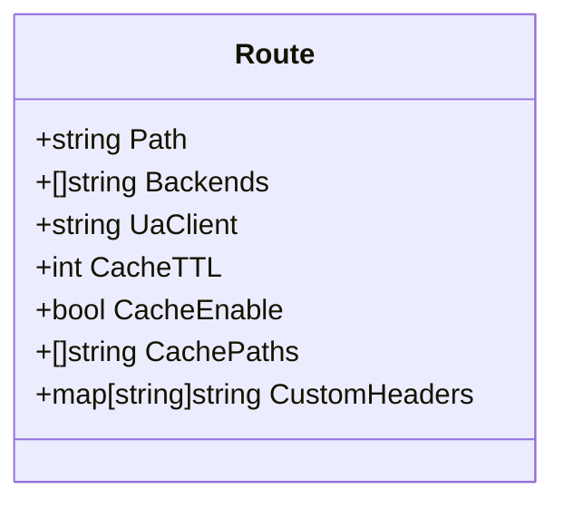
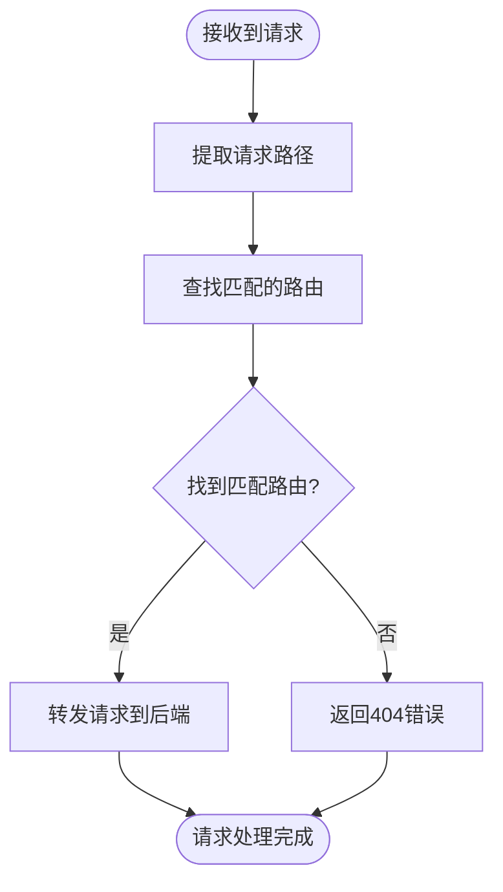
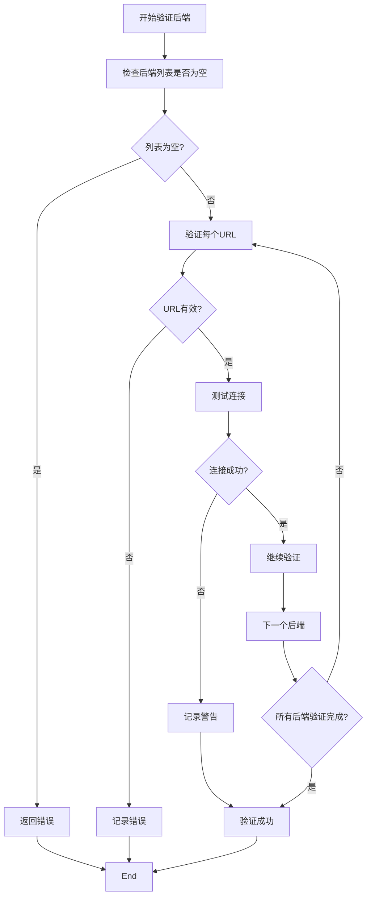
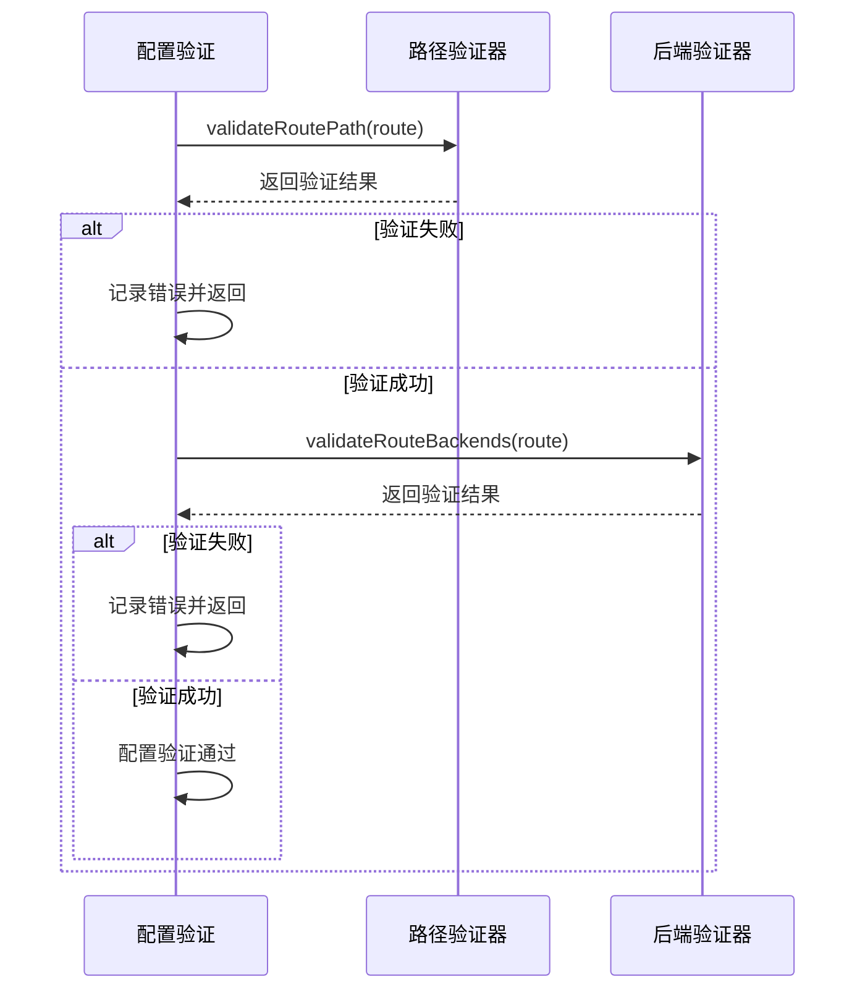
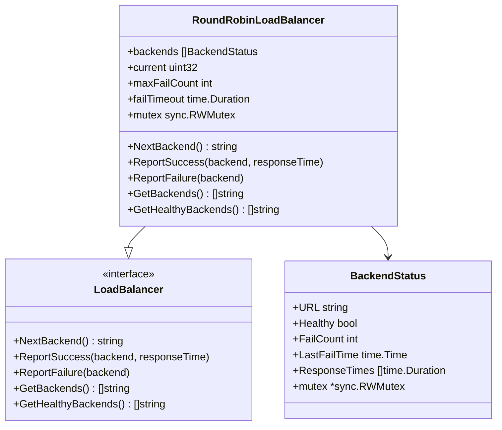
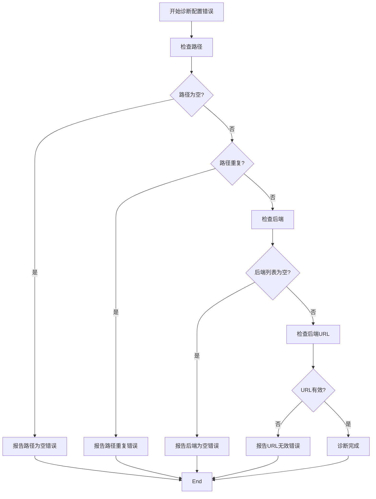

# 目标定义

<cite>
**本文档中引用的文件**  
- [config.go](file://internal/config/config.go)
- [router.go](file://internal/router/router.go)
- [loadbalancer.go](file://internal/loadbalancer/loadbalancer.go)
- [example_config.toml](file://example_config.toml)
- [main.go](file://main.go)
</cite>

## 目录
1. [引言](#引言)
2. [Route结构体字段解析](#route结构体字段解析)
3. [Path字段详解](#path字段详解)
4. [Backends字段详解](#backends字段详解)
5. [配置验证机制](#配置验证机制)
6. [负载均衡集成](#负载均衡集成)
7. [实际配置示例](#实际配置示例)
8. [常见错误诊断](#常见错误诊断)
9. [结论](#结论)

## 引言
本文档深入解析简单API网关项目中Route结构体的Path和Backends字段。该API网关基于Go语言开发，使用Fiber框架处理HTTP请求，通过TOML配置文件定义路由规则。Route结构体是配置的核心部分，决定了请求如何被路由到后端服务。本文将详细说明Path作为路由匹配规则的语法要求及其在请求匹配中的作用机制，以及Backends字段作为后端服务URL列表的配置规范和与负载均衡模块的集成方式。

## Route结构体字段解析
Route结构体定义了API网关中的路由规则，包含多个字段用于控制请求的转发行为。其中，Path和Backends是最核心的两个字段，分别负责路由匹配和后端服务指定。



**图源**  
- [config.go](file://internal/config/config.go#L37-L45)

**本节来源**  
- [config.go](file://internal/config/config.go#L37-L45)

## Path字段详解
Path字段是路由匹配规则的关键，必须满足非空且唯一的语法要求。在配置文件中，Path以字符串形式定义，用于匹配客户端请求的URL路径。

### 语法要求
Path字段必须是非空字符串，且在整个配置中必须唯一。空路径或重复路径都会导致配置验证失败。在TOML配置文件中，Path使用`path = "/your-path"`的语法定义。

### 匹配机制
当API网关接收到请求时，会遍历所有配置的路由规则，使用精确匹配的方式查找与请求路径相符的Route。匹配成功后，请求将被转发到该Route指定的后端服务列表。



**图源**  
- [router.go](file://internal/router/router.go#L495)

**本节来源**  
- [config.go](file://internal/config/config.go#L38)
- [router.go](file://internal/router/router.go#L495)

## Backends字段详解
Backends字段定义了后端服务的URL列表，采用数组格式的TOML语法。它是实现负载均衡和高可用性的基础。

### 配置规范
Backends字段是一个字符串数组，使用TOML的数组语法定义：
```toml
backends = [
  "http://backend1:8080",
  "http://backend2:8080"
]
```

### 有效性验证
每个后端URL都必须是合法的URI格式。系统使用`url.ParseRequestURI()`函数进行验证，确保URL语法正确。此外，系统还会尝试建立连接以验证后端服务的可达性，但即使连接失败，配置仍会被接受，系统会在运行时重试。



**图源**  
- [config.go](file://internal/config/config.go#L188-L223)

**本节来源**  
- [config.go](file://internal/config/config.go#L39)
- [config.go](file://internal/config/config.go#L188-L223)

## 配置验证机制
系统通过一系列验证函数确保Route配置的正确性，主要包含`validateRoutePath`和`validateRouteBackends`两个核心函数。

### 路径验证
`validateRoutePath`函数负责验证Path字段的有效性，检查路径是否为空以及是否重复。系统使用一个map来跟踪已存在的路径，确保唯一性。

### 后端验证
`validateRouteBackends`函数验证Backends字段，确保后端列表不为空，并对每个后端URL进行格式验证和连接测试。



**图源**  
- [config.go](file://internal/config/config.go#L168-L201)

**本节来源**  
- [config.go](file://internal/config/config.go#L168-L201)

## 负载均衡集成
Backends字段与负载均衡模块紧密集成，实现了请求在多个后端服务间的分发。

### 负载均衡器创建
系统为每个Route创建一个独立的负载均衡器实例，存储在`routeLoadBalancers`映射中。负载均衡器采用读写锁保护，确保并发安全。

### 轮询算法
系统实现了轮询（Round Robin）负载均衡算法，通过原子操作维护当前索引，确保请求均匀分发到各个后端服务。



**图源**  
- [loadbalancer.go](file://internal/loadbalancer/loadbalancer.go#L27-L82)

**本节来源**  
- [loadbalancer.go](file://internal/loadbalancer/loadbalancer.go#L27-L82)
- [router.go](file://internal/router/router.go#L114-L135)

## 实际配置示例
以下是一些实际的配置示例，展示了不同场景下的路径模式和多后端配置。

### 基本路由配置
```toml
[[route]]
path = "/api/v1/users"
backends = [
  "http://user-service-1:8080",
  "http://user-service-2:8080"
]
cache_ttl = 300
cache_enable = true
```

### 复杂路径配置
```toml
[[route]]
path = "/microservice/api"
backends = [
  "http://ms-backend-1:9000",
  "http://ms-backend-2:9000",
  "http://ms-backend-3:9000"
]
ua_client = "Custom-User-Agent/1.0"
cache_paths = ["/data", "/info"]
```

### 高可用配置
```toml
[[route]]
path = "/critical-service"
backends = [
  "https://primary-service.example.com",
  "https://backup-service.example.com",
  "https://secondary-service.example.com"
]
cache_enable = false
```

**本节来源**  
- [example_config.toml](file://example_config.toml)

## 常见错误诊断
系统提供了详细的错误检测和诊断机制，帮助用户快速定位配置问题。

### 路径重复错误
当配置中出现重复的Path时，`validateRoutePath`函数会检测到并返回"route path is duplicated"错误，同时在日志中记录详细信息。

### 后端URL无效错误
当后端URL格式不正确时，`validateSingleBackend`函数会使用`url.ParseRequestURI()`进行验证，返回"route backend is not a valid URL"错误。

### 空配置错误
系统会检查Path是否为空（"route path is empty"）和Backends列表是否为空（"route backends is empty"），确保基本配置的完整性。



**图源**  
- [config.go](file://internal/config/config.go#L171-L213)

**本节来源**  
- [config.go](file://internal/config/config.go#L171-L213)

## 结论
Route结构体的Path和Backends字段是API网关配置的核心。Path字段作为路由匹配规则，必须满足非空且唯一的语法要求，确保请求能够准确匹配到相应的路由规则。Backends字段作为后端服务URL列表，采用数组格式的TOML语法，通过与负载均衡模块的集成，实现了请求在多个后端服务间的分发，提高了系统的可用性和性能。系统的配置验证机制通过`validateRoutePath`和`validateRouteBackends`等函数，能够有效检测路径重复和后端URL无效等常见配置错误，提供了详细的诊断信息，帮助用户快速定位和解决问题。合理的配置示例展示了不同场景下的最佳实践，为用户提供了实用的参考。