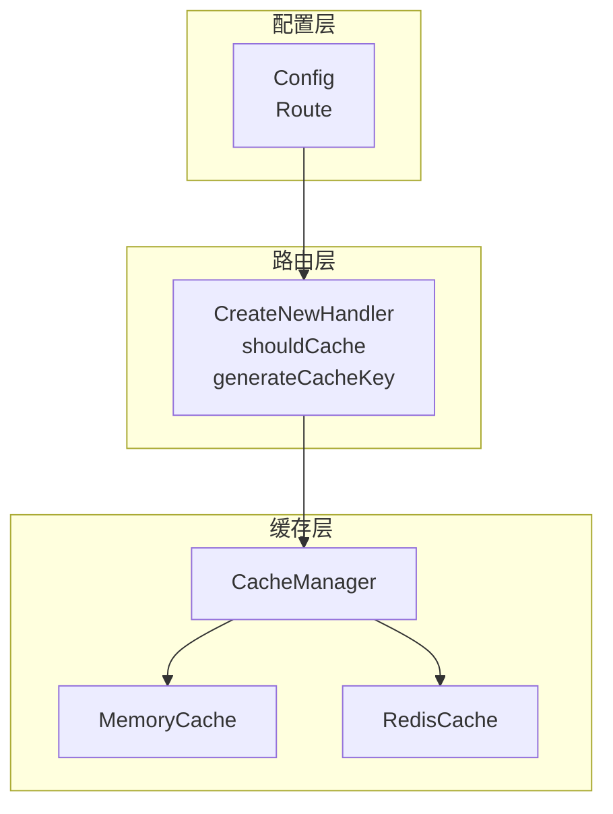
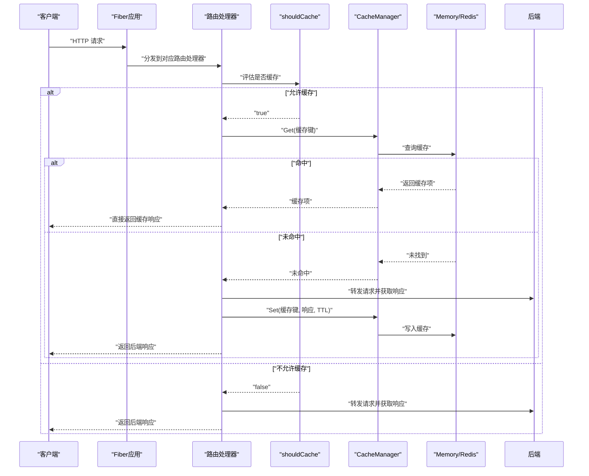
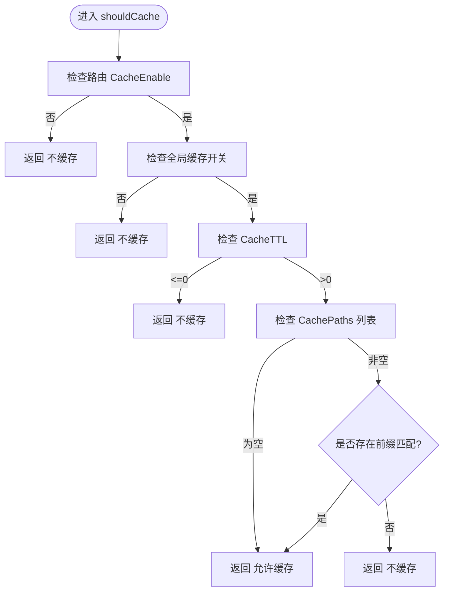
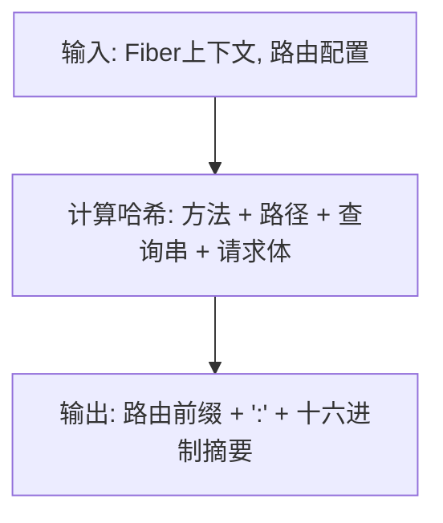
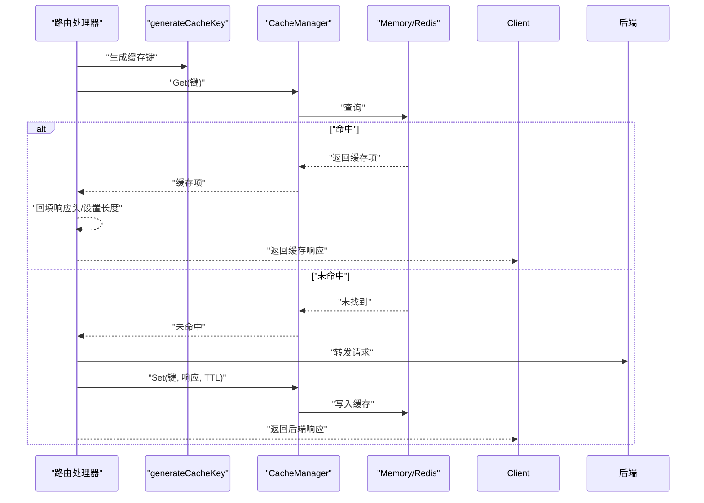
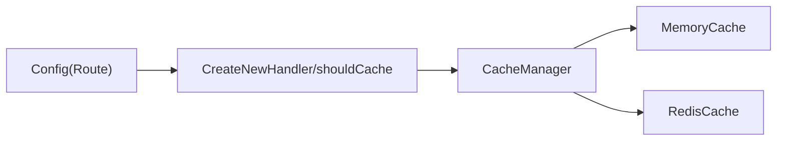

# 缓存策略

<cite>
**本文引用的文件**
- [internal/config/config.go](file://internal/config/config.go)
- [internal/router/router.go](file://internal/router/router.go)
- [internal/cache/cache.go](file://internal/cache/cache.go)
- [example_config.toml](file://example_config.toml)
- [config-with-redis.toml](file://config-with-redis.toml)
- [config-without-redis.toml](file://config-without-redis.toml)
- [README.md](file://README.md)
</cite>

## 目录
1. [简介](#简介)
2. [项目结构](#项目结构)
3. [核心组件](#核心组件)
4. [架构总览](#架构总览)
5. [详细组件分析](#详细组件分析)
6. [依赖关系分析](#依赖关系分析)
7. [性能考量](#性能考量)
8. [故障排查指南](#故障排查指南)
9. [结论](#结论)
10. [附录](#附录)

## 简介
本文件系统性阐述路由级别的缓存控制机制，围绕以下三个关键字段进行深入解析：
- CacheEnable：路由级开关，用于覆盖全局缓存设置，实现细粒度的路由级缓存启停。
- CacheTTL：缓存生命周期，单位为秒；当其为 0 时表示不缓存；负值在配置校验阶段会被拒绝。
- CachePaths：相对路径列表，用于限定可缓存的子路径范围，实现精细化的缓存范围控制。

同时，结合配置校验逻辑（validateSingleRoute 对 CacheTTL 的负值校验）与运行时决策流程（shouldCache），说明三者如何协同工作，并给出不同缓存策略的 TOML 配置示例与性能优化建议。

## 项目结构
本项目采用分层设计，缓存相关的核心代码分布在配置、路由与缓存管理三个模块中：
- 配置层：定义全局缓存与路由缓存字段，负责配置解析与校验。
- 路由层：根据全局缓存状态与路由配置决定是否缓存请求，并在命中/未命中时执行缓存读取与写入。
- 缓存层：抽象出统一的缓存接口，支持内存与 Redis 两种实现，负责缓存项的增删改查与过期处理。

图表来源
- [internal/config/config.go](file://internal/config/config.go#L21-L45)
- [internal/router/router.go](file://internal/router/router.go#L273-L340)
- [internal/cache/cache.go](file://internal/cache/cache.go#L252-L369)

章节来源
- [internal/config/config.go](file://internal/config/config.go#L21-L45)
- [internal/router/router.go](file://internal/router/router.go#L273-L340)
- [internal/cache/cache.go](file://internal/cache/cache.go#L252-L369)

## 核心组件
- 配置模型 Route 中的三个关键字段：
  - CacheEnable：布尔值，用于覆盖全局缓存开关，实现路由级禁用。
  - CacheTTL：整数，缓存生命周期（秒）；0 表示不缓存；负值在配置校验阶段即被拒绝。
  - CachePaths：字符串切片，相对路径前缀列表；若非空，仅匹配其中前缀的请求会被缓存。
- 运行时决策函数 shouldCache：综合全局缓存状态、路由开关、TTL 与路径白名单，决定是否对该请求进行缓存。
- 缓存键生成：基于请求方法、路径、查询参数与请求体，结合路由前缀生成唯一键，保证相同请求命中同一缓存项。
- 缓存写入与读取：仅对 2xx 成功响应进行缓存；命中时回填响应头并设置 Content-Length。

章节来源
- [internal/config/config.go](file://internal/config/config.go#L37-L45)
- [internal/router/router.go](file://internal/router/router.go#L33-L51)
- [internal/router/router.go](file://internal/router/router.go#L52-L110)
- [internal/router/router.go](file://internal/router/router.go#L356-L443)
- [internal/cache/cache.go](file://internal/cache/cache.go#L330-L369)

## 架构总览
下图展示了从请求进入网关到缓存决策与读写的关键交互：

图表来源
- [internal/router/router.go](file://internal/router/router.go#L273-L340)
- [internal/router/router.go](file://internal/router/router.go#L52-L110)
- [internal/router/router.go](file://internal/router/router.go#L356-L443)
- [internal/cache/cache.go](file://internal/cache/cache.go#L252-L369)

## 详细组件分析

### 路由级缓存决策 shouldCache
shouldCache 是路由级缓存控制的核心判定函数，其逻辑如下：
- 若路由显式禁用缓存（CacheEnable=false），直接返回不缓存。
- 若全局缓存禁用（globalCacheEnabled=false），即使路由开启也不缓存。
- 若 TTL 为 0 或负数，不缓存。
- 若 CachePaths 非空，仅当请求路径的相对部分（相对于路由前缀）与任一 CachePaths 前缀匹配时才缓存；否则不缓存。
- 其余情况允许缓存。

图表来源
- [internal/router/router.go](file://internal/router/router.go#L52-L110)

章节来源
- [internal/router/router.go](file://internal/router/router.go#L52-L110)

### 缓存键生成 generateCacheKey
缓存键由路由前缀与请求的多维信息组合生成，确保相同请求命中同一缓存项：
- 组成要素：请求方法、完整路径、查询字符串、请求体。
- 输出形式：路由前缀 + “:” + 上述要素的哈希摘要。

图表来源
- [internal/router/router.go](file://internal/router/router.go#L33-L51)

章节来源
- [internal/router/router.go](file://internal/router/router.go#L33-L51)

### 缓存读取与写入
- 读取：命中则回填响应头并设置 Content-Length，然后直接返回缓存体。
- 写入：仅对 2xx 成功响应进行缓存；写入时会对响应头进行过滤，剔除易变或重复的头部，降低缓存体积与一致性风险。
- 过期处理：内存缓存实现中包含周期性清理过期项的后台任务；Redis 实现中按 TTL 自动过期。

图表来源
- [internal/router/router.go](file://internal/router/router.go#L356-L443)
- [internal/cache/cache.go](file://internal/cache/cache.go#L76-L125)
- [internal/cache/cache.go](file://internal/cache/cache.go#L178-L231)
- [internal/cache/cache.go](file://internal/cache/cache.go#L330-L369)

章节来源
- [internal/router/router.go](file://internal/router/router.go#L356-L443)
- [internal/cache/cache.go](file://internal/cache/cache.go#L76-L125)
- [internal/cache/cache.go](file://internal/cache/cache.go#L178-L231)
- [internal/cache/cache.go](file://internal/cache/cache.go#L330-L369)

### 配置校验与约束
- 配置解析：使用 TOML 解码为 Config/Route 结构体。
- 路由级 TTL 校验：validateSingleRoute 对 CacheTTL 做负值校验，若为负值则报错并阻止启动。
- 全局缓存校验：当启用 Redis 时，要求 Redis URL 有效且可连通；失败时会记录告警并降级为内存缓存。

章节来源
- [internal/config/config.go](file://internal/config/config.go#L47-L67)
- [internal/config/config.go](file://internal/config/config.go#L146-L166)
- [internal/config/config.go](file://internal/config/config.go#L106-L124)
- [internal/router/router.go](file://internal/router/router.go#L445-L478)

### 配置文件示例与策略说明
以下示例展示三种常见缓存策略的 TOML 配置方式（路径参考具体文件）：
- 完全禁用缓存：将全局 cache.enabled 设为 false，或在特定路由上将 cache_enable 设为 false 且 cache_ttl 设为 0。
- 启用全路径缓存：将 cache_enable 设为 true，cache_ttl 设为正数，且不设置 cache_paths（或留空），使该路由下所有子路径均可缓存。
- 指定路径缓存：将 cache_enable 设为 true，cache_ttl 设为正数，并设置 cache_paths 为若干相对路径前缀，仅对匹配的子路径进行缓存。

章节来源
- [example_config.toml](file://example_config.toml#L1-L45)
- [config-with-redis.toml](file://config-with-redis.toml#L1-L31)
- [config-without-redis.toml](file://config-without-redis.toml#L1-L30)
- [README.md](file://README.md#L290-L360)

## 依赖关系分析
- 路由层依赖配置层提供的 Route 字段（CacheEnable、CacheTTL、CachePaths）与全局缓存开关。
- 路由层在运行时依赖缓存层的 CacheManager 接口，实现统一的 Get/Set/Delete。
- 缓存层内部根据配置选择内存或 Redis 实现；当 Redis 不可用时自动降级为内存缓存。

图表来源
- [internal/config/config.go](file://internal/config/config.go#L21-L45)
- [internal/router/router.go](file://internal/router/router.go#L273-L340)
- [internal/cache/cache.go](file://internal/cache/cache.go#L252-L369)

章节来源
- [internal/config/config.go](file://internal/config/config.go#L21-L45)
- [internal/router/router.go](file://internal/router/router.go#L273-L340)
- [internal/cache/cache.go](file://internal/cache/cache.go#L252-L369)

## 性能考量
- TTL 设定原则
  - 高并发静态资源：较长 TTL（如数分钟到数小时），显著降低后端压力。
  - 动态数据：较短 TTL（如几十秒到几分钟），平衡性能与数据新鲜度。
  - 0 TTL：完全禁用缓存，适合强一致性的接口。
- 路径白名单
  - 通过 CachePaths 精准限定缓存范围，避免缓存热点之外的冗余写入与命中成本。
- 缓存键复杂度
  - 由于缓存键包含请求体，频繁变化的大体量请求体可能带来更高的缓存命中成本与存储开销；建议对幂等的 GET/HEAD 请求使用缓存键生成策略，避免对大请求体进行缓存。
- 响应头过滤
  - 缓存写入前会过滤掉易变或重复的响应头，减少缓存体积与一致性问题。
- 缓存介质选择
  - Redis 适合分布式部署与跨进程共享；内存缓存适合单实例或低延迟场景。当 Redis 不可用时会自动降级，保障系统可用性。

章节来源
- [internal/cache/cache.go](file://internal/cache/cache.go#L330-L369)
- [internal/router/router.go](file://internal/router/router.go#L445-L478)

## 故障排查指南
- 启动时报“路由缓存 TTL 为负数”
  - 现象：配置校验阶段拒绝启动。
  - 原因：Route.CacheTTL 为负值。
  - 处理：将 TTL 设为 0（禁用）或正数（启用并设置有效生命周期）。
- 启动时报“Redis URL 无效或不可达”
  - 现象：启用 Redis 但 URL 不合法或无法连接。
  - 原因：Redis 配置错误或网络异常。
  - 处理：修正 redis_url 或关闭 use_redis；系统会自动降级为内存缓存。
- 路由未缓存
  - 现象：请求未命中缓存。
  - 可能原因：
    - 全局缓存禁用（cache.enabled=false）。
    - 路由显式禁用（cache_enable=false）。
    - TTL 为 0 或负数。
    - 指定了 CachePaths 但请求路径不匹配。
  - 处理：检查上述配置项，确保三者满足 shouldCache 的允许条件。
- 缓存命中率低
  - 现象：命中次数较少。
  - 可能原因：缓存键包含请求体导致命中困难；路径白名单过于严格。
  - 处理：确认请求幂等性与缓存键生成策略；适当放宽 CachePaths 或调整 TTL。

章节来源
- [internal/config/config.go](file://internal/config/config.go#L106-L124)
- [internal/config/config.go](file://internal/config/config.go#L146-L166)
- [internal/router/router.go](file://internal/router/router.go#L52-L110)
- [internal/router/router.go](file://internal/router/router.go#L445-L478)

## 结论
路由级缓存控制通过 CacheEnable、CacheTTL 与 CachePaths 的协同，实现了灵活而可控的缓存策略：
- CacheEnable 提供路由级开关，覆盖全局设置；
- CacheTTL 控制缓存生命周期，0 表示不缓存；
- CachePaths 精细化限定可缓存路径范围；
- 配置校验确保 TTL 非负，避免运行期异常；
- 运行时决策 shouldCache 将三者整合为统一的缓存判定流程；
- 缓存层提供内存与 Redis 两种实现，并在 Redis 不可用时自动降级。

通过合理设置 TTL 与 CachePaths，可在性能与数据新鲜度之间取得良好平衡。

## 附录
- 配置示例文件路径参考：
  - [example_config.toml](file://example_config.toml#L1-L45)
  - [config-with-redis.toml](file://config-with-redis.toml#L1-L31)
  - [config-without-redis.toml](file://config-without-redis.toml#L1-L30)
- 行为说明与约束参考：
  - [README.md](file://README.md#L290-L360)