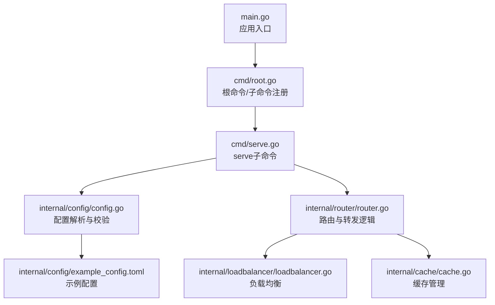
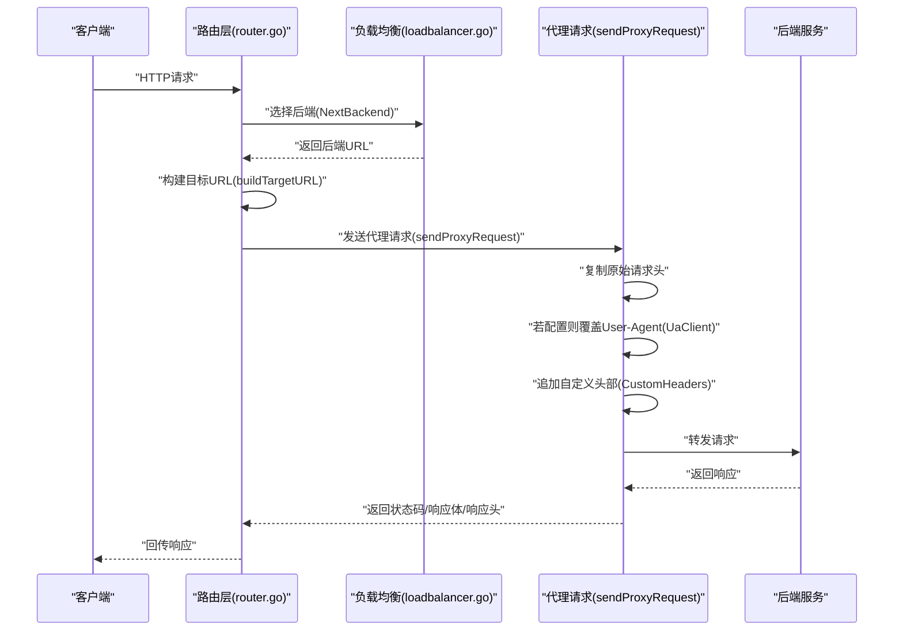
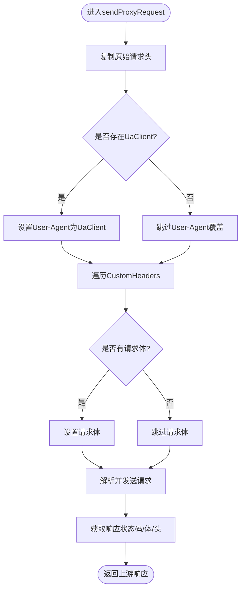
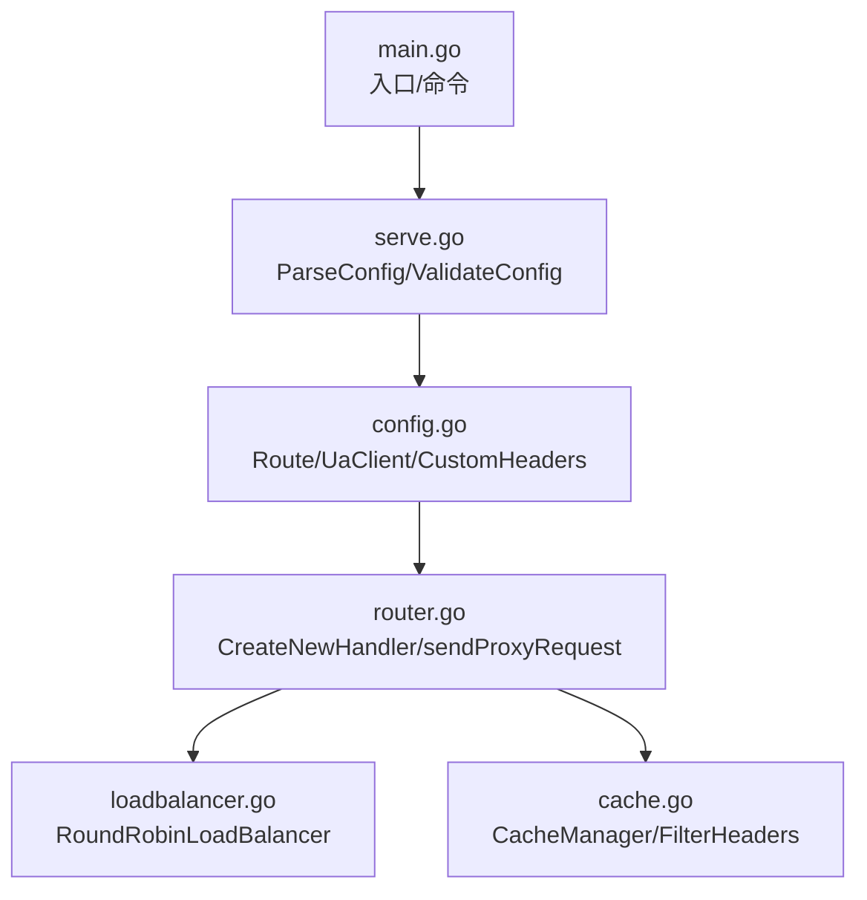

# 请求增强

<cite>
**本文引用的文件**
- [main.go](file://main.go)
- [root.go](file://cmd/root.go)
- [serve.go](file://cmd/serve.go)
- [config.go](file://internal/config/config.go)
- [example_config.toml](file://internal/config/example_config.toml)
- [router.go](file://internal/router/router.go)
- [loadbalancer.go](file://internal/loadbalancer/loadbalancer.go)
- [cache.go](file://internal/cache/cache.go)
</cite>

## 目录
1. [简介](#简介)
2. [项目结构](#项目结构)
3. [核心组件](#核心组件)
4. [架构总览](#架构总览)
5. [详细组件分析](#详细组件分析)
6. [依赖关系分析](#依赖关系分析)
7. [性能考量](#性能考量)
8. [故障排查指南](#故障排查指南)
9. [结论](#结论)
10. [附录](#附录)

## 简介
本文件围绕请求增强主题，系统讲解两个关键能力：
- CustomHeaders：在请求转发过程中向上游后端注入自定义HTTP头部，支持在TOML配置中以映射形式声明，实现API密钥传递、服务间认证、流量标记等场景。
- UaClient：覆盖默认User-Agent值，用于客户端标识伪装或满足特定后端服务对User-Agent的要求。

文档将结合请求转发逻辑（如sendProxyRequest函数）说明这些增强字段如何生效，并给出典型应用场景、安全使用建议以及冲突排查方法。

## 项目结构
该项目采用模块化组织，入口命令解析配置并启动路由层，路由层负责请求转发、负载均衡与缓存；配置层负责解析TOML并校验路由规则。

图表来源
- [main.go](file://main.go#L1-L49)
- [root.go](file://cmd/root.go#L1-L50)
- [serve.go](file://cmd/serve.go#L1-L30)
- [config.go](file://internal/config/config.go#L1-L263)
- [router.go](file://internal/router/router.go#L1-L504)
- [loadbalancer.go](file://internal/loadbalancer/loadbalancer.go#L1-L248)
- [cache.go](file://internal/cache/cache.go#L1-L369)
- [example_config.toml](file://internal/config/example_config.toml#L1-L45)

章节来源
- [main.go](file://main.go#L1-L49)
- [root.go](file://cmd/root.go#L1-L50)
- [serve.go](file://cmd/serve.go#L1-L30)
- [config.go](file://internal/config/config.go#L1-L263)
- [router.go](file://internal/router/router.go#L1-L504)
- [loadbalancer.go](file://internal/loadbalancer/loadbalancer.go#L1-L248)
- [cache.go](file://internal/cache/cache.go#L1-L369)
- [example_config.toml](file://internal/config/example_config.toml#L1-L45)

## 核心组件
- 配置模型与解析
  - Route结构体包含UaClient与CustomHeaders字段，分别用于覆盖User-Agent与注入自定义头部。
  - TOML映射语法通过route.custom_headers段落声明，键值对即为要注入的头部名与值。
- 路由与转发
  - sendProxyRequest负责构建上游请求，复制原始请求头，按需覆盖User-Agent，并追加自定义头部。
  - handleBackendRequest选择后端、构建目标URL并调用sendProxyRequest。
- 负载均衡
  - 轮询LB根据健康状态选择后端，记录成功/失败与响应时间，支持恢复与重试。
- 缓存
  - 可选内存或Redis缓存，过滤掉易变响应头后缓存响应体与头部，提升性能。

章节来源
- [config.go](file://internal/config/config.go#L37-L67)
- [example_config.toml](file://internal/config/example_config.toml#L27-L31)
- [router.go](file://internal/router/router.go#L138-L202)
- [loadbalancer.go](file://internal/loadbalancer/loadbalancer.go#L49-L248)
- [cache.go](file://internal/cache/cache.go#L252-L369)

## 架构总览
下图展示请求从客户端到后端的完整链路，突出CustomHeaders与UaClient在转发阶段的作用点。

图表来源
- [router.go](file://internal/router/router.go#L204-L247)
- [router.go](file://internal/router/router.go#L249-L269)
- [router.go](file://internal/router/router.go#L138-L202)
- [loadbalancer.go](file://internal/loadbalancer/loadbalancer.go#L84-L109)

## 详细组件分析

### 配置模型与TOML映射
- Route结构体
  - UaClient：字符串，用于覆盖User-Agent。
  - CustomHeaders：map[string]string，键为头部名，值为头部值。
- TOML语法要点
  - route.custom_headers为映射段落，每行一个键值对，键为头部名，值为头部值。
  - 支持多条自定义头部，形成“多头部配置”。
- 示例位置
  - 示例配置中展示了两处route.custom_headers段落，分别包含不同头部键值对。

章节来源
- [config.go](file://internal/config/config.go#L37-L67)
- [example_config.toml](file://internal/config/example_config.toml#L27-L31)
- [example_config.toml](file://internal/config/example_config.toml#L42-L45)

### 请求转发与增强字段生效点
- 复制原始请求头
  - sendProxyRequest遍历原始请求头并复制到上游请求头。
- 覆盖User-Agent
  - 若Route.UaClient非空，则显式设置User-Agent为配置值。
- 注入自定义头部
  - 遍历Route.CustomHeaders，逐个设置到上游请求头。
- 发送与回传
  - 解析代理请求、发送、接收响应，回传状态码、响应体与响应头。

图表来源
- [router.go](file://internal/router/router.go#L138-L202)

章节来源
- [router.go](file://internal/router/router.go#L138-L202)

### 负载均衡与错误处理
- NextBackend优先选择健康后端；若无健康后端则重置并回退到首个后端。
- 成功/失败上报会更新后端健康状态与响应时间统计，支持自动恢复与重试。
- 转发失败时记录日志并返回错误状态。

章节来源
- [loadbalancer.go](file://internal/loadbalancer/loadbalancer.go#L84-L109)
- [loadbalancer.go](file://internal/loadbalancer/loadbalancer.go#L111-L170)
- [router.go](file://internal/router/router.go#L204-L247)

### 缓存与头部过滤
- 缓存仅在路由允许且全局缓存开启、TTL有效、路径匹配时生效。
- 响应头在缓存前会进行过滤，排除易变或代理相关头部，确保缓存一致性。

章节来源
- [router.go](file://internal/router/router.go#L52-L110)
- [cache.go](file://internal/cache/cache.go#L330-L369)

## 依赖关系分析
- 配置层
  - config.ParseConfig与ValidateConfig负责解析与校验，确保UaClient与CustomHeaders等字段合法。
- 路由层
  - CreateNewHandler基于Route创建处理器，内部组合负载均衡、缓存与转发。
  - sendProxyRequest与buildTargetURL共同完成上游请求构造与发送。
- 负载均衡层
  - RoundRobinLoadBalancer提供健康检查与轮询策略。
- 缓存层
  - CacheManager封装内存/Redis缓存，FilterHeaders保证缓存头部一致性。

图表来源
- [config.go](file://internal/config/config.go#L37-L67)
- [router.go](file://internal/router/router.go#L138-L202)
- [loadbalancer.go](file://internal/loadbalancer/loadbalancer.go#L49-L248)
- [cache.go](file://internal/cache/cache.go#L252-L369)
- [serve.go](file://cmd/serve.go#L1-L30)
- [main.go](file://main.go#L1-L49)

章节来源
- [config.go](file://internal/config/config.go#L37-L67)
- [router.go](file://internal/router/router.go#L138-L202)
- [loadbalancer.go](file://internal/loadbalancer/loadbalancer.go#L49-L248)
- [cache.go](file://internal/cache/cache.go#L252-L369)
- [serve.go](file://cmd/serve.go#L1-L30)
- [main.go](file://main.go#L1-L49)

## 性能考量
- CustomHeaders与UaClient均为轻量级头部设置，开销主要来自网络往返与上游处理。
- 负载均衡采用原子计数轮询，线程安全且低开销。
- 缓存可显著降低上游压力，但需注意头部过滤与TTL策略，避免污染缓存。

[本节为通用指导，无需列出具体文件来源]

## 故障排查指南
- 自定义头部未生效
  - 检查配置文件中route.custom_headers段落是否正确书写，键值对是否缺失。
  - 确认路由路径与请求路径匹配，避免被缓存或被其他中间件覆盖。
- User-Agent未按预期
  - 确认Route.UaClient已配置且非空。
  - 注意某些客户端或代理可能覆盖User-Agent，可在上游服务侧确认最终值。
- 与后端预期冲突
  - 若后端要求特定头部或禁止某些头部，应调整配置或在上游服务侧处理冲突。
  - 使用日志定位：关注路由层与负载均衡层的日志输出，确认转发链路与后端选择。
- 缓存导致的异常
  - 若启用缓存，检查FilterHeaders策略与TTL设置，必要时临时禁用缓存验证问题。

章节来源
- [example_config.toml](file://internal/config/example_config.toml#L27-L31)
- [example_config.toml](file://internal/config/example_config.toml#L42-L45)
- [router.go](file://internal/router/router.go#L138-L202)
- [loadbalancer.go](file://internal/loadbalancer/loadbalancer.go#L84-L109)
- [cache.go](file://internal/cache/cache.go#L330-L369)

## 结论
- CustomHeaders与UaClient为请求增强提供了灵活而强大的手段：前者用于注入业务所需的头部（如鉴权、追踪、标记），后者用于适配后端对User-Agent的特殊要求。
- 在转发链路中，它们在sendProxyRequest阶段被应用，配合负载均衡与可选缓存，形成稳定高效的请求处理流程。
- 建议在生产环境中谨慎配置敏感头部，遵循最小暴露原则，并建立完善的日志与监控以便快速定位问题。

[本节为总结性内容，无需列出具体文件来源]

## 附录

### TOML语法与多头部配置示例
- 映射段落
  - route.custom_headers为映射段落，每行一个键值对，键为头部名，值为头部值。
- 多头部配置示例
  - 示例配置中展示了两处route.custom_headers段落，分别包含不同头部键值对，体现多头部配置能力。

章节来源
- [example_config.toml](file://internal/config/example_config.toml#L27-L31)
- [example_config.toml](file://internal/config/example_config.toml#L42-L45)

### 典型应用场景
- API密钥传递
  - 通过CustomHeaders注入Authorization或X-API-Key等头部，实现后端鉴权。
- 服务间认证
  - 注入X-Forwarded-For、X-Request-Id等头部，便于后端审计与追踪。
- 流量标记
  - 注入X-Service-Name、X-Environment等头部，用于灰度发布或环境识别。
- 客户端伪装
  - 通过UaClient覆盖User-Agent，满足后端对特定浏览器或爬虫的兼容性要求。

章节来源
- [config.go](file://internal/config/config.go#L37-L67)
- [example_config.toml](file://internal/config/example_config.toml#L27-L31)
- [example_config.toml](file://internal/config/example_config.toml#L42-L45)

### 安全使用指南
- 避免在CustomHeaders中明文传递敏感信息（如密码、令牌），优先使用后端侧的安全机制或加密通道。
- 对外暴露的配置文件应限制访问权限，防止泄露。
- 在调试阶段开启详细日志，但上线后适当降低日志级别，避免敏感数据外泄。
- 定期审查路由配置，确保头部设置符合最小权限原则。

[本节为通用指导，无需列出具体文件来源]