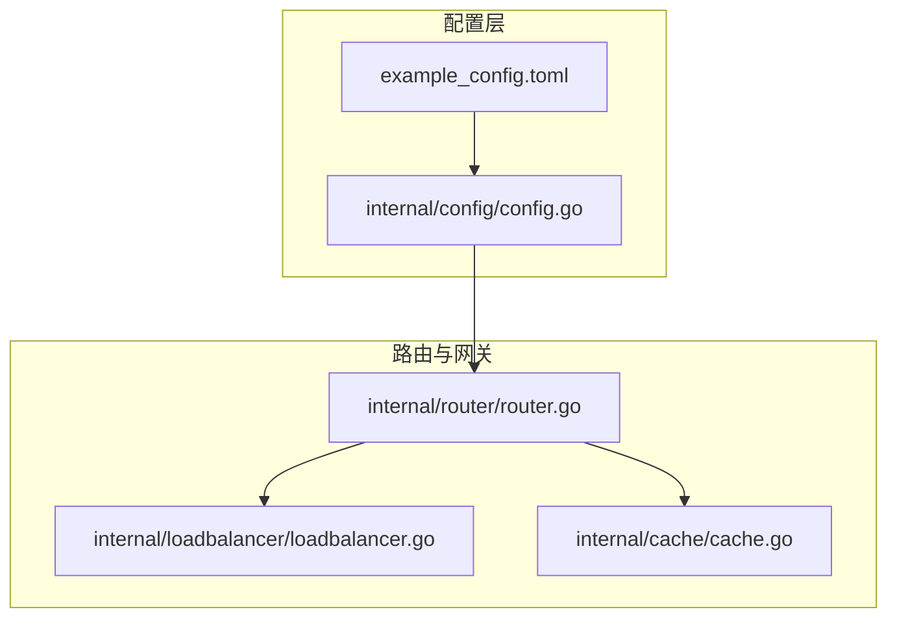
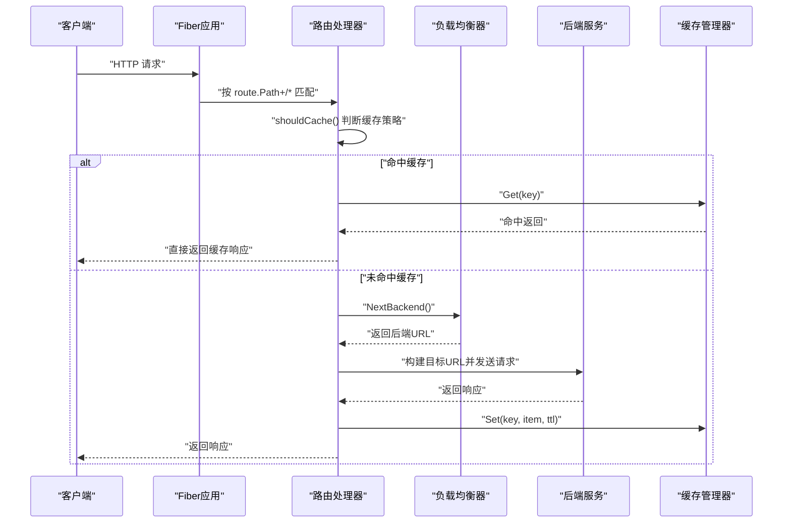
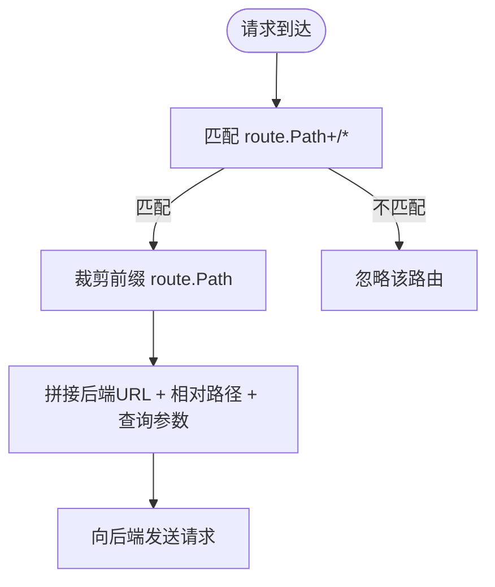
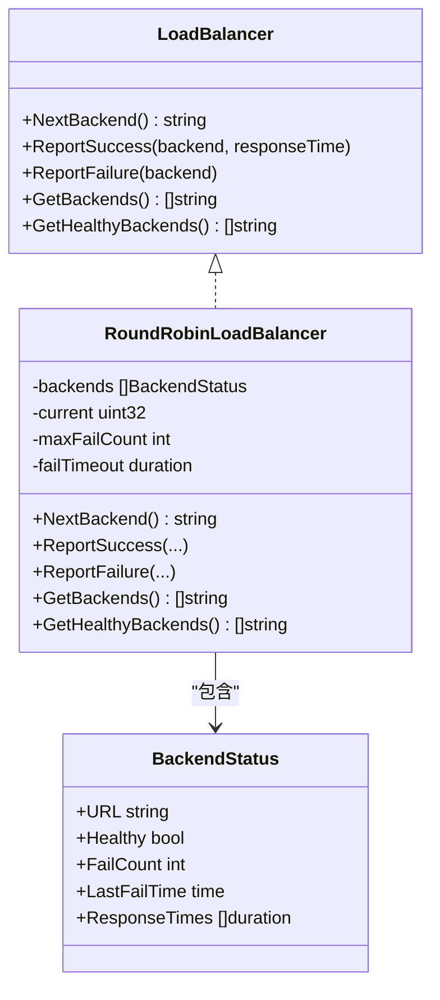
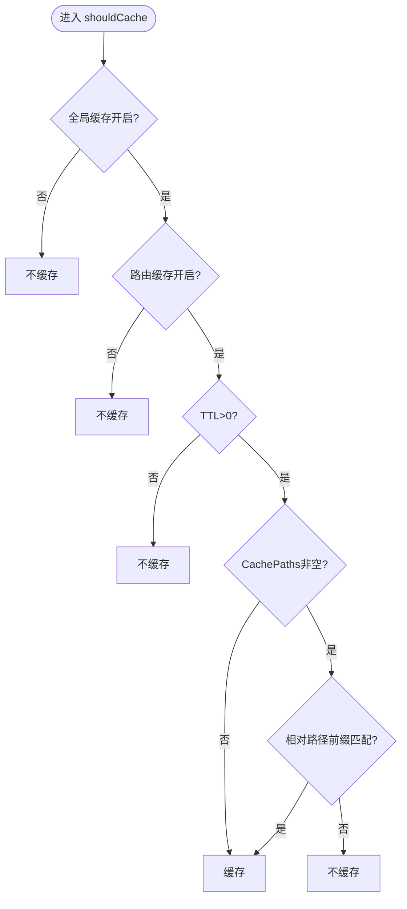
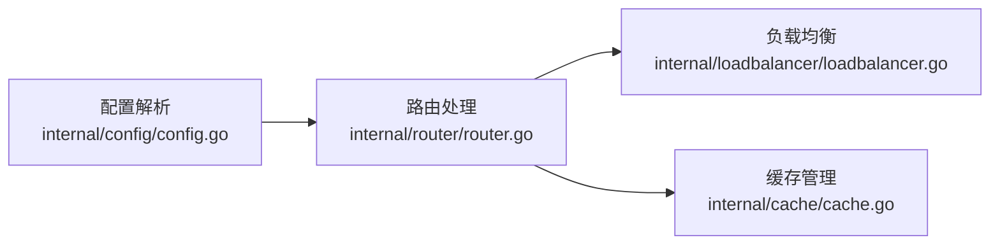

# 路由配置

<cite>
**本文引用的文件**
- [internal/config/config.go](file://internal/config/config.go)
- [internal/router/router.go](file://internal/router/router.go)
- [internal/cache/cache.go](file://internal/cache/cache.go)
- [internal/loadbalancer/loadbalancer.go](file://internal/loadbalancer/loadbalancer.go)
- [example_config.toml](file://example_config.toml)
- [internal/config/example_config.toml](file://internal/config/example_config.toml)
- [README.md](file://README.md)
</cite>

## 更新摘要
**变更内容**
- 新增了 per-route URL 路径重写功能，添加了 `rewrite_from` 和 `rewrite_to` 配置字段
- 在路由处理逻辑中实现了路径重写机制
- 更新了示例配置文件以包含路径重写示例
- 在 `validateSingleRoute` 函数中增加了对重写规则的验证
- 在 `buildTargetURL` 函数中实现了路径重写逻辑

## 目录
1. [简介](#简介)
2. [项目结构](#项目结构)
3. [核心组件](#核心组件)
4. [架构总览](#架构总览)
5. [详细组件分析](#详细组件分析)
6. [依赖关系分析](#依赖关系分析)
7. [性能考量](#性能考量)
8. [故障排查指南](#故障排查指南)
9. [结论](#结论)
10. [附录](#附录)

## 简介
本文件围绕 Route 结构体的配置项进行深入解析，重点覆盖：
- Path：路由匹配规则与路径前缀处理
- Backends：后端服务列表与轮询负载均衡
- UaClient：用户代理注入
- CacheTTL、CacheEnable、CachePaths：单路由缓存策略与路径级精细控制
- CustomHeaders：请求注入场景
- RewriteFrom、RewriteTo：per-route URL 路径重写功能
并结合配置文件示例，说明数组（Backends、CachePaths）与映射（CustomHeaders）的 TOML 语法；同时基于 validateRoutes 与 validateSingleRoute 的校验逻辑，给出路由路径唯一性、后端 URL 有效性等规则及常见配置错误的诊断建议。

## 项目结构
本项目采用分层设计：配置解析与校验位于 internal/config，路由处理与缓存逻辑位于 internal/router，负载均衡位于 internal/loadbalancer，缓存实现位于 internal/cache。路由注册与运行在 internal/router 中完成。

图表来源
- [internal/config/config.go](file://internal/config/config.go#L1-L263)
- [internal/router/router.go](file://internal/router/router.go#L1-L504)
- [internal/cache/cache.go](file://internal/cache/cache.go#L1-L369)
- [internal/loadbalancer/loadbalancer.go](file://internal/loadbalancer/loadbalancer.go#L1-L248)
- [example_config.toml](file://example_config.toml#L1-L45)

章节来源
- [internal/config/config.go](file://internal/config/config.go#L1-L263)
- [internal/router/router.go](file://internal/router/router.go#L1-L504)

## 核心组件
- Route 结构体字段
  - Path：路由路径，作为匹配规则的前缀
  - Backends：后端服务地址数组，支持多实例轮询
  - UaClient：注入到请求头的 User-Agent 字符串
  - CacheTTL：缓存有效期（秒），0 表示不缓存
  - CacheEnable：是否启用该路由的缓存（默认跟随全局）
  - CachePaths：允许缓存的相对路径前缀集合（空表示全量）
  - CustomHeaders：请求头映射，键值对形式注入到上游请求
  - RewriteFrom：要重写的路径前缀
  - RewriteTo：重写到的路径前缀

章节来源
- [internal/config/config.go](file://internal/config/config.go#L37-L47)

## 架构总览
下图展示了从配置加载到请求处理的关键流程，包括路由匹配、负载均衡、缓存决策与请求转发。

图表来源
- [internal/router/router.go](file://internal/router/router.go#L271-L340)
- [internal/router/router.go](file://internal/router/router.go#L52-L110)
- [internal/router/router.go](file://internal/router/router.go#L138-L202)
- [internal/router/router.go](file://internal/router/router.go#L249-L269)
- [internal/cache/cache.go](file://internal/cache/cache.go#L252-L328)
- [internal/loadbalancer/loadbalancer.go](file://internal/loadbalancer/loadbalancer.go#L49-L110)

## 详细组件分析

### 路由匹配与路径前缀处理（Path）
- Fiber 注册路由使用 route.Path + "/*"，因此请求路径必须以该前缀开头才进入对应处理器。
- 目标后端 URL 构造时会裁剪掉 route.Path 前缀，保留相对路径与查询参数，再拼接到后端基础 URL 上。

图表来源
- [internal/router/router.go](file://internal/router/router.go#L489-L496)
- [internal/router/router.go](file://internal/router/router.go#L249-L269)

章节来源
- [internal/router/router.go](file://internal/router/router.go#L249-L269)
- [internal/router/router.go](file://internal/router/router.go#L489-L496)

### 后端服务与负载均衡（Backends）
- 每个路由维护独立的负载均衡器，采用轮询策略。
- 健康检查与自动故障转移：连续失败达到阈值标记为不健康；超时后重试；全部不健康时重置。
- 选择下一个健康后端时使用原子计数器保证线程安全。

图表来源
- [internal/loadbalancer/loadbalancer.go](file://internal/loadbalancer/loadbalancer.go#L25-L48)
- [internal/loadbalancer/loadbalancer.go](file://internal/loadbalancer/loadbalancer.go#L49-L83)
- [internal/loadbalancer/loadbalancer.go](file://internal/loadbalancer/loadbalancer.go#L84-L110)
- [internal/loadbalancer/loadbalancer.go](file://internal/loadbalancer/loadbalancer.go#L111-L183)
- [internal/loadbalancer/loadbalancer.go](file://internal/loadbalancer/loadbalancer.go#L184-L231)

章节来源
- [internal/router/router.go](file://internal/router/router.go#L112-L136)
- [internal/loadbalancer/loadbalancer.go](file://internal/loadbalancer/loadbalancer.go#L49-L110)
- [internal/loadbalancer/loadbalancer.go](file://internal/loadbalancer/loadbalancer.go#L111-L183)
- [internal/loadbalancer/loadbalancer.go](file://internal/loadbalancer/loadbalancer.go#L184-L231)

### 用户代理注入（UaClient）
- 若配置了 UaClient，则在代理请求时覆盖默认 User-Agent；否则沿用客户端传入的 UA。
- 该行为发生在 sendProxyRequest 中复制请求头之后。

章节来源
- [internal/router/router.go](file://internal/router/router.go#L157-L166)

### 缓存策略：CacheEnable、CacheTTL 与 CachePaths
- 全局开关：全局 cache.enabled 控制是否启用缓存；若为 false，则所有路由均不缓存。
- 路由开关：route.cache_enable 控制该路由是否启用缓存；false 则不缓存。
- TTL：route.cache_ttl 为 0 或负数时不缓存；正数表示缓存有效期（秒）。
- 路径级控制：若 route.cache_paths 非空，仅当请求相对路径（去除 route.Path 前缀）以其中任一前缀开头时才缓存；为空则全量缓存。
- 成功响应才缓存：仅 2xx 状态码会被缓存。

图表来源
- [internal/router/router.go](file://internal/router/router.go#L52-L110)

章节来源
- [internal/router/router.go](file://internal/router/router.go#L52-L110)
- [internal/router/router.go](file://internal/router/router.go#L403-L443)
- [README.md](file://README.md#L316-L360)

### 请求注入：CustomHeaders
- 配置为键值对映射，会在 sendProxyRequest 中逐项设置到上游请求头。
- 常见用途：添加鉴权头（如 API Key）、追踪头（如 Request ID）、服务标识等。

章节来源
- [internal/router/router.go](file://internal/router/router.go#L161-L166)
- [internal/config/config.go](file://internal/config/config.go#L37-L45)

### per-route URL 路径重写（RewriteFrom、RewriteTo）
- 新增了 per-route URL 路径重写功能，允许在路由级别配置路径重写规则。
- 重写规则仅在 `rewrite_from` 和 `rewrite_to` 两个字段都非空时才生效。
- 重写规则应用于请求路径中跟随路由路径前缀的部分，查询字符串保持不变。
- 重写过程：当请求路径部分以 `rewrite_from` 开头时，将其替换为 `rewrite_to`，然后拼接到后端 URL。
- 示例：`/api/v1/users` -> `/api` 路由 -> `rewrite_from="/v1"` -> `rewrite_to="/v4"` -> 后端请求 `/v4/users`。
- 验证规则：`rewrite_from` 和 `rewrite_to` 必须同时存在或同时为空；两者都必须以 `/` 开头。

章节来源
- [internal/config/config.go](file://internal/config/config.go#L45-L47)
- [internal/config/config.go](file://internal/config/config.go#L247-L281)
- [internal/router/router.go](file://internal/router/router.go#L270-L286)

### 配置文件示例与 TOML 语法
- 数组（Backends、CachePaths）：使用方括号，元素间逗号分隔。
- 映射（CustomHeaders）：使用方括号块 [route.custom_headers]，键值对分行书写。
- 路径重写：使用 `rewrite_from` 和 `rewrite_to` 字段配置重写规则。
- 示例文件位置：
  - 顶层示例：example_config.toml
  - 内部示例：internal/config/example_config.toml

章节来源
- [example_config.toml](file://example_config.toml#L12-L57)
- [internal/config/example_config.toml](file://internal/config/example_config.toml#L12-L57)

## 依赖关系分析
- 配置层负责解析与校验，确保每条路由的 Path 唯一、Backends 非空且 URL 有效，以及重写规则的有效性。
- 路由层根据配置创建处理器，内部依赖负载均衡器与缓存管理器，并在请求处理时应用路径重写规则。
- 缓存层提供内存/Redis 两种实现，支持头部过滤与 TTL 管理。
- 负载均衡层提供健康检查与故障转移。

图表来源
- [internal/config/config.go](file://internal/config/config.go#L1-L263)
- [internal/router/router.go](file://internal/router/router.go#L1-L504)
- [internal/cache/cache.go](file://internal/cache/cache.go#L1-L369)
- [internal/loadbalancer/loadbalancer.go](file://internal/loadbalancer/loadbalancer.go#L1-L248)

章节来源
- [internal/config/config.go](file://internal/config/config.go#L1-L263)
- [internal/router/router.go](file://internal/router/router.go#L1-L504)

## 性能考量
- 轮询负载均衡：NextBackend 使用原子计数器，线程安全且开销低。
- 健康检查与失败回退：减少对不可用后端的请求，提升整体可用性。
- 缓存命中：命中时直接返回，避免后端压力；未命中时按需缓存，降低重复请求成本。
- 头部过滤：缓存时过滤易变或重复的响应头，减少存储与传输开销。
- 路径重写：使用简单的字符串前缀匹配和替换，性能开销低。

[本节为通用指导，无需特定文件引用]

## 故障排查指南

### 路由唯一性与路径校验
- 错误表现：启动时报“路由路径为空”或“路由路径重复”
- 根因定位：validateRoutePath 会拒绝空路径并检测重复
- 排查步骤：
  - 确认每条 route.path 非空且唯一
  - 检查是否存在相同前缀导致匹配冲突

章节来源
- [internal/config/config.go](file://internal/config/config.go#L168-L182)

### 后端 URL 有效性
- 错误表现：启动时报“后端URL无效”或“无法连接后端”
- 根因定位：validateSingleBackend 对空值、非法URL进行校验；网络连通性仅在日志中警告（运行时仍会尝试）
- 排查步骤：
  - 确认 backends 数组非空且每个元素为合法URL
  - 确认后端服务可达（至少在运行时）

章节来源
- [internal/config/config.go](file://internal/config/config.go#L184-L224)

### 缓存相关问题
- 错误表现：路由未按预期缓存
- 根因定位：
  - 全局 cache.enabled 为 false：不缓存
  - route.cache_enable 为 false：不缓存
  - route.cache_ttl <= 0：不缓存
  - 指定了 cache_paths 但请求相对路径不匹配：不缓存
  - 非 2xx 响应：不缓存
- 排查步骤：
  - 检查全局与路由级缓存开关
  - 确认 TTL 为正值
  - 核对请求路径是否满足 cache_paths 前缀匹配
  - 确认后端返回 2xx 状态码

章节来源
- [internal/router/router.go](file://internal/router/router.go#L52-L110)
- [internal/router/router.go](file://internal/router/router.go#L403-L443)
- [README.md](file://README.md#L316-L360)

### 负载均衡问题
- 错误表现：503 无可用后端或频繁切换后端
- 根因定位：当所有后端均不健康时，负载均衡器会重置并尝试全部后端
- 排查步骤：
  - 检查后端健康状况与网络连通性
  - 观察失败计数与超时重试机制

章节来源
- [internal/router/router.go](file://internal/router/router.go#L204-L247)
- [internal/loadbalancer/loadbalancer.go](file://internal/loadbalancer/loadbalancer.go#L84-L110)
- [internal/loadbalancer/loadbalancer.go](file://internal/loadbalancer/loadbalancer.go#L168-L183)

### 路径重写问题
- 错误表现：启动时报“rewrite_from 和 rewrite_to 必须同时指定或同时为空”或“rewrite_from/rewrite_to 必须以 / 开头”
- 根因定位：validateRewriteRule 对重写规则进行校验
- 排查步骤：
  - 确认 `rewrite_from` 和 `rewrite_to` 要么同时存在，要么同时为空
  - 确认 `rewrite_from` 和 `rewrite_to` 都以 `/` 开头
  - 确认请求路径部分以 `rewrite_from` 开头才能触发重写

章节来源
- [internal/config/config.go](file://internal/config/config.go#L247-L281)

### 配置错误诊断清单
- 路由配置为空或缺失
- 路由路径为空或重复
- 后端数组为空或包含非法URL
- TTL 为负数
- 缓存启用但全局禁用
- Redis 启用但 URL 无效或连接失败（运行时仅警告）
- `rewrite_from` 和 `rewrite_to` 不匹配（一个为空另一个不为空）
- `rewrite_from` 或 `rewrite_to` 不以 `/` 开头

章节来源
- [internal/config/config.go](file://internal/config/config.go#L90-L124)
- [internal/config/config.go](file://internal/config/config.go#L126-L224)
- [internal/config/config.go](file://internal/config/config.go#L247-L281)

## 结论
- Path 作为前缀匹配规则，决定请求是否进入某路由处理器。
- Backends 提供多实例轮询与健康检查，保障高可用。
- UaClient 与 CustomHeaders 为请求注入提供了灵活扩展点。
- CacheEnable、CacheTTL 与 CachePaths 协同实现“全局禁用、路由开关、TTL限制、路径前缀”的四层缓存控制。
- RewriteFrom 与 RewriteTo 提供了 per-route URL 路径重写功能，支持 API 版本迁移等场景。
- 配置校验严格约束了路径唯一性、后端 URL 有效性以及重写规则的有效性，有助于早期发现配置错误。

[本节为总结性内容，无需特定文件引用]

## 附录

### 配置项速查表
- Path：路由匹配前缀
- Backends：后端服务数组
- UaClient：User-Agent 注入
- CacheTTL：缓存有效期（秒）
- CacheEnable：路由级缓存开关
- CachePaths：允许缓存的相对路径前缀集合
- CustomHeaders：请求头映射
- RewriteFrom：要重写的路径前缀
- RewriteTo：重写到的路径前缀

章节来源
- [internal/config/config.go](file://internal/config/config.go#L37-L47)

### TOML 示例要点
- 数组（Backends、CachePaths）：方括号内元素逗号分隔
- 映射（CustomHeaders）：[route.custom_headers] 块内键值对分行书写
- 路径重写：使用 `rewrite_from` 和 `rewrite_to` 字段配置重写规则

章节来源
- [example_config.toml](file://example_config.toml#L12-L57)
- [internal/config/example_config.toml](file://internal/config/example_config.toml#L12-L57)