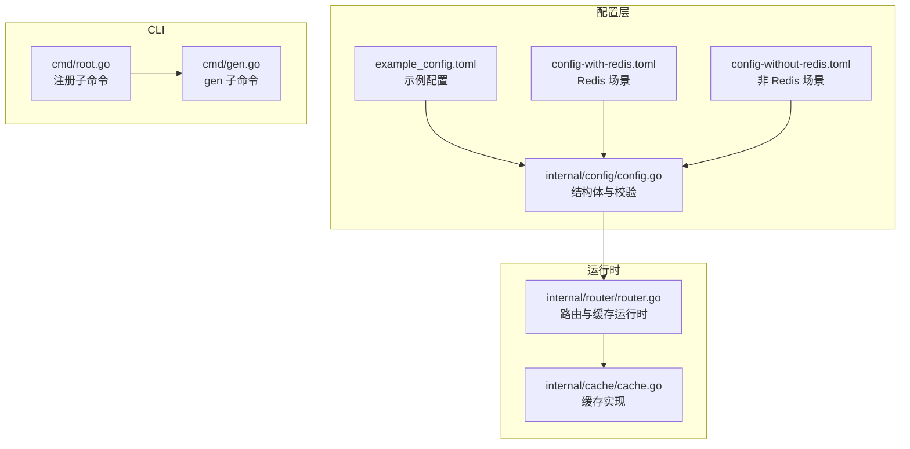
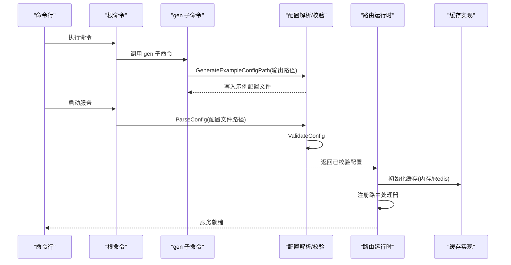
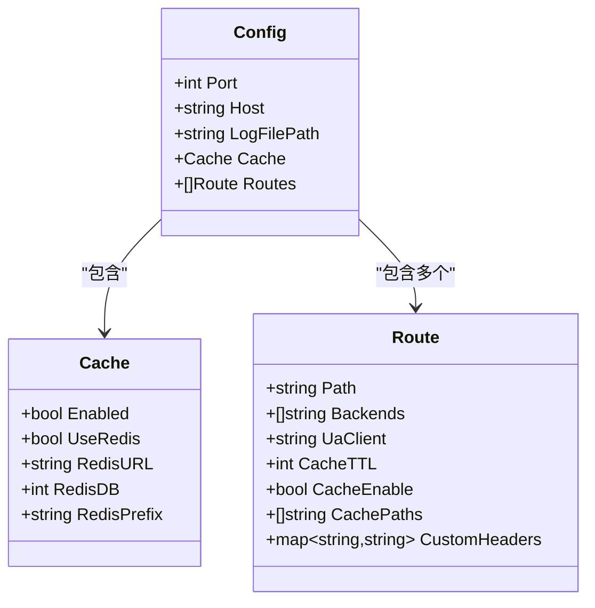
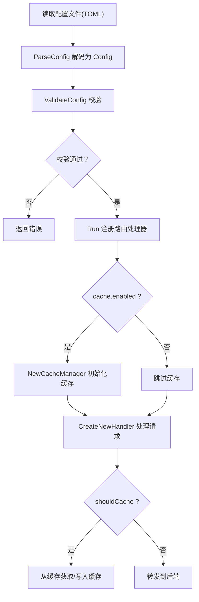

# 配置参考

<cite>
**本文引用的文件**
- [internal/config/config.go](file://internal/config/config.go)
- [internal/config/example_config.toml](file://internal/config/example_config.toml)
- [config-with-redis.toml](file://config-with-redis.toml)
- [config-without-redis.toml](file://config-without-redis.toml)
- [example_config.toml](file://example_config.toml)
- [cmd/gen.go](file://cmd/gen.go)
- [cmd/root.go](file://cmd/root.go)
- [internal/router/router.go](file://internal/router/router.go)
- [internal/cache/cache.go](file://internal/cache/cache.go)
</cite>

## 目录
1. [简介](#简介)
2. [项目结构与配置入口](#项目结构与配置入口)
3. [核心配置结构总览](#核心配置结构总览)
4. [架构概览](#架构概览)
5. [详细配置项说明](#详细配置项说明)
6. [配置差异对比：Redis 与 非 Redis](#配置差异对比redis-与-非-redis)
7. [字段级验证规则](#字段级验证规则)
8. [复杂配置示例与说明](#复杂配置示例与说明)
9. [自动化配置生成指南](#自动化配置生成指南)
10. [依赖关系与数据流分析](#依赖关系与数据流分析)
11. [性能与最佳实践建议](#性能与最佳实践建议)
12. [故障排查](#故障排查)
13. [结论](#结论)

## 简介
本文件为 simple_api_gateway 的 TOML 配置参考，基于内部配置解析与校验逻辑，逐项说明全局配置（监听地址、日志路径等）、缓存配置（启用状态、TTL、Redis 连接信息）以及路由配置（路径匹配、后端地址列表、自定义头部）的语法与语义。同时对比 Redis 与非 Redis 场景下的配置差异，给出字段级验证规则、示例片段与复杂配置（如路径匹配）的使用方法，并提供自动化配置生成的使用指导。

## 项目结构与配置入口
- 配置解析与校验位于 internal/config/config.go，包含 Config、Cache、Route 结构体及 ParseConfig、ValidateConfig 等函数。
- 示例配置文件 example_config.toml 与 config-with-redis.toml、config-without-redis.toml 提供不同部署场景的参考。
- 命令行子命令 gen 用于生成示例配置文件；根命令注册了 gen 子命令。
- 路由与缓存运行时行为由 internal/router/router.go 与 internal/cache/cache.go 实现。

图表来源
- [internal/config/config.go](file://internal/config/config.go#L21-L46)
- [internal/router/router.go](file://internal/router/router.go#L445-L504)
- [internal/cache/cache.go](file://internal/cache/cache.go#L252-L287)
- [cmd/root.go](file://cmd/root.go#L33-L40)
- [cmd/gen.go](file://cmd/gen.go#L9-L26)

章节来源
- [internal/config/config.go](file://internal/config/config.go#L21-L46)
- [cmd/root.go](file://cmd/root.go#L33-L40)
- [cmd/gen.go](file://cmd/gen.go#L9-L26)

## 核心配置结构总览
- 全局配置（顶层）
  - port：整数，监听端口
  - host：字符串，绑定主机
  - log_file_path：字符串，日志文件路径（可选）
  - cache：缓存配置对象
  - route[]：路由数组

- 缓存配置（cache）
  - enabled：布尔，是否启用缓存
  - use_redis：布尔，是否使用 Redis
  - redis_url：字符串，Redis 连接 URL（当 use_redis=true 时必填且需有效）
  - redis_db：整数，Redis 数据库编号
  - redis_prefix：字符串，Redis 键前缀

- 路由配置（route）
  - path：字符串，路由路径（必填，且不可重复）
  - backends[]：字符串数组，后端服务 URL 列表（至少一个）
  - ua_client：字符串，User-Agent 头部（可选）
  - cache_ttl：整数，缓存 TTL（秒），0 表示不缓存
  - cache_enable：布尔，是否启用该路由缓存（默认跟随全局）
  - cache_paths[]：字符串数组，仅对这些相对路径进行缓存（可选）
  - custom_headers：键值映射，添加到请求中的自定义头部（可选）

章节来源
- [internal/config/config.go](file://internal/config/config.go#L21-L46)

## 架构概览
配置在启动时被解析与校验，随后驱动路由与缓存运行时的行为：
- 解析与校验：ParseConfig + ValidateConfig
- 路由注册：根据 route.path 注册通配符路径处理器
- 缓存初始化：根据 cache.enabled/use_redis 选择内存或 Redis 缓存
- 请求处理：根据 shouldCache 规则决定是否命中缓存或转发至后端

图表来源
- [cmd/gen.go](file://cmd/gen.go#L9-L26)
- [internal/config/config.go](file://internal/config/config.go#L47-L88)
- [internal/router/router.go](file://internal/router/router.go#L445-L504)
- [internal/cache/cache.go](file://internal/cache/cache.go#L252-L287)

## 详细配置项说明

### 全局配置（顶层）
- port
  - 类型：整数
  - 必填：是
  - 取值范围：0–65535
  - 语义：监听端口
- host
  - 类型：字符串
  - 必填：是
  - 取值范围：非空
  - 语义：绑定主机地址
- log_file_path
  - 类型：字符串
  - 必填：否
  - 语义：日志文件路径；若提供则开启文件输出

章节来源
- [internal/config/config.go](file://internal/config/config.go#L93-L104)

### 缓存配置（cache）
- enabled
  - 类型：布尔
  - 必填：是
  - 语义：启用/禁用缓存
- use_redis
  - 类型：布尔
  - 必填：是
  - 语义：是否使用 Redis 缓存
- redis_url
  - 类型：字符串
  - 必填：当 use_redis=true 时必填
  - 校验：必须为有效的 URL
  - 语义：Redis 连接 URL
- redis_db
  - 类型：整数
  - 必填：否（默认 0）
  - 语义：Redis 数据库编号
- redis_prefix
  - 类型：字符串
  - 必填：否（默认前缀）
  - 语义：Redis 键前缀

章节来源
- [internal/config/config.go](file://internal/config/config.go#L106-L124)
- [internal/cache/cache.go](file://internal/cache/cache.go#L151-L176)

### 路由配置（route）
- path
  - 类型：字符串
  - 必填：是
  - 校验：非空且不可重复
  - 语义：路由路径（注册时会附加通配符）
- backends[]
  - 类型：字符串数组
  - 必填：至少一个
  - 校验：每个元素非空且为有效 URL
  - 语义：后端服务地址列表（支持多后端轮询）
- ua_client
  - 类型：字符串
  - 必填：否
  - 语义：覆盖请求的 User-Agent
- cache_ttl
  - 类型：整数
  - 必填：否（默认 0，表示不缓存）
  - 校验：非负数
  - 语义：缓存 TTL（秒）
- cache_enable
  - 类型：布尔
  - 必填：否（默认跟随全局）
  - 语义：是否启用该路由缓存
- cache_paths[]
  - 类型：字符串数组
  - 必填：否
  - 语义：仅对这些相对路径进行缓存（相对于 route.path 的相对路径）
- custom_headers
  - 类型：键值映射
  - 必填：否
  - 语义：为请求添加自定义头部

章节来源
- [internal/config/config.go](file://internal/config/config.go#L126-L224)
- [internal/router/router.go](file://internal/router/router.go#L495-L496)

## 配置差异对比：Redis 与 非 Redis
- 共同点
  - 均需提供 port、host、cache.enabled、route[].path、route[].backends[]
- 差异点
  - use_redis：Redis 场景设为 true，非 Redis 场景设为 false
  - redis_url：Redis 场景必填且需为有效 URL；非 Redis 场景可为空
  - 其他字段保持一致（如 redis_db、redis_prefix）

章节来源
- [config-with-redis.toml](file://config-with-redis.toml#L1-L31)
- [config-without-redis.toml](file://config-without-redis.toml#L1-L30)

## 字段级验证规则
- 全局配置
  - port：必须在 0–65535 范围内
  - host：必须非空
- 缓存配置
  - 当 use_redis=true 时，redis_url 必须非空且为有效 URL
- 路由配置
  - path：必须非空且全局唯一
  - backends[]：至少一个，每个元素必须非空且为有效 URL
  - cache_ttl：必须非负数
- 其他
  - route[].custom_headers 为键值映射，无额外强制校验

章节来源
- [internal/config/config.go](file://internal/config/config.go#L93-L124)
- [internal/config/config.go](file://internal/config/config.go#L126-L224)

## 复杂配置示例与说明

### 示例片段（路径与后端）
- 参考路径
  - [config-with-redis.toml](file://config-with-redis.toml#L12-L18)
  - [config-without-redis.toml](file://config-without-redis.toml#L12-L18)
  - [example_config.toml](file://example_config.toml#L13-L18)

### 自定义头部示例
- 参考路径
  - [config-with-redis.toml](file://config-with-redis.toml#L27-L31)
  - [config-without-redis.toml](file://config-without-redis.toml#L26-L30)
  - [example_config.toml](file://example_config.toml#L25-L30)

### 路由与通配符
- 路由注册采用 route.path + "/*" 的通配符模式，所有子路径均进入该路由处理器。
- 参考路径
  - [internal/router/router.go](file://internal/router/router.go#L495-L496)

### 缓存路径匹配（相对路径）
- 仅当 cache_paths 非空时，才会对相对路径进行匹配；否则默认缓存该路由下所有路径。
- 匹配逻辑：对请求路径去掉 route.path 前缀后的相对路径，判断是否以 cache_paths 中任一项为前缀。
- 参考路径
  - [internal/router/router.go](file://internal/router/router.go#L54-L110)

### 缓存 TTL 与开关
- cache_ttl=0 或 cache_enable=false 或全局缓存关闭时，不会缓存响应。
- 参考路径
  - [internal/router/router.go](file://internal/router/router.go#L54-L110)
  - [internal/config/config.go](file://internal/config/config.go#L126-L166)

## 自动化配置生成指南
- 使用 gen 子命令生成示例配置文件
  - 用法：simple-api-gateway gen <输出路径(.toml)>
  - 若未指定输出路径，默认写入 ./example.toml
  - 输出路径必须具有 .toml 扩展名，且目录存在
- 参考路径
  - [cmd/gen.go](file://cmd/gen.go#L9-L26)
  - [cmd/root.go](file://cmd/root.go#L33-L40)
  - [internal/config/config.go](file://internal/config/config.go#L226-L263)

## 依赖关系与数据流分析

### 配置结构类图

图表来源
- [internal/config/config.go](file://internal/config/config.go#L21-L46)

### 配置到运行时的数据流
- 解析与校验
  - ParseConfig：读取 TOML 并解码为 Config
  - ValidateConfig：依次调用 validateBasicConfig、validateCacheConfig、validateRoutes
- 路由注册
  - Run：遍历 Routes，按 route.Path + "/*" 注册处理器
- 缓存初始化
  - NewCacheManager：根据 cache.enabled/use_redis 选择内存或 Redis 缓存
- 请求处理
  - CreateNewHandler：根据 shouldCache 决定是否命中缓存或转发后端

图表来源
- [internal/config/config.go](file://internal/config/config.go#L47-L88)
- [internal/router/router.go](file://internal/router/router.go#L445-L504)
- [internal/cache/cache.go](file://internal/cache/cache.go#L252-L287)

## 性能与最佳实践建议
- 缓存策略
  - 对热点只读接口设置合理的 cache_ttl，避免过长导致陈旧数据
  - 使用 cache_paths 精确控制可缓存的相对路径，减少不必要的缓存
- 负载均衡
  - 后端列表建议至少两个，提升可用性
- Redis 选择
  - 生产环境建议启用 Redis 以共享缓存，提高横向扩展能力
- 日志
  - 在调试阶段开启 log_file_path，便于定位问题

## 故障排查
- 常见错误与定位
  - 端口无效：检查 port 是否在 0–65535
  - 主机无效：检查 host 是否非空
  - Redis URL 无效：当 use_redis=true 时，确保 redis_url 为有效 URL
  - 路由路径为空或重复：确保每条路由 path 非空且全局唯一
  - 后端 URL 无效：确保每个 backend 为有效 URL
  - 缓存 TTL 为负数：确保 cache_ttl 非负
- 日志位置
  - 若配置了 log_file_path，可在对应路径查看日志

章节来源
- [internal/config/config.go](file://internal/config/config.go#L93-L124)
- [internal/config/config.go](file://internal/config/config.go#L126-L224)

## 结论
本文档基于源码解析与校验逻辑，系统性地阐述了 simple_api_gateway 的 TOML 配置结构、字段级验证规则、运行时行为与自动化生成流程。通过对比 Redis 与非 Redis 场景，读者可据此快速完成不同部署环境下的配置与优化。