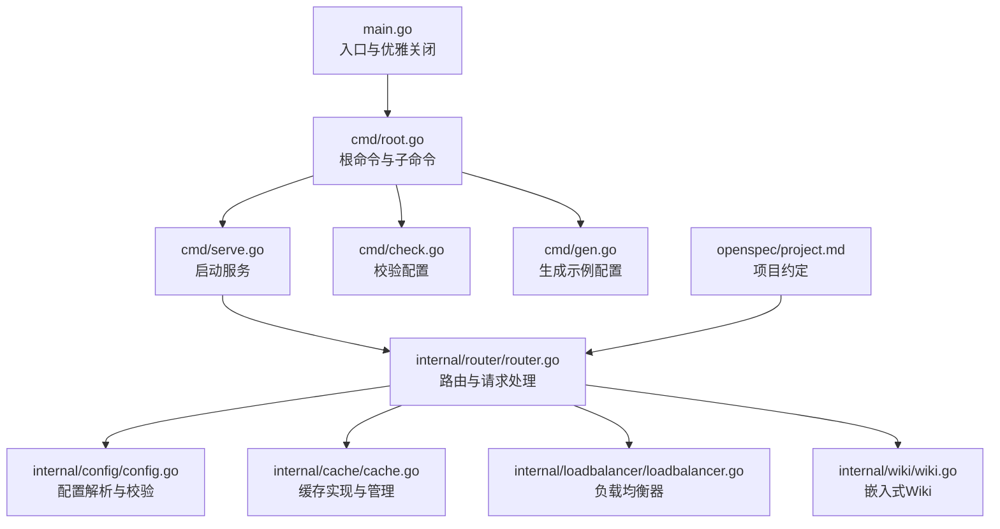
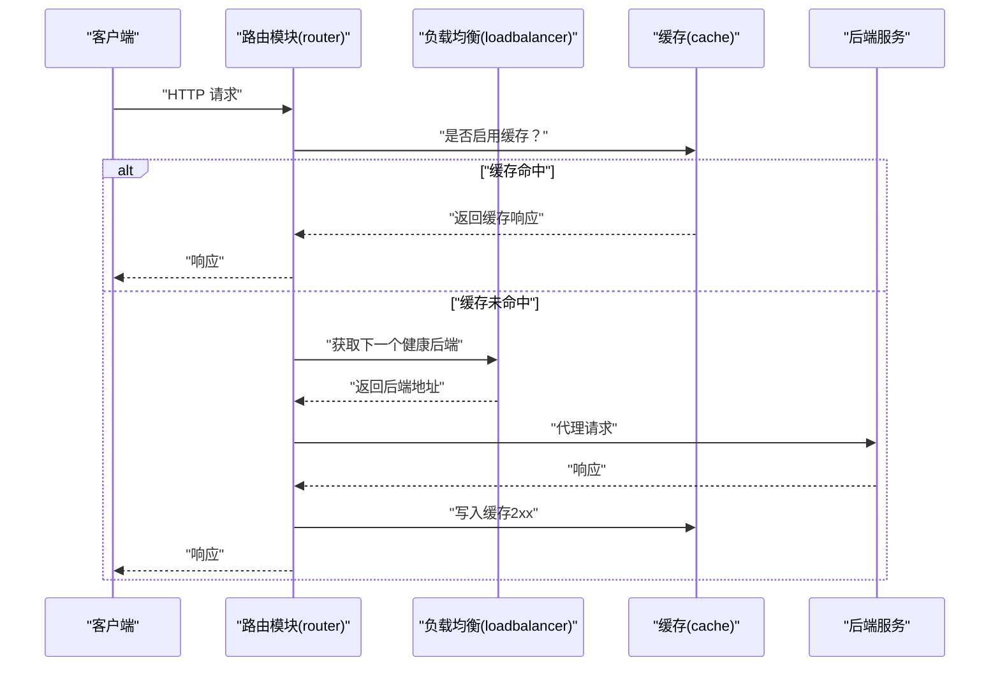
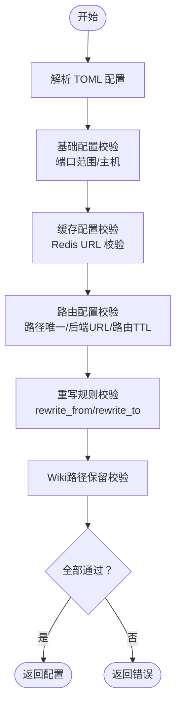
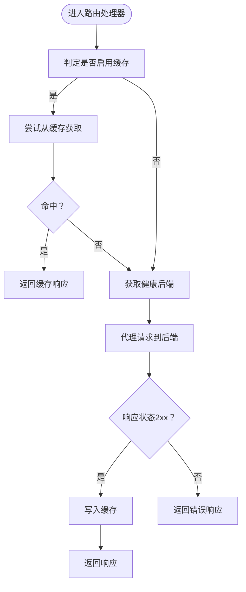
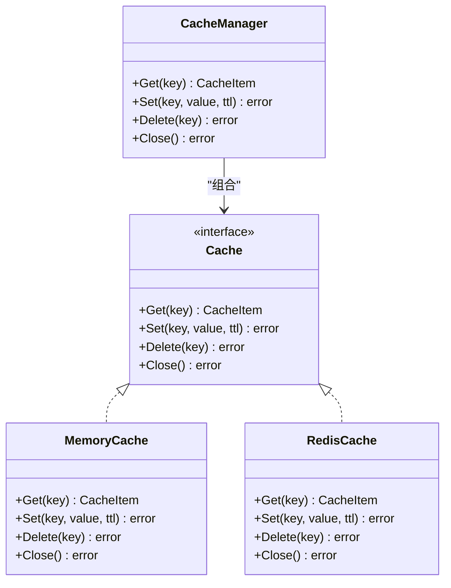
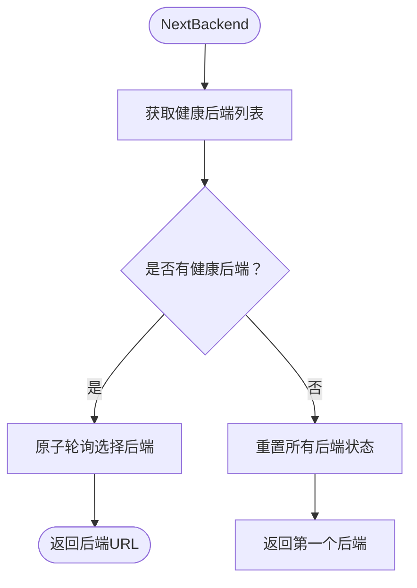
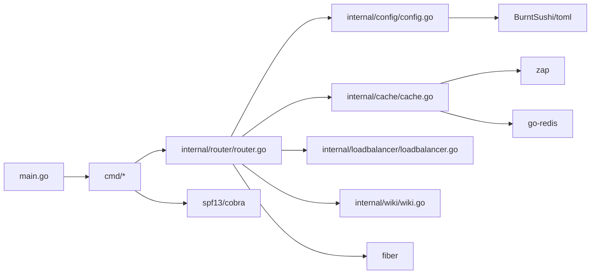

# 项目概述

<cite>
**本文引用的文件**
- [README.md](file://README.md)
- [main.go](file://main.go)
- [go.mod](file://go.mod)
- [cmd/root.go](file://cmd/root.go)
- [cmd/serve.go](file://cmd/serve.go)
- [cmd/check.go](file://cmd/check.go)
- [cmd/gen.go](file://cmd/gen.go)
- [internal/config/config.go](file://internal/config/config.go)
- [internal/config/example_config.toml](file://internal/config/example_config.toml)
- [internal/router/router.go](file://internal/router/router.go)
- [internal/cache/cache.go](file://internal/cache/cache.go)
- [internal/loadbalancer/loadbalancer.go](file://internal/loadbalancer/loadbalancer.go)
- [openspec/project.md](file://openspec/project.md)
- [openspec/AGENTS.md](file://openspec/AGENTS.md)
- [internal/wiki/wiki.go](file://internal/wiki/wiki.go)
</cite>

## 更新摘要
**已做更改**
- 更新了项目目的、技术栈、代码风格、架构模式和重要约束等信息
- 新增了关于嵌入式Wiki功能的说明
- 更新了技术栈信息，确认使用Fiber框架而非Gin
- 补充了项目约定和外部依赖信息

## 目录
1. [简介](#简介)
2. [项目结构](#项目结构)
3. [核心组件](#核心组件)
4. [架构总览](#架构总览)
5. [详细组件分析](#详细组件分析)
6. [依赖分析](#依赖分析)
7. [性能考量](#性能考量)
8. [故障排查指南](#故障排查指南)
9. [结论](#结论)
10. [附录](#附录)

## 简介
Simple API Gateway 是一个轻量级、高性能的 API 网关，专注于将请求代理到多个后端服务，提供负载均衡、缓存与多后端支持。项目采用 Fiber 框架提供高性能 HTTP 路由与中间件能力，支持通过 TOML 配置文件进行灵活的路由与缓存策略配置，并内置优雅关闭与健康检查等工程化特性。适合在微服务架构中作为统一入口，实现请求聚合、流量治理与性能优化。

- 主要目标与设计哲学
  - 轻量化与高扩展：以最小依赖实现核心网关能力，便于集成与运维。
  - 微服务入口：统一对外暴露 API，隐藏后端复杂度，提供一致的访问体验。
  - 可观测与可维护：详细日志、配置校验、优雅关闭与缓存降级，降低线上风险。
  - 易用性：提供命令行工具与 Docker 部署方案，快速上手。

- 在微服务架构中的作用
  - 请求代理：将外部请求转发至一组后端服务，屏蔽后端差异。
  - 负载均衡：基于轮询与故障转移，提升可用性与吞吐。
  - 缓存：支持 Redis 或内存缓存，显著降低重复请求开销。
  - 流量管理：通过路由与缓存策略控制请求路径与响应复用。

- 主要使用场景
  - 统一 API 入口：集中暴露服务，便于鉴权、限流与监控。
  - 后端服务聚合：将多个微服务的接口整合为单一入口。
  - 流量管理：按路由维度配置缓存 TTL、缓存路径白名单与自定义头部，实现精细化流量治理。

- 目标用户
  - 后端工程师：关注代理、负载均衡与缓存策略。
  - DevOps 工程师：关注部署、可观测性与运维稳定性。

- 初学者概念引导
  - 反向代理：网关接收客户端请求，再向后端转发，最终将响应返回给客户端。
  - 负载均衡：在多个后端之间分配请求，提升整体吞吐与可用性。
  - 缓存：将热点请求结果缓存，减少后端压力与延迟。

- 高级用户架构优势
  - 高性能 Fiber 框架：具备低延迟与高吞吐特性，满足高并发场景。
  - 优雅关闭：捕获系统信号，保证在退出前完成日志落盘与资源释放。
  - 健康检查与故障转移：内置后端健康状态跟踪与自动恢复逻辑。
  - 缓存降级：Redis 连接失败时自动回退到内存缓存，保障服务连续性。
  - 嵌入式 Wiki：在 `/wiki` 路径提供项目文档，增强可维护性。

**章节来源**
- [README.md](file://README.md#L1-L120)
- [openspec/project.md](file://openspec/project.md#L3-L8)
- [openspec/AGENTS.md](file://openspec/AGENTS.md#L1-L457)

## 项目结构
项目采用分层清晰的目录组织：
- cmd：命令行入口与子命令（启动、检查配置、生成示例、版本信息）。
- internal：核心业务模块
  - config：配置解析、校验与示例生成。
  - router：路由注册、请求处理、缓存与负载均衡编排。
  - cache：缓存抽象、Redis 与内存实现、缓存管理器。
  - loadbalancer：轮询负载均衡器与后端健康状态管理。
  - wiki：嵌入式文档系统，提供 `/wiki` 路由支持。
- openspec：规范驱动开发文档，包含项目约定、变更提案和规格说明。
- 根目录：入口程序 main.go、Docker 与部署脚本、示例配置与文档。

**图表来源**
- [main.go](file://main.go#L1-L49)
- [cmd/root.go](file://cmd/root.go#L1-L50)
- [cmd/serve.go](file://cmd/serve.go)
- [cmd/check.go](file://cmd/check.go)
- [cmd/gen.go](file://cmd/gen.go)
- [internal/router/router.go](file://internal/router/router.go#L445-L504)
- [internal/config/config.go](file://internal/config/config.go#L47-L124)
- [internal/cache/cache.go](file://internal/cache/cache.go#L252-L328)
- [internal/loadbalancer/loadbalancer.go](file://internal/loadbalancer/loadbalancer.go#L1-L82)
- [internal/wiki/wiki.go](file://internal/wiki/wiki.go#L1-L50)
- [openspec/project.md](file://openspec/project.md#L28-L35)

**章节来源**
- [README.md](file://README.md#L397-L410)
- [go.mod](file://go.mod#L1-L20)
- [openspec/project.md](file://openspec/project.md#L28-L35)

## 核心组件
- 配置模块（config）
  - 负责解析 TOML 配置、校验端口与主机、缓存与路由配置合法性，并提供示例配置生成。
  - 关键点：端口范围校验、Redis URL 校验、路由路径唯一性与后端 URL 合法性、运行时连通性提示。
  - 新增功能：`/wiki` 路径保留校验，防止配置冲突。

- 路由模块（router）
  - 基于 Fiber 注册路由，为每个路由创建负载均衡器；实现请求缓存判定、缓存命中与回填、后端代理与响应头复制。
  - 关键点：缓存键生成（方法+路径+查询+请求体）、路由级缓存开关与 TTL 控制、路径白名单控制、负载均衡器并发安全。
  - 新增功能：支持路径重写规则（rewrite_from/rewrite_to），增强路由灵活性。

- 缓存模块（cache）
  - 提供统一 Cache 接口，支持 Redis 与内存两种实现；缓存管理器根据配置选择后端并在 Redis 失败时自动降级。
  - 关键点：响应头过滤（排除易变与重复字段）、TTL 管理、JSON 序列化与键前缀。

- 负载均衡模块（loadbalancer）
  - 轮询负载均衡器，跟踪后端健康状态、失败计数与超时恢复；在无健康后端时重置所有后端。
  - 关键点：原子轮询索引、并发安全、失败阈值与超时重试、健康回退逻辑。

- Wiki模块（wiki）
  - 提供嵌入式文档系统，在 `/wiki` 路径服务项目文档。
  - 关键点：自动重定向、CDN资源加载、GitHub链接重写、构建时包含文档资产。

**章节来源**
- [internal/config/config.go](file://internal/config/config.go#L47-L124)
- [internal/router/router.go](file://internal/router/router.go#L33-L110)
- [internal/cache/cache.go](file://internal/cache/cache.go#L19-L369)
- [internal/loadbalancer/loadbalancer.go](file://internal/loadbalancer/loadbalancer.go#L1-L248)
- [internal/wiki/wiki.go](file://internal/wiki/wiki.go#L1-L100)
- [openspec/changes/add-qoder-wiki/specs/gateway-wiki/spec.md](file://openspec/changes/add-qoder-wiki/specs/gateway-wiki/spec.md#L1-L47)

## 架构总览
下图展示从客户端到后端服务的整体调用链路，以及缓存与负载均衡在其中的作用。

**图表来源**
- [internal/router/router.go](file://internal/router/router.go#L271-L340)
- [internal/router/router.go](file://internal/router/router.go#L356-L443)
- [internal/loadbalancer/loadbalancer.go](file://internal/loadbalancer/loadbalancer.go#L84-L110)
- [internal/cache/cache.go](file://internal/cache/cache.go#L252-L328)

## 详细组件分析

### 配置解析与校验（config）
- 数据模型
  - Config：监听端口、主机、日志文件路径、缓存配置、路由列表。
  - Cache：是否启用、是否使用 Redis、Redis 连接 URL、DB 编号、键前缀。
  - Route：路由路径、后端服务列表、User-Agent、路由级缓存 TTL、是否启用缓存、可缓存路径白名单、自定义头部、路径重写规则。

- 校验流程
  - 基础配置：端口范围校验、主机非空。
  - 缓存配置：当启用 Redis 时校验 URL 格式；运行时对后端连通性给出提示。
  - 路由配置：路由路径非空且唯一；后端列表非空且 URL 合法；路由级 TTL 非负；`/wiki` 路径保留校验。
  - 重写规则：`rewrite_from` 和 `rewrite_to` 必须同时存在或同时为空，且必须以 `/` 开头。

**图表来源**
- [internal/config/config.go](file://internal/config/config.go#L47-L124)
- [internal/config/config.go](file://internal/config/config.go#L126-L201)
- [internal/config/config.go](file://internal/config/config.go#L203-L224)
- [internal/config/config.go](file://internal/config/config.go#L247-L281)

**章节来源**
- [internal/config/config.go](file://internal/config/config.go#L21-L46)
- [internal/config/config.go](file://internal/config/config.go#L47-L124)
- [internal/config/config.go](file://internal/config/config.go#L126-L201)
- [internal/config/config.go](file://internal/config/config.go#L203-L224)
- [internal/config/config.go](file://internal/config/config.go#L247-L281)

### 路由与请求处理（router）
- 路由注册
  - 为每个路由注册通配符路径，绑定处理器函数。
- 缓存策略
  - 路由级开关与 TTL 控制；可选路径白名单；缓存键由方法、路径、查询参数与请求体生成。
- 负载均衡
  - 为每个路由维护独立的轮询负载均衡器；并发安全地选择健康后端。
- 后端代理
  - 复制请求头与请求体，构造目标 URL 并发起请求；成功后记录响应时间并上报成功，失败上报失败。
- 响应回传
  - 设置状态码与响应头，发送响应体；缓存命中时直接回填响应。
- 路径重写
  - 支持 `rewrite_from` 和 `rewrite_to` 规则，实现请求路径转换。

**图表来源**
- [internal/router/router.go](file://internal/router/router.go#L271-L340)
- [internal/router/router.go](file://internal/router/router.go#L356-L443)
- [internal/router/router.go](file://internal/router/router.go#L445-L504)

**章节来源**
- [internal/router/router.go](file://internal/router/router.go#L271-L340)
- [internal/router/router.go](file://internal/router/router.go#L356-L443)
- [internal/router/router.go](file://internal/router/router.go#L445-L504)

### 缓存实现（cache）
- 接口与实现
  - Cache 接口：Get/Set/Delete/Close。
  - MemoryCache：基于 sync.Map 的内存缓存，定时清理过期项。
  - RedisCache：基于 go-redis 的 Redis 缓存，支持 TTL 与键前缀。
  - CacheManager：根据配置选择具体缓存实现，Redis 失败时自动降级为内存缓存。
- 头部过滤
  - 过滤掉易变或重复的响应头，避免缓存污染。

**图表来源**
- [internal/cache/cache.go](file://internal/cache/cache.go#L19-L369)

**章节来源**
- [internal/cache/cache.go](file://internal/cache/cache.go#L19-L369)

### 负载均衡（loadbalancer）
- 轮询策略
  - 原子递增当前索引，实现线程安全的轮询。
- 健康状态
  - 成功请求更新响应时间与健康状态；失败请求累计失败计数并可能标记为不健康。
- 超时恢复
  - 若所有后端均不健康，重置所有后端状态，允许后续重试恢复。
- 并发安全
  - 使用互斥锁保护后端状态数组与单个后端状态。

**图表来源**
- [internal/loadbalancer/loadbalancer.go](file://internal/loadbalancer/loadbalancer.go#L84-L110)
- [internal/loadbalancer/loadbalancer.go](file://internal/loadbalancer/loadbalancer.go#L233-L248)

**章节来源**
- [internal/loadbalancer/loadbalancer.go](file://internal/loadbalancer/loadbalancer.go#L1-L248)

## 依赖分析
- 技术栈与依赖
  - Go：核心语言，提供高性能与并发能力。
  - Fiber：HTTP 路由与中间件框架，简化请求处理。
  - Redis：可选缓存后端，提供高吞吐与持久化能力。
  - TOML：人类友好的配置格式，便于维护。
  - Zap：高性能结构化日志库，支持文件输出与级别控制。
  - Cobra：命令行框架，提供子命令与参数解析。
  - go-redis：Redis 客户端库，支持连接池与多种数据结构。
- 模块耦合
  - router 依赖 config、cache、loadbalancer、wiki；cache 依赖 config；loadbalancer 为纯逻辑模块。
  - cmd 层负责 CLI 与执行入口，与核心业务解耦。

**图表来源**
- [go.mod](file://go.mod#L1-L20)
- [main.go](file://main.go#L1-L49)
- [cmd/root.go](file://cmd/root.go#L1-L50)
- [internal/router/router.go](file://internal/router/router.go#L445-L504)
- [internal/cache/cache.go](file://internal/cache/cache.go#L143-L251)
- [internal/loadbalancer/loadbalancer.go](file://internal/loadbalancer/loadbalancer.go#L1-L82)
- [internal/config/config.go](file://internal/config/config.go#L1-L26)
- [internal/wiki/wiki.go](file://internal/wiki/wiki.go#L1-L50)

**章节来源**
- [go.mod](file://go.mod#L1-L20)
- [openspec/project.md](file://openspec/project.md#L10-L17)

## 性能考量
- 低延迟与高吞吐
  - 基于 Fiber 的高效 HTTP 处理，典型代理请求额外开销小于 2ms。
  - 轮询负载均衡与健康状态跟踪，避免热点后端与故障节点。
- 缓存收益
  - 启用缓存后，请求吞吐显著提升，延迟大幅下降。
- 内存效率
  - 内存缓存与 Redis 缓存均可使用，内存占用在高负载下仍保持较低水平。
- 配置与部署
  - 提供 Docker 与 Docker Compose 部署示例，支持 Redis 与内存两种缓存模式。

**章节来源**
- [README.md](file://README.md#L374-L410)
- [openspec/project.md](file://openspec/project.md#L51-L55)

## 故障排查指南
- 启动与优雅关闭
  - main 中捕获系统信号，触发日志同步与关闭，确保退出时资源正确释放。
- 配置问题
  - 端口越界、主机为空、Redis URL 为空或非法、路由路径重复或后端 URL 非法、路由级 TTL 为负。
  - `/wiki` 路径冲突：配置中不能使用 `/wiki` 路径。
  - 重写规则错误：`rewrite_from` 和 `rewrite_to` 必须同时存在或同时为空。
- 缓存问题
  - Redis 连接失败时自动降级为内存缓存；检查 Redis URL、DB 编号与网络连通性。
- 负载均衡问题
  - 所有后端均不健康时会重置状态；检查后端可达性与超时阈值。
- 日志定位
  - 通过配置设置日志文件路径，结合详细日志定位问题。

**章节来源**
- [main.go](file://main.go#L27-L49)
- [internal/config/config.go](file://internal/config/config.go#L90-L124)
- [internal/config/config.go](file://internal/config/config.go#L126-L201)
- [internal/cache/cache.go](file://internal/cache/cache.go#L252-L328)
- [internal/loadbalancer/loadbalancer.go](file://internal/loadbalancer/loadbalancer.go#L168-L182)

## 结论
Simple API Gateway 以轻量、高性能为核心设计理念，围绕"请求代理、负载均衡、缓存"三大能力构建，适配微服务架构中的统一入口与流量治理需求。通过 Fiber 的高效处理、完善的配置校验与优雅关闭机制，以及 Redis/内存双缓存与健康检查的负载均衡策略，项目在易用性与工程化方面表现突出。新增的嵌入式 Wiki 功能增强了文档可维护性。建议在生产环境中优先启用缓存与健康检查，并结合日志与监控持续优化路由与后端配置。

## 附录
- 快速开始与示例
  - 安装与运行：支持 Go 安装与 Docker 拉取两种方式。
  - 生成示例配置与启动服务：提供命令行工具与 Docker Compose 示例。
  - 配置示例：包含端口、主机、日志、缓存与路由配置。
- 常用命令
  - 启动服务、检查配置、生成示例配置、查看版本信息。

**章节来源**
- [README.md](file://README.md#L34-L120)
- [README.md](file://README.md#L120-L210)
- [README.md](file://README.md#L210-L362)
- [internal/config/example_config.toml](file://internal/config/example_config.toml#L1-L45)